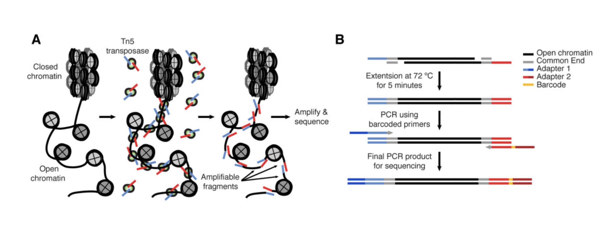
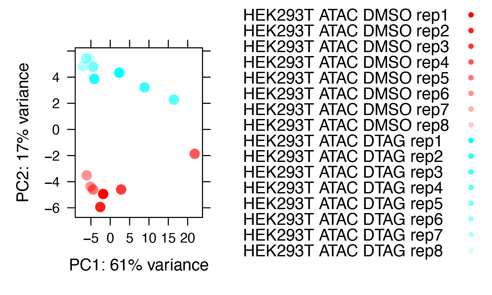
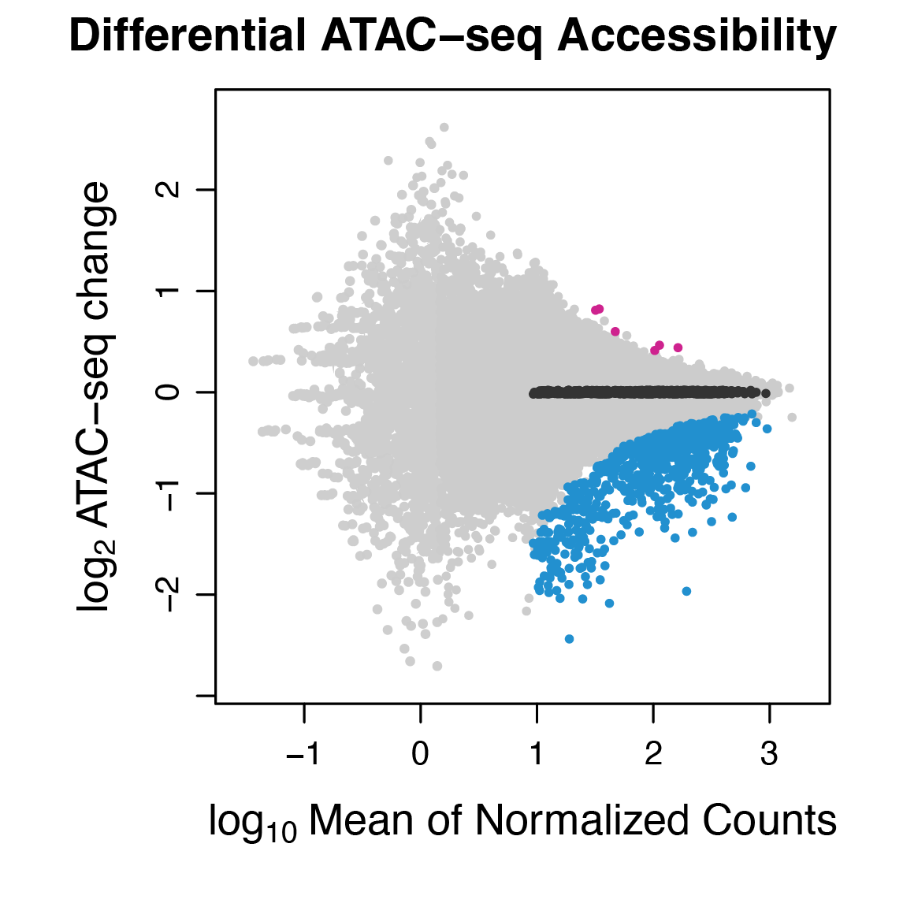
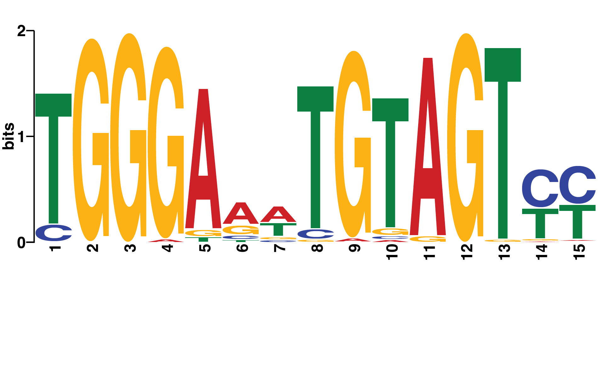

```{css, echo=FALSE}
body .main-container {
  max-width: 1000px !important;
  width: 1000px !important;
}
body {
  max-width: 1000px !important;
}

pre {
  max-height: 600px;
  overflow-y: auto;
}

pre[class] {
  max-height: 600px;
}
```

# Introduction

This vignette contains the ATAC-seq analysis for the manuscript "ZNF143 binds DNA and stimulates transcription initiation to activate and repress direct target genes" (doi: https://doi.org/10.1101/2024.05.13.594008). The analysis follows the published figures, which may differ from the preprint figures in labeling and content. This vignette is copied largely from the ATAC-seq vignette for the GeneX course (https://github.com/guertinlab/genex/tree/main).

# ATAC-seq experiments

ATAC-seq is an assay that measures chromatin accessibility. In short,
cells are treated with detergents to disrupt the cell and nuclear
membranes, then treated with Tn5 transposase, which targets DNA that
is accessible. Targeting includes cleaving the DNA and ligating DNA to
the cut ends. DNA can be highly compacted and inaccessible,
nucleosome free and very accessible, or in between. The Tn5 transpoase
dimers are preloaded with Illumina adapters, so when two adapters are
inserted into DNA close enough to one another and in the correct
orientation the molecules can be PCR amplified and subjected to
high-throughput sequencing. The ATAC-seq methods
[https://doi.org/10.1002%2F0471142727.mb2129s109](https://doi.org/10.1002%2F0471142727.mb2129s109) paper presents the
figure below.


```{r  out.width="600px", echo=F, fig.align = "center", fig.cap="ATAC-seq molecular biology"}
library(knitr)
 
```

# Why perform ATAC-seq experiments?

Chromatin accessibility genomics data is analyzed much like ChIP-seq
data, but it does not measure transcription factor binding or histone
modification abundance directly. Chromatin accessibility correlates
with gene expression levels, but if you want to use chromatin
accessibility to tell you anything about gene expression you are
better off just measuring RNA levels directly. Chromatin accessibility
patterns can provide information about nucleosome positioning, but if
you want to know about nucleosome positioning you should perform
MNase-seq. So when would we want to perform ATAC-seq? Regions of
accessible chromatin are generally bound by sequence-specific
transcription factors and we can use prior knowledge about the
sequences that factors recognize and the openness of chromatin to
infer transcription factor binding, as opposed to doing 1000+ ChIP-seq
experiments per cell type per condition. I believe the most powerful
application of ATAC-seq is to perform ATAC-seq in two conditions to
determine the candidate transcription factors that change activity
between the two conditions. If the time points are closely spaced,
then one can hypothesize that the factor (or a member of the factor
family) is directly affected by the condition. For instance, we can
treat cells with a drug for a short period of time (20 minutes) and
perform ATAC-seq. If the drug affects the function of a transcription
factor, then the motif that the TF recognizes will be specifically
enriched in the differential ATAC peaks. A classic example is to treat
breast cancer cells with estrogen for 10 minutes and perform a before
and after ATAC. The Estrogen Receptor binding motif is specifically
enriched in ATAC peaks that increase accessibility. 

# ATAC-seq experimental design

If you design an ATAC-seq experiment to infer transcription factor
binding, then you should should perform paired-end sequencing because
each end of a sequenced molecule is the precise position that is
accessible to the transposase. Well, the molecular biology is a bit
more complicated and we need to shift the forward-strand aligned reads
downstream by 4 bases and shift the reverse-strand aligned reads
upstream by 4 bases to specify the  center of where Tn5
recognizes. We outline the molecular biology in
Figure S1 here:
[seqOutATACBias](https://www.biorxiv.org/content/10.1101/2022.12.08.519600v1). We
also deviate from many ATAC-seq workflows because we perform size
selection. We are most interested in defining open regions of
chromatin and not nucleosome mapping (larger fragments can be used for
this purpose). We would perform MNase-seq if we wanted to map nucleosomes. An overview of our ATAC experimental workflow can be
found here: [ATAC experimental workflow](https://genome.cshlp.org/content/33/3/314.full#sec-16).

# ATAC-seq analysis

In this vignette, grey code chunks are performed in bash, blue code chunks are performed in R, and red code chunks are not to be run by you (either we already ran them or will run them using all samples).


## Download samples from GEO

Log into the high-performance cluster, start an interactive node, set up the directories, and get the files from GEO accession record GSE266489 for ChIP-seq files. 

```{r engine='bash', eval=F, echo=TRUE} 
# Connect to the cluster
# ssh jdong@xanadu-submit-ext.cam.uchc.edu 

# Start interactive node
srun --partition=general --qos=general --mem=2G -N 1 -n 1 -c 1 --pty bash

# Make and change to analysis directories
mkdir /scratch/jdong/ZNF143dTAG/
cd /scratch/jdong/ZNF143dTAG/
mkdir ATAC
cd ATAC
mkdir FASTQ
cd FASTQ

```

Get the files from GEO accession record GSE266490 for ATAC-seq files. 

"get_SRA_template_ATAC_SRR288795.sh":

```{r engine='bash', eval=F, echo=TRUE}
#! /usr/bin/bash

#SBATCH --job-name=get_ATAC_SRA_SRR288795XXX
#SBATCH -N 1
#SBATCH -n 1
#SBATCH -c 10
#SBATCH -p general
#SBATCH --qos=general
#SBATCH --mem=12G
#SBATCH --mail-type=ALL 
#SBATCH --mail-user=jdong@uchc.edu
#SBATCH -o /home/FCAM/jdong/slurm_out/%x_%j.all_out
#SBATCH -e /home/FCAM/jdong/slurm_out/%x_%j.all_out

export TMPDIR=/scratch/jdong/
cd /scratch/jdong/ZNF143dTAG/ATAC/FASTQ 
echo "Current wd:" $(pwd)
echo "Current node:" $(hostname)

module load sratoolkit/3.0.5 # latest version on Xanadu

fasterq-dump SRR288795XXX 

echo "Script finished:" $(date '+%a %Y-%m-%d %H:%M:%S %Z')

```

"get_SRA_template_ATAC_SRR302751.sh":

```{r engine='bash', eval=F, echo=TRUE}
#! /usr/bin/bash

#SBATCH --job-name=get_ATAC_SRA_SRR302751XXX
#SBATCH -N 1
#SBATCH -n 1
#SBATCH -c 10
#SBATCH -p general
#SBATCH --qos=general
#SBATCH --mem=12G
#SBATCH --mail-type=ALL 
#SBATCH --mail-user=jdong@uchc.edu
#SBATCH -o /home/FCAM/jdong/slurm_out/%x_%j.all_out
#SBATCH -e /home/FCAM/jdong/slurm_out/%x_%j.all_out

export TMPDIR=/scratch/jdong/
cd /scratch/jdong/ZNF143dTAG/ATAC/FASTQ 
echo "Current wd:" $(pwd)
echo "Current node:" $(hostname)

module load sratoolkit/3.0.5 # latest version on Xanadu

fasterq-dump SRR302751XXX 

echo "Script finished:" $(date '+%a %Y-%m-%d %H:%M:%S %Z')

```

Make individual scripts for each SRA run.

```{r engine='bash', eval=F, echo=TRUE}
# first set of files
file=/home/FCAM/jdong/script_templates/get_SRA_template_ATAC_SRR288795.sh

# create scripts
for i in {30..45}
do
  echo $i
  sed -e "s/XXX/${i}/g" "$file" > get_ATAC_SRR288795${i}.sh
  grep fasterq get_ATAC_SRR288795${i}.sh
done

# Submit jobs 
for i in get_ATAC_SRR288795${i}.sh
do
    echo $i
    sbatch $i
done

# second set of files
file=/home/FCAM/jdong/script_templates/get_SRA_template_ATAC_SRR302751.sh

# create scripts
for i in {46..61}
do
  echo $i
  sed -e "s/XXX/${i}/g" "$file" > get_ATAC_SRR302751${i}.sh
  grep fasterq get_ATAC_SRR302751${i}.sh
done

# Submit jobs 
for i in get_ATAC_SRR302751${i}.sh
do
    echo $i
    sbatch $i
done

```


Rename files:

```{r engine='bash', eval=F, echo=TRUE}
mv SRR28879530_1.fastq HEK293T_DTAG_ATAC_rep8_PE1.fastq
mv SRR28879530_2.fastq HEK293T_DTAG_ATAC_rep8_PE2.fastq
mv SRR28879531_1.fastq HEK293T_DTAG_ATAC_rep7_PE1.fastq
mv SRR28879531_2.fastq HEK293T_DTAG_ATAC_rep7_PE2.fastq
mv SRR28879532_1.fastq HEK293T_DTAG_ATAC_rep6_PE1.fastq
mv SRR28879532_2.fastq HEK293T_DTAG_ATAC_rep6_PE2.fastq
mv SRR28879533_1.fastq HEK293T_DTAG_ATAC_rep5_PE1.fastq
mv SRR28879533_2.fastq HEK293T_DTAG_ATAC_rep5_PE2.fastq
mv SRR28879534_1.fastq HEK293T_DTAG_ATAC_rep4_PE1.fastq
mv SRR28879534_2.fastq HEK293T_DTAG_ATAC_rep4_PE2.fastq
mv SRR28879535_1.fastq HEK293T_DTAG_ATAC_rep3_PE1.fastq
mv SRR28879535_2.fastq HEK293T_DTAG_ATAC_rep3_PE2.fastq
mv SRR28879536_1.fastq HEK293T_DTAG_ATAC_rep2_PE1.fastq
mv SRR28879536_2.fastq HEK293T_DTAG_ATAC_rep2_PE2.fastq
mv SRR28879537_1.fastq HEK293T_DTAG_ATAC_rep1_PE1.fastq
mv SRR28879537_2.fastq HEK293T_DTAG_ATAC_rep1_PE2.fastq

mv SRR28879538_1.fastq HEK293T_DMSO_ATAC_rep8_PE1.fastq
mv SRR28879538_2.fastq HEK293T_DMSO_ATAC_rep8_PE2.fastq
mv SRR28879539_1.fastq HEK293T_DMSO_ATAC_rep7_PE1.fastq
mv SRR28879539_2.fastq HEK293T_DMSO_ATAC_rep7_PE2.fastq
mv SRR28879540_1.fastq HEK293T_DMSO_ATAC_rep6_PE1.fastq
mv SRR28879540_2.fastq HEK293T_DMSO_ATAC_rep6_PE2.fastq
mv SRR28879541_1.fastq HEK293T_DMSO_ATAC_rep5_PE1.fastq
mv SRR28879541_2.fastq HEK293T_DMSO_ATAC_rep5_PE2.fastq
mv SRR28879542_1.fastq HEK293T_DMSO_ATAC_rep4_PE1.fastq
mv SRR28879542_2.fastq HEK293T_DMSO_ATAC_rep4_PE2.fastq
mv SRR28879543_1.fastq HEK293T_DMSO_ATAC_rep3_PE1.fastq
mv SRR28879543_2.fastq HEK293T_DMSO_ATAC_rep3_PE2.fastq
mv SRR28879544_1.fastq HEK293T_DMSO_ATAC_rep2_PE1.fastq
mv SRR28879544_2.fastq HEK293T_DMSO_ATAC_rep2_PE2.fastq
mv SRR28879545_1.fastq HEK293T_DMSO_ATAC_rep1_PE1.fastq
mv SRR28879545_2.fastq HEK293T_DMSO_ATAC_rep1_PE2.fastq

mv SRR30275146_1.fastq HEK293T_DTAG_ATAC_rep16_PE1.fastq
mv SRR30275146_2.fastq HEK293T_DTAG_ATAC_rep16_PE2.fastq
mv SRR30275147_1.fastq HEK293T_DTAG_ATAC_rep15_PE1.fastq
mv SRR30275147_2.fastq HEK293T_DTAG_ATAC_rep15_PE2.fastq
mv SRR30275148_1.fastq HEK293T_DTAG_ATAC_rep14_PE1.fastq
mv SRR30275148_2.fastq HEK293T_DTAG_ATAC_rep14_PE2.fastq
mv SRR30275149_1.fastq HEK293T_DTAG_ATAC_rep13_PE1.fastq
mv SRR30275149_2.fastq HEK293T_DTAG_ATAC_rep13_PE2.fastq
mv SRR30275150_1.fastq HEK293T_DTAG_ATAC_rep12_PE1.fastq
mv SRR30275150_2.fastq HEK293T_DTAG_ATAC_rep12_PE2.fastq
mv SRR30275151_1.fastq HEK293T_DTAG_ATAC_rep11_PE1.fastq
mv SRR30275151_2.fastq HEK293T_DTAG_ATAC_rep11_PE2.fastq
mv SRR30275152_1.fastq HEK293T_DTAG_ATAC_rep10_PE1.fastq
mv SRR30275152_2.fastq HEK293T_DTAG_ATAC_rep10_PE2.fastq
mv SRR30275153_1.fastq HEK293T_DTAG_ATAC_rep9_PE1.fastq
mv SRR30275153_2.fastq HEK293T_DTAG_ATAC_rep9_PE2.fastq

mv SRR30275154_1.fastq HEK293T_DMSO_ATAC_rep16_PE1.fastq
mv SRR30275154_2.fastq HEK293T_DMSO_ATAC_rep16_PE2.fastq
mv SRR30275155_1.fastq HEK293T_DMSO_ATAC_rep15_PE1.fastq
mv SRR30275155_2.fastq HEK293T_DMSO_ATAC_rep15_PE2.fastq
mv SRR30275156_1.fastq HEK293T_DMSO_ATAC_rep14_PE1.fastq
mv SRR30275156_2.fastq HEK293T_DMSO_ATAC_rep14_PE2.fastq
mv SRR30275157_1.fastq HEK293T_DMSO_ATAC_rep13_PE1.fastq
mv SRR30275157_2.fastq HEK293T_DMSO_ATAC_rep13_PE2.fastq
mv SRR30275158_1.fastq HEK293T_DMSO_ATAC_rep12_PE1.fastq
mv SRR30275158_2.fastq HEK293T_DMSO_ATAC_rep12_PE2.fastq
mv SRR30275159_1.fastq HEK293T_DMSO_ATAC_rep11_PE1.fastq
mv SRR30275159_2.fastq HEK293T_DMSO_ATAC_rep11_PE2.fastq
mv SRR30275160_1.fastq HEK293T_DMSO_ATAC_rep10_PE1.fastq
mv SRR30275160_2.fastq HEK293T_DMSO_ATAC_rep10_PE2.fastq
mv SRR30275161_1.fastq HEK293T_DMSO_ATAC_rep9_PE1.fastq
mv SRR30275161_2.fastq HEK293T_DMSO_ATAC_rep9_PE2.fastq

```

## Cut off the adapter with `cutadapt`

In our daily workflow we use
`cutadapt` to remove adapter sequences. The options we use below are `-j` for the number of cores
to use, `-m` specifies the minimal length of a read to keep after
adapter sequence removal, and `-O` is the number of bases to trim off the
end of the read if it overlaps with the adapter sequence. If the
genome is 25% of each base, then you would expect one quarter of the
reads that have no adapter to have the trailing base
trimmed. Likewise, approximately 1/16 of the remaining
reads without the adapter will have the final two bases
trimmed. Technically these values are not exact, because the reads with
matches to longer trailing k-mers (in this case 19-mers) would be
removed first, then 18-mer matches removed, etcetera. The `-a` and `-A`
options are the adapter sequences of the PE1 and PE2 reads.  The
output file is `-o` (PE1) and `-p` PE2. The last two positional
areguments are the input `fastq` files. We save the output
to a log file.

```{r engine='bash', eval=F, echo=TRUE}
for i in *PE1.fastq.gz
do
    name=$(echo $i | awk -F"/" '{print $NF}' | awk -F"_PE1" '{print $1}')
    echo $name
    echo unzipping $i
    gunzip $i
    echo unzipping ${name}_PE2.fastq.gz
    gunzip ${name}_PE2.fastq.gz
    cutadapt -a CTGTCTCTTATACACATCT -A CTGTCTCTTATACACATCT -j 8 -m 10 -O 1 -o ${name}_PE1_no_adapt.fastq -p ${name}_PE2_no_adapt.fastq ${name}_PE1.fastq ${name}_PE2.fastq 2>&1 | tee ${name}_cutadapt.log
done
```

## Align the the mitochondrial chromosome with `bowtie2`
We perform alignments just as we have previously, but
with many modifications. Mitochondrial DNA is preferentially
targeted by transposase because it is more accessible, so we first
align to `chrM`. However, we only need to align the PE1 read to `chrM`
to save time, then we sort the file, use `samtools collate` to discard unpaired reads, and use `samtools` and the `-f`
option with the flag `0x4` to output the reads that do NOT align to
the mitochondrial genome.

To fix: instead of printing the alignment statistics to the screen and to the log file, it prints all the reads. 

```{r engine='bash', eval=F, echo=TRUE}
#If you need to build the mitochondrial genome
wget https://hgdownload.cse.ucsc.edu/goldenpath/hg38/chromosomes/chrM.fa.gz
gunzip chrM.fa.gz
bowtie2-build chrM.fa chrM

#Align to chrM first and remove aligned and unpaired reads
ncore=8
for i in *_PE1_no_adapt.fastq
do
	name=$(echo $i | awk -F"/" '{print $NF}' | awk -F"_PE1" '{print $1}')
	echo $name
	bowtie2 -p $ncore -x chrM -1 ${name}_PE1_no_adapt.fastq -2 ${name}_PE2_no_adapt.fastq | samtools sort -@ $ncore -n - | samtools collate -u -O - | samtools fastq -f 0x4 -1 ${name}_PE1.chrM.fastq -2 ${name}_PE2.chrM.fastq -0 /dev/null -s /dev/null -n 2>&1 | tee ${name}_chrM_alignment.log
done
```

## Align to the human genome

Now we are aligning to the `hg38.fa` genome just as we have previously
for ChIP-seq, the difference is that the libraries are paired end. Note the `-1` and
`-2` options for the respective paired-end `fastq` files. There is no
need to save the output `sam` file, so the output is piped to
`samtools` to convert to `bam`, then sorted by name (`-n`) so paired
end reads are adjacent in the file, then piped to `samtools fixmate`
which adds information about the fragment length by comparing the PE1
and PE2 coordinates, then the files are sorted by coordinate, then
piped to `samtools markdup` to remove duplicate reads. Duplicate reads
have the same PE1 and PE2 ends. This is very unlikely to happen by
chance unless you sequence to very high read depth, so these reads are
considered PCR amplicon duplicates. The `fixmate` step is necessary to
pipe to `markdup`. 

```{r engine='bash', eval=F, echo=TRUE}
#Align to the hg38 genome and remove duplicates
genome_index=~/genex/genomes/hg38_bt2
ncore=7

cd ~/genex_ATAC/
for i in *_PE1_no_adapt.fastq
do
	name=$(echo $i | awk -F"/" '{print $NF}' | awk -F"_PE1" '{print $1}')
	echo $name
	bowtie2 -p $ncore --maxins 800 -x $genome_index -1 ${name}_PE1.chrM.fastq -2 ${name}_PE2.chrM.fastq | samtools view -bS -f 0x2 - | samtools sort -@ $ncore -n - | samtools fixmate -m - - | samtools sort - | samtools markdup -s -r - ${name}.hg38.bam 2>&1 | tee ${name}_bowtie2_hg38.log
	gzip ${name}_*.fastq
done
```

## Convert aligned data to a `bed` file

We could convert the data to a bed file using `bedtools`, but the
software `seqOutBias` has some desirable options. First `seqOutBias`
was designed to account for enzymatic sequence bias in chromatin
accessibility assays, but we will not use this feature, hence the
`--no-scale` flag. `seqOutBias` does allow for custom shifting of the
plus and minus aligned reads, in this case `--custom-shift=4,-4` to
specify the center of the transposase interaction site. The first time
`seqOutBias` is run with a new genome and `read-size` combination, it
takes a while to determine the regions in the genome that are uniquely
mappable at the specified read length. Subsequent invocations identify
the necessary mappability files and it runs much quicker. Generally,
it is best practice to exclude reads from regions that are not
uniquely mappable, because the true origin of the read cannot be
determined. The last line removes chromosomes that are incomplete
contigs and the Epstein-Barr Virus genome. 

```{r engine='bash', class.source="bg-danger", eval=F, echo=TRUE}
tallymer=~/genex/genomes/hg38.tal_40.gtTxt.gz
table=~/genex/genomes/hg38_40.4.2.2.tbl
readLength=40

# mappability tallymer files were pregenerated using this command (these can only be used for 40 base reads and hg38).

seqOutBias seqtable hg38.fa --read-size=40
```

Convert BAM to bed for counting (previously created the tallymer with `seqOutBias seqtable`)

```{r engine='bash', eval=F, echo=TRUE}
for i in *.hg38.bam
do
	name=$(echo $i | awk -F"/" '{print $NF}' | awk -F".hg38.bam" '{print $1}')
	echo $name
	seqOutBias scale $table ${name}.hg38.bam --tallymer=$tallymer --no-scale --custom-shift=4,-4 --read-size=${readLength} 2>&1 | tee ${name}_seqOutBias.log
	grep -v "random" ${name}.hg38_not_scaled.bed | grep -v "chrUn" | grep -v "chrEBV" | grep -v "alt" | sort -k1,1 -k2,2n > ${name}_tmp.txt && mv ${name}_tmp.txt ${name}_not_scaled.bed 
	rm ${name}.hg38_not_scaled.bed
done
```

# Call peaks with `macs3`

We next call peaks with `macs3` using all the `*.hg38.bam` files. We
already removed replicate duplicates, so any true duplicates arose
independently. We could call peaks in individual replicates and take
the union or intersect or there are many other ways to call
peaks. Since we don't have an input or control file (why not?) and
most biologically relevant peaks will be found by most peak callers, I
am content with just a single peak calling using all the data. We
should find the important peaks where we have the power to detect changes in
accessibility. 

```{r engine='bash', eval=F, echo=TRUE}
#cp */*.hg38.bam ./
mkdir temp_macs
macs3 callpeak --call-summits -t *.hg38.bam -n ZNF143_degron_ATAC -g hs -q 0.01 --keep-dup all -f BAM --nomodel --shift -100 --extsize 200 --tempdir temp_macs
#rm *.hg38.bam
```
## Removing peaks on contigs and within blacklisted regions

You can Google "blacklisted genomic regions" or the alike to find a
set of region in the genome in `bed` format that have an over-representation of
reads regardless of the experiment. Recall this is even more necessary
because we do not have a control data set. We can also remove peaks on non-canonical chromosomes with
`grep -v`. 

```{r engine='bash', eval=F, echo=TRUE}
wget https://github.com/Boyle-Lab/Blacklist/raw/master/lists/hg38-blacklist.v2.bed.gz
gunzip hg38-blacklist.v2.bed.gz
blacklist=hg38-blacklist.v2.bed
sizes=~/genex/genomes/hg38.chrom.sizes
name=ZNF143_degron_ATAC

grep -v "random" ${name}_summits.bed | grep -v "chrUn" | grep -v "chrEBV" | grep -v "chrM" | grep -v "alt" | intersectBed -v -a stdin -b $blacklist > ${name}_tmp.txt

mv ${name}_tmp.txt ${name}_summits.bed

slopBed -b 200 -i ${name}_summits.bed -g $sizes > ${name}_summit_window.bed
```

# Differential reads counts with `mapBed`

`mapBed` from `bedtools` counts reads in regions with
two `bed` file inputs. We will counts reads in the 400 base window
summit file and merge these into a file with experiment name columns
and genomic interval named rows.

```{r engine='bash', eval=F, echo=TRUE}
name=ZNF143_degron_ATAC

#cp */*_not_scaled.bed ./

sort -k1,1 -k2,2n ${name}_summit_window.bed > ${name}_summit_window_sorted.bed

peaks=${name}_summit_window_sorted.bed

for i in *_not_scaled.bed
do
	nm=$(echo $i | awk -F"/" '{print $NF}' | awk -F"_not_scaled.bed" '{print $1}')
	sort -k1,1 -k2,2n $i > ${nm}_sorted.bed
	mapBed -null '0' -a $peaks -b ${nm}_sorted.bed > ${nm}_peak_counts.txt 
done

for i in *_peak_counts.txt
do
  name=$(echo $i | awk -F"/" '{print $NF}' | awk -F"_peak_counts.txt" '{print $1}')
  awk '{print $NF}' ${name}_peak_counts.txt > ${name}_peak_counts_only.txt
  echo $name | cat - ${name}_peak_counts_only.txt > ${name}_peak_counts.txt
  rm ${name}_peak_counts_only.txt
done

echo -e "chr\tstart\tend\tname\tqvalue" | cat - $peaks | paste -d'\t' - *peak_counts.txt > Combined_ATAC_peak_counts.txt

#rm *_not_scaled.bed
```

# Differential accessibility 

## Running `DESeq2` with ATAC data

Update with a description of DESeq2.

```{r class.source="bg-info", engine='R', eval=F, echo=T}
# libraries
library(DESeq2)
library(lattice)
library(dplyr)
library(ggplot2)
library(limma)
library(MatchIt)

# functions on github
source('https://raw.githubusercontent.com/mjg54/znf143_pro_seq_analysis/master/docs/ZNF143_functions.R')

# new functions, we can load them individually as opposed to sourcing them (we sourced in ChIP-seq)

plotPCAlattice <- function(df, file = 'PCA_lattice.pdf') {  
  perVar = round(100 * attr(df, "percentVar"))
  df = data.frame(cbind(df, sapply(strsplit(as.character(df$name), '_rep'), '[', 1)))
  colnames(df) = c(colnames(df)[1:(ncol(df)-1)], 'unique_condition')
  print(df)
  #get colors and take away the hex transparency
  color.x = substring(rainbow(length(unique(df$unique_condition))), 1,7) 
  
  df$color = NA
  df$alpha.x = NA
  df$alpha.y = NA
  df$colpal = NA
  
  for (i in 1:length(unique(df$unique_condition))) {
    
    df[df$unique_condition == unique(df$unique_condition)[[i]],]$color = color.x[i]   
    #gives replicates for unique condition
    reps_col<- df[df$unique_condition == unique(df$unique_condition)[[i]],]
    #gives number of replicates in unique condition
    replicates.x = nrow(reps_col)
    alx <- rev(seq(0.2, 1, length.out = replicates.x))
    
    #count transparency(alx), convert alx to hex(aly), combain color and transparency(cp)
    for(rep in 1:replicates.x) {
    
      na <- reps_col[rep, ]$name
      df[df$name == na, ]$alpha.x = alx[rep]
      aly = as.hexmode(round(alx * 255))
      df[df$name == na, ]$alpha.y = aly[rep]
      cp = paste0(color.x[i], aly)
      df[df$name == na, ]$colpal = cp[rep]
      #print(df)
    }
  }
  colpal = df$colpal
  df$name = gsub('_', ' ', df$name)
  pdf(file, width=5, height=3, useDingbats=FALSE)
  print(xyplot(PC2 ~ PC1, groups = name, data=df,
               xlab = paste('PC1: ', perVar[1], '% variance', sep = ''),
               ylab = paste('PC2: ', perVar[2], '% variance', sep = ''),
               par.settings = list(superpose.symbol = list(pch = c(20), col=colpal)),
               pch = 20, cex = 1.7,
               auto.key = TRUE,
               col = colpal))
  dev.off()
}


plot.barchart <- function(df.barchart, filename = "barchart_jinhong.pdf") {
  pdf(filename, width=4, height=4)

  polycol <- trellis.par.get("superpose.polygon")
  polycol$col <- c("#2290cf", "grey80", "#ce228e", "grey80", "#ce228e", "grey80")
  trellis.par.set("superpose.polygon",polycol)

  print(barchart(as.numeric(as.character(fraction))~factor, data = df.barchart, groups=p_n,
                 stack=TRUE,
                 as.table=TRUE,
                 layout=c(1,1),
               #auto.key = list(title = "",rows=3,fill=colors,just="bottom"),
                 #ain="H3R26Cit Peaks",
               #xlab = "HSF1 or HSF2 Peaks",
                 ylab="Fraction Overlapping ZNF143",
                 cex.axis=1.2,
                 between=list(y=0.5, x=0.5),
                 font.axis=1,
                 par.settings=list(par.xlab.text=list(cex=1.0,font=1),
                   par.ylab.text=list(cex=1.2,font=1),
                   axis.text=list(cex=1,font=1),
                   strip.background=list(col="#ecdaf5"),
                   par.main.text=list(cex=1.2, font=1)),
                                        #aspect = 1,
                 scales=list(x=list(alternating=c(1,1,1,0,0,0),rot=30),
                   y=list(alternating=c(1,1)))))
  
  dev.off()
}

categorize.DEseq.df <- function(DE.results, unchanged.padj = 0.02, changed.padj = 0.1) {
    DE.results.lattice = DE.results

    activated = DE.results[DE.results$padj < changed.padj & !is.na(DE.results$padj) & DE.results$log2FoldChange > 0,]
    unchanged.act = DE.results[!is.na(DE.results$padj) & DE.results$padj > unchanged.padj & abs(DE.results$log2FoldChange) < unchanged.padj,]
    unchanged.act$treatment = 0
    activated$treatment = 1
    df.deseq.effects.lattice = rbind(unchanged.act, activated)
    out = matchit(treatment ~ baseMean, data = df.deseq.effects.lattice, method = "optimal", ratio = 1)
    unchanged.act = df.deseq.effects.lattice[rownames(df.deseq.effects.lattice) %in% out$match.matrix,]
    DE.results.lattice$category = "All Other Genes"

    matching_rows <- intersect(rownames(DE.results.lattice), rownames(unchanged.act))
    for (row_name in matching_rows) {
        DE.results.lattice[row_name, "category"] <- "Matched to Activated"
    }
    DE.results.lattice$category <- ifelse(
        DE.results.lattice$padj < changed.padj & !is.na(DE.results.lattice$padj) & DE.results.lattice$log2FoldChange > 0,
        "Activated",
        DE.results.lattice$category
    )
    DE.results.lattice$category <- ifelse(
        DE.results.lattice$padj < changed.padj & !is.na(DE.results.lattice$padj) & DE.results.lattice$log2FoldChange < 0,
        "Repressed",
        DE.results.lattice$category
    )
    unchanged.rep = DE.results.lattice[!is.na(DE.results.lattice$padj) & DE.results.lattice$padj > unchanged.padj & abs(DE.results.lattice$log2FoldChange) < unchanged.padj & DE.results.lattice$category == "All Other Genes",]
    repressed = DE.results.lattice[DE.results.lattice$padj < changed.padj & !is.na(DE.results.lattice$padj) & DE.results.lattice$log2FoldChange < 0,]
    unchanged.rep$treatment = 0
    repressed$treatment = 1
    df.deseq.effects.lattice.2 = rbind(unchanged.rep, repressed)
    out = matchit(treatment ~ baseMean, data = df.deseq.effects.lattice.2, method = "optimal", ratio = 1)
    unchanged.rep = df.deseq.effects.lattice.2[rownames(df.deseq.effects.lattice.2) %in% out$match.matrix,]

    matching_rows <- intersect(rownames(DE.results.lattice), rownames(unchanged.rep))
    for (row_name in matching_rows) {
        DE.results.lattice[row_name, "category"] <- "Matched to Repressed"
    }
    
    return(DE.results.lattice)
}

ma.plot.lattice <- function(ma.df, filename = 'file.name', 
                            title.main = "Differential ATAC-seq Accessibility",
                            col = c("grey80", "grey20" , "grey20", "#2290cf", "#ce228e"))
{
    desired_order <- c("All Other Genes", "Matched to Activated", "Matched to Repressed", "Repressed", "Activated")
    ma.df$category <- factor(ma.df$category, levels = desired_order)
  pdf(paste("MA_plot_", filename, ".pdf", sep=''), 
      useDingbats = FALSE, width=3.83, height=3.83);
  print(xyplot(ma.df$log2FoldChange ~ log(ma.df$baseMean, base=10),
               groups=ma.df$category,
               col= col,
                main=title.main, scales="free", aspect=1, pch=20, cex=0.5,
               ylab=expression("log"[2]~"ATAC-seq change"), 
               xlab=expression("log"[10]~"Mean of Normalized Counts"),
               par.settings=list(par.xlab.text=list(cex=1.1,font=2), 
                                 par.ylab.text=list(cex=1.1,font=2))));
  dev.off()
  }


# data processing and plotting
setwd("~/ZNF143_ATAC/")
x = read.table('Combined_ATAC_peak_counts.txt', sep = "\t", check.names=FALSE, header=TRUE)
rownames(x) = paste0(x[,1], ":", x[,2], "-", x[,3])
peak_name = x[,4]
peak_qvalue = x[,5]
x = x[,-c(1:5)]

sample.conditions = factor(sapply(strsplit(colnames(x), '_'), '[', 3), levels=c("DMSO","DTAG"))
rep = factor(sapply(strsplit(colnames(x), 'rep'), '[', 2))

deseq.counts.table = DESeqDataSetFromMatrix(countData = x,
                colData = cbind.data.frame(sample.conditions, rep), 
                design = ~ rep + sample.conditions)

deseq.counts.table 

dds = DESeq(deseq.counts.table)
dds
save(dds, file = "genex_ATAC_dds.Rdata")

normalized.counts = counts(dds, normalized=TRUE)
    
rld = rlog(dds, blind=TRUE)
save(rld, file = "genex_ATAC_rld.Rdata")

# plot principle components 

pca.plot = plotPCA(rld, intgroup="sample.conditions", returnData=TRUE)

pca.plot 

plotPCAlattice(pca.plot, file = 'ATAC_PCA_plot_30min_ZNF143_degradation.pdf')

DE.results = results(dds)

head(DE.results)


DE.results.lattice = categorize.DEseq.df(DE.results, changed.padj = 0.1)

ma.plot.lattice(DE.results.lattice, filename = "ATAC_ZNF143_30min_accessiblity_MA")


matched.all = DE.results.lattice[DE.results.lattice$category == 
                                 'Matched to Repressed' |
                                DE.results.lattice$category == 
                                 'Matched to Activated',]

repressed.all = DE.results.lattice[DE.results.lattice$category == 
                                             'Repressed',]

activated.all = DE.results.lattice[DE.results.lattice$category == 
                                             'Activated',]

chr = sapply(strsplit(rownames(activated.all), ":"), "[", 1)
rnge = sapply(strsplit(rownames(activated.all), ":"), "[", 2)
start = as.numeric(sapply(strsplit(rnge, "-"), "[", 1)) +100
end = as.numeric(sapply(strsplit(rnge, "-"), "[", 2)) -100 

write.table(cbind(chr, start, end), file = "ZNF143_degron_ATAC_up.bed", quote = FALSE,
col.names =FALSE, row.names=FALSE, sep = "\t")


chr = sapply(strsplit(rownames(repressed.all), ":"), "[", 1)
rnge = sapply(strsplit(rownames(repressed.all), ":"), "[", 2)
start = as.numeric(sapply(strsplit(rnge, "-"), "[", 1)) +100
end = as.numeric(sapply(strsplit(rnge, "-"), "[", 2)) -100

write.table(cbind(chr, start, end), file = "ZNF143_degron_ATAC_down.bed", quote = FALSE,
col.names =FALSE, row.names=FALSE, sep = "\t")

chr = sapply(strsplit(rownames(matched.all), ":"), "[", 1)
rnge = sapply(strsplit(rownames(matched.all), ":"), "[", 2)
start = as.numeric(sapply(strsplit(rnge, "-"), "[", 1)) +100
end = as.numeric(sapply(strsplit(rnge, "-"), "[", 2)) -100


matched.file = cbind(chr, start, end)
matched.file = unique(matched.file)

write.table(matched.file, file = "ZNF143_degron_ATAC_matched.bed", quote = FALSE,
col.names =FALSE, row.names=FALSE, sep = "\t")
```

Count for the barchart

```{r engine='bash', eval=F, echo=TRUE}
#retrieve ZNF143 motifs
wget https://raw.githubusercontent.com/guertinlab/znf143_degron/main/ChIP_analysis/ZNF143strict_comp29_inferredSites_peakIntensities_unique.bed

intersectBed -v -a ZNF143_degron_ATAC_down.bed -b ZNF143strict_comp29_inferredSites_peakIntensities_unique.bed | wc -l
intersectBed -a ZNF143_degron_ATAC_down.bed -b ZNF143strict_comp29_inferredSites_peakIntensities_unique.bed | wc -l
wc -l ZNF143_degron_ATAC_down.bed

intersectBed -v -a ZNF143_degron_ATAC_up.bed -b ZNF143strict_comp29_inferredSites_peakIntensities_unique.bed | wc -l
intersectBed -a ZNF143_degron_ATAC_up.bed -b ZNF143strict_comp29_inferredSites_peakIntensities_unique.bed | wc -l
wc -l ZNF143_degron_ATAC_up.bed

intersectBed -v -a ZNF143_degron_ATAC_matched.bed -b ZNF143strict_comp29_inferredSites_peakIntensities_unique.bed | wc -l
intersectBed -a ZNF143_degron_ATAC_matched.bed -b ZNF143strict_comp29_inferredSites_peakIntensities_unique.bed | wc -l
wc -l ZNF143_degron_ATAC_matched.bed
```

Plot the barchart

```{r class.source="bg-info", engine='R', eval=F, echo=T}

y= as.data.frame(matrix(c(5, 1, 53, 620, 634, 45, rep('Increased ATAC', 2), rep('Decreased ATAC', 2), rep('Matched', 2), 0.8333333, 0.1666667,  0.0787519,  0.9212481,  0.9337261, 0.0662739, rep(c('b','a'), 3)), ncol=4, byrow=FALSE))
 
# specify the column names and row names of dataframe
colnames(y) = c('num','factor','fraction','p_n')

plot.barchart(y, filename = "barchart_ATAC_overlap_ZNF143.pdf")


```

```{r  out.width = "500px", echo=F, fig.align = "center", fig.cap="PCA Analysis"}
library(knitr)
 
```

```{r  out.width = "500px", echo=F, fig.align = "center", fig.cap="MA plot"}
library(knitr)
 
```

# De novo motif analysis of differentially accessible peaks

Lastly, we perform _de novo_ motif analysis as we have previously with
`meme`. We can also determine the fraction of regions with immediate
increases in accessibility have the underlying motif. However, this
value is meaningless without a comparison. We could compare to
`ZNF143_degron_30min Unchanged` region set.

```{r engine='bash', eval=F, echo=TRUE}
genome=~/genex/genomes/hg38.fa

fastaFromBed -fi $genome -bed ZNF143_degron_ATAC_down.bed -fo ZNF143_degron_ATAC_down.fasta
fastaFromBed -fi $genome -bed ZNF143_degron_ATAC_matched.bed -fo ZNF143_degron_ATAC_matched.fasta

meme -oc ZNF143.meme_output -objfun classic -nmotifs 2 -searchsize 0 -minw 5 -maxw 15 -revcomp -dna -markov_order 2 -maxsize 100000000 ZNF143_degron_ATAC_down.fasta

mast ZNF143.meme_output/meme.txt -mt 0.0001 -hit_list ZNF143_degron_ATAC_down.fasta > mast_hits_decreased.txt
mast ZNF143.meme_output/meme.txt -mt 0.0001 -hit_list ZNF143_degron_ATAC_matched.fasta > mast_hits_unchanged.txt

cut -f 1 -d " " mast_hits_decreased.txt | sort | uniq | grep -v "#" > unique_mast_hits_decreased.txt 
wc -l unique_mast_hits_decreased.txt
wc -l ZNF143_degron_ATAC_down.bed

cut -f 1 -d " " mast_hits_unchanged.txt | sort | uniq | grep -v "#" | wc -l
wc -l  ZNF143_degron_ATAC_matched.bed
```


```{r echo=F, fig.align = "center", out.width="400px", fig.cap="ZNF143 motif"}
#library(knitr)
 
```


