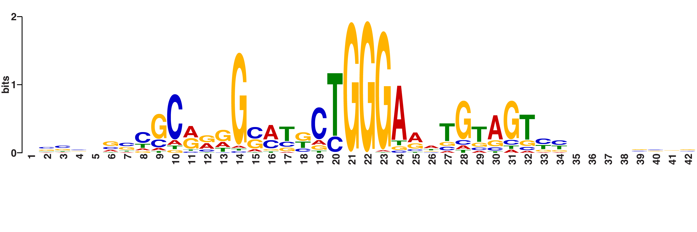

```{css, echo=FALSE}
body .main-container {
  max-width: 1600px !important;
  width: 1600px !important;
}
body {
  max-width: 1600px !important;
}

pre {
  max-height: 600px;
  overflow-y: auto;
}

pre[class] {
  max-height: 600px;
}
```

# Introduction

This is a vignette for ChIP-seq and motif analysis accompanying the manuscript "ZNF143 binds DNA and stimulates transcription initiation to activate and repress direct target genes" (doi: https://doi.org/10.1101/2024.05.13.594008). The analysis follows the published figures, which may differ from the preprint figures in labeling and content.

# Get files from GEO 

Log into the high-performance cluster, start an interactive node, set up the directories, and get the files from GEO accession record GSE266489 for ChIP-seq files. 

```{r engine='bash', eval=F, echo=TRUE} 
# Connect to the cluster
# ssh jdong@xanadu-submit-ext.cam.uchc.edu 

# Start interactive node
srun --partition=general --qos=general --mem=2G -N 1 -n 1 -c 1 --pty bash

# Make and change to analysis directories
mkdir /scratch/jdong/ZNF143dTAG/
cd /scratch/jdong/ZNF143dTAG/
mkdir ChIP
cd ChIP
mkdir FASTQ
cd FASTQ

```


"get_SRA_template_ChIP_SRR288794.sh":

```{r engine='bash', eval=F, echo=TRUE}
#! /usr/bin/bash

#SBATCH --job-name=get_ChIP_SRA_SRR288794XXX
#SBATCH -N 1
#SBATCH -n 1
#SBATCH -c 10
#SBATCH -p general
#SBATCH --qos=general
#SBATCH --mem=12G
#SBATCH --mail-type=ALL 
#SBATCH --mail-user=jdong@uchc.edu
#SBATCH -o /home/FCAM/jdong/slurm_out/%x_%j.all_out
#SBATCH -e /home/FCAM/jdong/slurm_out/%x_%j.all_out

export TMPDIR=/scratch/jdong/
cd /scratch/jdong/ZNF143dTAG/ChIP/FASTQ 
echo "Current wd:" $(pwd)
echo "Current node:" $(hostname)

module load sratoolkit/3.0.5 # latest version on Xanadu

fasterq-dump SRR288794XXX 

echo "Script finished:" $(date '+%a %Y-%m-%d %H:%M:%S %Z')

```

"get_SRA_template_ChIP_SRR307725.sh":

```{r engine='bash', eval=F, echo=TRUE}
#! /usr/bin/bash

#SBATCH --job-name=get_ChIP_SRA_SRR307725XXX
#SBATCH -N 1
#SBATCH -n 1
#SBATCH -c 10
#SBATCH -p general
#SBATCH --qos=general
#SBATCH --mem=12G
#SBATCH --mail-type=ALL 
#SBATCH --mail-user=jdong@uchc.edu
#SBATCH -o /home/FCAM/jdong/slurm_out/%x_%j.all_out
#SBATCH -e /home/FCAM/jdong/slurm_out/%x_%j.all_out

export TMPDIR=/scratch/jdong/
cd /scratch/jdong/ZNF143dTAG/ChIP/FASTQ 
echo "Current wd:" $(pwd)
echo "Current node:" $(hostname)

module load sratoolkit/3.0.5 # latest version on Xanadu

fasterq-dump SRR307725XXX 

echo "Script finished:" $(date '+%a %Y-%m-%d %H:%M:%S %Z')

```


Make individual scripts for each SRA run.

```{r engine='bash', eval=F, echo=TRUE}
# first set of files
file=/home/FCAM/jdong/script_templates/get_SRA_template_ChIP_SRR288794.sh

# create scripts
for i in {68..83}
do
  echo $i
  sed -e "s/XXX/${i}/g" "$file" > get_ChIP_SRA_SRR288794${i}.sh
  grep fasterq get_ChIP_SRA_SRR288794${i}.sh
done

# Submit jobs 
for i in {68..83}
do
    echo $i
    sbatch get_ChIP_SRA_SRR288794${i}.sh
done

# second set of files
file=/home/FCAM/jdong/script_templates/get_SRA_template_ChIP_SRR307725.sh

# create scripts
for i in {21..28}
do
  echo $i
  sed -e "s/XXX/${i}/g" "$file" > get_ChIP_SRA_SRR307725${i}.sh
  grep fasterq get_ChIP_SRA_SRR307725${i}.sh
done

# Submit jobs 
for i in {21..28}
do
    echo $i
    sbatch get_ChIP_SRA_SRR307725${i}.sh
done

```

The SRA runs for GSE266489 are:

- HEK293T ZNF143-dTAG Mock IP samples
  - SRR28879479: mock-control-rep1
  - SRR28879478: mock-control-rep2
  - SRR28879477: mock-dTAG-rep1
  - SRR28879476: mock-dTAG-rep2
- HEK293T ZNF143-dTAG control (no treatment) with anti-HA (ZNF143) ChIP 
  - SRR28879468: antiZNF143-control-rep1
  - SRR28879482: antiZNF143-control-rep2
- HEK293T ZNF143-dTAG degraded (30 min +dTAGV-1) with anti-HA (ZNF143) ChIP 
  - SRR28879481: antiZNF143-dTAG-rep1
  - SRR28879480: antiZNF143-dTAG-rep2
- HEK293T ZNF143-dTAG control (no treatment) with anti-SP1 ChIP 
  - SRR28879483: antiSP1-control-rep1
  - SRR28879475: antiSP1-control-rep2
  - SRR28879474: antiSP1-control-rep3
  - SRR28879473: antiSP1-control-rep4
- HEK293T ZNF143-dTAG degraded (30 min +dTAGV-1) with anti-SP1 ChIP
  - SRR28879472: antiSP1-dTAG-rep1
  - SRR28879471: antiSP1-dTAG-rep2
  - SRR28879470: antiSP1-dTAG-rep3
  - SRR28879469: antiSP1-dTAG-rep4
- HEK293T ZNF143-dTAG control (no treatment) with anti-Nrf1 ChIP 
  - SRR30772528: antiNrf1_control_1
  - SRR30772527: antiNrf1_control_2
  - SRR30772526: antiNrf1_control_3
  - SRR30772525: antiNrf1_control_4
- HEK293T ZNF143-dTAG degraded (30 min +dTAGV-1) with anti-Nrf1 ChIP
  - SRR30772524: antiNrf1_dTAG_1
  - SRR30772523: antiNrf1_dTAG_2
  - SRR30772522: antiNrf1_dTAG_3
  - SRR30772521: antiNrf1_dTAG_4

Rename files:

```{r engine='bash', eval=F, echo=TRUE}
mv SRR28879479_1.fastq HEK_CloneZD29_mock_control_rep1_PE1.fastq
mv SRR28879479_2.fastq HEK_CloneZD29_mock_control_rep1_PE2.fastq
mv SRR28879478_1.fastq HEK_CloneZD29_mock_control_rep2_PE1.fastq
mv SRR28879478_2.fastq HEK_CloneZD29_mock_control_rep2_PE2.fastq
mv SRR28879477_1.fastq HEK_CloneZD29_mock_dTAGV1_rep1_PE1.fastq
mv SRR28879477_2.fastq HEK_CloneZD29_mock_dTAGV1_rep1_PE2.fastq
mv SRR28879476_1.fastq HEK_CloneZD29_mock_dTAGV1_rep2_PE1.fastq
mv SRR28879476_2.fastq HEK_CloneZD29_mock_dTAGV1_rep2_PE2.fastq

mv SRR28879468_1.fastq HEK_CloneZD29_HA_control_rep1_PE1.fastq
mv SRR28879468_2.fastq HEK_CloneZD29_HA_control_rep1_PE2.fastq
mv SRR28879482_1.fastq HEK_CloneZD29_HA_control_rep2_PE1.fastq
mv SRR28879482_2.fastq HEK_CloneZD29_HA_control_rep2_PE2.fastq
mv SRR28879481_1.fastq HEK_CloneZD29_HA_dTAGV1_rep1_PE1.fastq
mv SRR28879481_2.fastq HEK_CloneZD29_HA_dTAGV1_rep1_PE2.fastq
mv SRR28879480_1.fastq HEK_CloneZD29_HA_dTAGV1_rep2_PE1.fastq
mv SRR28879480_2.fastq HEK_CloneZD29_HA_dTAGV1_rep2_PE2.fastq

mv SRR28879483_1.fastq HEK_CloneZD29_SP1_control_rep1_PE1.fastq
mv SRR28879483_2.fastq HEK_CloneZD29_SP1_control_rep1_PE2.fastq
mv SRR28879475_1.fastq HEK_CloneZD29_SP1_control_rep2_PE1.fastq
mv SRR28879475_2.fastq HEK_CloneZD29_SP1_control_rep2_PE2.fastq
mv SRR28879474_1.fastq HEK_CloneZD29_SP1_control_rep3_PE1.fastq
mv SRR28879474_2.fastq HEK_CloneZD29_SP1_control_rep3_PE2.fastq
mv SRR28879473_1.fastq HEK_CloneZD29_SP1_control_rep4_PE1.fastq
mv SRR28879473_2.fastq HEK_CloneZD29_SP1_control_rep4_PE2.fastq
mv SRR28879472_1.fastq HEK_CloneZD29_SP1_dTAGV1_rep1_PE1.fastq
mv SRR28879472_2.fastq HEK_CloneZD29_SP1_dTAGV1_rep1_PE2.fastq
mv SRR28879471_1.fastq HEK_CloneZD29_SP1_dTAGV1_rep2_PE1.fastq
mv SRR28879471_2.fastq HEK_CloneZD29_SP1_dTAGV1_rep2_PE2.fastq
mv SRR28879470_1.fastq HEK_CloneZD29_SP1_dTAGV1_rep3_PE1.fastq
mv SRR28879470_2.fastq HEK_CloneZD29_SP1_dTAGV1_rep3_PE2.fastq
mv SRR28879469_1.fastq HEK_CloneZD29_SP1_dTAGV1_rep4_PE1.fastq
mv SRR28879469_2.fastq HEK_CloneZD29_SP1_dTAGV1_rep4_PE2.fastq

mv SRR30772528_1.fastq HEK_CloneZD29_Nrf1_control_rep1_PE1.fastq
mv SRR30772528_2.fastq HEK_CloneZD29_Nrf1_control_rep1_PE2.fastq
mv SRR30772527_1.fastq HEK_CloneZD29_Nrf1_control_rep2_PE1.fastq
mv SRR30772527_2.fastq HEK_CloneZD29_Nrf1_control_rep2_PE2.fastq
mv SRR30772526_1.fastq HEK_CloneZD29_Nrf1_control_rep3_PE1.fastq
mv SRR30772526_2.fastq HEK_CloneZD29_Nrf1_control_rep3_PE2.fastq
mv SRR30772525_1.fastq HEK_CloneZD29_Nrf1_control_rep4_PE1.fastq
mv SRR30772525_2.fastq HEK_CloneZD29_Nrf1_control_rep4_PE2.fastq
mv SRR30772524_1.fastq HEK_CloneZD29_Nrf1_dTAGV1_rep1_PE1.fastq
mv SRR30772524_2.fastq HEK_CloneZD29_Nrf1_dTAGV1_rep1_PE2.fastq
mv SRR30772523_1.fastq HEK_CloneZD29_Nrf1_dTAGV1_rep2_PE1.fastq
mv SRR30772523_2.fastq HEK_CloneZD29_Nrf1_dTAGV1_rep2_PE2.fastq
mv SRR30772522_1.fastq HEK_CloneZD29_Nrf1_dTAGV1_rep3_PE1.fastq
mv SRR30772522_2.fastq HEK_CloneZD29_Nrf1_dTAGV1_rep3_PE2.fastq
mv SRR30772521_1.fastq HEK_CloneZD29_Nrf1_dTAGV1_rep4_PE1.fastq
mv SRR30772521_2.fastq HEK_CloneZD29_Nrf1_dTAGV1_rep4_PE2.fastq


```


# ChIP-seq alignment and peak calling


## Remove adapters and align to human genome 

In our daily workflow in the lab we use
`cutadapt` to remove adapter sequences. The options we use below are:

- `-m` specifies the minimal length of a read to keep after adapter sequence removal
- `-O` is the number of bases to trim off the end of the read if it overlaps with the adapter sequence 
- `-a` adapter sequence of PE1 reads 
- `-A` adapter sequence of PE2 reads
- `-o` PE1 output file 
- `-p` PE2 output file

The last two positional arguments are the input `fastq` files. Save the output
to a log file.

If the genome contains 25% of each base, then you would expect one quarter of the
reads that have no adapter to have the trailing base
trimmed. Likewise, approximately 1/16 of the remaining
reads without the adapter will have the final two bases
trimmed. Technically these values are not exact, because the reads with
matches to longer trailing k-mers (in this case 19-mers) would be
removed first, then 18-mer matches removed, and so on. 


After removing adapters, we are aligning to the `hg38.fa` genome.
The `-1` and`-2` options are for the respective paired-end `fastq` files. There is no
need to save the output `sam` file, so the output is piped to
`samtools` to convert to `bam`, then piped to `samtools fixmate`
which adds information about the fragment length by comparing the PE1
and PE2 coordinates. Then the files are sorted by coordinate and 
piped to `samtools markdup` to remove duplicate reads. Duplicate reads
have the same PE1 and PE2 ends. This is very unlikely to happen by
chance unless you sequence to very high read depth, so these reads are
considered PCR amplicon duplicates. The `fixmate` step is necessary to
pipe to `markdup`. After removing duplicates, the reads are sorted by name (`-n`) so paired
end reads are adjacent in the file. 

Template script "chip_cutadapt_align_template.sh":
```{r engine='bash', eval=F, echo=TRUE}
#! /usr/bin/bash

#SBATCH --job-name=chip_adapt_align_XXXXXXX.sh     # name for job
#SBATCH -N 1                  
#SBATCH -n 1                 
#SBATCH -c 40                 
#SBATCH -p general           
#SBATCH --qos=general       
#SBATCH --mem=32G               
#SBATCH --mail-type=ALL 
#SBATCH --mail-user=jdong@uchc.edu
#SBATCH -o /home/FCAM/jdong/slurm_out/%x_%j.all_out
#SBATCH -e /home/FCAM/jdong/slurm_out/%x_%j.all_out

export TMPDIR=/scratch/jdong
cd /scratch/jdong/ZNF143dTAG/ChIP/FASTQ
echo "Current wd:" $(pwd)
echo "Current node:" $(hostname)

name=XXXXXXX
read_size=40
module load samtools/1.16.1
module load genometools/1.5.10
module load ucsc_genome/2012.05.22
module load rust
module load bowtie2
module load bedtools
sizes=/home/FCAM/jdong/human38/hg38.chrom.sizes
genome=/home/FCAM/jdong/human38/hg38.fa
genome_index=/home/FCAM/jdong/human38/hg38
ncore=40

echo "Removing adapters" $(date '+%a %Y-%m-%d %H:%M:%S %Z')
cutadapt -a AGATCGGAAGAGCACACGTCTGAACTCCAGTCA -A AGATCGGAAGAGCGTCGTGTAGGGAAAGAGTGT --cores=$ncore -m 10 -O 1 -o ${name}_PE1_no_adapt.fastq -p ${name}_PE2_no_adapt.fastq ${name}_PE1.fastq ${name}_PE2.fastq 2>&1 | tee ${name}_cutadapt.log

echo "Begin alignment" $(date '+%a %Y-%m-%d %H:%M:%S %Z')
bowtie2 -p $ncore --maxins 800 -x $genome_index -1 ${name}_PE1_no_adapt.fastq -2 ${name}_PE2_no_adapt.fastq | samtools sort -@ $ncore -n -o ${name}.bw.bam

echo "Begin BAM processing" $(date '+%a %Y-%m-%d %H:%M:%S %Z')
samtools fixmate -m ${name}.bw.bam - | samtools sort -@ $ncore - | samtools markdup -s -r - ${name}.hg38.bam

echo "End: " $(date '+%a %Y-%m-%d %H:%M:%S %Z')
```

Generate sbatch scripts for each sample and submit to the cluster for parallel processing:

```{r engine='bash', eval=F, echo=TRUE}
file=/scratch/jdong/ZNF143dTAG/chip_cutadapt_align_template.sh

for i in *_PE1.fastq
do
    nm=$(echo $i | awk -F"/" '{print $NF}' | awk -F"_PE1.fastq" '{print $1}')
    echo $nm
    sed -e "s/XXXXXXX/${nm}/g" "$file" > chip_adapt_align_${nm}.sh
    sleep 1
done

# manually check if substitutions worked, then submit all
for i in chip_adapt_align_*rep*.sh
do
    echo $i
    sbatch $i
done
```

## seqOutBias 

### Pre-run seqtable 

For each specific read size, a tallymer file needs to be created by seqOutBias prior to running it to generate bigWigs from the aligned reads. This can be done separately since it can take some time and only needs to be completed once per read size. Since our reads are 40 bases long: 

```{r engine='bash', eval=F, echo=TRUE}
#! /usr/bin/bash

#SBATCH --job-name=seqOutBias40
#SBATCH -N 1                  
#SBATCH -n 1                 
#SBATCH -c 36                  
#SBATCH -p general           
#SBATCH --qos=general       
#SBATCH --mem=60G               
#SBATCH --mail-type=ALL 
#SBATCH --mail-user=jdong@uchc.edu
#SBATCH -o /home/FCAM/jdong/slurm_out/%x_%j.all_out
#SBATCH -e /home/FCAM/jdong/slurm_out/%x_%j.all_out

export TMPDIR=/scratch/jdong/
cd /scratch/jdong/ZNF143dTAG/sOBfiles/
echo "Current wd:" $(pwd)
echo "Current node:" $(hostname)

module load genometools/1.5.10
module load ucsc_genome/2012.05.22
module load rust

seqOutBias=/home/FCAM/jdong/software/seqOutBias #version 1.4.0
genome=/home/FCAM/jdong/human38/hg38.fa

echo "Time start seqOutBias:" $(date '+%a %Y-%m-%d %H:%M:%S %Z')

seqOutBias seqtable $genome --read-size=40

echo "Time script finished:" $(date '+%a %Y-%m-%d %H:%M:%S %Z')

```

This will generate the following output files for our particular read size:

- tallymer=hg38.tal_${read_size}.gtTxt.gz
- table=hg38_${read_size}.4.2.2.tbl

### Run seqOutBias

We will generate sbatch scripts for each sample and run them simultaneously.

Template script "chIP_seqOB_template.sh": 
```{r engine='bash', eval=F, echo=TRUE}
#! /usr/bin/bash

#SBATCH --job-name=chIP_seqOB2_XXXXXXX     # name for job
#SBATCH -N 1                  
#SBATCH -n 1                 
#SBATCH -c 1                  
#SBATCH -p general           
#SBATCH --qos=general       
#SBATCH --mem=24G               
#SBATCH --mail-type=ALL 
#SBATCH --mail-user=jdong@uchc.edu
#SBATCH -o /home/FCAM/jdong/slurm_out/%x_%j.all_out
#SBATCH -e /home/FCAM/jdong/slurm_out/%x_%j.all_out
export TMPDIR=/scratch/jhdtemp/tmp
echo "Current wd:" $(pwd)
echo "Current node:" $(hostname)

name=XXXXXXX
read_size=40
seqOutBias=/home/FCAM/jdong/software/seqOutBias #version 1.4.0
tallymerFile=/scratch/jdong/ZNF143dTAG/sOBfiles/hg38.tal_${read_size}.gtTxt.gz
tableFile=/scratch/jdong/ZNF143dTAG/sOBfiles/hg38_${read_size}.4.2.2.tbl
module load samtools/1.16.1
module load genometools/1.5.10
module load ucsc_genome/2012.05.22
module load rust
module load bowtie2
module load bedtools
sizes=/home/FCAM/jdong/human38/hg38.chrom.sizes
genome=/home/FCAM/jdong/human38/hg38.fa

echo "Begin seqOutBias"
seqOutBias scale ${tableFile} ${name}.hg38.bam --tallymer=$tallymerFile --shift-counts --no-scale --bw=${name}.seqOut.bigWig --read-size=${read_size} 2>&1 | tee ${name}_seqOutBias.log
echo "End seqOutBias"
```

Make individual scripts and submit:

```{r engine='bash', eval=F, echo=TRUE}
file=SP1chIP_seqOB_template.sh

for i in *_PE1.fastq 
do
    nm=$(echo $i | awk -F"/" '{print $NF}' | awk -F"_PE1.fastq" '{print $1}')
    echo $nm
    sed -e "s/XXXXXXX/${nm}/g" "$file" > SP1chIP_seqOB_${nm}.sh
    sleep 1
done

# manually check if substitutions worked, then submit all
for i in SP1chIP_seqOB_*rep*.sh
do
    echo $i
    sbatch $i
done
```

This process can be memory intensive, so we found 48G to be sufficient for our larger samples.

## Peak calling 
We call peaks with MACS3's `callpeak` function using the following arguments:

- `--call-summits`: looks for subpeaks inside every peak called by the default process
- `-t`: aligned treament files. If listing multiple, they will be pooled.
- `-c`: aligned control files. If listing multiple, they will be pooled. The same mock IP BAM files were used as background for all peak calling steps.
- `-g hs`: mappable or effective genome size, or the amount of genome that can be sequenced. Smaller than total genome size due to repetitions. Different for various species; 'hs' (which=2.7e9) is for human genomes.
- `q`: q-value (minimum false discovery rate) cutoff 
- `--keep-dup all`: keeps all tags(reads) at every location even if they are duplicates (same coordinate on same strand)
- `-f BAMPE`: format of input. In this case, we need to specify these BAM files contain paired-end reads
- `--nomodel`: by specifying `-f BAMPE` we are already bypassing building the shifting model, but this ensures that the model will not be built. Insert sizes determined from read pairs are used as fragments and no shifting is needed.
- `--tempdir temp_macs`: create this prior to running macs3. Designated directory to store temporary files. Will be empty after the `callpeaks` completes
 

```{r engine='bash', eval=F, echo=TRUE}
module load macs3

mkdir temp_macs

# Control ZNF143 ChIP only
macs3 callpeak --call-summits -t *HA_control*sorted.bam -c mock*hg38.bam -n ZNF143_ChIP -g hs -q 0.01 --keep-dup all -f BAMPE --nomodel --tempdir temp_macs

macs3 callpeak --call-summits -t *SP1*hg38.bam -c mock*hg38.bam -n antiSP1_ChIP -g hs -q 0.01 --keep-dup all -f BAMPE --nomodel --tempdir temp_macs

macs3 callpeak --call-summits -t *Nrf1*hg38.bam -c mock*hg38.bam -n antiNrf1_ChIP -g hs -q 0.01 --keep-dup all -f BAMPE --nomodel --tempdir temp_macs

```

### Remove peaks in blacklisted areas 

```{r engine='bash', eval=F, echo=TRUE}
wget https://github.com/Boyle-Lab/Blacklist/raw/master/lists/hg38-blacklist.v2.bed.gz
gunzip hg38-blacklist.v2.bed.gz
blacklist=hg38-blacklist.v2.bed
sizes=/Users/jinhongdong/fileRef/human38/hg38.chrom.sizes

# loop through all samples
for i in *_summits.bed
do
    name=$(echo $i | awk -F"/" '{print $NF}' | awk -F"_summits.bed" '{print $1}')
    echo $name
    grep -v "random" ${name}_summits.bed | grep -v "chrUn" | grep -v "chrEBV" | grep -v "chrM" | grep -v "alt" | intersectBed -v -a - -b $blacklist > ${name}_summits_final.bed
    slopBed -b 50 -i ${name}_summits_final.bed -g $sizes  | sort -k1,1 -k2,2n > ${name}_summit_100window.bed
    slopBed -b 200 -i ${name}_summits_final.bed -g $sizes  | sort -k1,1 -k2,2n > ${name}_summit_400window.bed
done

```

### Fraction of Reads in Peaks (FRiP)

Although low FRiP is not necessarily a cause for alarm with ChIP-seq samples, it can be informative to calculate to look for inconsistencies between samples. 

```{r engine='bash', eval=F, echo=TRUE}
# Loop through all samples

module load samtools

for i in *_peak_counts.txt
do
    name=$(echo $i | awk -F"/" '{print $NF}' | awk -F"_peak_counts.txt" '{print $1}')
    echo $name > ${name}_FRiP.txt
    awk '{print $NF}' ${name}_peak_counts.txt > ${name}_peak_counts_only.txt
    RiP=$(awk '{sum+=$1;} END{print sum;}' ${name}_peak_counts_only.txt)
    echo $name | cat - ${name}_peak_counts_only.txt > ${name}_peak_counts.txt
    aligned_reads=$(samtools view -c -f 0x42 ${name}.hg38.bam)
    FRiP=$(echo "scale=2 ; $RiP / $aligned_reads" | bc)
    echo $FRiP >> ${name}_FRiP.txt
    rm ${name}_peak_counts_only.txt
done

```

Our samples typically had FRiPs ranging from 5%-25% (excluding the +dTAGV-1 anti-HA samples, which were much lower). 

# Normalization for genome browser viewing 

Usually we combine replicates into a single track for visualization
and we compare the tracks between conditions. All ChIP-seq samples are normalized by read depth.

First normalize each replicate separately: 

Template script "normByRep_template.sh":
```{r engine='bash', eval=F, echo=TRUE}
#! /usr/bin/bash

#SBATCH --job-name=normByRep_XXXXXXX.sh     # name for job
#SBATCH -N 1                  
#SBATCH -n 1                 
#SBATCH -c 8               
#SBATCH -p general           
#SBATCH --qos=general       
#SBATCH --mem=12G               
#SBATCH --mail-type=ALL 
#SBATCH --mail-user=jdong@uchc.edu
#SBATCH -o /home/FCAM/jdong/slurm_out/%x_%j.out
#SBATCH -e /home/FCAM/jdong/slurm_out/%x_%j.err

export TMPDIR=/scratch/jhdtemp/tmp
echo "Current wd:" $(pwd)
echo "Current node:" $(hostname)

name=XXXXXXX
read_size=40
module load samtools/1.16.1
module load genometools/1.5.10
module load ucsc_genome/2012.05.22
module load rust
module load bowtie2
module load bedtools
sizes=/home/FCAM/jdong/human38/hg38.chrom.sizes
genome=/home/FCAM/jdong/human38/hg38.fa
genome_index=/home/FCAM/jdong/human38/hg38
ncore=8

samtools sort -@ $ncore -n -o ${name}.sorted.bam ${name}.hg38.bam
bedtools bamtobed -i ${name}.sorted.bam -bedpe > ${name}_bed12.bed
awk '$1==$4 {print $0}' ${name}_bed12.bed | awk '{OFS="\t";} {print $1, $2, $6}' | awk '$1!="." && $3>$2 && (($3 - $2)<2000) {print $0}' | sort -k1,1 -k2,2n > ${name}_read_span.bed
genomeCoverageBed -bg -i ${name}_read_span.bed -g $sizes > ${name}.bedGraph

echo "Generate normalized bedGraphs and bigWigs"
depth=`awk -F'\t' '{sum+=$5;}END{print sum;}' ${name}.hg38_not_scaled.bed` # this file is from seqOutBias 
scaled=$(bc <<< "scale=3 ; 10000000 / $depth") #scale: number of decimal points in result
echo $scaled
awk -v scaled="$scaled" '{OFS="\t";} {print $1, $2, $3, $4*scaled}' ${name}.bedGraph > ${name}_normalized.bedGraph
wigToBigWig -clip ${name}_normalized.bedGraph $sizes ${name}_normalized.bigWig

```

Generate individual scripts and submit:

```{r engine='bash', eval=F, echo=TRUE}
file=normByRep_template.sh

for i in *_PE1.fastq 
do
    nm=$(echo $i | awk -F"/" '{print $NF}' | awk -F"_PE1.fastq" '{print $1}')
    echo $nm
    sed -e "s/XXXXXXX/${nm}/g" "$file" > normByRep_${nm}.sh
    sleep 1
done

# manually check if substitutions worked, then submit all
for i in normByRep_*rep*.sh
do
    echo $i
    sbatch $i
done

```


Then combine and re-normalize all samples within a condition: 

```{r engine='bash', eval=F, echo=TRUE}
#! /usr/bin/bash

#SBATCH --job-name=merge_normalized
#SBATCH -N 1                  
#SBATCH -n 1                 
#SBATCH -c 1                  
#SBATCH -p general           
#SBATCH --qos=general       
#SBATCH --mem=32G               
#SBATCH --mail-type=ALL 
#SBATCH --mail-user=jdong@uchc.edu
#SBATCH -o /home/FCAM/jdong/slurm_out/%x_%j.all_out
#SBATCH -e /home/FCAM/jdong/slurm_out/%x_%j.all_out

export TMPDIR=/scratch/jdong
echo "Current wd:" $(pwd)
echo "Current node:" $(hostname)

module load ucsc_genome/2012.05.22
sizes=/home/FCAM/jdong/human38/hg38.chrom.sizes

# For each condition:
for i in *rep1*normalized.bigWig
do
    nm=$(echo $i | awk -F"/" '{print $NF}' | awk -F"_normalized" '{print $1}')
    name=$(echo $nm | awk -F"-rep" '{print $1}')
    echo $name
    reps=$(ls ${name}-rep*normalized.bigWig | wc -w | bc)
    echo $reps
    files=$(ls ${name}-rep*normalized.bigWig) 
    echo $files
    bigWigMerge $files ${name}_tmp.bg
    scaleall=$(bc <<< "scale=4 ; 1.0 / $reps")
    echo scale:
    echo $scaleall
    awk -v scaleall="$scaleall" '{OFS="\t";} {print $1, $2, $3, $4*scaleall}' ${name}_tmp.bg > ${name}_normalized.bedGraph
    rm ${name}_tmp.bg 
    wigToBigWig ${name}_normalized.bedGraph $sizes ${name}_merged_normalized.bigWig
done

```

The normalized bigWigs are available in our trackhub which is available by linking the UCSC genome browser to `http://guertinlab.cam.uchc.edu/ znf143_hub/hub.txt`.

# Calculating peak intensities 

After peak calling, we use DESeq2 to calculate normalized peak intensities. For ZNF143-ChIP, we use the manually calculated size factors based on read depth of the control samples, since the +dTAGV-1 ChIP samples have so little signal. For the other ChIPs, we use DESeq2-generated size factors. 

```{r engine='R', eval=F, echo=TRUE}


# ZNF143


# SP1


# Nrf1

# all that other deseq stuff

normCountsNrf1$nrf1ContPeakIntens = rowMeans(normCountsNrf1[,4:7])
normCountsNrf1sorted = normCountsNrf1[order(as.numeric(normCountsNrf1$nrf1ContPeakIntens), decreasing = FALSE),]
write.table(normCountsNrf1sorted[,c("chr","start","end","peakCoords","nrf1ContPeakIntens")], sep="\t", quote=FALSE, row.names=FALSE,col.names=FALSE,file="nrf1_peaks_intensities_decreasing_401bp.bed")
```

# Quick de novo motif analysis 

We do de novo motif analysis after peak calling to verify if our target antibodies pulled down our expected targets. Generally we expect that the top motif to come out of the most intense peaks to be that of our expected transcription factor. This was only done for non-ZNF143 samples since ZNF143 went through a more rigorous de novo motif analysis process (see below). 

```{r engine='bash', eval=F, echo=TRUE}
cat antiSP1_ChIP_summits.bed | sort -rn -k5 | head -1000 > antiSP1_top1kPeaks.bed
# search for motif in 100bp window (101 total)
sizes=/home/FCAM/jdong/human38/hg38.chrom.sizes
slopBed -b 50 -i antiSP1_top1kPeaks.bed -g $sizes  | sort -k1,1 -k2,2n > antiSP1_top1kPeaks_101window.bed
genome=/home/FCAM/jdong/human38/hg38.fa
fastaFromBed -fi $genome -bed antiSP1_top1kPeaks_101window.bed -fo antiSP1_top1kPeaks_101window.fasta

module load meme/5.4.1

meme -oc antiSP1_top1kPeaks_101window.meme_output -nmotifs 5 -objfun classic -csites 20000 -searchsize 0 -minw 5 -maxw 10 -revcomp -dna -markov_order 3 -maxsize 100000000 antiSP1_top1kPeaks_101window.fasta -mpi

meme -oc Nrf1_motif_analysis_top1k_normCounts.meme_output -nmotifs 3 -p 160 -objfun classic -csites 20000 -searchsize 0 -minw 5 -maxw 19 -revcomp -dna -markov_order 3 -maxsize 100000000 nrf1_normCounts_summits_top1k_101bp.fasta 

```

[add figure of sp motif]

[add figure of Nrf1 motif]


# ZNF143 ChIP-seq analysis 

## Defining a functional threshold for peak intensity

Getting down to 4682: SF_ZNF143summits_overQuant0.7.bed how did I make this file???????? See ZNF143_15_ChIP2_size_factors_20240108.qmd line 388 and above thank you past me for writing this!!!!!!! 

cumulativeQuantileChIP2_SF_abline400_CDF_Repressed.pdf <-- we picked intensity from this plot. 

(ZNF143_16.5_strict_r1...20240816.qmd)


Final file of ZNF143 functional binding sites: (see ZNF143_17_CDF...20240209.qmd)ZNF143strict_comp29_inferredSites_peakIntensities_unique.bed

## rigorous de novo motif analysis  

## heatmaps


# SP1 ChIP-seq analysis

## subsection(s)

## Differential binding analysis

# Nrf1 ChIP-seq analysis

## subsection(s)

## Differential binding analysis


# ======= previous =================
We use the entire DNA fragment for making the
browser tracks, which is accomplished by converting the paired-end
`bam` file to a `bed12` and taking out discordant reads. 
The final step is normalizing to read depth. 

"chip_alignment.sh":
```{r engine='bash', eval=F, echo=TRUE}
#! /usr/bin/bash

#SBATCH --job-name=chip_alignment_XXXXXXX.sh     # name for job
#SBATCH -N 1                  
#SBATCH -n 1                 
#SBATCH -c 32                  
#SBATCH -p general           
#SBATCH --qos=general       
#SBATCH --mem=32G               
#SBATCH --mail-type=ALL 
#SBATCH --mail-user=jdong@uchc.edu
#SBATCH -o chip_alignment_XXXXXXX.sh_%j.out
#SBATCH -e chip_alignment_XXXXXXX.sh_%j.err

cd /scratch/jhdtemp

echo "Current wd:" $(pwd)
echo "Current node:" $(hostname)

name=XXXXXXX
read_size=42
seqOutBias=/home/FCAM/jdong/software/seqOutBias #version 1.4.0
tallymerFile=/scratch/jhdtemp/hg38.tal_${read_size}.gtTxt.gz
module load samtools/1.16.1
module load genometools/1.5.10
module load ucsc_genome/2012.05.22
module load rust
module load bowtie2
module load bedtools
sizes=/home/FCAM/jdong/human38/hg38.chrom.sizes
genome=/home/FCAM/jdong/human38/hg38.fa
genome_index=/home/FCAM/jdong/human38/hg38
ncore=32

echo "Begin alignment"
bowtie2 -p $ncore --maxins 800 -x $genome_index -1 ${name}_PE1_no_adapt.fastq -2 ${name}_PE2_no_adapt.fastq | samtools sort -@ $ncore -n -o ${name}.bw.bam
echo "Zipping source FASTQs"
gzip ${name}_PE1_no_adapt.fastq
gzip ${name}_PE2_no_adapt.fastq
gzip ${name}_PE2.fastq
gzip ${name}_PE1.fastq
echo "Zipping done; begin BAM processing"
samtools fixmate -m ${name}.bw.bam - | samtools sort -@ $ncore - | samtools markdup -s -r - ${name}.hg38.bam
echo "Begin seqOutBias"
seqOutBias ${genome} ${name}.hg38.bam --tallymer=$tallymerFile --shift-counts --no-scale --bw=${name}.bigWig --read-size=${read_size} 2>&1 | tee ${name}_seqOutBias.log
echo "End seqOutBias"
samtools sort -@ $ncore -n -o ${name}.sorted.bam ${name}.hg38.bam
bedtools bamtobed -i ${name}.sorted.bam -bedpe > ${name}_bed12.bed
awk '$1==$4 {print $0}' ${name}_bed12.bed | awk '{OFS="\t";} {print $1, $2, $6}' | awk '$1!="." && $3>$2 && (($3 - $2)<2000) {print $0}' | sort -k1,1 -k2,2n > ${name}_read_span.bed
genomeCoverageBed -bg -i ${name}_read_span.bed -g $sizes > ${name}.bedGraph
echo "Generate normalized bedGraphs and bigWigs"
depth=`awk -F'\t' '{sum+=$5;}END{print sum;}' ${name}.hg38_not_scaled.bed`
scaled=$(bc <<< "scale=3 ; 10000000 / $depth") # should this always be scale=3 or flexible?
echo $scaled
awk -v scaled="$scaled" '{OFS="\t";} {print $1, $2, $3, $4*scaled}' ${name}.bedGraph > ${name}_normalized.bedGraph
wigToBigWig -clip ${name}_normalized.bedGraph $sizes ${name}_normalized.bigWig
echo "Script complete"
```

## Run the previous chunk in parallel 

Important: prior to running any sort of parallel alignment, seqOutBias needs to run tallymer once. This only needs to be done once for each dataset (as long as they have the same read length), as future runs of seqOutBias can use the same output. This step may take a while, so do it before sending anything to the cluster.

```{r engine='bash', eval=F, echo=TRUE}
genome=/home/FCAM/jdong/human38/hg38.fa
read_size=42

# run seqoutbias tallymer outside the loop
seqOutBias tallymer $genome $read_size

file=chip_alignment.sh

for i in *_PE1.fastq
do
    nm=$(echo $i | awk -F"/" '{print $NF}' | awk -F"_PE1.fastq" '{print $1}')
    fq=$(echo $i | rev | cut -f 1 -d '/' | rev)
    echo $nm
    echo $fq
    sed -e "s/XXXXXXX/${nm}/g" "$file" > chip_alignment_${nm}.sh
    sbatch chip_alignment_${nm}.sh
    sleep 1
done
```

# Combining replicates for the genome browser


[http://guertinlab.cam.uchc.edu/znf143_hub/](http://guertinlab.cam.uchc.edu/znf143_hub/)

```{r engine='bash', eval=F, echo=TRUE}
#!/bin/bash
module load ucsc_genome/2012.05.22
sizes=/home/FCAM/jdong/human38/hg38.chrom.sizes

for i in *ZNF*rep1_PE1.fastq.gz
do
    nm=$(echo $i | awk -F"/" '{print $NF}' | awk -F"_PE1.fastq.gz" '{print $1}')
    name=$(echo $nm | awk -F"_rep1" '{print $1}')
    echo $name
    reps=$(ls ${name}_rep*normalized.bigWig | wc -w | bc)
    echo $reps
    files=$(ls ${name}_rep*normalized.bigWig)
    echo $files
    bigWigMerge $files tmp.bg
    scaleall=$(bc <<< "scale=4 ; 1.0 / $reps")
    echo scale:
    echo $scaleall
    awk -v scaleall="$scaleall" '{OFS="\t";} {print $1, $2, $3, $4*scaleall}' tmp.bg > ${name}_normalized.bedGraph
    rm tmp.bg
    wigToBigWig ${name}_normalized.bedGraph $sizes ${name}.bigWig
    awk -v var="$name" 'BEGIN {  print "browser position chr11:5,289,521-5,291,937"; print "track type=bedGraph name=\"" var "\" description=\"" var "_bedGraph\" visibility=full autoScale=on alwaysZero=on color=0,0,0"}  { print $0}' ${name}_normalized.bedGraph > ${name}_header_normalized.bedGraph
    gzip ${name}_header_normalized.bedGraph
done
```

(make directories for each condition rather than each replicate? but this also removes all the BAMs from being accessible for the peak calling step)

```{r engine='bash', eval=F, echo=TRUE}
for i in *ZNF*PE1.fastq.gz
do
    name=$(echo $i | awk -F"/" '{print $NF}' | awk -F"_PE1.fastq.gz" '{print $1}')
    mkdir ${name}_files
    mv ${name}* ./${name}_files
done
```

# Peak calling

```{r engine='bash', eval=F, echo=TRUE}
#! /usr/bin/bash

#SBATCH --job-name=chip_peak_calling_ZNF143     # name for job
#SBATCH -N 1
#SBATCH -n 1
#SBATCH -c 2
#SBATCH -p general
#SBATCH --qos=general
#SBATCH --mem=32G
#SBATCH --mail-type=ALL
#SBATCH --mail-user=jdong@uchc.edu
#SBATCH -o /home/FCAM/jdong/slurm_out/%x_%j.all_out
#SBATCH -e /home/FCAM/jdong/slurm_out/%x_%j.all_out

cd /scratch/jhdtemp

echo "Current wd:" $(pwd)
echo "Current node:" $(hostname)

module load macs3

macs3 callpeak --call-summits -t *_CTCF_*sorted.bam -c *IgG*sorted.bam -n CTCF_ChIP -g hs -q 0.01 --keep-dup all -f BAMPE --nomodel --tempdir temp_macs
macs3 callpeak --call-summits -t *cont_HA_*sorted.bam -c *IgG*sorted.bam -n ZNF143_ChIP -g hs -q 0.01 --keep-dup all -f BAMPE --nomodel --tempdir temp_macs
```

## Removing peaks on contigs and within blacklisted regions


You can Google "blacklisted genomic regions" to find a
set of region in the genome in `bed` format that have an over-representation of
reads regardless of the experiment. Recall this is even more necessary
because we do not have a control data set. We can also remove peaks on non-canonical chromosomes with
`grep -v`. 

We also do slopBed to create two different sizes of windows in which we can count the number of reads in peaks.

```{r engine='bash', eval=F, echo=TRUE}
module load deeptools/3.5.0
module load bedtools
wget https://github.com/Boyle-Lab/Blacklist/raw/master/lists/hg38-blacklist.v2.bed.gz
gunzip hg38-blacklist.v2.bed.gz
blacklist=hg38-blacklist.v2.bed
sizes=/home/FCAM/jdong/human38/hg38.chrom.sizes

for i in *_summits.bed
do
    name=$(echo $i | awk -F"/" '{print $NF}' | awk -F"_summits.bed" '{print $1}')
    echo $name
    grep -v "random" ${name}_summits.bed | grep -v "chrUn" | grep -v "chrEBV" | grep -v "chrM" | grep -v "alt" | intersectBed -v -a - -b $blacklist > ${name}_summits_final.bed
    slopBed -b 70 -i ${name}_summits_final.bed -g $sizes  | sort -k1,1 -k2,2n > ${name}_summit_140window.bed
   	slopBed -b 200 -i ${name}_summits_final.bed -g $sizes  | sort -k1,1 -k2,2n > ${name}_summit_400window.bed
done

```

# Size factors from library 

To normalize our data later, we use samtools to count the number of reads that are paired and mapped in proper pairs (0x3). We do this for each replicate, and all the counts for a particular factor (ex. HA and CTCF below) are collected in the `*reads.txt` file. 

```{r engine='bash', eval=F, echo=TRUE}
#size factors

module load samtools/1.12
for i in HA
do
  echo $i
  > ${i}_header.txt
  > ${i}_reads.txt
  for j in HEK_ZNF-dTAG*_${i}_*sorted.bam
  do
    echo $j
    name=$(echo $j | awk -F".sorted.bam" '{print $1}')
    echo $name | paste ${i}_header.txt - > ${i}_tmp.txt 
    mv ${i}_tmp.txt ${i}_header.txt
    reads=`samtools view -c -f 0x3 $j`
    echo $reads | paste ${i}_reads.txt - > ${i}_tmp.txt 
    mv ${i}_tmp.txt ${i}_reads.txt
  done  
  cat ${i}_header.txt ${i}_reads.txt > ${i}_tmp.txt
  mv ${i}_tmp.txt ${i}_reads.txt
  rm ${i}_header.txt
done 

# repeat for CTCF
for i in CTCF
do
  echo $i
  > ${i}_header.txt
  > ${i}_reads.txt
  
  for j in HEK_ZNF-dTAG*_${i}_*sorted.bam
  do
    echo $j
    name=$(echo $j | awk -F".sorted.bam" '{print $1}')
    echo $name | paste ${i}_header.txt - > ${i}_tmp.txt 
    mv ${i}_tmp.txt ${i}_header.txt
    reads=`samtools view -c -f 0x3 $j`
    echo $reads | paste ${i}_reads.txt - > ${i}_tmp.txt 
    mv ${i}_tmp.txt ${i}_reads.txt
  done  
  
  cat ${i}_header.txt ${i}_reads.txt > ${i}_tmp.txt 
  mv ${i}_tmp.txt ${i}_reads.txt 
  rm ${i}_header.txt
done

```

## Differential binding and read count in peaks

Recall that this version of `R` on Xanadu has many of our libraries
preinstalled. 

```{r engine='bash', eval=F, echo=TRUE}
module load R/4.1.2

R
```


## things to do for the ZNF143

Using the parallel factor ChIP analysis does not work well because
ZNF143 is ablated on chromatin upon degradation. So size factors
cannot be accurately estimated between ZNF143 ChIP degron and
ZNF143/CTCF parallel factor ChIP degron. What is the point of the PF
then? well, we can see that by our peak calling threshold, that all
peaks decrease intensity and are likely true positives when we use
read depth to normalize. 

## Counting reads in peaks and differential binding 

Points to consider:

It is important to distinguish between the normalized and unnormalized bigWigs for this step.
DESeq requires unnormalized data, so use the bigWigs created by seqOutBias in the alignment step
as inputs for `znf143.counts.df`, since this becomes the basis for creating the DESeqDataSet object
used in `DESeq()`. There should be one bigWig per replicate for each condition.

We are also supplying our own size factors in the form of read counts (counted and collected above).
It is also important to remember to normalize the read counts (done here by `estimateSizeFactorsForMatrix`) prior to running `DESeq()`.

```{r, engine='R', eval=F, echo=T}
#libraries
library(DESeq2)
library(lattice)
library(dplyr)
library(ggplot2)
library(limma)
library(bigWig)

#functions on github
source('https://raw.githubusercontent.com/mjg54/znf143_pro_seq_analysis/master/docs/ZNF143_functions.R')

#new functions
get.counts.interval <- function(df, path.to.bigWig, file.prefix = 'H') {
    vec.names = c()
    inten.df=data.frame(matrix(ncol = 0, nrow = nrow(df)))
    
    for (mod.bigWig in Sys.glob(file.path(path.to.bigWig, paste(file.prefix, "*.bigWig", sep ='')))) {
        factor.name = strsplit(strsplit(mod.bigWig, "/")[[1]][length(strsplit(mod.bigWig, "/")[[1]])], '.bigWig')[[1]][1]
        print(factor.name)
        vec.names = c(vec.names, factor.name)
        loaded.bw = load.bigWig(mod.bigWig)
        print(mod.bigWig)
        mod.inten = bed.region.bpQuery.bigWig(loaded.bw, df, abs.value = TRUE)
        inten.df = cbind(inten.df, mod.inten)
    }
    colnames(inten.df) = vec.names
    r.names = paste(df[,1], ':', df[,2], '-', df[,3], sep='')
    row.names(inten.df) = r.names
    return(inten.df)
}

ma.plot.lattice <- function(ma.df, filename = 'file.name', 
         title.main = "Differential ATAC-seq Accessibility", ymin = -4,
         ymax=4,
         col = c("grey90",  "grey60", "#ce228e" , "#2290cf"))
  {
  pdf(paste("MA_plot_", filename, ".pdf", sep=''), 
      useDingbats = FALSE, width=3.83, height=3.83);
  print(xyplot(ma.df$log2FoldChange ~ log(ma.df$baseMean, base=10),
               groups=ma.df$response,
               col= col, ylim=c(ymin,ymax),
                main=title.main, scales="free", aspect=1, pch=20, cex=0.5,
               ylab=expression("log"[2]~"ChIP-seq change"), 
               xlab=expression("log"[10]~"Mean of Normalized Counts"),
               par.settings=list(par.xlab.text=list(cex=1.1,font=2), 
                                 par.ylab.text=list(cex=1.1,font=2))));
  dev.off()
  }

categorize.deseq.df.repressed <- function(df, fdr = 0.1, log2fold = 0.0, treat
= 'Auxin') {

     df.activated = data.frame(matrix(nrow = 0, ncol = 0))
     df.repressed = data.frame(matrix(nrow = 0, ncol = 0))
	 df.unchanged = data.frame(matrix(nrow = 0, ncol = 0))
     df.dregs = data.frame(matrix(nrow = 0, ncol = 0))
     if (nrow(df[df$padj < fdr & !is.na(df$padj) & df$log2FoldChange > log2fold,]) != 0) {
     	df.activated = df[df$padj < fdr & !is.na(df$padj) & df$log2FoldChange > log2fold,]
	df.activated$response = paste(treat, 'Activated')
	}

     if (nrow(df[df$padj < fdr & !is.na(df$padj) & df$log2FoldChange < -log2fold,]) != 0) {
     	df.repressed = df[df$padj < fdr & !is.na(df$padj) & df$log2FoldChange < -log2fold,]
	df.repressed$response = paste(treat, 'Repressed')
	}
    
    if (nrow(df[df$padj > 0.5 & !is.na(df$padj) & abs(df$log2FoldChange) < 0.25,]) != 0) {
	df.unchanged = df[df$padj > 0.5 & !is.na(df$padj) & abs(df$log2FoldChange) < 0.25,]
    df.unchanged$response = paste(treat, 'Unchanged')
	}

    if (nrow(df[!(df$padj < fdr & !is.na(df$padj) & df$log2FoldChange > log2fold) &
                  !(df$padj < fdr & !is.na(df$padj) & df$log2FoldChange < -log2fold) &
                  !(df$padj > 0.5 & !is.na(df$padj) &
    		  abs(df$log2FoldChange) < 0.25), ]) != 0) {
	df.dregs = df[!(df$padj < fdr & !is.na(df$padj) & df$log2FoldChange > log2fold) &
                  !(df$padj < fdr & !is.na(df$padj) & df$log2FoldChange < -log2fold) &
                  !(df$padj > 0.5 & !is.na(df$padj) &
    		  abs(df$log2FoldChange) < 0.25), ]
	df.dregs$response = paste(treat, 'All Other Genes')
	}
	print(head(df.repressed))
	print(head(df.activated))
	print(head(df.dregs))
	print(head(df.unchanged))
    df.effects.lattice = df.repressed
    #rbind(df.activated, 
    #      df.unchanged, 
    #      df.repressed, 
    #      df.dregs)
	print(head(df.effects.lattice))
    #df.effects.lattice$response = factor(df.effects.lattice$response)
	#df.effects.lattice$response = relevel(df.effects.lattice$response, ref = paste(treat, 'Unchanged'))
	#df.effects.lattice$response = relevel(df.effects.lattice$response, ref = paste(treat, 'All Other Genes'))
    return(df.effects.lattice)
}

# Begin analysis here

x = read.table('CTCF_ChIP_summit_400window.bed', sep = "\t", header=FALSE)
y = read.table('ZNF143_ChIP_summit_400window.bed', sep = "\t", header=FALSE)

# normalized signal for znf143 and ctcf
znf.signal.df = get.counts.interval(y, "/scratch/jhdtemp/norm_bigWigs")
ctcf.signal.df = get.counts.interval(x, "/scratch/jhdtemp/norm_bigWigs")

# get un-normalized counts for znf143 and ctcf
znf143.counts.df = get.counts.interval(y, "/scratch/jhdtemp/seqOutBias_bigWigs")
ctcf.counts.df = get.counts.interval(x, "/scratch/jhdtemp/seqOutBias_bigWigs")

# use read depth for ZNF143 size factors
HA.SF <- read.table("HA_reads.txt", sep = '\t', header = TRUE)[,-1]
HA.size.factors = estimateSizeFactorsForMatrix(HA.SF)


#first step is get sizefactors for CTCFHA degron, CTCFHA ctrl, CTCF degron, CTCF ctrl
#next step is identify ZNF143 peaks distal to any CTCF peak
#get sizefactors of HA ctrl and HACTCF ctrl for these peaks
#get sizefactors of HA degron and HACTCF degron for these peaks 
#use the HACTCF degron and HACTCF ctrl to get normalized size factors between all conditions 

# why combine? don't need to do this anymore?
#all.regions = rbind(ctcf.counts.df, znf143.counts.df)

#ctcf.all.regions=all.regions[,grepl("CTCF",colnames(all.regions))]
#sample.conditions = factor(sapply(strsplit(colnames(ctcf.all.regions), '_rep'), '[', 1))

#deseq.counts.table = DESeqDataSetFromMatrix(countData = ctcf.all.regions,
#                colData = as.data.frame(sample.conditions), 
#                design = ~ sample.conditions)
				
#dds <- estimateSizeFactors(deseq.counts.table , controlGenes=rownames(deseq.counts.table) %in% rownames(ctcf.counts.df))
#dds <- DESeq(dds)
#anchor.SF = dds$sizeFactor


# Get the HA columns (control and dTAGV) from the znf143 region counts table

#znf143.analysis.regions=all.regions[,grepl("_HA_",colnames(all.regions))]
znf143.analysis.regions=znf143.counts.df[,grepl("_HA_",colnames(znf143.counts.df))]

#znf143.analysis.regions = znf143.analysis.regions[rownames(znf143.analysis.regions) %in% rownames(znf143.counts.df),]
identical(rownames(znf143.analysis.regions),rownames(znf143.counts.df))
# [1] TRUE

#znf143.analysis.SF = HA.size.factors

sample.conditions = factor(sapply(strsplit(colnames(znf143.analysis.regions), '_rep'), '[', 1))

deseq.counts.table.4 = DESeqDataSetFromMatrix(countData = znf143.analysis.regions,
                colData = as.data.frame(sample.conditions),
                design = ~ sample.conditions)
		
		
#deseq.counts.table.4$colnames
#HA.sf.final = rep(NA, 6)
#HA.sf = read.table(i, sep = '\t', header = FALSE, check.names=FALSE)[,-1]
#HA.sf=t(HA.sf)

#factors <- read.table("ATAC_sizeFactor.txt")
#HA.sf.final[1:6] = as.numeric(HA.sf[2,1:6])
#names(HA.sf.final) = HA.sf[1,]
#sizeFactors(deseq.df) <- size_factors


#sizeFactors(deseq.counts.table.4) <- HA.sf.final/mean(HA.sf.final)

sizeFactors(deseq.counts.table.4) <- HA.size.factors

dds.4 <- DESeq(deseq.counts.table.4)


DE.results = results(dds.4)
#DE.results.lattice = 
#    categorize.deseq.df.repressed(DE.results, 
#                        fdr = 0.1, log2fold = 0.0, treat =
#						'ZNF143_degron_30min')
						
#DE.results.lattice = 
#    categorize.deseq.df(DE.results, 
#                        fdr = 0.1, log2fold = 0.0, treat =
#						'ZNF143_degron_30min')
						
						
normalized.counts.znf143 = counts(dds.4, normalized=TRUE)
peak.intensities = rowMeans(normalized.counts.znf143[,1:3])

names(peak.intensities) = rownames(normalized.counts.znf143)
chr = sapply(strsplit(names(peak.intensities), ":"), "[", 1)
rnge = sapply(strsplit(names(peak.intensities), ":"), "[", 2)
start = as.numeric(sapply(strsplit(rnge, "-"), "[", 1)) + 200
end = as.numeric(sapply(strsplit(rnge, "-"), "[", 2)) - 200

quantile(peak.intensities, probs = seq(.05, 1.00, by = .05))

j =0 
q=seq(.05, 1.00, by = .05)
count=0
for (i in quantile(peak.intensities, probs = seq(.05, 1.00, by =
.05)))
{
count = count +1

write.table(file = paste0('quantile', as.character(q[count]), '_summits.bed'), data.frame(chr[peak.intensities > j & peak.intensities <= i], start[peak.intensities > j & peak.intensities <= i], end[peak.intensities > j & peak.intensities <= i], peak.intensities[peak.intensities > j & peak.intensities <= i]), sep = '\t', quote=FALSE, col.names=FALSE, row.names=FALSE )
j = i
}

```


# Now switch over to the PRO-seq vignette to determine the functional peaks


## Establish threshold to define functional (final) peaks

1. Plot cumulative quantile CDF (like nesting quantile traces)
2. Note where overlaps begin to happen and use that to pick threshold for "functional" quantiles
3. Use threshold to obtain set of functional peaks 


```{r, engine='R', eval=F, echo=T}

#take the CDF plots from genex course with upstream vs downstream
length(peak.intensities[peak.intensities >= quantile(peak.intensities, probs = seq(.05, 1.00, by = .05))[13]])

func.znf143.peaks = peak.intensities[peak.intensities >= quantile(peak.intensities, probs = seq(.05, 1.00, by = .05))[13]]

other.znf143.peaks = peak.intensities[peak.intensities < quantile(peak.intensities, probs = seq(.05, 1.00, by = .05))[13]]

```

## Make CDF plots of peaks above and below the threshold, repressed and activated


```{r, engine='R', eval=F, echo=T}
setwd("/Users/jinhongdong/Desktop/TSSinference/ZNF143dTag_2023")
load("2023-08-20_cdfs_cont.Rdata")

highQuantPeaks = read.table(file="./ChIP/ZNF143_functional_peaks.bed", sep="\t", header=FALSE)
lowQuantPeaks = read.table(file="./ChIP/ZNF143_other_peaks.bed", sep="\t", header=FALSE)

library(latticeExtra)
library(DESeq2)
library(lattice)
library(dplyr)
library(ggplot2)
library(limma)
library(bigWig)
library(gplots)
library(RColorBrewer)
library(viridis)
source('https://raw.githubusercontent.com/guertinlab/seqOutBias/master/docs/R/seqOutBias_functions.R')
source('https://raw.githubusercontent.com/mjg54/znf143_pro_seq_analysis/master/docs/ZNF143_functions.R')
source('https://raw.githubusercontent.com/guertinlab/genex/main/ChIP_analysis/cdf_functions.R')

# use these versions of cdf.deseq.df and bedTools.Closest
cdf.deseq.df <- function(genes = gene.file, chip.peaks = chip.peaks, cat = "Repressed", opt.str="") {
  bed.tss.activated = get.tss(genes[genes$V5 == cat,])
  bed.tss.unchanged = get.tss(genes[genes$V5 == paste0("Matched to ", cat),])
  
  # note 'functionstring' in bedTools.closest
  act.distance = bedTools.closest(bed1 = bed.tss.activated, bed2 = chip.peaks[,c(1:3)], opt.string = '-D a')
  unreg.distance = bedTools.closest(bed1 = bed.tss.unchanged, bed2 = chip.peaks[,c(1:3)], opt.string = '-D a')

  df.up.can = cbind(act.distance[,c(4, 10)], paste0(opt.str,cat))
  df.un.can = cbind(unreg.distance[,c(4, 10)], paste0(opt.str,"Matched to ", cat))

  colnames(df.up.can) = c(colnames(df.up.can)[1:2], 'status')
  colnames(df.un.can) = c(colnames(df.up.can)[1:2], 'status')

  df.all = rbind(df.up.can, df.un.can)
  df.all$status = factor(df.all$status, levels = c(paste0(opt.str,cat), paste0(opt.str,"Matched to ", cat)))
  return(df.all)
}

bedTools.closest <- function(functionstring="/usr/local/bin/bedtools2-2.31.0/bin/closestBed",bed1,bed2,opt.string="") {
  
  options(scipen =99) # not to use scientific notation when writing out
  
  #write bed formatted dataframes to tempfile
  write.table(bed1,file= 'a.file.bed', quote=F,sep="\t",col.names=F,row.names=F)
  write.table(bed2,file= 'b.file.bed', quote=F,sep="\t",col.names=F,row.names=F)
  
  # create the command string and call the command using system()
  command1=paste('sort -k1,1 -k2,2n', 'a.file.bed', '> a.file.sorted.bed')
  cat(command1,"\n")
  try(system(command1))
  command2=paste('sort -k1,1 -k2,2n', 'b.file.bed', '> b.file.sorted.bed')
  cat(command2,"\n")
  try(system(command2))
  
  command=paste(functionstring,opt.string,"-a",'a.file.sorted.bed',"-b",'b.file.sorted.bed',">",'out.file.bed',sep=" ")
  cat(command,"\n")
  try(system(command))
  
  res=read.table('out.file.bed',sep ="\t", header=F, comment.char='')
  
  command3=paste('rm', 'a.file.bed', 'b.file.bed', 'a.file.sorted.bed', 'b.file.sorted.bed', 'out.file.bed')
  cat(command3,"\n")
  try(system(command3))
  
  colnames(res) = c(colnames(bed1), colnames(bed2), 'dis' )
  return(res)
}

# the PEAKS data frames above are already summits (1bp length regions) so I don't need to adjust them.
# opt.str you can change if you want to change the words in the resulting plot's key
df.rep.high = cdf.deseq.df(genes = gene.file, chip.peaks=highQuantPeaks, cat = "Repressed", opt.str = "Over threshold ")
df.rep.low = cdf.deseq.df(genes = gene.file, chip.peaks=lowQuantPeaks, cat = "Repressed", opt.str = "Below threshold ")

plot_cdf <- function(df.all, tf="quantile", cat = "Repressed", col.lines = c("#ce228e", "grey60", "#2290cf","grey90"), line.type = c(1), cex = 1, abline=0) {
pdf(paste0(tf, "_CDF_", cat, ".pdf"), width=6.2, height=3.83) 
         print(ecdfplot(~log(abs(dis), base = 10), groups = status, data = df.all,
         auto.key = list(lines=TRUE, points=FALSE, cex = cex),
         col = col.lines,
         aspect = 1,
                                        #xlim = c(0, 50000),
         scales=list(relation="free",alternating=c(1,1,1,1)),
         ylab = 'Cumulative Distribution Function',
         xlab = expression('log'[10]~'ZNF143 Distance from TSS'),
                                        #index.cond = list(c(2,1)),
         between=list(y=1.0),
         type = 'a',
         xlim = c(0,8),
         lwd=2,
         lty=line.type,
         par.settings = list(superpose.line = list(col = col.lines, lwd=3), strip.background=list(col="grey85")),
         panel = function(...) {
             panel.abline(v= log(abline, base=10), lty =2) # variable line location
             panel.ecdfplot(...)
         }))
    dev.off()
}

# CDF for repressed+matched, peaks above and below threshold
df.rep.all = rbind(df.rep.high, df.rep.low)

plot_cdf(df.rep.all, tf = "ZNF143_repAll_above_below_thresh", col.lines = c("#ce228e", "grey60", "#2290cf","grey90"), cat = cat, line.type = c(1), cex = 0.75)

# CDF for only those above threshold, but repressed and activated
df.act = cdf.deseq.df(genes = gene.file, chip.peaks=highQuantPeaks, cat = "Activated", opt.str = "Over threshold ")
df.high.rep.act = rbind(df.rep.high,df.act)

plot_cdf(df.high.rep.act, tf = "ZNF143_aboveThresh_rep_act", col.lines = c("#ce228e", "grey60", "#f7461e","grey90"), cat = "Both", line.type = c(1), cex = 0.75)
```

```{r, engine='R', eval=F, echo=T}
# Find point where repressed and matched CDF traces start being parallel 
match = ecdf(abs(df.rep.high$dis)[df.rep.high$status == 'Over threshold Matched to Repressed'])
rep = ecdf(abs(df.rep.high$dis)[df.rep.high$status == 'Over threshold Repressed'])
match.y = seq(0, 20000, by=20) # like indices
rep.y = seq(0, 20000, by=20)

spl = smooth.spline(rep.y, rep(rep.y) - match(match.y))
pred = predict(spl)
pred1 = predict(spl, deriv=1)

print('the distance that CDFs are parallel or converge')
print(rep.y[min(which(pred1$y<=0)) - 1])
# 440 yup, unchanged

pdf("empirical_distance_determination_ZNF143_latest.pdf", width=3.83, height=3.83) 
plot(rep.y, rep(rep.y) - match(match.y),
     xlim = c(0,2000),
     cex=0.7,
     xlab = 'ZNF143 distance from TSS (bp)',
     ylab = 'Repressed Genes CDF - Matched genes CDF')
     abline(v = rep.y[min(which(pred1$y<=0)) - 1], col =2, lty =2)
      lines(pred[[1]], pred[[2]], col = 'blue')
dev.off()


pdf("empirical_distance_determination_ZNF143_wide_latest.pdf", width=3.83, height=3.83) 
plot(rep.y, rep(rep.y) - match(match.y),
     xlim = c(0,10000),
     cex=0.7,
     xlab = 'ZNF143 distance from TSS (bp)',
     ylab = 'Repressed Genes CDF - Matched genes CDF')
     abline(v = rep.y[min(which(pred1$y<=0)) - 1], col =2, lty =2)
      lines(pred[[1]], pred[[2]], col = 'blue')
dev.off()
```
empirical_distance_determination_ZNF143_latest.pdf

empirical_distance_determination_ZNF143_wide_latest.pdf

```{r, engine='R', eval=F, echo=T}
# Replot the two CDFs above, but add the line where repressed and matched CDF traces start being parallel
plot_cdf(df.rep.all, tf = "ZNF143_repAll_above_below_thresh", col.lines = c("#ce228e", "grey60", "#2290cf","grey90"), cat = cat, line.type = c(1), cex = 0.75, abline=440)

plot_cdf(df.high.rep.act, tf = "ZNF143_aboveThresh_rep_act", col.lines = c("#ce228e", "grey60", "#f7461e","grey90"), cat = "Both", line.type = c(1), cex = 0.75, abline=440)

```
ZNF143_repAll_above_below_thresh_CDF_Repressed.pdf

ZNF143_aboveThresh_rep_act_CDF_Both.pdf

## correct cdf code

```{r, engine='R', eval=F, echo=T}
bedTools.closest <- function(functionstring="/usr/local/bin/bedtools2-2.31.0/bin/closestBed",bed1,bed2,opt.string="") {
  
  options(scipen =99) # not to use scientific notation when writing out
  
  #write bed formatted dataframes to tempfile
  write.table(bed1,file= 'a.file.bed', quote=F,sep="\t",col.names=F,row.names=F)
  write.table(bed2,file= 'b.file.bed', quote=F,sep="\t",col.names=F,row.names=F)
  
  # create the command string and call the command using system()
  command1=paste('sort -k1,1 -k2,2n', 'a.file.bed', '> a.file.sorted.bed')
  cat(command1,"\n")
  try(system(command1))
  command2=paste('sort -k1,1 -k2,2n', 'b.file.bed', '> b.file.sorted.bed')
  cat(command2,"\n")
  try(system(command2))
  
  # use opt.string argument to add options for closestBed
  command=paste(functionstring,opt.string,"-a",'a.file.sorted.bed',"-b",'b.file.sorted.bed',">",'out.file.bed',sep=" ")
  cat(command,"\n")
  try(system(command))
  
  res=read.table('out.file.bed',sep ="\t", header=F, comment.char='')
  
  command3=paste('rm', 'a.file.bed', 'b.file.bed', 'a.file.sorted.bed', 'b.file.sorted.bed', 'out.file.bed')
  cat(command3,"\n")
  try(system(command3))
  
  colnames(res) = c(colnames(bed1), colnames(bed2), 'dis' )
  return(res)
}

# makes input dataframe for plotting function
cdf.deseq.df <- function(genes = gene.file, chip.peaks = chip.peaks, cat = "Repressed", opt.str="") {
  bed.tss.activated = get.tss(genes[genes$V5 == cat,])
  bed.tss.unchanged = get.tss(genes[genes$V5 == paste0("Matched to ", cat),])
  
  # note 'functionstring' in bedTools.closest
  act.distance = bedTools.closest(bed1 = bed.tss.activated, bed2 = chip.peaks[,c(1:3)], opt.string = '-D a')
  unreg.distance = bedTools.closest(bed1 = bed.tss.unchanged, bed2 = chip.peaks[,c(1:3)], opt.string = '-D a')

  df.up.can = cbind(act.distance[,c(4, 10)], paste0(opt.str,cat))
  df.un.can = cbind(unreg.distance[,c(4, 10)], paste0(opt.str,"Matched to ", cat))

  colnames(df.up.can) = c(colnames(df.up.can)[1:2], 'status')
  colnames(df.un.can) = c(colnames(df.up.can)[1:2], 'status')

  df.all = rbind(df.up.can, df.un.can)
  df.all$status = factor(df.all$status, levels = c(paste0(opt.str,cat), paste0(opt.str,"Matched to ", cat)))
  return(df.all)
}

# plotting function
plot_cdf <- function(df.all, tf="quantile", cat = "Repressed", col.lines = c("#ce228e", "grey60", "#2290cf","grey90"), line.type = c(1), cex = 1, abline=1) {
pdf(paste0(tf, "_CDF_", cat, ".pdf"), width=6.2, height=3.83) 
         print(ecdfplot(~log(abs(dis), base = 10), groups = status, data = df.all,
         auto.key = list(lines=TRUE, points=FALSE, cex = cex),
         col = col.lines,
         aspect = 1,
                                        #xlim = c(0, 50000),
         scales=list(relation="free",alternating=c(1,1,1,1)),
         ylab = 'Cumulative Distribution Function',
         xlab = expression('log'[10]~'ZNF143 inferred binding site distance from TSS'),
                                        #index.cond = list(c(2,1)),
         between=list(y=1.0),
         type = 'a',
         xlim = c(0,8),
         lwd=2,
         lty=line.type,
         par.settings = list(superpose.line = list(col = col.lines, lwd=3), strip.background=list(col="grey85")),
         panel = function(...) {
             panel.abline(v= log(abline, base=10), lty =2) # variable line location
             panel.ecdfplot(...)
         }))
    dev.off()
}

gene.file=read.table(file = "./ZNF143dTAG_diffExp/treated_and_matched_genes_merged.bed", sep="\t", header=FALSE)

znf143binding = read.table(file = "/Users/jinhongdong/znf143_degron/ChIP_analysis/peaks_motifs_final/inferred_ZNF143_motifs_w_chip_intensity.bed", sep="\t", header=FALSE)

dim(znf143binding)
[1] 3772    6
head(znf143binding)
    V1       V2       V3               V4       V5 V6
1 chr1  1116268  1116296 0.00000000000746 3437.724  +
2 chr1  6613620  6613648 0.00000000000130 2676.739  -
3 chr1 10472584 10472612 0.00000000048900 2219.421  +
4 chr1 25998220 25998248 0.00000000612000 3401.978  -
5 chr1 33472617 33472645 0.00000000026400 3064.417  -

unique(znf143binding$V3-znf143binding$V2)
# 28

rep.df = cdf.deseq.df(genes=gene.file, chip.peaks= znf143binding, cat="Repressed")
act.df = cdf.deseq.df(genes=gene.file, chip.peaks= znf143binding, cat="Activated")
plot.df = rbind(rep.df, act.df)

# Get distance when number of repressed genes increases at same rate as matched genes
match = ecdf(abs(plot.df$dis)[plot.df$status == 'Matched to Repressed'])
rep = ecdf(abs(plot.df$dis)[plot.df$status == 'Repressed'])
match.y = seq(0, 20000, by=20) # creating indices
rep.y = seq(0, 20000, by=20)

spl = smooth.spline(rep.y, rep(rep.y) - match(match.y))
pred = predict(spl)
pred1 = predict(spl, deriv=1)

print('the distance that CDFs are parallel or converge')
print(rep.y[min(which(pred1$y<=0)) - 1])
[1] 440 

# add abline at 440 distance (technically log10 of) and plot CDF 
plot_cdf(plot.df, tf = "ZNF143_binding_vs_TSS", col.lines = c("#2290cf", "grey60", "#ce228e","grey90"), cat = "diffExp", line.type = c(1), cex = 0.75, abline=440)
```


# Motif analysis of other and functional ZNF143 peaks


```{r, engine='R', eval=F, echo=T}

chr = sapply(strsplit(names(func.znf143.peaks), ":"), "[", 1)
rnge = sapply(strsplit(names(func.znf143.peaks), ":"), "[", 2)
start =	as.numeric(sapply(strsplit(rnge, "-"), "[", 1)) + 200
end = as.numeric(sapply(strsplit(rnge, "-"), "[", 2)) - 200

write.table(cbind(chr, start, end), file = "ZNF143_functional_peaks.bed", quote = FALSE,
col.names =FALSE, row.names=FALSE, sep = "\t")
write.table(cbind(chr, start, end, func.znf143.peaks), file = "ZNF143_functional_intensity_peaks.bed", quote = FALSE,
col.names =FALSE, row.names=FALSE, sep = "\t")


chr = sapply(strsplit(names(other.znf143.peaks), ":"), "[", 1)
rnge = sapply(strsplit(names(other.znf143.peaks), ":"), "[", 2)
start =	as.numeric(sapply(strsplit(rnge, "-"), "[", 1)) + 200
end = as.numeric(sapply(strsplit(rnge, "-"), "[", 2)) - 200

write.table(cbind(chr, start, end), file = "ZNF143_other_peaks.bed", quote = FALSE,
col.names =FALSE, row.names=FALSE, sep = "\t")
write.table(cbind(chr, start, end, other.znf143.peaks), file = "ZNF143_other_intensity_peaks.bed", quote = FALSE,
col.names =FALSE, row.names=FALSE, sep = "\t")

```


# deeptools heatmap of ZNF143 functional and non-functional peaks [not done yet]

```{r, engine='bash', eval=F, echo=T}

module load deeptools/3.5.0
module load bedtools

#Make the matrix (this can be used for a composite profile as well)
computeMatrix reference-point --referencePoint center -b 500 -a 500 -p 2 --missingDataAsZero \
  -R ZNF143_functional_peaks.bed \
  -S HEK_ZNF-dTAG_cont_HA.bigWig \
  HEK_ZNF-dTAG_dTAGV_HA.bigWig \
  -o matrix_HA_ChIP_ZNF143_peaks.gz --outFileSortedRegions ZNF143_peaks_sorted_for_heatmap.bed
  
#Make the heatmap
plotHeatmap -m matrix_HA_ChIP_ZNF143_peaks.gz -out heatmap_HA_ChIP_ZNF143_peaks.pdf --heatmapHeight 7 \
   --regionsLabel "ZNF143 peaks" --xAxisLabel "Distance from summit" \
   --samplesLabel "DMSO" "dTAG" --colorMap Purples -min 0 -max 300 --whatToShow "heatmap and colorbar" 
   
   
   #Make the matrix (this can be used for a composite profile as well)
computeMatrix reference-point --referencePoint center -b 500 -a 500 -p 2 --missingDataAsZero \
  -R ZNF143_other_peaks.bed \
  -S HEK_ZNF-dTAG_cont_HA.bigWig \
  HEK_ZNF-dTAG_dTAGV_HA.bigWig \
  -o all_matrix_HA_ChIP_ZNF143_peaks.gz --outFileSortedRegions other_ZNF143_peaks_sorted_for_heatmap.bed
  
#Make the heatmap
plotHeatmap -m all_matrix_HA_ChIP_ZNF143_peaks.gz -out other_heatmap_HA_ChIP_ZNF143_peaks.pdf --heatmapHeight 7 \
   --regionsLabel "ZNF143 peaks" --xAxisLabel "Distance from summit" \
   --samplesLabel "DMSO" "dTAG" --colorMap Purples -min 0 -max 300 --whatToShow "heatmap and colorbar" 

#so we can see peaks
plotHeatmap -m all_matrix_HA_ChIP_ZNF143_peaks.gz -out other_heatmap_HA_ChIP_ZNF143_peaks_scaled.pdf --heatmapHeight 7 \
   --regionsLabel "ZNF143 peaks" --xAxisLabel "Distance from summit" \
   --samplesLabel "DMSO" "dTAG" --colorMap Purples -min 0 -max 13 --whatToShow "heatmap and colorbar" 
```


# De novo motif analysis of ZNF143 peaks

I am brute forcing my way through an iterative and exhaustive motif
analysis. This should be written into a systematic loop. The reason I
did not is because I am manualy looking at the top hit to ensure that
it is a ZNF143 motif variant before going on to the next
iteration. Any student using this for their work needs to put in the
work to automate systematic iterative exhaustive de novo motif
analysis. 

```{r engine='bash', eval=F, echo=TRUE}
cd /labs/Guertin/ZNF143_ChIP/

module load meme/5.4.1
module load bedtools

genome=/home/FCAM/jdong/human38/hg38.fa
sizes=/home/FCAM/jdong/human38/hg38.chrom.sizes

for i in ZNF143_*_peaks.bed
do
	name=$(echo $i | awk -F"/" '{print $NF}' | awk -F"_peaks.bed" '{print $1}')
	echo $name
	slopBed -b 70 -i $i -g $sizes  | sort -k1,1 -k2,2n > ${name}_summit_140window.bed
   	slopBed -b 200 -i $i -g $sizes  | sort -k1,1 -k2,2n > ${name}_summit_400window.bed
	fastaFromBed -fi $genome -bed ${name}_summit_140window.bed -fo ${name}_summit_140window.fasta
done

# for i in ZNF143_*_peaks.bed
# do
# 	name=$(echo $i | awk -F"/" '{print $NF}' | awk -F"_peaks.bed" '{print $1}')
# 	echo $name
# 	meme -p 16 -oc ${name}_motif_functional.meme_output -nmotifs 1 -objfun classic -csites 20000 -searchsize 0 -minw 10 -maxw 25 -revcomp -dna -markov_order 3 -maxsize 100000000 ${name}_summit_140window.fasta
# done

# meme round 1
# note: I'm only going to meme the functional peaks, so I didn't do the loop above
meme -p 40 -oc ZNF143_functional_motif_functional.meme_output -nmotifs 1 -objfun classic -csites 20000 -searchsize 0 -minw 10 -maxw 25 -revcomp -dna -markov_order 3 -maxsize 100000000 ZNF143_functional_summit_140window.fasta

fimo --max-strand --max-stored-scores 10000000 --oc ZNF143_functional_motif_functional.fimo_output ZNF143_functional_motif_functional.meme_output/meme.txt $genome

tail -n +2 ZNF143_functional_motif_functional.fimo_output/fimo.tsv | awk '{OFS="\t";} {print $3,$4,$5,$7,$8,$6}' | grep -v Individual| grep -v format | grep -v "max-stored-scores" | sort -k1,1 -k2,2n | tail -n +2 > fimo_ZNF143_functional_round1.bed

wc -l fimo_ZNF143_functional_round1.bed
# 1455305 fimo_ZNF143_functional_round1.bed

# get peaks that DON'T overlap with motif locations we just found
intersectBed -v -wa -a ZNF143_functional_summit_140window.bed -b fimo_ZNF143_functional_round1.bed > ZNF143_ChIP_summit_140window_no_func_motif_1.bed

wc -l ZNF143_ChIP_summit_140window_no_func_motif_1.bed
# 655 ZNF143_ChIP_summit_140window_no_func_motif_1.bed

fastaFromBed -fi $genome -bed ZNF143_ChIP_summit_140window_no_func_motif_1.bed -fo ZNF143_ChIP_summit_140window_no_func_motif_1.fasta

# meme round 2
meme -p 40 -oc ZNF143_functional_motif_functional_second.meme_output -nmotifs 1 -objfun classic -csites 20000 -searchsize 0 -minw 10 -maxw 25 -revcomp -dna -markov_order 3 -maxsize 100000000 ZNF143_ChIP_summit_140window_no_func_motif_1.fasta

fimo --max-strand --max-stored-scores 10000000 --oc ZNF143_functional_motif_functional_second.fimo_output ZNF143_functional_motif_functional_second.meme_output/meme.txt $genome

tail -n +2 ZNF143_functional_motif_functional_second.fimo_output/fimo.tsv | awk '{OFS="\t";} {print $3,$4,$5,$7,$8,$6}' | grep -v Individual| grep -v format | grep -v "max-stored-scores" | sort -k1,1 -k2,2n | tail -n +2 > fimo_ZNF143_functional_round2.bed

intersectBed -v -wa -a ZNF143_ChIP_summit_140window_no_func_motif_1.bed -b fimo_ZNF143_functional_round2.bed > ZNF143_ChIP_summit_140window_no_func_motif_1_or_2.bed

wc -l ZNF143_ChIP_summit_140window_no_func_motif_1_or_2.bed
# 93 ZNF143_ChIP_summit_140window_no_func_motif_1_or_2.bed

# did not do third round
# fastaFromBed -fi $genome -bed ZNF143_ChIP_summit_140window_no_func_motif_1_or_2.bed -fo ZNF143_ChIP_summit_140window_no_func_motif_1_or_2.fasta
# meme -p 16 -oc ZNF143_functional_motif_functional_third.meme_output -nmotifs 1 -objfun classic -csites 20000 -searchsize 0 -minw 10 -maxw 25 -revcomp -dna -markov_order 3 -maxsize 100000000 ZNF143_ChIP_summit_140window_no_func_motif_1_or_2.fasta

wc -l ZNF143_functional_summit_140window.bed
# 2182 ZNF143_functional_summit_140window.bed

#96% have either motif
# what comparison comparison set of regions can we use as a control?
```

# Combining different ZNF143 matricies

we could also incorporate the third motif, but the vast majority of peaks have one of the first two

```{r engine='bash', eval=F, echo=TRUE}
genome=/home/FCAM/jdong/human38/hg38.fa
#cat fimo_ZNF143_functional_round1.bed fimo_ZNF143_functional_round2.bed | sort -k1,1 -k2,2n > all_ZNF143_motifs.bed
closestBed -d -t first -a ZNF143_functional_peaks.bed -b fimo_ZNF143_functional_round1.bed > motif1_znf143_peaks.bed
closestBed -d -t first -a ZNF143_functional_peaks.bed -b fimo_ZNF143_functional_round2.bed > motif2_znf143_peaks.bed

#motif 2 subtract 9 from start if a minus motif
#motif 1 add 9 to end if a minus motif
#motif 1 subtract 9 from start if a plus motif
#motif 2 add 9 to end if a plus motif

awk '{OFS="\t";} {if($9 == "-") print $4,$5-9,$6,$7,$8,$9; else print $4,$5,$6+9,$7,$8,$9}' motif2_znf143_peaks.bed > expanded_motif2_znf143_peaks.bed
awk '{OFS="\t";} {if($9 == "-") print $4,$5,$6+9,$7,$8,$9; else print $4,$5-9,$6,$7,$8,$9}' motif1_znf143_peaks.bed > expanded_motif1_znf143_peaks.bed

# big list of (unique) fimo regions
cat expanded_motif*_znf143_peaks.bed | sort -k1,1 -k2,2n |  awk '!seen[$1,$2]++' > expanded_motifs_in_peaks.bed

# look again for closest regions, but using the expanded regions this time
# and still print only the fimo regions ($4-$9) with a distance less than 150bp
closestBed -d -t first -a ZNF143_functional_peaks.bed -b expanded_motifs_in_peaks.bed | awk '{OFS="\t";} {if($10 < 150) print $4,$5,$6,$7,$8,$9}' > expanded_motifs_closest.bed

# turn this into 42bp-width windows 
awk '{OFS="\t";} {if($6 == "-") print $1,$2-10,$3+10,$4,$5,$6; else print $1,$2-10,$3+10,$4,$5,$6}' expanded_motifs_closest.bed > expanded_motifs_window.bed

fastaFromBed -s -fi $genome -bed expanded_motifs_window.bed > expanded_motifs_for_PSWM.fasta
# see https://github.com/guertinlab/Tn5bias/blob/master/Manuscript_Vignette/Tn5_ATAC_bias.pdf section 2.4
```

After looking at the resulting FASTA, the 'GGG' sequence was not aligned for all of the regions. The plus regions needed to be shifted by one base pair, but that resulted in an aligned FASTA which we used for creating the PSWM. 

```{r engine='bash', eval=F, echo=TRUE}
awk '{OFS="\t";} {if($6 == "+") print $1,$2-1,$3-1,$4,$5,$6; else print $0}' expanded_motifs_window.bed > expanded_motifs_window_plus-1_shift.bed

fastaFromBed -s -fi $genome -bed expanded_motifs_window_plus-1_shift.bed > expanded_motifs_for_PSWM_plus-1.fasta
```

## move into R to make a PSWM for `meme`

```{r, engine='R', eval=F, echo=T}

source("https://raw.githubusercontent.com/guertinlab/Tn5bias/master/Manuscript_Vignette/Vignette_Scripts/Figure1_Nucleotide_Count.R")
source('https://raw.githubusercontent.com/guertinlab/seqOutBias/master/docs/R/seqOutBias_functions.R') 
library(ggseqlogo)

pswm.func.2 <- function(x.ligation, out = 'outfilename') {
  col.matrix <- matrix(unlist(strsplit(as.character(x.ligation), '')), ncol = 29, byrow = TRUE)
  
  a.nuc <- colSums(col.matrix == "A")
  t.nuc <- colSums(col.matrix == "T")
  c.nuc <- colSums(col.matrix == "C")
  g.nuc <- colSums(col.matrix == "G")
  
  pswm <- cbind(a.nuc, c.nuc, g.nuc, t.nuc)
  
  pswm <- pswm / rowSums(pswm)
  
  outfile <- file(paste0(out, '.txt'))
  on.exit(close(outfile))
  writeLines(c(
    "MEME version 4", 
    "ALPHABET= ACGT", 
    "strands: + -", 
    " ",
    "Background letter frequencies (from uniform background):",
    "A 0.30000 C 0.20000 G 0.20000 T 0.30000", 
    paste("MOTIF", out), 
    " ", 
    "letter-probability matrix: alength= 4 w= 29"
  ), outfile)
  
  write.table(pswm, file = paste0(out, '.txt'), append = TRUE, quote = FALSE, row.names = FALSE, col.names = FALSE)
  
  return(pswm)
}


x = read.table('expanded_motifs_for_PSWM_plus-1.fasta', comment.char = ">", header =FALSE)
znf143pswm = pswm.func.2(x[,1], "ZNF143")
write.table(znf143pswm, file = "znf143_denovo_pswm_ACGT.txt", sep="\t", quote = FALSE, col.names =FALSE, row.names=FALSE)
```

## make matrix with `meme` suite
```{r engine='bash', eval=F, echo=TRUE}

ceqlogo -i ZNF143.txt -m ZNF143 -o ZNF143_combined.eps
```
<!-- ```{r  out.width = "50%", out.height = "50%", echo=F, fig.align = "center", fig.cap="combined ZNF143 seqLogo"}
library(knitr)
 
``` -->

ZNF143_combined_final.png

## Trimming PSWM

In order to get specific binding locations of ZNF143, we generated a de novo composite motif from the functional ZNF143 peaks. To get a more informative binding site, after observing the position-specific weight matrix for that motif we decided to trim the motif to positions 7-35 inclusive based on information content. That is, we selected positions begining from position 7 of the original composite motif because the prior positions only had a maximum frequency of 36% for any one nucleotide, and the positions after 35 only had a maximum frequency of 35% for any one nucleotide.

```{r engine='bash', eval=F, echo=TRUE}
# get header to make A
head -9 ZNF143.txt > fileA.txt
# change 'w= 42' to 'w= 29' in A
sed 's/42/29/' fileA.txt > fileA2.txt

# head then tail the rest of the file to make B
tail +16 ZNF143.txt | head -29 > fileB.txt # should have 29 lines

cat fileA2.txt fileB.txt > ZNF143_PSWM_trimmed.txt

```


<!--
# make a barchart for fraction of peaks with motifs 

```{r engine='bash', eval=F, echo=TRUE}
#input for barchart

rm barchart.txt
for i in quantile*.bed
do
	name=$(echo $i | awk -F"quantile" '{print $NF}' | awk -F".bed" '{print $1}')
	sort -k1,1 -k2,2n $i > tmp.bed
	echo $name 
	intersectBed -u -wa -a tmp.bed -b fimo_ZNF143.bed fimo_ZNF143_motif2.bed > overlap_${name}_znf143.bed
	num=`wc -l overlap_${name}_znf143.bed | cut -f1 -d 'o'`
	tot=`wc -l $i | cut -f1 -d 'q'`
	echo ${num} pos ${name} ZNF143 >> barchart.txt
	neg=$(expr ${tot} - ${num})
	echo ${neg} neg ${name} ZNF143 >> barchart.txt
done


```


-->

# Jinhong: To do

## [in progress] run through the entire vignette and add context paragraphs and include figures

## [x] make a composite PSWM of motif 1 and motif 2 from the functional peaks 

## [x] make a composite FIMO motif signal at peak summits

## [] de novo motif analysis on other (non-functional peaks)

## Calculate the fraction of reads in peaks (FRiP) score for:

### the full set of ZNF143 narrowPeaks

### functional peaks (use narrowPeaks file)

### other (non-func) peaks (use narrowPeaks file)


# SP1 ChIP to look for redistribution of SP1 peaks after ZNF143 degradation

After performing SP1 ChIP with an anti-SP1 antibody (specify catalog number here),
first we went through standard quality control and alignment.

Samples were sequenced on a NextSeq550, and generated one FASTQ file per lane per sample. 

First, merge the lanes for each sample. 

```{r engine='bash', eval=F, echo=TRUE}
for i in *L001*R1*gz
do
    name=$(echo $i | awk -F"_S" '{print $1}')
    cat ${name}*L00*_R1*gz > ${name}_PE1.fastq.gz
    cat ${name}*L00*_R2*gz > ${name}_PE2.fastq.gz    
done
```


## Adapter removal and alignment to hg38

```{r engine='bash', eval=F, echo=TRUE}
#! /usr/bin/bash

#SBATCH --job-name=ZdSP1chip_cutadapt
#SBATCH -N 1                  
#SBATCH -n 1                 
#SBATCH -c 12                  
#SBATCH -p general           
#SBATCH --qos=general       
#SBATCH --mem=86G               
#SBATCH --mail-type=ALL 
#SBATCH --mail-user=jdong@uchc.edu
#SBATCH -o /home/FCAM/jdong/slurm_out/%x_%j.all_out
#SBATCH -e /home/FCAM/jdong/slurm_out/%x_%j.all_out

export TMPDIR=/scratch/jhdtemp/tmp
echo "Current node:" $(hostname)
echo "Current directory:" $(pwd)

module load cutadapt

for i in *PE1.fastq.gz
do
  name=$(echo $i | awk -F"/" '{print $NF}' | awk -F"_PE1" '{print $1}')
  echo $name
  echo unzipping $i
  gunzip $i
  echo unzipping ${name}_PE2.fastq.gz
  gunzip ${name}_PE2.fastq.gz
  cutadapt -a AGATCGGAAGAGCACACGTCTGAACTCCAGTCA -A AGATCGGAAGAGCGTCGTGTAGGGAAAGAGTGT -j 12 -m 10 -O 1 -o ${name}_PE1_no_adapt.fastq -p ${name}_PE2_no_adapt.fastq ${name}_PE1.fastq ${name}_PE2.fastq 2>&1 | tee ${name}_cutadapt.log
done
```

Align to hg38 in parallel.

Template script (chip_align_only.sh):
```{r engine='bash', eval=F, echo=TRUE}
#! /usr/bin/bash

#SBATCH --job-name=chip_align_XXXXXXX.sh     # name for job
#SBATCH -N 1                  
#SBATCH -n 1                 
#SBATCH -c 24                 
#SBATCH -p general           
#SBATCH --qos=general       
#SBATCH --mem=32G               
#SBATCH --mail-type=ALL 
#SBATCH --mail-user=jdong@uchc.edu
#SBATCH -o /home/FCAM/jdong/slurm_out/%x_%j.out
#SBATCH -e /home/FCAM/jdong/slurm_out/%x_%j.err

export TMPDIR=/scratch/jhdtemp/tmp

echo "Current wd:" $(pwd)
echo "Current node:" $(hostname)

name=XXXXXXX
read_size=40
module load samtools/1.16.1
module load genometools/1.5.10
module load ucsc_genome/2012.05.22
module load rust
module load bowtie2
module load bedtools
sizes=/home/FCAM/jdong/human38/hg38.chrom.sizes
genome=/home/FCAM/jdong/human38/hg38.fa
genome_index=/home/FCAM/jdong/human38/hg38
ncore=40

echo "Start: $(date)"
echo "Begin alignment"
bowtie2 -p $ncore --maxins 800 -x $genome_index -1 ${name}_PE1_no_adapt.fastq -2 ${name}_PE2_no_adapt.fastq | samtools sort -@ $ncore -n -o ${name}.bw.bam
echo "Zipping done; begin BAM processing"
samtools fixmate -m ${name}.bw.bam - | samtools sort -@ $ncore - | samtools markdup -s -r - ${name}.hg38.bam

echo "Alignment complete"
echo "End: $(date)"
```

Create individual scripts for each sample and submit to the cluster:

```{r engine='bash', eval=F, echo=TRUE}
file=chip_align_only.sh

for i in *_PE1.fastq
do
    nm=$(echo $i | awk -F"/" '{print $NF}' | awk -F"_PE1.fastq" '{print $1}')
    echo $nm
    sed -e "s/XXXXXXX/${nm}/g" "$file" > chip_align_${nm}.sh
    sleep 1
done

# manually check if substitutions worked, then submit all
for i in chip_align_*rep*.sh
do
    echo $i
    sbatch $i
done
```

seqOutBias preparation: since this is a new read size (40) compared to what 
I analyzed before, re-run seqOutBias seqtable to create the necessary files for running 
seqOutBias in parallel. I ran tallymer on its own first, but running seqtable directly
will also include tallymer if it wasn't run yet.


```{r engine='bash', eval=F, echo=TRUE}
#! /usr/bin/bash

#SBATCH --job-name=sOB_seqtable_40     # name for job
#SBATCH -N 1                  
#SBATCH -n 1                 
#SBATCH -c 2                  
#SBATCH -p general           
#SBATCH --qos=general       
#SBATCH --mem=40G               
#SBATCH --mail-type=ALL 
#SBATCH --mail-user=jdong@uchc.edu
#SBATCH -o /home/FCAM/jdong/slurm_out/%x_%j.all_out
#SBATCH -e /home/FCAM/jdong/slurm_out/%x_%j.all_out

export TMPDIR=/scratch/jhdtemp/tmp
cd /scratch/jhdtemp/sOB_tallymer
echo "Current wd:" $(pwd)
echo "Current node:" $(hostname)

seqOutBias=/home/FCAM/jdong/software/seqOutBias #version 1.4.0
genome=/home/FCAM/jdong/human38/hg38.fa
read_size=40
tallymerFile=/scratch/jhdtemp/sOB_tallymer/hg38.tal_${read_size}.gtTxt.gz
module load genometools/1.5.10
module load ucsc_genome/2012.05.22
module load rust

seqOutBias seqtable $genome --tallymer=$tallymerFile --read-size=40
```

Now we generate unscaled bigWigs using seqOutBias.

Template script for seqOutBias step (SP1ChIP_seqOB_template.sh):

```{r engine='bash', eval=F, echo=TRUE}
#! /usr/bin/bash

#SBATCH --job-name=SP1chIP_seqOB2_XXXXXXX     # name for job
#SBATCH -N 1                  
#SBATCH -n 1                 
#SBATCH -c 1                  
#SBATCH -p general           
#SBATCH --qos=general       
#SBATCH --mem=24G               
#SBATCH --mail-type=ALL 
#SBATCH --mail-user=jdong@uchc.edu
#SBATCH -o /home/FCAM/jdong/slurm_out/%x_%j.all_out
#SBATCH -e /home/FCAM/jdong/slurm_out/%x_%j.all_out
export TMPDIR=/scratch/jhdtemp/tmp
echo "Current wd:" $(pwd)
echo "Current node:" $(hostname)

name=XXXXXXX
read_size=40
seqOutBias=/home/FCAM/jdong/software/seqOutBias #version 1.4.0
tallymerFile=/scratch/jhdtemp/sOB_tallymer/hg38.tal_${read_size}.gtTxt.gz
tableFile=/scratch/jhdtemp/sOB_tallymer/hg38_${read_size}.4.2.2.tbl
module load samtools/1.16.1
module load genometools/1.5.10
module load ucsc_genome/2012.05.22
module load rust
module load bowtie2
module load bedtools
sizes=/home/FCAM/jdong/human38/hg38.chrom.sizes
genome=/home/FCAM/jdong/human38/hg38.fa

echo "Begin seqOutBias"
seqOutBias scale ${tableFile} ${name}.hg38.bam --tallymer=$tallymerFile --table=$tableFile --shift-counts --no-scale --bw=${name}.seqOut.bigWig --read-size=${read_size} 2>&1 | tee ${name}_seqOutBias.log
echo "End seqOutBias"
```

Create individual scripts and submit:
```{r engine='bash', eval=F, echo=TRUE}
file=SP1chIP_seqOB_template.sh

for i in *_PE1.fastq 
do
    nm=$(echo $i | awk -F"/" '{print $NF}' | awk -F"_PE1.fastq" '{print $1}')
    echo $nm
    sed -e "s/XXXXXXX/${nm}/g" "$file" > SP1chIP_seqOB_${nm}.sh
    sleep 1
done

# manually check if substitutions worked, then submit all
for i in SP1chIP_seqOB_*rep*.sh
do
    echo $i
    sbatch $i
done
```

## bigWig Normalization

We normalize each replicate on its own using a scale factor determined by the read depth, and then merge all the replicates for a condition together and divide by the number of replicates to obtain a final normalized bigWig for viewing on the UCSC Genome Browser.

Template script for individual replicate normalization:

```{r engine='bash', eval=F, echo=TRUE}
#! /usr/bin/bash

#SBATCH --job-name=normByRep_XXXXXXX.sh
#SBATCH -N 1                  
#SBATCH -n 1                 
#SBATCH -c 8               
#SBATCH -p general           
#SBATCH --qos=general       
#SBATCH --mem=12G               
#SBATCH --mail-type=ALL 
#SBATCH --mail-user=jdong@uchc.edu
#SBATCH -o /home/FCAM/jdong/slurm_out/%x_%j.out
#SBATCH -e /home/FCAM/jdong/slurm_out/%x_%j.err

export TMPDIR=/scratch/jhdtemp/tmp
echo "Current wd:" $(pwd)
echo "Current node:" $(hostname)

name=XXXXXXX
read_size=40
module load samtools/1.16.1
module load genometools/1.5.10
module load ucsc_genome/2012.05.22
module load rust
module load bowtie2
module load bedtools
sizes=/home/FCAM/jdong/human38/hg38.chrom.sizes
genome=/home/FCAM/jdong/human38/hg38.fa
genome_index=/home/FCAM/jdong/human38/hg38
ncore=8

samtools sort -@ $ncore -n -o ${name}.sorted.bam ${name}.hg38.bam
bedtools bamtobed -i ${name}.sorted.bam -bedpe > ${name}_bed12.bed
awk '$1==$4 {print $0}' ${name}_bed12.bed | awk '{OFS="\t";} {print $1, $2, $6}' | awk '$1!="." && $3>$2 && (($3 - $2)<2000) {print $0}' | sort -k1,1 -k2,2n > ${name}_read_span.bed
genomeCoverageBed -bg -i ${name}_read_span.bed -g $sizes > ${name}.bedGraph

echo "Generate normalized bedGraphs and bigWigs"
depth=`awk -F'\t' '{sum+=$5;}END{print sum;}' ${name}.hg38_not_scaled.bed` # this bed file is from seqOutBias 
scaled=$(bc <<< "scale=3 ; 10000000 / $depth") #scale: number of decimal points in result
echo $scaled
awk -v scaled="$scaled" '{OFS="\t";} {print $1, $2, $3, $4*scaled}' ${name}.bedGraph > ${name}_normalized.bedGraph
wigToBigWig -clip ${name}_normalized.bedGraph $sizes ${name}_normalized.bigWig
```

Generate individual scripts and submit:

```{r engine='bash', eval=F, echo=TRUE}
file=normByRep_template.sh

for i in *_PE1.fastq 
do
    nm=$(echo $i | awk -F"/" '{print $NF}' | awk -F"_PE1.fastq" '{print $1}')
    echo $nm
    sed -e "s/XXXXXXX/${nm}/g" "$file" > normByRep_${nm}.sh
    sleep 1
done

# manually check if substitutions worked, then submit all
for i in normByRep_*rep*.sh
do
    echo $i
    sbatch $i
done
```

Merged (one per condition) SP1 ChIP bigWigs can be viewed at this browser session: [https://genome.ucsc.edu/s/jhdong/ZNF688_SPredist](https://genome.ucsc.edu/s/jhdong/ZNF688_SPredist). The tracks are also included in the Guertin lab track hub for ZNF143, which can be connected to any UCSC browser session via this url: 
[http://guertinlab.cam.uchc.edu/znf143_hub/hub.txt](http://guertinlab.cam.uchc.edu/znf143_hub/hub.txt).

## Call peaks from all BAM files

We are using both the control and ZNF143-dTAG samples of the SP1 ChIP to call peaks, and using the mock IP samples as background reference.
```{r engine='bash', eval=F, echo=TRUE}
#! /usr/bin/bash

#SBATCH --job-name=SP1_peakCall
#SBATCH -N 1                  
#SBATCH -n 1                 
#SBATCH -c 1                  
#SBATCH -p general           
#SBATCH --qos=general       
#SBATCH --mem=24G               
#SBATCH --mail-type=ALL 
#SBATCH --mail-user=jdong@uchc.edu
#SBATCH -o /home/FCAM/jdong/slurm_out/%x_%j.all_out
#SBATCH -e /home/FCAM/jdong/slurm_out/%x_%j.all_out
export TMPDIR=/scratch/jhdtemp/tmp
echo "Current wd:" $(pwd)
echo "Current node:" $(hostname)

module load macs3

mkdir temp_macs
macs3 callpeak --call-summits -t antiSP1*hg38.bam -c mock*hg38.bam -n antiSP1_ChIP -g hs -q 0.01 --keep-dup all -f BAMPE --nomodel --tempdir temp_macs
```

Remove peaks that align to contigs or mitochondrial DNA.

```{r engine='bash', eval=F, echo=TRUE}
module load bedtools
sizes=/home/FCAM/jdong/human38/hg38.chrom.sizes

i=antiSP1_ChIP_summits.bed
name=$(echo $i | awk -F"/" '{print $NF}' | awk -F"_summits.bed" '{print $1}')
echo $name
grep -v "random" ${name}_summits.bed | grep -v "chrUn" | grep -v "chrEBV" | grep -v "chrM" | grep -v "alt" > ${name}_summits_final.bed
slopBed -b 50 -i ${name}_summits_final.bed -g $sizes  | sort -k1,1 -k2,2n > ${name}_summit_100window.bed
slopBed -b 200 -i ${name}_summits_final.bed -g $sizes  | sort -k1,1 -k2,2n > ${name}_summit_400window.bed

```

SP1:
- 128050 peaks before 
- 126275 peaks after (1775 peaks removed)

<!--

```{r engine='R', eval=F, echo=TRUE}


plot.barchart <- function(df.barchart, filename = "~/Desktop/barchart.beds.broadPeaks.pdf") {
  pdf(filename, width=12.83, height=6)

  polycol <- trellis.par.get("superpose.polygon")
  polycol$col <- c("red", "grey40")
  trellis.par.set("superpose.polygon",polycol)


  print(barchart(as.numeric(as.character(fraction))~factor, data = df.barchart, groups=p_n,
                 stack=TRUE,
                 as.table=TRUE,
                 layout=c(1,1),
               #auto.key = list(title = "",rows=3,fill=colors,just="bottom"),
                 main="H3R26Cit Peaks",
               #xlab = "HSF1 or HSF2 Peaks",
                 ylab="Fraction Enriched Red",
                 cex.axis=1.2,
                 between=list(y=0.5, x=0.5),
                 font.axis=1,
                 par.settings=list(par.xlab.text=list(cex=1.0,font=1),
                   par.ylab.text=list(cex=1.0,font=1),
                   axis.text=list(cex=1,font=1),
                   strip.background=list(col="#ecdaf5"),
                   par.main.text=list(cex=1.2, font=1)),
                                        #aspect = 1,
                 scales=list(x=list(alternating=c(1,1,1,0,0,0),rot=45),
                   y=list(alternating=c(1,1)))))
  
  dev.off()
}

```


```{r, engine='R', eval=F, echo=T}

DE.results = results(dds.4)


categorize.deseq.df.repressed <- function(df, fdr = 0.1, log2fold = 0.0, treat
= 'Auxin') {

     df.activated = data.frame(matrix(nrow = 0, ncol = 0))
     df.repressed = data.frame(matrix(nrow = 0, ncol = 0))
	 df.unchanged = data.frame(matrix(nrow = 0, ncol = 0))
     df.dregs = data.frame(matrix(nrow = 0, ncol = 0))
     if (nrow(df[df$padj < fdr & !is.na(df$padj) & df$log2FoldChange > log2fold,]) != 0) {
     	df.activated = df[df$padj < fdr & !is.na(df$padj) & df$log2FoldChange > log2fold,]
	df.activated$response = paste(treat, 'Activated')
	}

     if (nrow(df[df$padj < fdr & !is.na(df$padj) & df$log2FoldChange < -log2fold,]) != 0) {
     	df.repressed = df[df$padj < fdr & !is.na(df$padj) & df$log2FoldChange < -log2fold,]
	df.repressed$response = paste(treat, 'Repressed')
	}
    
    if (nrow(df[df$padj > 0.5 & !is.na(df$padj) & abs(df$log2FoldChange) < 0.25,]) != 0) {
	df.unchanged = df[df$padj > 0.5 & !is.na(df$padj) & abs(df$log2FoldChange) < 0.25,]
    df.unchanged$response = paste(treat, 'Unchanged')
	}

    if (nrow(df[!(df$padj < fdr & !is.na(df$padj) & df$log2FoldChange > log2fold) &
                  !(df$padj < fdr & !is.na(df$padj) & df$log2FoldChange < -log2fold) &
                  !(df$padj > 0.5 & !is.na(df$padj) &
    		  abs(df$log2FoldChange) < 0.25), ]) != 0) {
	df.dregs = df[!(df$padj < fdr & !is.na(df$padj) & df$log2FoldChange > log2fold) &
                  !(df$padj < fdr & !is.na(df$padj) & df$log2FoldChange < -log2fold) &
                  !(df$padj > 0.5 & !is.na(df$padj) &
    		  abs(df$log2FoldChange) < 0.25), ]
	df.dregs$response = paste(treat, 'All Other Genes')
	}
	print(head(df.repressed))
	print(head(df.activated))
	print(head(df.dregs))
	print(head(df.unchanged))
    df.effects.lattice = df.repressed
    #rbind(df.activated, 
    #      df.unchanged, 
    #      df.repressed, 
    #      df.dregs)
	print(head(df.effects.lattice))
    #df.effects.lattice$response = factor(df.effects.lattice$response)
	#df.effects.lattice$response = relevel(df.effects.lattice$response, ref = paste(treat, 'Unchanged'))
	#df.effects.lattice$response = relevel(df.effects.lattice$response, ref = paste(treat, 'All Other Genes'))
    return(df.effects.lattice)
}


DE.results.lattice = 
    categorize.deseq.df(DE.results, 
                        fdr = 0.1, log2fold = 0.0, treat =
						'ZNF143_degron_30min')
						
DE.results.lattice = 
    categorize.deseq.df.repressed(DE.results, 
                        fdr = 0.1, log2fold = 0.0, treat = 'ZNF143_degron_30min')						
						
head(DE.results.lattice)
repressed.all = DE.results.lattice[DE.results.lattice$response == 
                                             'ZNF143_degron_30min Repressed',]
dim(repressed.all)

activated.all = DE.results.lattice[DE.results.lattice$response == 
                                             'ZNF143_degron_30min Activated',]
dim(activated.all)
# what is happening in these 213 regions? likely no ZNF143 motif

ma.plot.lattice(DE.results.lattice, filename = 'ZNF143_30min_degradation_SF', 
        title.main = "Differential Binding", ymin=-12, ymax=4)		
		

DE.results = results(dds.4)
# also get un normalized ZNF143 MA plot.

#NEXT FOR EACH QUANTILE PLOT THE FRACTION THAT SIGNIFICANTLY DECREASE INTENSITY

#goal is to use a combination of peaks with motifs in each quantile
and sensitivity to depleteion to get a peak cut off.
STOPPED HERE


#make a MA plot without normalized SF to show theimportance of PF chip
# de novo motif analysi sof the NOT ACTIVATED to see if the ZNF143
#motif comes out. If so we are being too conservative in the
#differntial binding analysis and recommend moving to aligned Reads as
#size factors

DE.results = results(dds)

head(DE.results)

DE.results.lattice = 
    categorize.deseq.df(DE.results, 
                        fdr = 0.1, log2fold = 0.0, treat = 'ZNF143_degron_30min')

head(DE.results.lattice)


repressed.all = DE.results.lattice[DE.results.lattice$response == 
                                             'ZNF143_degron_30min Repressed',]

dim(repressed.all)


ma.plot.lattice(DE.results.lattice, filename = 'ZNF143_30min_degradation', 
        title.main = "Differential Binding")		
		
#we are not ranking by fold change, so no need for shrinkage

#lets export a smaller genomic interval for each region for subsequent motif analysis

chr = sapply(strsplit(rownames(activated.all), ":"), "[", 1)
rnge = sapply(strsplit(rownames(activated.all), ":"), "[", 2)
start =	as.numeric(sapply(strsplit(rnge, "-"), "[", 1)) + 100
end = as.numeric(sapply(strsplit(rnge, "-"), "[", 2)) - 100

write.table(cbind(chr, start, end), file = "ATAC_increase_TRPS1_degron.bed", quote = FALSE,
col.names =FALSE, row.names=FALSE, sep = "\t")


unchanged.all = DE.results.lattice[DE.results.lattice$response == 
                                             'TRPS1_degron_30min Unchanged',]
											 
chr.un = sapply(strsplit(rownames(unchanged.all), ":"), "[", 1)
rnge.un = sapply(strsplit(rownames(unchanged.all), ":"), "[", 2)
start.un =	as.numeric(sapply(strsplit(rnge.un, "-"), "[", 1)) + 100
end.un = as.numeric(sapply(strsplit(rnge.un, "-"), "[", 2)) - 100

write.table(cbind(chr.un, start.un, end.un), file = "ATAC_unchanged_TRPS1_degron.bed", quote = FALSE,
col.names =FALSE, row.names=FALSE, sep = "\t")


#motifs
with.motif = read.table('ZNF143_ChIP_summit_140window_w_motifs.bed', sep = "\t", header=FALSE)
no.motif = read.table('ZNF143_ChIP_summit_140window_no_motifs.bed', sep = "\t", header=FALSE)
with.motif = cbind(with.motif, 'ZNF143 Motif')
no.motif = cbind(no.motif, 'No Motif')

colnames(with.motif) = c('chr', 'start', 'end', 'peak', 'strength', 'category')
colnames(no.motif) = c('chr', 'start', 'end', 'peak', 'strength', 'category')

motif.strength = rbind(with.motif, no.motif)

densityplot(~log(strength, base = 10), data=motif.strength,
	groups = category,
       xlab="Peak Intensity",
        scales="free",
		par.settings = list(superpose.line = list(col = c("#5304a0","#0e930a"))),
   aspect=1, lwd =3,
       plot.points=FALSE,auto.key=TRUE,
	   panel=function(x,...){
      panel.densityplot(x,...)
      panel.abline(v=1, col.line="red", lty = 2) 
    })
#remove those with intensities less than 10 (no motif)

#data processing and plotting
#just calculate sizeFactors from read depth
#use aligned read depth


```

 don't use below 0.7 quantile

62 fold dynamic range, there is littel evidence of PRO changes near
genes below 1.6% of the max peak height


# DID NOT DO THIS YET De novo motif analysis of differential peaks

Lastly, we perform _de novo_ motif analysis as we have previously with
`meme`. We can also determine the fraction of regions with immediate
increases in accessibility have the underlying motif. However, this
value is meaningless without a comparison. We could compare to
`TRPS1_degron_30min Unchanged` region set.

```{r engine='bash', eval=F, echo=TRUE}
module load bedtools
#NEXT 
#do meme on those without a canonical ZNF143

rm barchart.txt
for i in quantile*.bed
do
	name=$(echo $i | awk -F"quantile" '{print $NF}' | awk -F".bed" '{print $1}')
	sort -k1,1 -k2,2n $i > tmp.bed
	echo $name 
	intersectBed -u -wa -a tmp.bed -b fimo_ZNF143.bed fimo_ZNF143_motif2.bed > overlap_${name}_znf143.bed
	num=`wc -l overlap_${name}_znf143.bed | cut -f1 -d 'o'`
	tot=`wc -l $i | cut -f1 -d 'q'`
	echo ${num} pos ${name} ZNF143 >> barchart.txt
	neg=$(expr ${tot} - ${num})
	echo ${neg} neg ${name} ZNF143 >> barchart.txt
done

num	p_n	b_f	factor	fraction
66	pos	bottom	BEAF_70	  .04737975
0	neg	bottom	BEAF_70	  0
1327	neu	bottom	BEAF_70	  .95262025

```


```{r engine='bash', eval=F, echo=TRUE}
genome=/home/FCAM/meds5420/genomes/hg38.fa
module load bedtools

for i in quantile*.bed
do
	name=$(echo $i | awk -F"/" '{print $NF}' | awk -F".bed" '{print $1}')
	echo $name
	fastaFromBed -fi $genome -bed $i -fo $name.fasta
done

DO MAST IN THESE WITH THE TOP DE NOVO MOTIF.

```


-->

<!-- 
```{r engine='bash', eval=F, echo=TRUE}

#Defined functional TRPS1 peaks by MACS2 q-value < 10^(-30)
awk '$5 > 30' /scratch/ts2hx/ChIP/results/macs2/HA_DMSO_vs_dTAG_summits.bed > \
  Functional_TRPS1_summits.bed

#Make the matrix (this can be used for a composite profile as well)
computeMatrix reference-point --referencePoint center -b 500 -a 500 -p 20 --missingDataAsZero \
  -R ZNF143_ChIP_summits_final.bed \
  -S HEK_ZNF-dTAG_cont_HA.bigWig \
  HEK_ZNF-dTAG_dTAGV_HA.bigWig \
  -o matrix_HA_ChIP_ZNF143_peaks.gz --outFileSortedRegions ZNF143_peaks_sorted_for_heatmap.bed
  
#Make the heatmap
plotHeatmap -m matrix_HA_ChIP_ZNF143_peaks.gz -out heatmap_HA_ChIP_ZNF143_peaks.pdf --heatmapHeight 14 \
   --regionsLabel "ZNF143 peaks" --xAxisLabel "Distance from summit" \
   --samplesLabel "DMSO" "dTAG" --colorMap Purples --whatToShow "heatmap and colorbar" 

```

Now we want to identify all CTCF peaks that are distal to ZNF143
binding sites and identify all ZNF143 peaks.

```{r engine='bash', eval=F, echo=TRUE}
module load bedtools
intersectBed -wa -v -a ZNF143_ChIP_peaks.narrowPeak -b CTCF_ChIP_peaks.narrowPeak > ZNF_away_CTCF.narrowPeak
intersectBed -wa -v -a CTCF_ChIP_peaks.narrowPeak -b ZNF143_ChIP_peaks.narrowPeak > CTCF_away_ZNF.narrowPeak
intersectBed -wa -a CTCF_ChIP_summit_400window.bed -b CTCF_away_ZNF.narrowPeak | sort -k1,1 -k2,2n | uniq > CTCF_ChIP_summit_400window_isolated.bed


closestBed -d -a ZNF143_ChIP_summit_400window.bed -b CTCF_ChIP_summits_final.bed | awk '{OFS="\t";} {print $1, $2, $3, $11}' > ZNF143_CTCFdistance.bed

genome=/home/FCAM/meds5420/genomes/hg38.fa
fastaFromBed -fi $genome -bed ZNF143_ChIP_summit_140window.bed -fo ZNF143_ChIP_summit_140window.fasta

# inputs to bigWig in R
head CTCF_ChIP_summit_400window_isolated.bed
head ZNF143_ChIP_summit_400window.bed


#size factors

module load samtools/1.12
for i in HA
do
  echo $i
  > ${i}_header.txt
  > ${i}_reads.txt
  for j in HEK_ZNF-dTAG*_${i}_*.bam
  do
    echo $j
    name=$(echo $j | awk -F".sorted.bam" '{print $1}')
    echo $name | paste ${i}_header.txt - > ${i}_tmp.txt 
    mv ${i}_tmp.txt ${i}_header.txt
    reads=`samtools view -c -f 0x3 $j`
    echo $reads | paste ${i}_reads.txt - > ${i}_tmp.txt 
    mv ${i}_tmp.txt ${i}_reads.txt
  done  
  cat ${i}_header.txt ${i}_reads.txt > ${i}_tmp.txt
  mv ${i}_tmp.txt ${i}_reads.txt
  rm ${i}_header.txt
done 

```


# De novo motif analysis of ZNF143 peaks

I am brute forcing my way through an iterative and exhaustive motif
analysis. I need to write this into a systematic loop. The reason I
did not is because I am manualy looking at the top hit to ensure that
it is a ZNF143 motif variant before going on to the next iteration.

```{r engine='bash', eval=F, echo=TRUE}
module load meme/5.4.1
genome=/home/FCAM/meds5420/genomes/hg38.fa

meme -p 16 -oc ZNF143_motif1.meme_output -nmotifs 3 -objfun classic -csites 20000 -searchsize 0 -minw 10 -maxw 25 -revcomp -dna -markov_order 3 -maxsize 100000000 ZNF143_ChIP_summit_140window.fasta

fimo --motif CTGGGAAATGTAGT --max-strand --max-stored-scores 10000000 --oc fimo_ZNF143 ZNF143_csites.meme_output/meme.txt $genome

tail -n +2 fimo.tsv | awk '{OFS="\t";} {print $3,$4,$5,$7,$8,$6}' | grep -v Individual| grep -v CTGGGAAATGTAGT | grep -v format | sort -k1,1 -k2,2n | tail -n +2 > fimo_ZNF143.bed
 
intersectBed -v -wa -a ZNF143_ChIP_summit_140window.bed -b fimo_ZNF143.bed > ZNF143_ChIP_summit_140window_no_motif1.bed
 
fastaFromBed -fi $genome -bed ZNF143_ChIP_summit_140window_no_motif1.bed -fo ZNF143_ChIP_summit_140window_no_motif1.fasta
 
meme -p 16 -oc ZNF143_motif2.meme_output -nmotifs 3 -objfun classic -csites 20000 -searchsize 0 -minw 10 -maxw 25 -revcomp -dna -markov_order 3 -maxsize 100000000 ZNF143_ChIP_summit_140window_no_motif1.fasta

fimo --thresh 0.001 --motif YTCCCAGMATSCHYYGCG --max-strand --max-stored-scores 10000000 --oc fimo_ZNF143_motif1 ZNF143_motif2.meme_output/meme.txt $genome

tail -n +2 fimo_ZNF143_motif1/fimo.tsv | awk '{OFS="\t";} {print $2,$3,$4,$6,$7,$5}' | grep -v Individual| grep -v YTCCCAGMATSCHYYGCG | grep -v format | sort -k1,1 -k2,2n | tail -n +2 > fimo_ZNF143_motif2.bed
 
intersectBed -v -wa -a ZNF143_ChIP_summit_140window.bed -b fimo_ZNF143.bed fimo_ZNF143_motif2.bed > ZNF143_ChIP_summit_140window_no_motifs.bed

fastaFromBed -fi $genome -bed ZNF143_ChIP_summit_140window_no_motifs.bed -fo ZNF143_ChIP_summit_140window_no_motifs.fasta
 
meme -p 16 -oc ZNF143_motif3.meme_output -nmotifs 3 -objfun classic -csites 20000 -searchsize 0 -minw 10 -maxw 25 -revcomp -dna
-markov_order 3 -maxsize 100000000 ZNF143_ChIP_summit_140window_no_motifs.fasta

fimo --thresh 0.0001 --motif SMVVVNNVRRRACTACATTTCCCAG --max-strand --max-stored-scores 10000000 --oc fimo_ZNF143_motif3 ZNF143_motif3.meme_output/meme.txt $genome

#stopped here

tail -n +2 fimo_ZNF143_motif3/fimo.tsv | awk '{OFS="\t";} {print $3,$4,$5,$7,$8,$6}' | grep -v Individual| grep -v SMVVVNNVRRRACTACATTTCCCAG | grep -v format | sort -k1,1 -k2,2n | tail -n +2 > fimo_ZNF143_motif3.bed


#the above should be in some sort of loop, but at least rechecked, because I hacked it together

intersectBed -v -a ZNF143_ChIP_summit_140window.bed -b fimo_ZNF143.bed fimo_ZNF143_motif2.bed fimo_ZNF143_motif3.bed > ZNF143_ChIP_summit_140window_no_motifs.bed

intersectBed -wa -u -a ZNF143_ChIP_summit_140window.bed -b fimo_ZNF143.bed fimo_ZNF143_motif2.bed fimo_ZNF143_motif3.bed > ZNF143_ChIP_summit_140window_w_motifs.bed
```


x = read.table('CTCF_ChIP_summit_400window_isolated.bed', sep = "\t", header=FALSE)
y = read.table('ZNF143_ChIP_summit_400window.bed', sep = "\t", header=FALSE)

x = x[((ctcf.signal.df[,'HEK_ZNF-dTAG_cont_CTCF']/ctcf.signal.df[,'HEK_ZNF-dTAG_cont_IgG'])>10) & ctcf.signal.df[,'HEK_ZNF-dTAG_cont_CTCF'] > max(ctcf.signal.df[,'HEK_ZNF-dTAG_cont_CTCF']/200),]

z = read.table('ZNF143_CTCFdistance.bed', sep = "\t", header=FALSE)

z.regions=paste0(z[,1],z[,2])
y.regions=paste0(y[,1],y[,2])

z =z[z.regions %in% y.regions,]
z.regions=paste0(z[,1],z[,2])
z =z[!duplicated(z.regions),]

distal.znf143 = z[z[,4]<2000,]


intervals.znf = paste(distal.znf143[,1], ':', distal.znf143[,2], '-', distal.znf143[,3], sep='')
distal.znf143 = distal.znf143[!duplicated(intervals.znf),]
intervals.znf = intervals.znf[!duplicated(intervals.znf)]


DE.results.1 = results(dds, contrast=c("sample.conditions","HEK_ZNF-dTAG_cont_CTCF","HEK_ZNF-dTAG_cont_HACTCF")) 

DE.results.lattice.1 = 
    categorize.deseq.df(DE.results.1, 
                        fdr = 0.1, log2fold = 0.0, treat = 'ZNF143_degron_30min_CTCF')
ma.plot.lattice(DE.results.lattice.1, filename = 'ZNF143_30min_degradation_CTCFpeaks_SFcont_CTCF_vs_HACTCF', 
        title.main = "Differential Binding", ymin=-6, ymax=6)	

#is every peak repressed on this near a ZNF143 binding site that we did not call?
#motif analysis

DE.results.11 = results(dds, contrast=c("sample.conditions","HEK_ZNF-dTAG_cont_CTCF","HEK_ZNF-dTAG_dTAGV_CTCF")) 

DE.results.lattice.11 = 
    categorize.deseq.df(DE.results.11, 
                        fdr = 0.1, log2fold = 0.0, treat = 'ZNF143_degron_30min_CTCF')
ma.plot.lattice(DE.results.lattice.11, filename = 'ZNF143_30min_degradation_CTCFpeaks_SF_CTCF_ctrl_degron', 
        title.main = "Differential Binding", ymin=-6, ymax=6)	


DE.results.12 = results(dds, contrast=c("sample.conditions","HEK_ZNF-dTAG_dTAGV_CTCF","HEK_ZNF-dTAG_dTAGV_HACTCF")) 

DE.results.lattice.12 = 
    categorize.deseq.df(DE.results.12, 
                        fdr = 0.1, log2fold = 0.0, treat = 'ZNF143_degron_30min_CTCF')
ma.plot.lattice(DE.results.lattice.12, filename = 'ZNF143_30min_degradation_CTCFpeaks_SF_CTCF_pf_degron', 
        title.main = "Differential Binding", ymin=-6, ymax=6)	


DE.results.13 = results(dds, contrast=c("sample.conditions","HEK_ZNF-dTAG_dTAGV_HACTCF","HEK_ZNF-dTAG_dTAGV_HACTCF")) 

DE.results.lattice.13 = 
    categorize.deseq.df(DE.results.13, 
                        fdr = 0.1, log2fold = 0.0, treat = 'ZNF143_degron_30min_CTCF')
ma.plot.lattice(DE.results.lattice.13, filename = 'ZNF143_30min_degradation_CTCFpeaks_SF_upon_degron_CTCF_vs_CTCF', 
        title.main = "Differential Binding", ymin=-6, ymax=6)	


#this needs to be filtered for ZNF143 peaks beign considered.
#???--this is ALL FUCKED UP
#control HA SF

#FEM1A is a good pfChIP 

ctrl.znf143 = c("chr5:173616547-173616948", "chr12:6852316-6852717", "chr1:156767180-156767581")

contHA.all.regions=all.regions[,grepl("cont_HA",colnames(all.regions))]
sample.conditions = factor(sapply(strsplit(colnames(contHA.all.regions), '_rep'), '[', 1))
deseq.counts.table.2 = DESeqDataSetFromMatrix(countData = contHA.all.regions,
                colData = as.data.frame(sample.conditions), 
                design = ~ sample.conditions)

#dds.2 <- estimateSizeFactors(deseq.counts.table.2, controlGenes=rownames(deseq.counts.table.2) %in% intervals.znf)
dds.2 <- estimateSizeFactors(deseq.counts.table.2, controlGenes=rownames(deseq.counts.table.2) %in% ctrl.znf143)
dds.2 <- DESeq(dds.2)

znfpeaks.SF = dds.2$sizeFactor

DE.results.2 = results(dds.2)
DE.results.lattice.2 = 
    categorize.deseq.df(DE.results.2, 
                        fdr = 0.1, log2fold = 0.0, treat = 'ZNF143_degron_30min')
ma.plot.lattice(DE.results.lattice.2, filename = 'ZNF143_30min_degradation_ZNFpeaks_SF', 
        title.main = "Differential Binding", ymin=-6, ymax=6)		
		
#it is clear from this MA plot that the ZNF143 overlap CTCF somewhat.


#degron HA SF
dtagHA.all.regions=all.regions[,grepl("dTAGV_HA",colnames(all.regions))]
sample.conditions = factor(sapply(strsplit(colnames(dtagHA.all.regions), '_rep'), '[', 1))
deseq.counts.table.3 = DESeqDataSetFromMatrix(countData = dtagHA.all.regions,
                colData = as.data.frame(sample.conditions), 
                design = ~ sample.conditions)
				

#dds.3 <- estimateSizeFactors(deseq.counts.table.3, controlGenes=rownames(deseq.counts.table.3) %in% intervals.znf)
dds.3 <- estimateSizeFactors(deseq.counts.table.3, controlGenes=rownames(deseq.counts.table.3) %in% ctrl.znf143)
dds.3 <- DESeq(dds.3)


DE.results.3 = results(dds.3)
DE.results.lattice.3 = 
    categorize.deseq.df(DE.results.3, 
                        fdr = 0.1, log2fold = 0.0, treat = 'ZNF143_degron_30min')
ma.plot.lattice(DE.results.lattice.3, filename = 'ZNF143_30min_degradation_ZNFpeaks_degron_SF', 
        title.main = "Differential Binding", ymin=-8, ymax=8)		
		


degronpeaks.SF = dds.3$sizeFactor
names(degronpeaks.SF)
names(znfpeaks.SF)
names(anchor.SF)

anchor.SF[names(anchor.SF) %in% names(degronpeaks.SF)]
degronpeaks.SF[names(degronpeaks.SF) %in% names(anchor.SF)]
mean.anchor.SF = mean(anchor.SF[names(anchor.SF) %in% names(degronpeaks.SF)])
mean.degron.SF = mean(degronpeaks.SF[names(degronpeaks.SF) %in% names(anchor.SF)])

norm.degronpeaks.SF = degronpeaks.SF *(mean.anchor.SF/mean.degron.SF)


anchor.SF[names(anchor.SF) %in% names(znfpeaks.SF)]
znfpeaks.SF[names(znfpeaks.SF) %in% names(anchor.SF)]
mean.anchor.SF = mean(anchor.SF[names(anchor.SF) %in% names(znfpeaks.SF)])
mean.degron.SF = mean(znfpeaks.SF[names(znfpeaks.SF) %in% names(anchor.SF)])

norm.znfpeaks.SF = znfpeaks.SF *(mean.anchor.SF/mean.degron.SF)

#then maybe we average the common SF and incorporate these new ones and compare to read depth SF?

all.SF = rep(NA, 21)
all.SF[1:6] = anchor.SF[1:6]
all.SF[4:6] = (anchor.SF[4:6]+norm.znfpeaks.SF[1:3])/2
all.SF[7:9] = norm.znfpeaks.SF[4:6]
#10:12 are IgG
all.SF[13:15] = anchor.SF[7:9]
all.SF[16:18] = (anchor.SF[10:12]+norm.degronpeaks.SF[1:3])/2
all.SF[19:21] = norm.degronpeaks.SF[4:6]
names(all.SF) = colnames(all.regions)

-->
