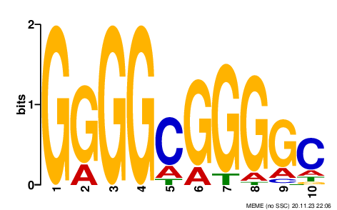
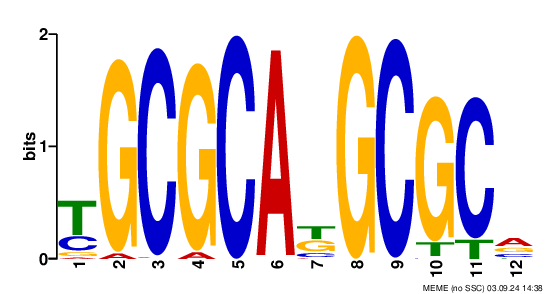
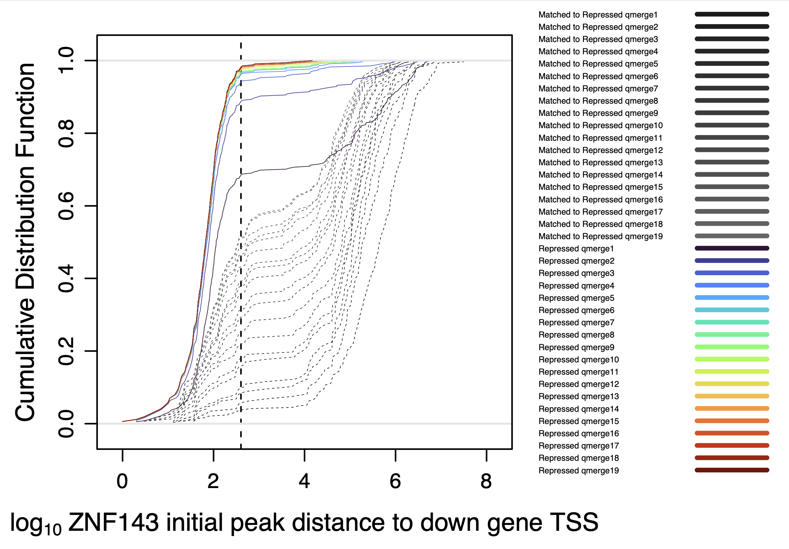

```{css, echo=FALSE}
body .main-container {
  max-width: 1600px !important;
  width: 1600px !important;
}
body {
  max-width: 1600px !important;
}

pre {
  max-height: 600px;
  overflow-y: auto;
}

pre[class] {
  max-height: 600px;
}
```

# Introduction

This is a vignette for ChIP-seq and motif analysis accompanying the manuscript "ZNF143 binds DNA and stimulates transcription initiation to activate and repress direct target genes" (doi: https://doi.org/10.1101/2024.05.13.594008). The analysis follows the published figures, which may differ from the preprint figures in labeling and content.

# Get files from GEO 

Log into the high-performance cluster, start an interactive node, set up the directories, and get the files from GEO accession record GSE266489 for ChIP-seq files. 

```{r engine='bash', eval=F, echo=TRUE} 
# Connect to the cluster
# ssh jdong@xanadu-submit-ext.cam.uchc.edu 

# Start interactive node
srun --partition=general --qos=general --mem=2G -N 1 -n 1 -c 1 --pty bash

# Make and change to analysis directories
mkdir /scratch/jdong/ZNF143dTAG/
cd /scratch/jdong/ZNF143dTAG/
mkdir ChIP
cd ChIP
mkdir FASTQ
cd FASTQ

```


"get_SRA_template_ChIP_SRR288794.sh":

```{r engine='bash', eval=F, echo=TRUE}
#! /usr/bin/bash

#SBATCH --job-name=get_ChIP_SRA_SRR288794XXX
#SBATCH -N 1
#SBATCH -n 1
#SBATCH -c 10
#SBATCH -p general
#SBATCH --qos=general
#SBATCH --mem=12G
#SBATCH --mail-type=ALL 
#SBATCH --mail-user=jdong@uchc.edu
#SBATCH -o /home/FCAM/jdong/slurm_out/%x_%j.all_out
#SBATCH -e /home/FCAM/jdong/slurm_out/%x_%j.all_out

export TMPDIR=/scratch/jdong/
cd /scratch/jdong/ZNF143dTAG/ChIP/FASTQ 
echo "Current wd:" $(pwd)
echo "Current node:" $(hostname)

module load sratoolkit/3.0.5 # latest version on Xanadu

fasterq-dump SRR288794XXX 

echo "Script finished:" $(date '+%a %Y-%m-%d %H:%M:%S %Z')

```

"get_SRA_template_ChIP_SRR307725.sh":

```{r engine='bash', eval=F, echo=TRUE}
#! /usr/bin/bash

#SBATCH --job-name=get_ChIP_SRA_SRR307725XXX
#SBATCH -N 1
#SBATCH -n 1
#SBATCH -c 10
#SBATCH -p general
#SBATCH --qos=general
#SBATCH --mem=12G
#SBATCH --mail-type=ALL 
#SBATCH --mail-user=jdong@uchc.edu
#SBATCH -o /home/FCAM/jdong/slurm_out/%x_%j.all_out
#SBATCH -e /home/FCAM/jdong/slurm_out/%x_%j.all_out

export TMPDIR=/scratch/jdong/
cd /scratch/jdong/ZNF143dTAG/ChIP/FASTQ 
echo "Current wd:" $(pwd)
echo "Current node:" $(hostname)

module load sratoolkit/3.0.5 # latest version on Xanadu

fasterq-dump SRR307725XXX 

echo "Script finished:" $(date '+%a %Y-%m-%d %H:%M:%S %Z')

```


Make individual scripts for each SRA run.

```{r engine='bash', eval=F, echo=TRUE}
# first set of files
file=/home/FCAM/jdong/script_templates/get_SRA_template_ChIP_SRR288794.sh

# create scripts
for i in {68..83}
do
  echo $i
  sed -e "s/XXX/${i}/g" "$file" > get_ChIP_SRA_SRR288794${i}.sh
  grep fasterq get_ChIP_SRA_SRR288794${i}.sh
done

# Submit jobs 
for i in {68..83}
do
    echo $i
    sbatch get_ChIP_SRA_SRR288794${i}.sh
done

# second set of files
file=/home/FCAM/jdong/script_templates/get_SRA_template_ChIP_SRR307725.sh

# create scripts
for i in {21..28}
do
  echo $i
  sed -e "s/XXX/${i}/g" "$file" > get_ChIP_SRA_SRR307725${i}.sh
  grep fasterq get_ChIP_SRA_SRR307725${i}.sh
done

# Submit jobs 
for i in {21..28}
do
    echo $i
    sbatch get_ChIP_SRA_SRR307725${i}.sh
done

```

The SRA runs for GSE266489 are:

- HEK293T ZNF143-dTAG Mock IP samples
  - SRR28879479: mock-control-rep1
  - SRR28879478: mock-control-rep2
  - SRR28879477: mock-dTAG-rep1
  - SRR28879476: mock-dTAG-rep2
- HEK293T ZNF143-dTAG control (no treatment) with anti-HA (ZNF143) ChIP 
  - SRR28879468: antiZNF143-control-rep1
  - SRR28879482: antiZNF143-control-rep2
- HEK293T ZNF143-dTAG degraded (30 min +dTAGV-1) with anti-HA (ZNF143) ChIP 
  - SRR28879481: antiZNF143-dTAG-rep1
  - SRR28879480: antiZNF143-dTAG-rep2
- HEK293T ZNF143-dTAG control (no treatment) with anti-SP1 ChIP 
  - SRR28879483: antiSP1-control-rep1
  - SRR28879475: antiSP1-control-rep2
  - SRR28879474: antiSP1-control-rep3
  - SRR28879473: antiSP1-control-rep4
- HEK293T ZNF143-dTAG degraded (30 min +dTAGV-1) with anti-SP1 ChIP
  - SRR28879472: antiSP1-dTAG-rep1
  - SRR28879471: antiSP1-dTAG-rep2
  - SRR28879470: antiSP1-dTAG-rep3
  - SRR28879469: antiSP1-dTAG-rep4
- HEK293T ZNF143-dTAG control (no treatment) with anti-Nrf1 ChIP 
  - SRR30772528: antiNrf1_control_1
  - SRR30772527: antiNrf1_control_2
  - SRR30772526: antiNrf1_control_3
  - SRR30772525: antiNrf1_control_4
- HEK293T ZNF143-dTAG degraded (30 min +dTAGV-1) with anti-Nrf1 ChIP
  - SRR30772524: antiNrf1_dTAG_1
  - SRR30772523: antiNrf1_dTAG_2
  - SRR30772522: antiNrf1_dTAG_3
  - SRR30772521: antiNrf1_dTAG_4

Rename files:

```{r engine='bash', eval=F, echo=TRUE}
mv SRR28879479_1.fastq HEK_CloneZD29_mock_control_rep1_PE1.fastq
mv SRR28879479_2.fastq HEK_CloneZD29_mock_control_rep1_PE2.fastq
mv SRR28879478_1.fastq HEK_CloneZD29_mock_control_rep2_PE1.fastq
mv SRR28879478_2.fastq HEK_CloneZD29_mock_control_rep2_PE2.fastq
mv SRR28879477_1.fastq HEK_CloneZD29_mock_dTAGV1_rep1_PE1.fastq
mv SRR28879477_2.fastq HEK_CloneZD29_mock_dTAGV1_rep1_PE2.fastq
mv SRR28879476_1.fastq HEK_CloneZD29_mock_dTAGV1_rep2_PE1.fastq
mv SRR28879476_2.fastq HEK_CloneZD29_mock_dTAGV1_rep2_PE2.fastq

mv SRR28879468_1.fastq HEK_CloneZD29_HA_control_rep1_PE1.fastq
mv SRR28879468_2.fastq HEK_CloneZD29_HA_control_rep1_PE2.fastq
mv SRR28879482_1.fastq HEK_CloneZD29_HA_control_rep2_PE1.fastq
mv SRR28879482_2.fastq HEK_CloneZD29_HA_control_rep2_PE2.fastq
mv SRR28879481_1.fastq HEK_CloneZD29_HA_dTAGV1_rep1_PE1.fastq
mv SRR28879481_2.fastq HEK_CloneZD29_HA_dTAGV1_rep1_PE2.fastq
mv SRR28879480_1.fastq HEK_CloneZD29_HA_dTAGV1_rep2_PE1.fastq
mv SRR28879480_2.fastq HEK_CloneZD29_HA_dTAGV1_rep2_PE2.fastq

mv SRR28879483_1.fastq HEK_CloneZD29_SP1_control_rep1_PE1.fastq
mv SRR28879483_2.fastq HEK_CloneZD29_SP1_control_rep1_PE2.fastq
mv SRR28879475_1.fastq HEK_CloneZD29_SP1_control_rep2_PE1.fastq
mv SRR28879475_2.fastq HEK_CloneZD29_SP1_control_rep2_PE2.fastq
mv SRR28879474_1.fastq HEK_CloneZD29_SP1_control_rep3_PE1.fastq
mv SRR28879474_2.fastq HEK_CloneZD29_SP1_control_rep3_PE2.fastq
mv SRR28879473_1.fastq HEK_CloneZD29_SP1_control_rep4_PE1.fastq
mv SRR28879473_2.fastq HEK_CloneZD29_SP1_control_rep4_PE2.fastq
mv SRR28879472_1.fastq HEK_CloneZD29_SP1_dTAGV1_rep1_PE1.fastq
mv SRR28879472_2.fastq HEK_CloneZD29_SP1_dTAGV1_rep1_PE2.fastq
mv SRR28879471_1.fastq HEK_CloneZD29_SP1_dTAGV1_rep2_PE1.fastq
mv SRR28879471_2.fastq HEK_CloneZD29_SP1_dTAGV1_rep2_PE2.fastq
mv SRR28879470_1.fastq HEK_CloneZD29_SP1_dTAGV1_rep3_PE1.fastq
mv SRR28879470_2.fastq HEK_CloneZD29_SP1_dTAGV1_rep3_PE2.fastq
mv SRR28879469_1.fastq HEK_CloneZD29_SP1_dTAGV1_rep4_PE1.fastq
mv SRR28879469_2.fastq HEK_CloneZD29_SP1_dTAGV1_rep4_PE2.fastq

mv SRR30772528_1.fastq HEK_CloneZD29_Nrf1_control_rep1_PE1.fastq
mv SRR30772528_2.fastq HEK_CloneZD29_Nrf1_control_rep1_PE2.fastq
mv SRR30772527_1.fastq HEK_CloneZD29_Nrf1_control_rep2_PE1.fastq
mv SRR30772527_2.fastq HEK_CloneZD29_Nrf1_control_rep2_PE2.fastq
mv SRR30772526_1.fastq HEK_CloneZD29_Nrf1_control_rep3_PE1.fastq
mv SRR30772526_2.fastq HEK_CloneZD29_Nrf1_control_rep3_PE2.fastq
mv SRR30772525_1.fastq HEK_CloneZD29_Nrf1_control_rep4_PE1.fastq
mv SRR30772525_2.fastq HEK_CloneZD29_Nrf1_control_rep4_PE2.fastq
mv SRR30772524_1.fastq HEK_CloneZD29_Nrf1_dTAGV1_rep1_PE1.fastq
mv SRR30772524_2.fastq HEK_CloneZD29_Nrf1_dTAGV1_rep1_PE2.fastq
mv SRR30772523_1.fastq HEK_CloneZD29_Nrf1_dTAGV1_rep2_PE1.fastq
mv SRR30772523_2.fastq HEK_CloneZD29_Nrf1_dTAGV1_rep2_PE2.fastq
mv SRR30772522_1.fastq HEK_CloneZD29_Nrf1_dTAGV1_rep3_PE1.fastq
mv SRR30772522_2.fastq HEK_CloneZD29_Nrf1_dTAGV1_rep3_PE2.fastq
mv SRR30772521_1.fastq HEK_CloneZD29_Nrf1_dTAGV1_rep4_PE1.fastq
mv SRR30772521_2.fastq HEK_CloneZD29_Nrf1_dTAGV1_rep4_PE2.fastq


```


# ChIP-seq alignment and peak calling


## Remove adapters and align to human genome 

In our daily workflow in the lab we use
`cutadapt` to remove adapter sequences. The options we use below are:

- `-m` specifies the minimal length of a read to keep after adapter sequence removal
- `-O` is the number of bases to trim off the end of the read if it overlaps with the adapter sequence 
- `-a` adapter sequence of PE1 reads 
- `-A` adapter sequence of PE2 reads
- `-o` PE1 output file 
- `-p` PE2 output file

The last two positional arguments are the input `fastq` files. Save the output
to a log file.

If the genome contains 25% of each base, then you would expect one quarter of the
reads that have no adapter to have the trailing base
trimmed. Likewise, approximately 1/16 of the remaining
reads without the adapter will have the final two bases
trimmed. Technically these values are not exact, because the reads with
matches to longer trailing k-mers (in this case 19-mers) would be
removed first, then 18-mer matches removed, and so on. 


After removing adapters, we are aligning to the `hg38.fa` genome.
The `-1` and`-2` options are for the respective paired-end `fastq` files. There is no
need to save the output `sam` file, so the output is piped to
`samtools` to convert to `bam`, then piped to `samtools fixmate`
which adds information about the fragment length by comparing the PE1
and PE2 coordinates. Then the files are sorted by coordinate and 
piped to `samtools markdup` to remove duplicate reads. Duplicate reads
have the same PE1 and PE2 ends. This is very unlikely to happen by
chance unless you sequence to very high read depth, so these reads are
considered PCR amplicon duplicates. The `fixmate` step is necessary to
pipe to `markdup`. After removing duplicates, the reads are sorted by name (`-n`) so paired
end reads are adjacent in the file. 

Template script "chip_cutadapt_align_template.sh":
```{r engine='bash', eval=F, echo=TRUE}
#! /usr/bin/bash

#SBATCH --job-name=chip_adapt_align_XXXXXXX.sh     # name for job
#SBATCH -N 1                  
#SBATCH -n 1                 
#SBATCH -c 8                 
#SBATCH -p general           
#SBATCH --qos=general       
#SBATCH --mem=30G               
#SBATCH --mail-type=ALL 
#SBATCH --mail-user=jdong@uchc.edu
#SBATCH -o /home/FCAM/jdong/slurm_out/%x_%j.all_out
#SBATCH -e /home/FCAM/jdong/slurm_out/%x_%j.all_out

export TMPDIR=/scratch/jdong
cd /scratch/jdong/ZNF143dTAG/ChIP/FASTQ
echo "Current wd:" $(pwd)
echo "Current node:" $(hostname)

name=XXXXXXX
read_size=40
module load samtools/1.16.1
module load genometools/1.5.10
module load ucsc_genome/2012.05.22
module load rust
module load bowtie2
module load bedtools
sizes=/home/FCAM/jdong/human38/hg38.chrom.sizes
genome=/home/FCAM/jdong/human38/hg38.fa
genome_index=/home/FCAM/jdong/human38/hg38
ncore=8

echo "Removing adapters" $(date '+%a %Y-%m-%d %H:%M:%S %Z')
cutadapt -a AGATCGGAAGAGCACACGTCTGAACTCCAGTCA -A AGATCGGAAGAGCGTCGTGTAGGGAAAGAGTGT --cores=$ncore -m 10 -O 1 -o ${name}_PE1_no_adapt.fastq -p ${name}_PE2_no_adapt.fastq ${name}_PE1.fastq ${name}_PE2.fastq 2>&1 | tee ${name}_cutadapt.log

echo "Begin alignment" $(date '+%a %Y-%m-%d %H:%M:%S %Z')
bowtie2 -p $ncore --maxins 800 -x $genome_index -1 ${name}_PE1_no_adapt.fastq -2 ${name}_PE2_no_adapt.fastq | samtools sort -@ $ncore -n -o ${name}.bw.bam

echo "Begin BAM processing" $(date '+%a %Y-%m-%d %H:%M:%S %Z')
samtools fixmate -m ${name}.bw.bam - | samtools sort -@ $ncore - | samtools markdup -s -r - ${name}.hg38.bam

echo "End: " $(date '+%a %Y-%m-%d %H:%M:%S %Z')
```

Generate sbatch scripts for each sample and submit to the cluster for parallel processing:

```{r engine='bash', eval=F, echo=TRUE}
file=/scratch/jdong/ZNF143dTAG/chip_cutadapt_align_template.sh

for i in *_PE1.fastq
do
    nm=$(echo $i | awk -F"/" '{print $NF}' | awk -F"_PE1.fastq" '{print $1}')
    echo $nm
    sed -e "s/XXXXXXX/${nm}/g" "$file" > chip_adapt_align_${nm}.sh
    sleep 1
done

# manually check if substitutions worked, then submit all
for i in chip_adapt_align_*rep*.sh
do
    echo $i
    sbatch $i
done
```

## seqOutBias 

### Pre-run seqtable 

For each specific read size, a tallymer file needs to be created by seqOutBias prior to running it to generate bigWigs from the aligned reads. This can be done separately since it can take some time and only needs to be completed once per read size. Since our reads are 40 bases long: 

```{r engine='bash', eval=F, echo=TRUE}
#! /usr/bin/bash

#SBATCH --job-name=seqOutBias40
#SBATCH -N 1                  
#SBATCH -n 1                 
#SBATCH -c 36                  
#SBATCH -p general           
#SBATCH --qos=general       
#SBATCH --mem=60G               
#SBATCH --mail-type=ALL 
#SBATCH --mail-user=jdong@uchc.edu
#SBATCH -o /home/FCAM/jdong/slurm_out/%x_%j.all_out
#SBATCH -e /home/FCAM/jdong/slurm_out/%x_%j.all_out

export TMPDIR=/scratch/jdong/
cd /scratch/jdong/ZNF143dTAG/sOBfiles/
echo "Current wd:" $(pwd)
echo "Current node:" $(hostname)

module load genometools/1.5.10
module load ucsc_genome/2012.05.22
module load rust

seqOutBias=/home/FCAM/jdong/software/seqOutBias #version 1.4.0
genome=/home/FCAM/jdong/human38/hg38.fa

echo "Time start seqOutBias:" $(date '+%a %Y-%m-%d %H:%M:%S %Z')

seqOutBias seqtable $genome --read-size=40

echo "Time script finished:" $(date '+%a %Y-%m-%d %H:%M:%S %Z')

```

This will generate the following output files for our particular read size:

- tallymer=hg38.tal_${read_size}.gtTxt.gz
- table=hg38_${read_size}.4.2.2.tbl

### Run seqOutBias

We will generate sbatch scripts for each sample and run them simultaneously.

Template script "chIP_seqOB_template.sh": 
```{r engine='bash', eval=F, echo=TRUE}
#! /usr/bin/bash

#SBATCH --job-name=chIP_seqOB_XXXXXXX     # name for job
#SBATCH -N 1                  
#SBATCH -n 1                 
#SBATCH -c 1                  
#SBATCH -p general           
#SBATCH --qos=general       
#SBATCH --mem=24G               
#SBATCH --mail-type=ALL 
#SBATCH --mail-user=jdong@uchc.edu
#SBATCH -o /home/FCAM/jdong/slurm_out/%x_%j.all_out
#SBATCH -e /home/FCAM/jdong/slurm_out/%x_%j.all_out
export TMPDIR=/scratch/jhdtemp/tmp
echo "Current wd:" $(pwd)
echo "Current node:" $(hostname)

name=XXXXXXX
read_size=40
seqOutBias=/home/FCAM/jdong/software/seqOutBias #version 1.4.0
tallymerFile=/scratch/jdong/ZNF143dTAG/sOBfiles/hg38.tal_${read_size}.gtTxt.gz
tableFile=/scratch/jdong/ZNF143dTAG/sOBfiles/hg38_${read_size}.4.2.2.tbl
module load samtools/1.16.1
module load genometools/1.5.10
module load ucsc_genome/2012.05.22
module load rust
module load bowtie2
module load bedtools
sizes=/home/FCAM/jdong/human38/hg38.chrom.sizes
genome=/home/FCAM/jdong/human38/hg38.fa

echo "Begin seqOutBias"
seqOutBias scale ${tableFile} ${name}.hg38.bam --tallymer=$tallymerFile --shift-counts --no-scale --bw=${name}.seqOut.bigWig --read-size=${read_size} 2>&1 | tee ${name}_seqOutBias.log
echo "End seqOutBias"
```

Make individual scripts and submit:

```{r engine='bash', eval=F, echo=TRUE}
file=chIP_seqOB_template.sh

for i in *_PE1.fastq 
do
    nm=$(echo $i | awk -F"/" '{print $NF}' | awk -F"_PE1.fastq" '{print $1}')
    echo $nm
    sed -e "s/XXXXXXX/${nm}/g" "$file" > chIP_seqOB_${nm}.sh
    sleep 1
done

# manually check if substitutions worked, then submit all
for i in chIP_seqOB_*rep*.sh
do
    echo $i
    sbatch $i
done
```

This process can be memory intensive, so we found 48G to be sufficient for our larger samples.

## Peak calling 
We call peaks with MACS3's `callpeak` function using the following arguments:

- `--call-summits`: looks for subpeaks inside every peak called by the default process
- `-t`: aligned treament files. If listing multiple, they will be pooled.
- `-c`: aligned control files. If listing multiple, they will be pooled. The same mock IP BAM files were used as background for all peak calling steps.
- `-g hs`: mappable or effective genome size, or the amount of genome that can be sequenced. Smaller than total genome size due to repetitions. Different for various species; 'hs' (which=2.7e9) is for human genomes.
- `q`: q-value (minimum false discovery rate) cutoff 
- `--keep-dup all`: keeps all tags(reads) at every location even if they are duplicates (same coordinate on same strand)
- `-f BAMPE`: format of input. In this case, we need to specify these BAM files contain paired-end reads
- `--nomodel`: by specifying `-f BAMPE` we are already bypassing building the shifting model, but this ensures that the model will not be built. Insert sizes determined from read pairs are used as fragments and no shifting is needed.
- `--tempdir temp_macs`: create this prior to running macs3. Designated directory to store temporary files. Will be empty after the `callpeaks` completes
 

```{r engine='bash', eval=F, echo=TRUE}
module load macs3

mkdir temp_macs

# Call peaks on control ZNF143 ChIP only
macs3 callpeak --call-summits -t *HA_control*sorted.bam -c mock*hg38.bam -n ZNF143_ChIP -g hs -q 0.01 --keep-dup all -f BAMPE --nomodel --tempdir temp_macs

macs3 callpeak --call-summits -t *SP1*hg38.bam -c mock*hg38.bam -n antiSP1_ChIP -g hs -q 0.01 --keep-dup all -f BAMPE --nomodel --tempdir temp_macs

macs3 callpeak --call-summits -t *Nrf1*hg38.bam -c mock*hg38.bam -n antiNrf1_ChIP -g hs -q 0.01 --keep-dup all -f BAMPE --nomodel --tempdir temp_macs

```

### Remove peaks in blacklisted areas 

```{r engine='bash', eval=F, echo=TRUE}
wget https://github.com/Boyle-Lab/Blacklist/raw/master/lists/hg38-blacklist.v2.bed.gz
gunzip hg38-blacklist.v2.bed.gz
blacklist=hg38-blacklist.v2.bed
sizes=/Users/jinhongdong/fileRef/human38/hg38.chrom.sizes

# loop through all samples
for i in *_summits.bed
do
    name=$(echo $i | awk -F"/" '{print $NF}' | awk -F"_summits.bed" '{print $1}')
    echo $name
    grep -v "random" ${name}_summits.bed | grep -v "chrUn" | grep -v "chrEBV" | grep -v "chrM" | grep -v "alt" | intersectBed -v -a - -b $blacklist > ${name}_summits_final.bed
    slopBed -b 50 -i ${name}_summits_final.bed -g $sizes  | sort -k1,1 -k2,2n > ${name}_summit_100window.bed
    slopBed -b 200 -i ${name}_summits_final.bed -g $sizes  | sort -k1,1 -k2,2n > ${name}_peaks_401bp.bed
done

```

### Fraction of Reads in Peaks (FRiP)

Although low FRiP is not necessarily a cause for alarm with ChIP-seq samples, it can be informative to calculate to look for inconsistencies between samples. 

```{r engine='bash', eval=F, echo=TRUE}
# Loop through all samples

module load samtools

for i in *_peak_counts.txt
do
    name=$(echo $i | awk -F"/" '{print $NF}' | awk -F"_peak_counts.txt" '{print $1}')
    echo $name > ${name}_FRiP.txt
    awk '{print $NF}' ${name}_peak_counts.txt > ${name}_peak_counts_only.txt
    RiP=$(awk '{sum+=$1;} END{print sum;}' ${name}_peak_counts_only.txt)
    echo $name | cat - ${name}_peak_counts_only.txt > ${name}_peak_counts.txt
    aligned_reads=$(samtools view -c -f 0x42 ${name}.hg38.bam)
    FRiP=$(echo "scale=2 ; $RiP / $aligned_reads" | bc)
    echo $FRiP >> ${name}_FRiP.txt
    rm ${name}_peak_counts_only.txt
done

```

Our samples typically had FRiPs ranging from 5%-25% (excluding the +dTAGV-1 anti-HA samples, which were much lower). 

# Normalization for genome browser viewing 

Usually we combine replicates into a single track for visualization
and we compare the tracks between conditions. All ChIP-seq samples are normalized by read depth.

First normalize each replicate separately: 

Template script "normByRep_template.sh":
```{r engine='bash', eval=F, echo=TRUE}
#! /usr/bin/bash

#SBATCH --job-name=normByRep_XXXXXXX.sh     # name for job
#SBATCH -N 1                  
#SBATCH -n 1                 
#SBATCH -c 8               
#SBATCH -p general           
#SBATCH --qos=general       
#SBATCH --mem=12G               
#SBATCH --mail-type=ALL 
#SBATCH --mail-user=jdong@uchc.edu
#SBATCH -o /home/FCAM/jdong/slurm_out/%x_%j.out
#SBATCH -e /home/FCAM/jdong/slurm_out/%x_%j.err

export TMPDIR=/scratch/jhdtemp/tmp
echo "Current wd:" $(pwd)
echo "Current node:" $(hostname)

name=XXXXXXX
read_size=40
module load samtools/1.16.1
module load genometools/1.5.10
module load ucsc_genome/2012.05.22
module load rust
module load bowtie2
module load bedtools
sizes=/home/FCAM/jdong/human38/hg38.chrom.sizes
genome=/home/FCAM/jdong/human38/hg38.fa
genome_index=/home/FCAM/jdong/human38/hg38
ncore=8

samtools sort -@ $ncore -n -o ${name}.sorted.bam ${name}.hg38.bam
bedtools bamtobed -i ${name}.sorted.bam -bedpe > ${name}_bed12.bed
awk '$1==$4 {print $0}' ${name}_bed12.bed | awk '{OFS="\t";} {print $1, $2, $6}' | awk '$1!="." && $3>$2 && (($3 - $2)<2000) {print $0}' | sort -k1,1 -k2,2n > ${name}_read_span.bed
genomeCoverageBed -bg -i ${name}_read_span.bed -g $sizes > ${name}.bedGraph

echo "Generate normalized bedGraphs and bigWigs"
depth=`awk -F'\t' '{sum+=$5;}END{print sum;}' ${name}.hg38_not_scaled.bed` # this file is from seqOutBias 
scaled=$(bc <<< "scale=3 ; 10000000 / $depth") #scale: number of decimal points in result
echo $scaled
awk -v scaled="$scaled" '{OFS="\t";} {print $1, $2, $3, $4*scaled}' ${name}.bedGraph > ${name}_normalized.bedGraph
wigToBigWig -clip ${name}_normalized.bedGraph $sizes ${name}_normalized.bigWig

```

Generate individual scripts and submit:

```{r engine='bash', eval=F, echo=TRUE}
file=normByRep_template.sh

for i in *_PE1.fastq 
do
    nm=$(echo $i | awk -F"/" '{print $NF}' | awk -F"_PE1.fastq" '{print $1}')
    echo $nm
    sed -e "s/XXXXXXX/${nm}/g" "$file" > normByRep_${nm}.sh
    sleep 1
done

# manually check if substitutions worked, then submit all
for i in normByRep_*rep*.sh
do
    echo $i
    sbatch $i
done

```


Then combine and re-normalize all samples within a condition: 

```{r engine='bash', eval=F, echo=TRUE}
#! /usr/bin/bash

#SBATCH --job-name=merge_normalized
#SBATCH -N 1                  
#SBATCH -n 1                 
#SBATCH -c 1                  
#SBATCH -p general           
#SBATCH --qos=general       
#SBATCH --mem=32G               
#SBATCH --mail-type=ALL 
#SBATCH --mail-user=jdong@uchc.edu
#SBATCH -o /home/FCAM/jdong/slurm_out/%x_%j.all_out
#SBATCH -e /home/FCAM/jdong/slurm_out/%x_%j.all_out

export TMPDIR=/scratch/jdong
echo "Current wd:" $(pwd)
echo "Current node:" $(hostname)

module load ucsc_genome/2012.05.22
sizes=/home/FCAM/jdong/human38/hg38.chrom.sizes

# For each condition:
for i in *rep1*normalized.bigWig
do
    nm=$(echo $i | awk -F"/" '{print $NF}' | awk -F"_normalized" '{print $1}')
    name=$(echo $nm | awk -F"-rep" '{print $1}')
    echo $name
    reps=$(ls ${name}-rep*normalized.bigWig | wc -w | bc)
    echo $reps
    files=$(ls ${name}-rep*normalized.bigWig) 
    echo $files
    bigWigMerge $files ${name}_tmp.bg
    scaleall=$(bc <<< "scale=4 ; 1.0 / $reps")
    echo scale:
    echo $scaleall
    awk -v scaleall="$scaleall" '{OFS="\t";} {print $1, $2, $3, $4*scaleall}' ${name}_tmp.bg > ${name}_normalized.bedGraph
    rm ${name}_tmp.bg 
    wigToBigWig ${name}_normalized.bedGraph $sizes ${name}_merged_normalized.bigWig
done

```

The normalized bigWigs are available in our trackhub which is available by linking the UCSC genome browser to `http://guertinlab.cam.uchc.edu/ znf143_hub/hub.txt`.

# Calculating peak intensities 

After peak calling, we use DESeq2 to calculate normalized peak intensities. For ZNF143-ChIP (see "ZNF143 ChIP peak intensities" below), we use the manually calculated size factors based on read depth of the control samples, since the +dTAGV-1 ChIP samples have so little signal. For the other ChIPs, we use DESeq2-generated size factors. 

```{r engine='R', eval=F, echo=TRUE}
library(bigWig)
library(lattice)
library(DESeq2)
library(MatchIt)
library(data.table)

source('https://raw.githubusercontent.com/guertinlab/seqOutBias/master/docs/R/seqOutBias_functions.R')
source('https://raw.githubusercontent.com/mjg54/znf143_pro_seq_analysis/master/docs/ZNF143_functions.R')

# Required functions in addition to sourced functions from above:

# Overwrite get.raw.counts.interval in ZNF143_functions.R (just changes the hard-coded file suffixes)

get.raw.counts.interval <- function(df, path.to.bigWig, file.prefix = 'M') {
    vec.names = c()
    inten.df=data.frame(matrix(ncol = 0, nrow = nrow(df)))
    
    for (mod.bigWig in Sys.glob(file.path(path.to.bigWig, paste(file.prefix, "*plus_PE1.bigWig", sep ='')))) {
        factor.name = strsplit(strsplit(mod.bigWig, "/")[[1]][length(strsplit(mod.bigWig, "/")[[1]])], '_plus')[[1]][1]
        print(factor.name)
        vec.names = c(vec.names, factor.name)
        loaded.bw.plus = load.bigWig(mod.bigWig)
        print(mod.bigWig)
        print(paste(path.to.bigWig,'/',factor.name, '_minus.bigWig', sep=''))
        loaded.bw.minus = load.bigWig(paste(path.to.bigWig,'/',factor.name, '_minus_PE1.bigWig', sep=''))
        mod.inten = bed6.region.bpQuery.bigWig(loaded.bw.plus, loaded.bw.minus, df)
        inten.df = cbind(inten.df, mod.inten)
    }
    colnames(inten.df) = vec.names
    r.names = paste(df[,1], ':', df[,2], '-', df[,3],'_', df[,4], sep='')
    row.names(inten.df) = r.names
    return(inten.df)
}

# run.deseq.list.dds: new function
run.deseq.list.dds <- function(mat) {
  sample.conditions = factor(c("untreated","untreated","untreated","untreated","treated","treated","treated","treated"), levels=c("untreated","treated"))        
  deseq.counts.table = DESeqDataSetFromMatrix(mat, DataFrame(sample.conditions), ~ sample.conditions);
  colData(deseq.counts.table)$condition<-factor(colData(deseq.counts.table)$sample.conditions, levels=c('untreated','treated'));
  dds = DESeq(deseq.counts.table);
  #res = results(dds);
  #res = res[order(res$padj),];
  return(dds)
}

# tighten_summit_window: new function. Needed for categorizing genes
tighten_summit_window <- function(res.deseq) {
  chr = sapply(strsplit(rownames(res.deseq), ':'), '[', 1)
  start = as.numeric(sapply(strsplit(sapply(strsplit(rownames(res.deseq), ':'), '[', 2), "-"), "[", 1))
  x=sapply(strsplit(sapply(strsplit(rownames(res.deseq), ':'), '[', 2), "-"), "[", 2)
  end = as.numeric(sapply(strsplit(x, "_"), "[", 1))
  gene = sapply(strsplit(rownames(res.deseq), "_"), "[", 2)
  df = cbind.data.frame(chr, start, end, gene)
  return(df)
}

plotPCAlattice <- function(df, file = 'PCA_lattice.pdf') {  
  perVar = round(100 * attr(df, "percentVar"))
  df = data.frame(cbind(df, sapply(strsplit(as.character(df$name), '_rep'), '[', 1)))
  colnames(df) = c(colnames(df)[1:(ncol(df)-1)], 'unique_condition')
  print(df)
  #get colors and take away the hex transparency
  color.x = substring(rainbow(length(unique(df$unique_condition))), 1,7) 
  
  df$color = NA
  df$alpha.x = NA
  df$alpha.y = NA
  df$colpal = NA
  
  for (i in 1:length(unique(df$unique_condition))) {
    
    df[df$unique_condition == unique(df$unique_condition)[[i]],]$color = color.x[i]   
    #gives replicates for unique condition
    reps_col<- df[df$unique_condition == unique(df$unique_condition)[[i]],]
    #gives number of replicates in unique condition
    replicates.x = nrow(reps_col)
    alx <- rev(seq(0.2, 1, length.out = replicates.x))
    
    #count transparency(alx), convert alx to hex(aly), combain color and transparency(cp)
    for(rep in 1:replicates.x) {
    
      na <- reps_col[rep, ]$name
      df[df$name == na, ]$alpha.x = alx[rep]
      aly = as.hexmode(round(alx * 255))
      df[df$name == na, ]$alpha.y = aly[rep]
      cp = paste0(color.x[i], aly)
      df[df$name == na, ]$colpal = cp[rep]
      #print(df)
    }
  }
  colpal = df$colpal
  df$name = gsub('_', ' ', df$name)
  pdf(file, width=6, height=6, useDingbats=FALSE)
  print(xyplot(PC2 ~ PC1, groups = name, data=df,
               xlab = paste('PC1: ', perVar[1], '% variance', sep = ''),
               ylab = paste('PC2: ', perVar[2], '% variance', sep = ''),
               par.settings = list(superpose.symbol = list(pch = c(20), col=colpal)),
               pch = 20, cex = 1.7,
               auto.key = TRUE,
               col = colpal))
  dev.off()
}

bedTools.closest <- function(functionstring="/usr/local/bin/bedtools2-2.31.0/bin/closestBed",bed1,bed2,opt.string="",distLabel = "dis") {
  
  options(scipen =99) # not to use scientific notation when writing out
  
  #write bed formatted dataframes to tempfile
  write.table(bed1,file= 'a.file.bed', quote=F,sep="\t",col.names=F,row.names=F)
  write.table(bed2,file= 'b.file.bed', quote=F,sep="\t",col.names=F,row.names=F)
  
  # create the command string and call the command using system()
  command1=paste('sort -k1,1 -k2,2n', 'a.file.bed', '> a.file.sorted.bed')
  cat(command1,"\n")
  try(system(command1))
  command2=paste('sort -k1,1 -k2,2n', 'b.file.bed', '> b.file.sorted.bed')
  cat(command2,"\n")
  try(system(command2))
  
  # use opt.string argument to add options for closestBed
  command=paste(functionstring,opt.string,"-a",'a.file.sorted.bed',"-b",'b.file.sorted.bed',">",'out.file.bed',sep=" ")
  cat(command,"\n")
  try(system(command))
  
  res=read.table('out.file.bed',sep ="\t", header=F, comment.char='')
  
  command3=paste('rm', 'a.file.bed', 'b.file.bed', 'a.file.sorted.bed', 'b.file.sorted.bed', 'out.file.bed')
  cat(command3,"\n")
  try(system(command3))
  
  colnames(res) = c(colnames(bed1), colnames(bed2), distLabel )
  return(res)
}

# SP1 
sp1.counts.df = get.counts.interval(y, '/scratch/jdong/ZNF143dTAG/ChIP/FASTQ', file.prefix="*SP1*seqOut")
sp1.analysis.regions=sp1.counts.df[,grepl("SP1",colnames(sp1.counts.df))]
sample.conditions = factor(sapply(strsplit(colnames(sp1.analysis.regions), '_rep'), '[', 1))

deseq.counts.table = DESeqDataSetFromMatrix(countData = sp1.analysis.regions,
                colData = as.data.frame(sample.conditions),
                design = ~ sample.conditions)
sp1.dds <- DESeq(deseq.counts.table)
sp1Res = results(sp1.dds) 
sp1Res = sp1Res[!(is.na(sp1Res$padj)),]

normCountsSP1 = counts(sp1.dds, normalized=TRUE)
peak.intensities = rowMeans(normCountsSP1[,1:4]) # get peak intensities from control peaks 
names(peak.intensities) = rownames(normCountsSP1)
peak.intensNoZero = peak.intensities[which(peak.intensities != 0)]

chr = sapply(strsplit(names(peak.intensNoZero), ":"), "[", 1)
rnge = sapply(strsplit(names(peak.intensNoZero), ":"), "[", 2)
start = as.numeric(sapply(strsplit(rnge, "-"), "[", 1)) + 200
end = as.numeric(sapply(strsplit(rnge, "-"), "[", 2)) - 200

normCountsSP1df = as.data.frame(cbind(chr,start,end,peak.intensNoZero))
write.table(normCountsSP1df, file = 'sp1_normCounts_summits.bed', sep = '\t', quote=FALSE, col.names=FALSE, row.names=FALSE)


# Nrf1
nrf1peaks401 = read.table('antiNrf1_ChIP_peaks_401bp.bed', sep = "\t", header=FALSE)
nrf1.counts.df = get.counts.interval(nrf1peaks401, '/scratch/jdong/ZNF143dTAG/ChIP/FASTQ', file.prefix="*Nrf1*seqOut")
sample.conditions = factor(sapply(strsplit(colnames(nrf1.counts.df), '_rep'), '[', 1))
deseq.counts.table = DESeqDataSetFromMatrix(countData = nrf1.counts.df,
                colData = as.data.frame(sample.conditions),
                design = ~ sample.conditions)
nrf1.dds <- DESeq(deseq.counts.table)
normCountsNrf1 = counts(nrf1.dds, normalized=TRUE)
nrf1Peaks = tighten_summit_window(normCountsNrf1)
normCountsNrf1 = cbind(nrf1Peaks,normCountsNrf1)

nrf1peakIntensSort = sort(nrf1peakIntens, decreasing=TRUE)

chr = sapply(strsplit(names(nrf1peakIntensSort), ":"), "[", 1)
rnge = sapply(strsplit(names(nrf1peakIntensSort), ":"), "[", 2)
start = as.numeric(sapply(strsplit(rnge, "-"), "[", 1)) + 200
end = as.numeric(sapply(strsplit(rnge, "-"), "[", 2)) - 200

normCountsNrf1df = as.data.frame(cbind(chr,start,end,nrf1peakIntensSort))
write.table(normCountsNrf1df, file = 'nrf1_normCounts_summits.bed', sep = '\t', quote=FALSE, col.names=FALSE, row.names=FALSE)

# take peak intensities from average of control intensities
normCountsNrf1$nrf1ContPeakIntens = rowMeans(normCountsNrf1[,4:7])
normCountsNrf1sorted = normCountsNrf1[order(as.numeric(normCountsNrf1$nrf1ContPeakIntens), decreasing = FALSE),]
write.table(normCountsNrf1sorted[,c("chr","start","end","peakCoords","nrf1ContPeakIntens")], sep="\t", quote=FALSE, row.names=FALSE,col.names=FALSE,file="nrf1_peaks_intensities_decreasing_401bp.bed")
```

# Quick de novo motif analysis 

We do de novo motif analysis after peak calling to verify if our target antibodies pulled down our expected targets. Generally we expect that the top motif to come out of the most intense peaks to be that of our expected transcription factor. This was only done for non-ZNF143 samples since ZNF143 went through a more rigorous de novo motif analysis process (see below). 

```{r engine='bash', eval=F, echo=TRUE}
# search for motif in 100bp window (101 total)
sizes=/home/FCAM/jdong/human38/hg38.chrom.sizes

cat sp1_normCounts_summits.bed | sort -rn -k4 | head -1000 > antiSP1_top1kPeaks.bed
slopBed -b 50 -i antiSP1_top1kPeaks.bed -g $sizes  | sort -k1,1 -k2,2n > antiSP1_top1kPeaks_101window.bed
genome=/home/FCAM/jdong/human38/hg38.fa
fastaFromBed -fi $genome -bed antiSP1_top1kPeaks_101window.bed -fo antiSP1_top1kPeaks_101window.fasta

slopBed -b 50 -i nrf1_normCounts_summits.bed -g $sizes > nrf1_normCounts_summits_101bp.bed
# take top 1k peaks 
head -1000 nrf1_normCounts_summits_101bp.bed > nrf1_normCounts_summits_top1k.bed
fastaFromBed -fi $genome -bed nrf1_normCounts_summits_top1k.bed -fo nrf1_normCounts_summits_top1k_101bp.fasta

module load meme/5.4.1

meme -oc antiSP1_top1kPeaks_101window.meme_output -nmotifs 5 -objfun classic -csites 20000 -searchsize 0 -minw 5 -maxw 10 -revcomp -dna -markov_order 3 -maxsize 100000000 antiSP1_top1kPeaks_101window.fasta -mpi

meme -oc Nrf1_motif_analysis_top1k_normCounts.meme_output -nmotifs 3 -p 160 -objfun classic -csites 20000 -searchsize 0 -minw 5 -maxw 19 -revcomp -dna -markov_order 3 -maxsize 100000000 nrf1_normCounts_summits_top1k_101bp.fasta 

```

```{r  out.width = "500px", echo=F, fig.align = "center", fig.cap="SP1 logo from top 1000 ChIP peaks"}
library(knitr)
 
```

```{r  out.width = "500px", echo=F, fig.align = "center", fig.cap="Nrf1 logo from top 1000 ChIP peaks"}
library(knitr)
 
```


# ZNF143 ChIP-seq analysis 

## ZNF143 ChIP peak intensities

Generate size factors from read depth:

```{r engine='bash', eval=F, echo=TRUE}
module load samtools

for i in antiZNF143
do
    echo $i
    > ${i}_header.txt
    > ${i}_reads.txt

    for j in antiZNF143*.sorted.bam
    do 
        echo $j
        name=$(echo $j | awk -F".sorted.bam" '{print $1}')
        echo $name | paste ${i}_header.txt - > ${i}_tmp.txt 
        mv ${i}_tmp.txt ${i}_header.txt
        # count the number of reads that are paired and mapped in proper pair (0x3)
        reads=`samtools view -c -f 0x3 $j`
        echo $reads | paste ${i}_reads.txt - > ${i}_tmp.txt
        mv ${i}_tmp.txt ${i}_reads.txt
    done

    cat ${i}_header.txt ${i}_reads.txt > ${i}_tmp.txt
    mv ${i}_tmp.txt ${i}_reads.txt 
    rm ${i}_header.txt
done

# output file: antiZNF143_reads.txt

```

Use manual size factors to get normalized counts in peaks:

```{r engine='R', eval=F, echo=TRUE}
y = read.table('ZNF143_ChIP_peaks_401bp.bed',sep="\t",header=FALSE)
znf143CountsDF = get.counts.interval(y, '/scratch/jdong/ZNF143dTAG/ChIP/FASTQ', file.prefix="*HA*seqOut",file.prefix="*HA*")
sample.conditions = factor(sapply(strsplit(colnames(znf143CountsDF), '_rep'), '[', 1))
deseqCounts = DESeqDataSetFromMatrix(countData = znf143CountsDF,
                colData = as.data.frame(sample.conditions),
                design = ~ sample.conditions)
ZNF.SF <- read.table("antiZNF143_reads.txt", sep = '\t', header = TRUE)[,-1]
ZNF.size.factors = estimateSizeFactorsForMatrix(ZNF.SF)
sizeFactors(deseqCounts) <- ZNF.size.factors
znf143dds2 = DESeq(deseqCounts)
norm.counts.znf143_2 = counts(znf143dds2, normalized=TRUE)
# Take final peak intensities from averages of the control ChIP counts
peak.intensities2 = rowMeans(norm.counts.znf143_2[,1:2]) 
peak.intens2.NoZero = peak.intensities2[which(peak.intensities2 != 0)]
```


## Defining a functional threshold for peak intensity

Make quantile of peaks by normalized control intensity: 

```{r engine='R', eval=F, echo=TRUE}
znf143quants2 = quantile(peak.intens2.NoZero, probs = seq(.05, 1.00, by = .05))
chr = sapply(strsplit(names(peak.intens2.NoZero), ":"), "[", 1)
rnge = sapply(strsplit(names(peak.intens2.NoZero), ":"), "[", 2)
start = as.numeric(sapply(strsplit(rnge, "-"), "[", 1)) + 200
end = as.numeric(sapply(strsplit(rnge, "-"), "[", 2)) - 200

j=0 
q=seq(0, 1.00, by = .05)
count=1

for (i in quantile(peak.intens2.NoZero, probs = seq(.05, 1.00, by = .05))) {
    prev=as.character(q[count])
    count = count +1

    write.table(file = paste0('SFquantile',prev,"_to_",as.character(q[count]), '_summits.bed'), data.frame(chr[peak.intens2.NoZero > j & peak.intens2.NoZero <= i], start[peak.intens2.NoZero > j & peak.intens2.NoZero <= i], end[peak.intens2.NoZero > j & peak.intens2.NoZero <= i], peak.intens2.NoZero[peak.intens2.NoZero > j & peak.intens2.NoZero <= i]), sep = '\t', quote=FALSE, col.names=FALSE, row.names=FALSE )
    j = i
}

```

Create cumulative quantile files:

```{r engine='bash', eval=F, echo=TRUE}
cat SFquantile0.95_to_1_summits.bed SFquantile0.9_to_0.95_summits.bed > SFqmerge1.bed
echo "Manually merged SFquantile0.95_to_1_summits.bed and SFquantile0.9_to_0.95_summits.bed to create SFqmerge1.bed" > merging_scheme_ChIP2_SFadjust.txt
echo $(wc -l SFqmerge1.bed) >> merging_scheme_ChIP2_SFadjust.txt
quants=($(seq 0.9 -0.05 0.05))
for i in {1..18}
do
    k=${quants[$((i-1))]} #bash arrays are 0-indexed
    prev=${quants[$((i))]}
    # echo $i
    # echo $k
    # echo $prev
    if [[ "$i" == "18" ]]; then 
        echo "Now merging" SFqmerge${i}.bed "with" SFquantile0_to_${k}_summits.bed "to create" SFqmerge$((i+1)).bed
        cat SFqmerge${i}.bed SFquantile0_to_${k}_summits.bed > SFqmerge$((i+1)).bed
        wc -l SFqmerge$((i+1)).bed
    elif [[ "$i" != "18" ]]; then
        echo "Now merging" SFqmerge${i}.bed "with" SFquantile${prev}_to_${k}_summits.bed "to create" SFqmerge$((i+1)).bed
        cat SFqmerge${i}.bed SFquantile${prev}_to_${k}_summits.bed > SFqmerge$((i+1)).bed
        wc -l SFqmerge$((i+1)).bed
    fi
done 2>&1 | tee -a merging_scheme_ChIP2_SFadjust.txt
```

Plot a cumulative quantile CDF showing ZNF143 peak distance to nearest TSS of a gene that decreased expression after ZNF143 degradtion (down genes). Generally, closer distances to down genes will indicate a higher chance that a particular ZNF143 peak is actually impacting the regulation of that gene's expression. We will pick a quantile threshold from the quantile where the traces start overlapping each other, indicating that most of the peaks are already represented by these quantiles.

```{r engine='R', eval=F, echo=TRUE}
geneFile = read.table(file="ZNF143dTAG_act_rep_matches.bed",header=FALSE,sep="\t")

cat="Repressed"

cdf.deseq.df <- function(genes = gene.file, chip.peaks = chip.peaks, cat = "Repressed", opt.str="") {
  bed.tss.activated = get.tss(genes[genes$treatment == cat,])
  bed.tss.unchanged = get.tss(genes[genes$treatment == paste0("Matched to ", cat),])
  
  # note 'functionstring' in bedTools.closest
  act.distance = bedTools.closest(bed1 = bed.tss.activated, bed2 = chip.peaks, opt.string = '-D a')
  unreg.distance = bedTools.closest(bed1 = bed.tss.unchanged, bed2 = chip.peaks, opt.string = '-D a')

  df.up.can = cbind(act.distance, paste0(opt.str,cat))
  df.un.can = cbind(unreg.distance, paste0(opt.str,"Matched to ", cat))

  colnames(df.up.can) = c(colnames(df.up.can)[seq(1,ncol(df.up.can)-1)], 'status')
  colnames(df.un.can) = c(colnames(df.up.can)[seq(1,ncol(df.un.can)-1)], 'status')

  df.all = rbind(df.up.can, df.un.can)
  df.all$status = factor(df.all$status, levels = c(paste0(opt.str,cat), paste0(opt.str,"Matched to ", cat)))
  return(df.all)
}

dfCDF2 = data.frame(matrix(nrow = 0, ncol = 12))
for (chip.peak in Sys.glob(file.path("/scratch/jdong/ZNF143dTAG/ChIP/FASTQ/SFqmerge*bed"))) {
    print(chip.peak)
    quantile.name = strsplit(strsplit(chip.peak, "/")[[1]][length(strsplit(chip.peak, "/")[[1]])], '.bed')[[1]][1]
    print(quantile.name)
    df.all = cdf.deseq.df(genes = gene.file,
        chip.peaks=read.table(chip.peak, header=FALSE),
        cat = cat)
    x = paste(as.character(df.all$status), quantile.name)
    df.all$status = x
    dfCDF2 = rbind(dfCDF2, df.all) # check variable names here!
    }

plot_cdf <- function(df.all, tf="quantile", cat = "Repressed", col.lines = c("#ce228e", "grey60", "#2290cf","grey90"), line.type = c(1), line.width = 1, cex = 1, abline=1) {
pdf(paste0(tf, "_CDF_", cat, ".pdf"), width=6.2, height=3.83) 
         print(ecdfplot(~log(abs(dis), base = 10), groups = status, data = df.all,
         auto.key = list(lines=TRUE, points=FALSE, cex = cex,space="right"),
         col = col.lines,
         aspect = 1,
                                        #xlim = c(0, 50000),
         scales=list(relation="free",alternating=c(1,1,1,1)),
         ylab = 'Cumulative Distribution Function',
         xlab = expression('log'[10]~'ZNF143 initial peak distance to down gene TSS'),
                                        #index.cond = list(c(2,1)),
         between=list(y=1.0),
         type = 'a',
         xlim = c(0,8),
         lwd=line.width,
         lty=line.type,
         par.settings = list(superpose.line = list(col = col.lines, lwd=3), strip.background=list(col="grey85")),
         panel = function(...) {
             panel.abline(v= log(abline, base=10), lty =2) # variable line location
             panel.ecdfplot(...)
         }))
    dev.off()
}

colnames(dfCDF2) = c("chrTSS","startTSS","endTSS","gene","treatment","strand","chrSumm","startSumm","endSumm","peakIntens","dis","status")

mlvls2 = gsub("qmerge","SFqmerge",mlvls)
rlvls2 = gsub("qmerge","SFqmerge",rlvls)
lvlslvls2 = c(mlvls2,rlvls2)
dfCDF2$status = factor(dfCDF2$status,levels=lvlslvls2)

# Empirically determine where the traces begin to increase at the same rate:
matched = ecdf(abs(dfCDF2$dis)[dfCDF2$status == 'Matched to Repressed SFqmerge13'])
repr = ecdf(abs(dfCDF2$dis)[dfCDF2$status == 'Repressed SFqmerge13'])
match.y = seq(0, 20000, by=20) # like indices
rep.y = seq(0, 20000, by=20)
spl = smooth.spline(rep.y, repr(rep.y) - matched(match.y))
pred = predict(spl)
pred1 = predict(spl, deriv=1)
ablineVal = rep.y[min(which(pred1$y<=0)) - 1]
ablineVal
# [1] 200

matched = ecdf(abs(dfCDF2$dis)[dfCDF2$status == 'Matched to Repressed SFqmerge5'])
repr = ecdf(abs(dfCDF2$dis)[dfCDF2$status == 'Repressed SFqmerge5'])
match.y = seq(0, 20000, by=20) # like indices
rep.y = seq(0, 20000, by=20)
spl = smooth.spline(rep.y, repr(rep.y) - matched(match.y))
pred = predict(spl)
pred1 = predict(spl, deriv=1)
ablineVal = rep.y[min(which(pred1$y<=0)) - 1]
ablineVal
# [1] 400

colorQ6 = c(colorRampPalette(c("grey10","grey40"))(19),turbo(19))

plot_cdf(dfCDF,tf="cumulativeQuantileChIP2_SF_abline400",cat = "Repressed",col.lines = colorQ6, line.type = c(rep(2, 19), rep(1,19)), line.width = 0.4, cex = 0.35,abline=400)
# plot file name: cumulativeQuantileChIP2_SF_abline400_CDF_Repressed.pdf
```

```{r  out.width = "800px", echo=F, fig.align = "center", fig.cap="Cumulative Quantile CDF"}
library(knitr)
 
```

We chose to include everything in quantile 0.7 and above (qmerge5) as "functional" ZNF143 binding sites. 

```{r engine='bash', eval=F, echo=TRUE}
# clean up bed file
cp SFqmerge5.bed SF_ZNF143peaks_overQuant0.7.bed
grep -v "random" SF_ZNF143peaks_overQuant0.7.bed | grep -v "chrUn" | grep -v "chrEBV" | grep -v "chrM" | grep -v "alt" > SF_ZNF143summits_overQuant0.7.bed

```


## Iterative de novo motif analysis  

We conducted several rounds of de novo motif analysis on the "functional" ZNF143 ChIP peaks defined above. After each round, peaks containing the top ZNF143 motif (as determined by MAST) are removed. De novo motif analyis is repeated with the remaining peaks, and this continues until all peaks are accounted for.

```{r engine='bash', eval=F, echo=TRUE}
module load meme/5.4.1
module load bedtools
module load R/4.1.2

genome=/scratch/jdong/ZNF143dTAG/human38/hg38.fa
chromSizes=/scratch/jdong/ZNF143dTAG/human38/hg38.chrom.sizes

slopBed -i SF_ZNF143summits_overQuant0.7.bed -g $chromSizes -b 100 > SF_ZNF143summits_overQuant0.7_201.bed
fastaFromBed -fi $genome -bed SF_ZNF143summits_overQuant0.7_201.bed -fo SF_ZNF143summits_overQuant0.7_201.fasta

# round 1
meme -p 100 -oc SF_ZNF143_strict_motif_round1_201.meme_output -nmotifs 1 -objfun classic -csites 20000 -searchsize 0 -minw 5 -maxw 30 -revcomp -dna -markov_order 3 -maxsize 100000000 SF_ZNF143summits_overQuant0.7_201.fasta
mast -mt 0.0005 -hit_list -best SF_ZNF143_strict_motif_round1_201.meme_output/meme.txt SF_ZNF143summits_overQuant0.7_201.fasta > mast_ZNF143_PSWM_in_peaks_round1_0005.txt
Rscript parse_mast_to_coordinates.R mast_ZNF143_PSWM_in_peaks_round1_0005.txt 1
wc -l mast_ZNF143_PSWM_in_peaks_round1_0005.bed

intersectBed -v -a SF_ZNF143summits_overQuant0.7_201.bed -b mast_ZNF143_PSWM_in_peaks_round1_0005.bed > without_motif_1_0005.bed
fastaFromBed -fi $genome -bed without_motif_1_0005.bed -fo without_motif_1_0005.fasta

# round 2
meme -p 100 -oc ZNF143_no_round1_0005_201.meme_output -nmotifs 1 -objfun classic -csites 20000 -searchsize 0 -minw 10 -maxw 30 -revcomp -dna -markov_order 3 -maxsize 100000000 without_motif_1_0005.fasta
mast -mt 0.0005 -hit_list -best ZNF143_no_round1_0005_201.meme_output/meme.txt without_motif_1_0005.fasta > mast_ZNF143_PSWM_in_peaks_wout_motif1_0005.txt
Rscript parse_mast_to_coordinates.R mast_ZNF143_PSWM_in_peaks_wout_motif1_0005.txt 1
wc -l mast_ZNF143_PSWM_in_peaks_wout_motif1_0005.bed

intersectBed -v -a without_motif_1_0005.bed -b mast_ZNF143_PSWM_in_peaks_wout_motif1_0005.bed > without_motifs_1_2_0005.bed
fastaFromBed -fi $genome -bed without_motifs_1_2_0005.bed -fo without_motifs_1_2_0005.fasta

# round 3
streme --oc without_motifs_1_2_0005_ord3.streme_output --dna --nmotifs 30 --minw 5 --maxw 30 --order 3 --objfun de --p without_motifs_1_2_0005.fasta # 12-CTCCCAGAG STREME-12
mast -mt 0.0005 -hit_list -m 12-CTCCCAGAG -best without_motifs_1_2_0005_ord3.streme_output/streme.txt without_motifs_1_2_0005.fasta > mast_ZNF143_PSWM_in_peaks_wout_motifs123_0005.txt
Rscript parse_mast_to_coordinates.R mast_ZNF143_PSWM_in_peaks_wout_motifs123_0005.txt 12
wc -l mast_ZNF143_PSWM_in_peaks_wout_motifs123_0005.bed

intersectBed -v -a without_motifs_1_2_0005.bed -b mast_ZNF143_PSWM_in_peaks_wout_motifs123_0005.bed > without_motifs_1_2_3_0005.bed                                
fastaFromBed -fi $genome -bed without_motifs_1_2_3_0005.bed -fo without_motifs_1_2_3_0005.fasta

# round 4
streme --oc without_motifs_1_2_3_0005_ord3_prev.streme_output --dna --nmotifs 30 --order 3 --minw 5--maxw 10 --p without_motifs_1_2_3_0005.fasta # 27-SGTGCCGTGGGAGC
mast -mt 0.0005 -hit_list -m 27-SGTGCCGTGGGAGC -best without_motifs_1_2_3_0005_ord3_prev.streme_output/streme.txt without_motifs_1_2_3_0005.fasta > mast_ZNF143_PSWM_in_peaks_wout_motifs1234_0005.txt
Rscript parse_mast_to_coordinates.R mast_ZNF143_PSWM_in_peaks_wout_motifs1234_0005.txt 27
wc -l mast_ZNF143_PSWM_in_peaks_wout_motifs1234_0005.bed

intersectBed -v -a without_motifs_1_2_3_0005.bed -b mast_ZNF143_PSWM_in_peaks_wout_motifs1234_0005.bed > without_motifs_1_2_3_4_0005.bed
fastaFromBed -fi $genome -bed without_motifs_1_2_3_4_0005.bed -fo without_motifs_1_2_3_4_0005.fasta

# round 5 (no more de novo ZNF143 motifs)
streme --oc without_motifs_1_2_3_4_0005_test1de.streme_output --dna --nmotifs 30 --order 3 --minw 5 --maxw 30 --p without_motifs_1_2_3_4_0005.fasta
streme --oc without_motifs_1_2_3_4_0005_test2cd.streme_output --objfun cd --dna --nmotifs 30 --order 3 --minw 5 --maxw 30 --p without_motifs_1_2_3_4_0005.fasta
```

Align all de novo motifs and create a composite PSWM: 

```{r engine='bash', eval=F, echo=TRUE}
## add 7 (8) positions upstream of motif 1. Final interval should be length 23. 
awk '{OFS="\t";} {if($6 == "+") print $1,$2-8,$3+0,$4,$5,$6; else print $1,$2-1,$3+7,$4,$5,$6}' mast_ZNF143_PSWM_in_peaks_round1_0005.bed > mast_ZNF143_PSWM_in_peaks_round1_0005_expanded.bed
fastaFromBed -s -fi $genome -bed mast_ZNF143_PSWM_in_peaks_round1_0005_expanded.bed -fo mast_ZNF143_PSWM_in_peaks_round1_0005_expanded.fasta

## Reverse complement the regions that MASTed to motif 2...
awk '{OFS="\t";} {if($6 == "-") print $1,$2,$3,$4,$5,"+",$7; else print $1,$2,$3,$4,$5,"-",$7}' mast_ZNF143_PSWM_in_peaks_wout_motif1_0005.bed > mast_ZNF143_PSWM_in_peaks_wout_motif1_0005_rc.bed
## ...and add 0 (1) upstream and 9 positions DOWNSTREAM of reverse complement of motif 2
awk '{OFS="\t";} {if($6 == "+") print $1,$2-1,$3+9,$4,$5,$6; else print $1,$2-10,$3+0,$4,$5,$6}' mast_ZNF143_PSWM_in_peaks_wout_motif1_0005_rc.bed > mast_ZNF143_PSWM_in_peaks_wout_motif1_0005_rc_expanded.bed


cat mast_ZNF143_PSWM_in_peaks_round1_0005_expanded.bed mast_ZNF143_PSWM_in_peaks_wout_motif1_0005_rc_expanded.bed > ZNF143strict_201_peaks_with_motifs12.bed
# VERY IMPORTANT to use the -s flag otherwise your awk-ing won't work
fastaFromBed -s -fi $genome -bed ZNF143strict_201_peaks_with_motifs12.bed -fo ZNF143strict_201_peaks_with_motifs12.fasta

## Reverse complement the regions that MASTed to motif 3...
awk '{OFS="\t";} {if($6 == "-") print $1,$2,$3,$4,$5,"+",$7; else print $1,$2,$3,$4,$5,"-",$7}' mast_ZNF143_PSWM_in_peaks_wout_motifs123_0005.bed > mast_ZNF143_PSWM_in_peaks_wout_motifs123_0005_rc.bed
## ...and add 9 (10) upstream of start and 5 positions DOWNSTREAM of reverse complement of motif 3!!!
awk '{OFS="\t";} {if($6 == "+") print $1,$2-10,$3+5,$4,$5,$6; else print $1,$2-6,$3+9,$4,$5,$6}' mast_ZNF143_PSWM_in_peaks_wout_motifs123_0005_rc.bed > mast_ZNF143_PSWM_in_peaks_wout_motifs123_0005_rc_expanded.bed

cat ZNF143strict_201_peaks_with_motifs12.bed mast_ZNF143_PSWM_in_peaks_wout_motifs123_0005_rc_expanded.bed > ZNF143strict201_comp123.bed
fastaFromBed -s -fi $genome -bed ZNF143strict201_comp123.bed -fo ZNF143strict201_comp123.fasta

## add 1 (2) upstream and 8 downstream of motif 4
awk '{OFS="\t";} {if($6 == "+") print $1,$2-2,$3+8,$4,$5,$6; else print $1,$2-9,$3+1,$4,$5,$6}' mast_ZNF143_PSWM_in_peaks_wout_motifs1234_0005.bed > mast_ZNF143_PSWM_in_peaks_wout_motifs1234_0005_expanded.bed

cat ZNF143strict201_comp123.bed mast_ZNF143_PSWM_in_peaks_wout_motifs1234_0005_expanded.bed > ZNF143strict201_comp1234.bed
fastaFromBed -s -fi $genome -bed ZNF143strict201_comp1234.bed -fo ZNF143strict201_comp1234.fasta

```

Recalculate the PSWM in R:

```{r engine='R', eval=F, echo=TRUE}
pswm.func.2 <- function(x.ligation, out = 'outfilename') {
  cols = nchar(x.ligation[1])
  # split each nucleotide into its own column
  col.matrix <- matrix(unlist(strsplit(as.character(x.ligation), '')), ncol = cols, byrow = TRUE)
  
  # get sum of how many times each nuc appears in each column. should have 35 rows
  a.nuc <- colSums(col.matrix == "A")
  t.nuc <- colSums(col.matrix == "T")
  c.nuc <- colSums(col.matrix == "C")
  g.nuc <- colSums(col.matrix == "G")
  
  # make the above into one data frame
  pswm <- cbind(a.nuc, c.nuc, g.nuc, t.nuc)
  
  # get total sum of each nuc
  pswm <- pswm / rowSums(pswm)
  
  # open the output file and write to it
  outfile <- file(paste0(out, '.txt'))
  # on function exit, close the output file
  on.exit(close(outfile))
  # add stuff to the output file
  writeLines(c(
    "MEME version 5.4.1", # changed this from "MEME version 4" 
    "ALPHABET= ACGT", 
    "strands: + -", 
    " ",
    "Background letter frequencies (from uniform background):",
    "A 0.30000 C 0.20000 G 0.20000 T 0.30000", 
    paste("MOTIF", out), 
    " ", 
    paste0("letter-probability matrix: alength= 4 w= ",cols)
  ), outfile)
  
  # appending to the file we just created
  write.table(pswm, file = paste0(out, '.txt'), append = TRUE, quote = FALSE, row.names = FALSE, col.names = FALSE)
  
  # also return the dataframe with the letter appearance counts
  return(pswm)
}

x = read.table('ZNF143strict201_comp1234.fasta', comment.char = ">", header =FALSE)
znf143pswm = pswm.func.2(x[,1], "ZNF143strict201_comp1234")

```

Create composite seqLogo for ZNF143: (Fig 1D)

```{r engine='R', eval=F, echo=TRUE}
ceqlogo -i ZNF143strict201_comp1234.txt -m 1 -o ZNF143strict201_comp1234.eps
open ZNF143strict201_comp1234.eps

```

Create barchart indicating how many peaks contain each de novo variant of ZNF143: (Fig 1C)

```{r engine='R', eval=F, echo=TRUE}
plot.barchart <- function(df.barchart, cols = c("grey", "blue", "green", "purple", "yellow", "pink"),filename = "barchart_AS.pdf") {
  pdf(filename, width=3, height=4)

  polycol <- trellis.par.get("superpose.polygon")
  # colors will fill from last row upwards
  polycol$col <- cols
  trellis.par.set("superpose.polygon",polycol)

  print(barchart(as.numeric(as.character(fraction))~factor, data = df.barchart, groups=b_f,
                 stack=TRUE,
                 as.table=TRUE,
                 layout=c(1,1),
               #auto.key = list(title = "",rows=3,fill=colors,just="bottom"),
                 #ain="H3R26Cit Peaks",
               #xlab = "HSF1 or HSF2 Peaks",
                 ylab="Fraction with motif",
                 cex.axis=1.2,
                 between=list(y=0.5, x=0.5),
                 font.axis=1,
                 par.settings=list(par.xlab.text=list(cex=1.0,font=1),
                   par.ylab.text=list(cex=1.2,font=1),
                   axis.text=list(cex=1,font=1),
                   strip.background=list(col="#ecdaf5"),
                   par.main.text=list(cex=1.2, font=1)),
                                        #aspect = 1,
                 scales=list(x=list(alternating=c(1,1,1,0,0,0),rot=0),
                   y=list(alternating=c(1,1)))))
  
  dev.off()
}

num = c(2719,1500,111,106,246)
p_n = c("b","c","d","e","g")
b_f = c("yround1","xround2","wround3","vround4","tleft")

barDF = as.data.frame(cbind(num, p_n,b_f))
barDF$factor = "Motif"
barDF$fraction = as.numeric(barDF$num)/sum(as.numeric(barDF$num))
barDF
#    num p_n     b_f factor   fraction
# 1 2719   b yround1  Motif 0.58073473
# 2 1500   c xround2  Motif 0.32037591
# 3  111   d wround3  Motif 0.02370782
# 4  106   e vround4  Motif 0.02263990
# 5  246   g   tleft  Motif 0.05254165

alt = c("grey80","#DF536B","#61D04F","#8d0bcd","#fcec28")
plot.barchart(barDF,cols= alt,filename="znf143_fig1_motif_barchart_unlabeled.pdf")
# final colors in manuscript were changed in Adobe Illustrator
```

## Defining 29bp ZNF143 functional binding sites 

MAST the composite 29mer ZNF143 PSWM against all functional ZNF143 peaks.

```{r engine='bash', eval=F, echo=TRUE}
# We discovered some overlapping peaks and removed them manually:
grep -v 26603840 SF_ZNF143summits_overQuant0.7_201.bed > temp.bed
grep -v 96586253 temp.bed > ZNF143strict_overQuant07_201_cleaned.bed 
fastaFromBed -fi $genome -bed ZNF143strict_overQuant07_201_cleaned.bed -fo ZNF143strict_overQuant07_201_cleaned.fasta
awk '{OFS="\t"} {print $1,$2+100,$3-100,$4}' ZNF143strict_overQuant07_201_cleaned.bed > ZNF143strict_overQuant07_summits_cleaned.bed

# trim down the PSWM using head/tail as needed (careful with the numbering)
# remove 4 positions from beginning and 10 positions from end
head -9 ZNF143strict201_comp1234_noDupes.txt > header.txt
sed -i '' 's/w=\ 43/w=\ 29/g' header.txt 
sed -i '' 's/ZNF143strict201_comp1234_noDupes/ZNF143strict201_comp29motif/g' header.txt

tail -n 43 ZNF143strict201_comp1234_noDupes.txt > pswmonly.txt
head -33 pswmonly.txt > a.txt
tail -n 29 a.txt > pswm29.txt

cat header.txt pswm29.txt > ZNF143strict201_comp29motif.txt
ceqLogo -i ZNF143strict201_comp29motif.txt -m 1 -o ZNF143strict201_comp29motif.eps
ceqLogo -i ZNF143strict201_comp29motif.txt -m 1 -r -o ZNF143strict201_comp29motif_rc.eps

# MAST the trimmed PSWM to the cleaned peak list 
mast -mt 0.2 -hit_list -best ZNF143strict201_comp29motif.txt ZNF143strict_overQuant07_201_cleaned.fasta > ZNF143strict_comp29_4682inferredSites.txt
Rscript parse_mast_to_coordinates.R ZNF143strict_comp29_4682inferredSites.txt 1
wc -l ZNF143strict_comp29_4682inferredSites.bed

```

Plot MAST p-value distribution: (Fig. S5C)

```{r engine='R', eval=F, echo=TRUE}
mastAll = read.table(file="ZNF143strict_comp29_4682inferredSites.bed",sep="\t")
colnames(mastAll)[5] = "pval"
mastAll$log10p = log(mastAll$pval,10)
mastAll$type = "ZNF143 composite\nmotif matches"

pdf("mastComp4682_log10pvals.pdf", width=4, height=4)
  print(bwplot(-log10p ~ type, data=mastAll, 
    ylab="-log10(MAST p-value)", 
    ylim=c(0,20),
    xlab="", 
    aspect=2,
    scales=list(x=list(alternating=c(1),rot=0, font = 1, cex=0.75),
                y=list(alternating=c(1), relation="free",rot=0,cex=0.7),
                axs="i"),
    lattice.options = list(skip.boundary.labels = 0),
    # prepanel = function(x,y,...) { 
    #     # set dynamic y-axis limits for each group
    #     list(ylim=c(0,max(y)*1.2))
    #     },
    panel=function(...){
        panel.violin.hack(...,col="#40004B99")
        # panel.xyplot(...,jitter.x=TRUE,factor=2,col="#00000066",cex=0.3,pch=16)
        panel.bwplot(..., col='red', cex=0.8, pch='|', fill='transparent', do.out = FALSE)
        panel.abline(h=-log(0.0005,10), lty =2)
        panel.stripplot(..., col='#b3b3b366', do.out=FALSE, jitter.data=TRUE, amount = 0.4, pch = 16, cex = 0.3)
        } ) 
  )
dev.off()


```


## ChIP intensity heatmaps (Fig. 1B and S5B)

```{r engine='bash', eval=F, echo=TRUE}
wget http://guertinlab.cam.uchc.edu/znf143_hub/hg38/antiZNF143-control_merged_normalized.bigWig
wget http://guertinlab.cam.uchc.edu/znf143_hub/hg38/antiZNF143-dTAG_merged_normalized.bigWig

# To sort by decreasing ChIP intensity, first plot in a smaller window around 
# TSS to see if intensities are properly ordered
computeMatrix reference-point --referencePoint center -b 100 -a 100 -p 2 --missingDataAsZero \
  -R ZNF143strict_overQuant07_summits_cleaned.bed \
  -S ../antiZNF143-control_merged_normalized.bigWig ../antiZNF143-dTAG_merged_normalized.bigWig \
  -o matrix_200bp_HA_ChIP_ZNF143_peaks_q7.gz --outFileSortedRegions ZNF143_200bp_peaks_sorted_for_heatmap_q7.bed

plotHeatmap -m matrix_200bp_HA_ChIP_ZNF143_peaks_q7.gz -out heatmap_200bp_HA_ChIP_ZNF143_peaks_q7_magma.pdf --heatmapHeight 7 \
    --interpolationMethod auto \
    --regionsLabel "ZNF143 peaks" --xAxisLabel "Distance from summit" \
    --outFileSortedRegions heatmap_200bp_HA_ChIP_ZNF143_peaks_q7_magma_regions.bed \
    --outFileNameMatrix heatmap_200bp_HA_ChIP_ZNF143_peaks_q7_magma_matrix.gz \
    --samplesLabel "No dTAGV1" "30min Degradation" --colorList ${magmaBright} --whatToShow "heatmap and colorbar"

# Expand plot to 500 on either side of summit 
# no sorting of given regions
# give it the output regions from previous plotHeatmap
# Use scaled bigWigs, merged by condition
computeMatrix reference-point --referencePoint center -b 500 -a 500 -p 2 --missingDataAsZero \
  -R heatmap_200bp_HA_ChIP_ZNF143_peaks_q7_magma_regions.bed \
  -S antiZNF143-control_merged_normalized.bigWig antiZNF143-dTAG_merged_normalized.bigWig \
  -o matrix_500bp_HA_ChIP_ZNF143_peaks_q7.gz --sortRegions keep --outFileSortedRegions ZNF143_500bp_peaks_200sort_for_heatmap_q7.bed

magmaBright="#000004FF,#1F0C49FF,#3B0964FF,#540F6DFF,#6D186EFF,#751B6EFF,#7E1E6DFF,#86216BFF,#8F2469FF,#972766FF,#9F2A63FF,#A72E60FF,#AF315BFF,#B73557FF,#BF3952FF,#C63D4DFF,#CD4347FF,#D44842FF,#DA4E3CFF,#E05536FF,#E55C30FF,#EB6429FF,#EF6B23FF,#F2741CFF,#F57D15FF,#F8860FFF,#FA8F08FF,#FB9806FF,#FCA309FF,#FCAC11FF,#FBB71BFF,#FAC127FF,#F9CB34FF,#F6D543FF,#F4DF54FF,#F2E967FF,#F2F27BFF,#F5F991FF,#FCFFA4FF"

plotHeatmap -m matrix_500bp_HA_ChIP_ZNF143_peaks_q7.gz -out heatmap_HA_ChIP_ZNF143_peaks_200sort_q7_magma.pdf --heatmapHeight 7 \
    --interpolationMethod auto --sortRegions no\
    --regionsLabel "ZNF143 peaks" --xAxisLabel "Distance from summit" \
    --samplesLabel "No dTAGV1" "30min Degradation" --colorList ${magmaBright} --whatToShow "heatmap and colorbar"

# "overexposed" version
plotHeatmap -m matrix_500bp_HA_ChIP_ZNF143_peaks_q7.gz -out heatmap_HA_ChIP_ZNF143_peaks_200sort_q7_magma_overexposed.pdf --heatmapHeight 7 \
    --zMax 3 --interpolationMethod auto --sortRegions no\
    --regionsLabel "ZNF143 peaks" --xAxisLabel "Distance from summit" \
    --samplesLabel "No dTAGV1" "30min Degradation" --colorList ${magmaBright} --whatToShow "heatmap and colorbar"


```

# ZNF143 ChIP intensity in Up genes 

For genes that increase after ZNF143 degradation (Up genes), plot their corresponding ZNF143 ChIP intensities and compare to matched unchanged genes and similar Down genes. The categorized genes in the data frame `znf143genesDF` were categorized in the PRO-seq analysis vignette.

## R setup 

```{r engine='R', eval=F, echo=TRUE}
library(latticeExtra)
library(grid)

panel.violin.hack <-
function (x, y, box.ratio = 1, box.width = box.ratio/(1 + box.ratio),
     horizontal = TRUE, alpha = plot.polygon$alpha, border =  
plot.polygon$border,
     lty = plot.polygon$lty, lwd = plot.polygon$lwd, col = plot.polygon 
$col,
     varwidth = FALSE, bw = NULL, adjust = NULL, kernel = NULL,
     window = NULL, width = NULL, n = 50, from = NULL, to = NULL,
     cut = NULL, na.rm = TRUE, ...)
{
     if (all(is.na(x) | is.na(y)))
         return()
     x <- as.numeric(x)
     y <- as.numeric(y)
     plot.polygon <- trellis.par.get("plot.polygon")
     darg <- list()
     darg$bw <- bw
     darg$adjust <- adjust
     darg$kernel <- kernel
     darg$window <- window
     darg$width <- width
     darg$n <- n
     darg$from <- from
     darg$to <- to
     darg$cut <- cut
     darg$na.rm <- na.rm
     my.density <- function(x) {
         ans <- try(do.call("density", c(list(x = x), darg)),
             silent = TRUE)
         if (inherits(ans, "try-error"))
             list(x = rep(x[1], 3), y = c(0, 1, 0))
         else ans
     }
     numeric.list <- if (horizontal)
         split(x, factor(y))
     else split(y, factor(x))
     levels.fos <- as.numeric(names(numeric.list))
     d.list <- lapply(numeric.list, my.density)
     dx.list <- lapply(d.list, "[[", "x")
     dy.list <- lapply(d.list, "[[", "y")
     max.d <- sapply(dy.list, max)
     if (varwidth)
         max.d[] <- max(max.d)
     xscale <- current.panel.limits()$xlim
     yscale <- current.panel.limits()$ylim
     height <- box.width
     if (horizontal) {
         for (i in seq_along(levels.fos)) {
             if (is.finite(max.d[i])) {
                 pushViewport(viewport(y = unit(levels.fos[i],
                   "native"), height = unit(height, "native"),
                   yscale = c(max.d[i] * c(-1, 1)), xscale = xscale))
                 grid.polygon(x = c(dx.list[[i]], rev(dx.list[[i]])),
                   y = c(dy.list[[i]], -rev(dy.list[[i]])),  
default.units = "native",
# this is the point at which the index is added
                   gp = gpar(fill = col[i], col = border, lty = lty,
                     lwd = lwd, alpha = alpha))
                 popViewport()
             }
         }
     }
     else {
         for (i in seq_along(levels.fos)) {
             if (is.finite(max.d[i])) {
                 pushViewport(viewport(x = unit(levels.fos[i],
                   "native"), width = unit(height, "native"),
                   xscale = c(max.d[i] * c(-1, 1)), yscale = yscale))
                 grid.polygon(y = c(dx.list[[i]], rev(dx.list[[i]])),
                   x = c(dy.list[[i]], -rev(dy.list[[i]])),  
default.units = "native",
# this is the point at which the index is added
                   gp = gpar(fill = col[i], col = border, lty = lty,
                     lwd = lwd, alpha = alpha))
                 popViewport()
             }
         }
     }
     invisible()
} 

```

## Up genes with ZNF143 binding over TSS (Fig. 4B)

```{r engine='R', eval=F, echo=TRUE}
upOnCTSS = znf143genesDF[(znf143genesDF$catRS == "Up") & (znf143genesDF$disMOTIFcTSS == 0),]
upOnDTSS = znf143genesDF[(znf143genesDF$catRS == "Up") & (znf143genesDF$disMOTIFdTSS == 0),]

upON = znf143genesDF[znf143genesDF$upRScatDetail %in% c("onCTSS","onDTSS"),] 
upON$plotcat = "Up"

downOnTSS = znf143genesDF[(znf143genesDF$catRS == "Down") & (znf143genesDF$disMOTIFcTSS == 0 | znf143genesDF$disMOTIFdTSS == 0),]
downOnTSS$plotcat = "Down"

unchanged = znf143genesDF[znf143genesDF$catRS == "Other",]
unchanged$treatment = 0
up500 = znf143genesDF[znf143genesDF$catRS == "Up" & (abs(znf143genesDF$disMOTIFdTSS) < 500),]
up500$treatment = 1
df.deseq.effects.lattice = rbind(unchanged, up500)
out = matchit(treatment ~ baseMeanRS, data = df.deseq.effects.lattice, method = "optimal", ratio = 1)
unchanged = df.deseq.effects.lattice[rownames(df.deseq.effects.lattice) %in% out$match.matrix,]
unchanged$treatment = NULL 
unchanged$plotcat = "Matched to Up"

violplotUpON = rbind(upON,unchanged,downOnTSS)
violplotUpON$plotcat = factor(violplotUpON$plotcat,levels=c("Up","Matched to Up","Down"),labels = c("Up (5)", "Matched to Up (61)","Down (51)"))

pdf(file = "violin_upOnTSS_peakIntens_matched_down.pdf" ,width=5,height=3.5)
trellis.par.set(box.umbrella = list(lty = 1, col="black", lwd=1),
                box.rectangle = list(col = 'black', lwd=1), plot.symbol = list(col='blue', lwd=1, pch ='.'))
print(
    bwplot(peakIntens ~ plotcat,
         data=violplotUpON, #subset=(abs(Lat)<60),
           xlab='Gene Response',
           ylab='ChIP Intensity',
         #main = 'Changes in Rates',
         ylim = c(0,12000),
           aspect = 1.0, 
           horizontal=FALSE,
           between=list(y=0.7, x=0.7),
           scales=list(x=list(alternating=c(1,1,1,0,0,0),rot=30, font = 1, cex=0.8),
               y=list(alternating=c(1,1))),
           panel = function(..., box.ratio) {
               
                panel.violin.hack(..., col = c("#ce228e","grey95","#2290cf"),
                            varwidth = FALSE, box.ratio = 10)
               panel.abline(h=1, lty =2)
               panel.bwplot(..., col='red',
                            cex=0.8, pch='|', fill='transparent', box.ratio = .2, do.out = FALSE)
	       panel.stripplot(..., col='#b3b3b3CC', do.out=FALSE, jitter.data=TRUE, amount = 0.2, pch = 16, cex = 0.3)
           },
           par.settings = list(box.rectangle=list(col='black'),
               strip.background=list(col="grey90"),
               plot.symbol = list(pch='.', cex = 0.1))
           )
           )
dev.off()

```

## Up genes with ZNF143 binding in gene body (Fig. 4F and 4H)

```{r engine='R', eval=F, echo=TRUE}
# categorize the rest of the up genes relative to the CONTROL-CALLED max TSS 
upPromoCTSS = znf143genesDF[(znf143genesDF$catRS == "Up") & !(znf143genesDF$gene %in% upOnTSS$gene) & (abs(znf143genesDF$disMOTIFcTSS) < 500) & (znf143genesDF$disMOTIFcTSS < 0),]
upBodyCTSS = znf143genesDF[(znf143genesDF$catRS == "Up") & !(znf143genesDF$gene %in% upOnTSS$gene) & (abs(znf143genesDF$disMOTIFcTSS) < 500) & (znf143genesDF$disMOTIFcTSS > 0),] 
upPromoDTSS = znf143genesDF[(znf143genesDF$catRS == "Up") & !(znf143genesDF$gene %in% upOnTSS$gene) & (abs(znf143genesDF$disMOTIFdTSS) < 500) & (znf143genesDF$disMOTIFdTSS < 0),]
upBodyDTSS = znf143genesDF[(znf143genesDF$catRS == "Up") & !(znf143genesDF$gene %in% upOnTSS$gene) & (abs(znf143genesDF$disMOTIFdTSS) < 500) & (znf143genesDF$disMOTIFdTSS > 0),]
upSpecialGenes = as.list(upPromoCTSS$gene[!(upPromoCTSS$gene %in% upPromoDTSS$gene)])
znf143genesDF$upRScatDetail = znf143genesDF$catRS 
znf143genesDF$upRScatDetail[znf143genesDF$gene %in% c("FIS1","ZNF219")] = "onCTSS"
znf143genesDF$upRScatDetail[znf143genesDF$gene %in% c("BOLA1","PAF1","ZNF133")] = "onDTSS"
znf143genesDF$upRScatDetail[znf143genesDF$gene %in% upPromoCTSS$gene] = "upPromo"
znf143genesDF$upRScatDetail[znf143genesDF$gene %in% upBodyDTSS$gene] = "upBody"
znf143genesDF$upRScatDetail[znf143genesDF$gene %in% c("GMPR2","LYSMD1","ZNF583","NAA38")] = "special"

upBody = znf143genesDF[znf143genesDF$upRScatDetail == "upBody",]
upBody$plotcat = "Up"

# remove genes that were previously cat'd as "on TSS" for down 
downintermediate = znf143genesDF[(znf143genesDF$catRS == "Down") & !(znf143genesDF$gene %in% downOnTSS$gene),] # 315 genes 
downBody = downintermediate[(downintermediate$disMOTIFcTSS > 0) & (downintermediate$disMOTIFdTSS > 0),] # 33 genes 
downBodyplot = downBody[downBody$disMOTIFcTSS < 500 & downBody$disMOTIFdTSS < 500,] # 25 genes 
downBodyplot$plotcat = "Down"

# make new matched controls 
unchanged = znf143genesDF[!is.na(znf143genesDF$disMOTIFdTSS) & znf143genesDF$catRS == "Other" & (znf143genesDF$disMOTIFcTSS > 0) & (znf143genesDF$disMOTIFdTSS > 0) & ((abs(znf143genesDF$disMOTIFcTSS) < 500) & (abs(znf143genesDF$disMOTIFdTSS) < 500)),]
unchanged$treatment = 0
up500 = znf143genesDF[znf143genesDF$upRScatDetail == "upBody",]
up500$treatment = 1
df.deseq.effects.lattice = rbind(unchanged, up500)
out = matchit(treatment ~ baseMeanRS, data = df.deseq.effects.lattice, method = "optimal", ratio = 1)
unchanged = df.deseq.effects.lattice[rownames(df.deseq.effects.lattice) %in% out$match.matrix,]
unchanged$treatment = NULL 
unchanged$plotcat = "Matched to Up"

violplot = rbind(upBody,unchanged,downBodyplot)
violplot$plotcat = factor(violplot$plotcat,levels=c("Up","Matched to Up","Down"),labels=c("Up (28)", "Matched to Up (28)","Down (25)"))

save(violplot,file="violplot.Rdata")

pdf(file = "violin_upBodyZNF143_peakIntens_matched_down.pdf" ,width=5,height=3.5)
trellis.par.set(box.umbrella = list(lty = 1, col="black", lwd=1),
                box.rectangle = list(col = 'black', lwd=1), plot.symbol = list(col='blue', lwd=1, pch ='.'))
print(
    bwplot(peakIntens ~ plotcat,
         data=violplot, #subset=(abs(Lat)<60),
           xlab='Gene Response',
           ylab='ChIP Intensity',
           #main = 'Changes in Rates',
           ylim = c(0,25000),
           aspect = 1.0, 
           horizontal=FALSE,
           between=list(y=0.7, x=0.7),
           scales=list(x=list(alternating=c(1,1,1,0,0,0),rot=30, font = 1, cex=0.8),
               y=list(alternating=c(1,1))),
           panel = function(..., box.ratio) {
               
                panel.violin.hack(..., col = c("#ce228e","grey95","#2290cf"),
                            varwidth = FALSE, box.ratio = 10)
               panel.abline(h=1, lty =2)
               panel.bwplot(..., col='red',
                            cex=0.8, pch='|', fill='transparent', box.ratio = .2, do.out = FALSE)
	       panel.stripplot(..., col='#b3b3b3CC', do.out=FALSE, jitter.data=TRUE, amount = 0.2, pch = 16, cex = 0.3)
           },
           par.settings = list(box.rectangle=list(col='black'),
               strip.background=list(col="grey90"),
               plot.symbol = list(pch='.', cex = 0.1))
           )
           )
dev.off()

actDownMatchedRepDown = violplot[,c("chrRS","startRS","endRS","gene","baseMeanRS","strand","plotcat","chrMotif","startMotif","endMotif","motif","peakIntens","strandMotif")]
colnames(actDownMatchedRepDown) = c("chrRS","startRS","endRS","gene","baseMeanRS","strand","status","chrMotif","startMotif","endMotif","motif","peakIntens","strandMotif")

# Incorporating significantly decreased genic bidirectional regions:

actDownMatchedRepDown$status = as.character(actDownMatchedRepDown$status)

actDownMatchedRepDown$status[actDownMatchedRepDown$status == "Up"] = "Up (21)"
actDownMatchedRepDown$status[actDownMatchedRepDown$startMotif %in% c(64987191, 58392820, 90331691, 120742307, 45340501, 30744380, 144950632)] = "Up (7)"
actDownMatchedRepDown$status[actDownMatchedRepDown$status == "Matched to Up"] = "Matched to Up (28)"
# head(actDownMatchedRepDown[actDownMatchedRepDown$status == "Up (21)",])
# head(actDownMatchedRepDown[actDownMatchedRepDown$status == "Up (7)",])

# plot nothing, taking place of Down genes
actDownMatchedRepDown$status[actDownMatchedRepDown$status == "Down"] = "Matched to Up (0)"
actDownMatchedRepDown$peakIntens[actDownMatchedRepDown$status == "Matched to Up (0)"] = NA

desired_order <- c("Up (21)", "Up (7)", "Matched to Up (28)", "Matched to Up (0)")
actDownMatchedRepDown$status <- factor(actDownMatchedRepDown$status, levels = desired_order)

actDownMatchedRepDown$peakIntens <- actDownMatchedRepDown$peakIntens/100

pdf(file = "Violin_BWplot_downstream_keynote_subset_matched_20240402.pdf", width=4, height=3.5)

trellis.par.set(box.umbrella = list(lty = 1, col="black", lwd=1),
                box.rectangle = list(col = 'black', lwd=1), plot.symbol = list(col='blue', lwd=1, pch ='.'))
print(
    bwplot(peakIntens ~ status,
        data=actDownMatchedRepDown, #subset=(abs(Lat)<60),
        xlab='Gene Response',
        ylab='ChIP Intensity',
        #main = 'Changes in Rates',
        ylim = c(0,250),
        aspect = 1.0, 
        horizontal=FALSE,
        between=list(y=0.7, x=0.7),
        scales=list(x=list(alternating=c(1,1,1,0,0,0),rot=30, font = 1, cex=0.8),
                    y=list(alternating=c(1,1))),
        lattice.options = modifyList(lattice.options(),list(skip.boundary.labels = 0)),
        panel = function(..., box.ratio) {
            panel.violin.hack(..., col = c("#ce228e", "#ce228e" , "grey95",  "#2290cf", "#2290cf"),
                              varwidth = FALSE, box.ratio = 10)
            #panel.abline(h=1, lty =2)
            panel.bwplot(..., col='red',
                         cex=0.8, pch='|', fill='transparent', box.ratio = .2, do.out = FALSE)
            panel.stripplot(..., col='#b3b3b3CC', do.out=FALSE, jitter.data=TRUE, amount = 0.2, pch = 16, cex = 0.3)
        },
        par.settings = list(box.rectangle=list(col='black'),
                            strip.background=list(col="grey90"),
                            plot.symbol = list(pch='.', cex = 0.1))
    )
)
dev.off()

```


# Finding overlaps of promoter-enriched motifs with ZNF143

## Fig. S9A Motif overlap dot plot

MAST motifs of promoter-enriched transcription factors against Up genes with ZNF143 binding in the promoter:

```{r engine='bash', eval=F, echo=TRUE}
# NFYA (MA0060.3)
# awk '{OFS="\t";} {print $3, $4, $5, $1"_"$2, $7, $6}' /Users/jinhongdong/Desktop/TSSinference/fimo/fimo_out/MA0060.3_NFYA_fimo_out.txt | sort -k 1,1 -k2,2n > MA0060.3_NFYA_fimo.bed
# mast # -mt 0.0005 zero hits
mast -mt 0.005 -hit_list -best /Users/jinhongdong/Desktop/TSSinference/fimo/MA0060.3.meme upPromo_ZNF143motif_center_48bp.fasta > mast_MA0060.3_NFYA_upPromo_ZNF143flank_48bp.txt # one hit 
Rscript ./motif_analysis_201/parse_mast_to_coordinates.R mast_MA0060.3_NFYA_upPromo_ZNF143flank_48bp.txt 1
# browser: https://genome.ucsc.edu/s/jhdong/NFY_Z143_upPromo_overlap
# Amount of overlap:
intersectBed -wao -a mast_MA0060.3_NFYA_upPromo_ZNF143flank_48bp.bed -b upPromo_ZNF143motif_sites.bed > MA0060.3_NFYA_ZNF143_upPromo_overlaps.bed

# ELK4 (MA0076.2)
# awk '{OFS="\t";} {print $3, $4, $5, $1"_"$2, $7, $6}' /Users/jinhongdong/Desktop/TSSinference/fimo/fimo_out/MA0076.2_ELK4_fimo_out.txt | sort -k 1,1 -k2,2n > MA0076.2_ELK4_fimo.bed
mast -mt 0.005 -hit_list -best /Users/jinhongdong/Desktop/TSSinference/fimo/MA0076.2.meme upPromo_ZNF143motif_center_48bp.fasta > mast_MA0076.2_ELK4_upPromo_ZNF143flank_48bp.txt # 16 hits with 4 under -mt 0.0005 
Rscript ./motif_analysis_201/parse_mast_to_coordinates.R mast_MA0076.2_ELK4_upPromo_ZNF143flank_48bp.txt 1
# browser of best one: https://genome.ucsc.edu/s/jhdong/ELK4_Z143_upPromo_overlap 
intersectBed -wao -a mast_MA0076.2_ELK4_upPromo_ZNF143flank_48bp.bed -b upPromo_ZNF143motif_sites.bed > MA0076.2_ELK4_ZNF143_upPromo_overlaps.bed

# mast MA0506.2_Nrf1
# awk '{OFS="\t";} {print $3, $4, $5, $1"_"$2, $7, $6}' /Users/jinhongdong/Desktop/TSSinference/fimo/fimo_out/MA0506.2_Nrf1_fimo_out.txt | sort -k 1,1 -k2,2n > MA0506.2_Nrf1_fimo.bed
mast -mt 0.005 -hit_list -best /Users/jinhongdong/Desktop/TSSinference/fimo/MA0506.2.meme upPromo_ZNF143motif_center_48bp.fasta > mast_MA0506.2_Nrf1_upPromo_ZNF143flank_48bp.txt # 17 hits, 4 under -mt 0.0005 
Rscript ./motif_analysis_201/parse_mast_to_coordinates.R mast_MA0506.2_Nrf1_upPromo_ZNF143flank_48bp.txt 1
intersectBed -wao -a mast_MA0506.2_Nrf1_upPromo_ZNF143flank_48bp.bed -b upPromo_ZNF143motif_sites.bed > MA0506.2_Nrf1_ZNF143_upPromo_overlaps.bed 

# mast MA0605.2_ATF3
mast -mt 0.005 -hit_list -best /Users/jinhongdong/Desktop/TSSinference/fimo/MA0605.2.meme upPromo_ZNF143motif_center_48bp.fasta > mast_MA0605.2_ATF3_upPromo_ZNF143flank_48bp.txt # no hits 

# mast MA0750.2_ZBTB7A
mast -mt 0.005 -hit_list -best /Users/jinhongdong/Desktop/TSSinference/fimo/MA0750.2.meme upPromo_ZNF143motif_center_48bp.fasta > mast_MA0750.2_ZBTB7A_upPromo_ZNF143flank_48bp.txt # 18 hits, 9 under -mt 0.0005 
Rscript ./motif_analysis_201/parse_mast_to_coordinates.R mast_MA0750.2_ZBTB7A_upPromo_ZNF143flank_48bp.txt 1
intersectBed -wao -a mast_MA0750.2_ZBTB7A_upPromo_ZNF143flank_48bp.bed -b upPromo_ZNF143motif_sites.bed > MA0750.2_ZBTB7A_ZNF143_upPromo_overlaps.bed

# mast FOSL2::JUND (MA1145.1)
mast -mt 0.005 -hit_list -best /Users/jinhongdong/Desktop/TSSinference/fimo/MA1145.1.meme upPromo_ZNF143motif_center_48bp.fasta > mast_MA1145.1_FOSL2_JUND_upPromo_ZNF143flank_48bp.txt # 3 matches on the order of 1e-03
Rscript ./motif_analysis_201/parse_mast_to_coordinates.R mast_MA1145.1_FOSL2_JUND_upPromo_ZNF143flank_48bp.txt 1
intersectBed -wao -a mast_MA1145.1_FOSL2_JUND_upPromo_ZNF143flank_48bp.bed -b upPromo_ZNF143motif_sites.bed > MA1145.1_FOSL2_JUND_ZNF143_upPromo_overlaps.bed

# finally, also with the good SP1 motif:
mast -mt 0.005 -hit_list -best SP_repressed.txt upPromo_ZNF143motif_center_48bp.fasta > mast_SP_11mer_upPromo_ZNF143flank_48bp.txt # 19 matches, 9 under -mt 0.0005
Rscript ./motif_analysis_201/parse_mast_to_coordinates.R mast_SP_11mer_upPromo_ZNF143flank_48bp.txt 1
intersectBed -wao -a mast_SP_11mer_upPromo_ZNF143flank_48bp.bed -b upPromo_ZNF143motif_sites.bed > SP_11mer_upPromo_overlaps.bed

```

Get random 1 million regions of same length as ZNF143 flank regions, then MAST in those to see if the scores/p-values change based on number of input regions. About 5% of the sequences are just a string of N's, but out of a million it should be okay. The MAST scores/pvalues don't change with the number of input sequences anyway. 

```{r engine='bash', eval=F, echo=TRUE}
bedtools random -g $sizes -l 48 -seed 92840 > randomBed_92840.bed 
fastaFromBed -fi $genome -bed randomBed_92840.bed -fo randomBed_92840.fasta
# 49896 sequences that are just "N" though--I don't want that to affect my scores

# let's just see how often this happens
bedtools random -g $sizes -l 48 > random2.bed
bedtools random -g $sizes -l 48 > random3.bed
bedtools random -g $sizes -l 48 > random4.bed
bedtools random -g $sizes -l 48 > random5.bed

fastaFromBed -fi $genome -bed random2.bed -fo random2.fasta
fastaFromBed -fi $genome -bed random3.bed -fo random3.fasta
fastaFromBed -fi $genome -bed random4.bed -fo random4.fasta
fastaFromBed -fi $genome -bed random5.bed -fo random5.fasta

grep -c ^N random*fasta
# random2.fasta:50025
# random3.fasta:50078
# random4.fasta:49618
# random5.fasta:49865
# randomBed_92840.fasta:49896 
# Always around 5%...

# trying a MAST anyway
# mast -mt 0.005 -hit_list -best /Users/jinhongdong/Desktop/TSSinference/fimo/MA0506.2.meme upPromo_ZNF143motif_center_48bp.fasta > mast_MA0506.2_Nrf1_upPromo_ZNF143flank_48bp.txt
cat randomBed_92840.fasta upPromo_ZNF143motif_center_48bp.fasta > random_upPromoZflanks.fasta
mast -mt 0.005 -hit_list -best /Users/jinhongdong/Desktop/TSSinference/fimo/MA0506.2.meme random_upPromoZflanks.fasta > mast_MA0506.2_Nrf1_randomBed_48bp.txt

grep 77457626 mast_MA0506.2_Nrf1_randomBed_48bp.txt
# chr14:77457626-77457674 +1 MA0506.2 Nrf1 12 26   439.46 5.61e-04
grep 77457626 mast_MA0506.2_Nrf1_upPromo_ZNF143flank_48bp.txt
# chr14:77457626-77457674 +1 MA0506.2 Nrf1 12 26   439.46 5.61e-04

grep 70688481 mast_MA0506.2_Nrf1_randomBed_48bp.txt
# chr4:70688481-70688529 +1 MA0506.2 Nrf1 12 26   349.44 8.15e-04
grep 70688481 mast_MA0506.2_Nrf1_upPromo_ZNF143flank_48bp.txt
# chr4:70688481-70688529 +1 MA0506.2 Nrf1 12 26   349.44 8.15e-04

# It looks like MAST scores are independent of number of input regions

Rscript ./motif_analysis_201/parse_mast_to_coordinates.R mast_MA0506.2_Nrf1_randomBed_48bp.txt 1
wc -l mast_MA0506.2_Nrf1_randomBed_48bp.bed #   165366 mast_MA0506.2_Nrf1_randomBed_48bp.bed


mast -mt 0.005 -hit_list -best /Users/jinhongdong/Desktop/TSSinference/fimo/MA0506.2.meme random2.fasta > mast_MA0506.2_Nrf1_randomBed2_48bp.txt
Rscript ./motif_analysis_201/parse_mast_to_coordinates.R mast_MA0506.2_Nrf1_randomBed2_48bp.txt 1
wc -l mast_MA0506.2_Nrf1_randomBed2_48bp.bed # 165330

# Now the other three motifs 
mast -mt 0.005 -hit_list -best /Users/jinhongdong/Desktop/TSSinference/fimo/MA0750.2.meme random_upPromoZflanks.fasta >  mast_MA0750.2_ZBTB7A_randomBed_48bp.txt
Rscript ./motif_analysis_201/parse_mast_to_coordinates.R mast_MA0750.2_ZBTB7A_randomBed_48bp.txt 1
wc -l mast_MA0750.2_ZBTB7A_randomBed_48bp.bed # 260460

mast -mt 0.005 -hit_list -best /Users/jinhongdong/Desktop/TSSinference/fimo/MA1145.1.meme random_upPromoZflanks.fasta > mast_MA1145.1_FOSL2_JUND_randomBed_48bp.txt 
Rscript ./motif_analysis_201/parse_mast_to_coordinates.R mast_MA1145.1_FOSL2_JUND_randomBed_48bp.txt 1
wc -l mast_MA1145.1_FOSL2_JUND_randomBed_48bp.bed # 177084

mast -mt 0.005 -hit_list -best SP_repressed.txt random_upPromoZflanks.fasta > mast_SP_11mer_randomBed_48bp.txt
Rscript ./motif_analysis_201/parse_mast_to_coordinates.R mast_SP_11mer_randomBed_48bp.txt 1
wc -l mast_SP_11mer_randomBed_48bp.bed # 278596

mast -mt 0.005 -hit_list -best /Users/jinhongdong/Desktop/TSSinference/fimo/MA0060.3.meme random_upPromoZflanks.fasta > mast_MA0060.3_NFYA_randomBed_48bp.txt 
Rscript ./motif_analysis_201/parse_mast_to_coordinates.R mast_MA0060.3_NFYA_randomBed_48bp.txt 1
wc -l mast_MA0060.3_NFYA_randomBed_48bp.bed # 258655
```

Put data into R and plot amount of overlap with ZNF143 and quantile of MAST score:

```{r engine='R', eval=F, echo=TRUE}
nfyaUpPromoZoverlap = read.table(file="MA0060.3_NFYA_ZNF143_upPromo_overlaps.bed",sep="\t")
nfyaUpPromoZoverlap$motifName = "NFYA"
elk4UpPromoZoverlap = read.table(file="MA0076.2_ELK4_ZNF143_upPromo_overlaps.bed",sep="\t")
elk4UpPromoZoverlap$motifName = "ELK4"
nrf1UpPtomoZoverlap = read.table(file="MA0506.2_Nrf1_ZNF143_upPromo_overlaps.bed",sep="\t") 
nrf1UpPtomoZoverlap$motifName = "Nrf1"
zbtb7aUpPtomoZoverlap = read.table(file="MA0750.2_ZBTB7A_ZNF143_upPromo_overlaps.bed",sep="\t") 
zbtb7aUpPtomoZoverlap$motifName = "ZBTB7A"
fosl2jundUpPtomoZoverlap = read.table(file="MA1145.1_FOSL2_JUND_ZNF143_upPromo_overlaps.bed",sep="\t") 
fosl2jundUpPtomoZoverlap$motifName = "FOSL2_JUND"
sp1upPromoZoverlap = read.table(file="SP_11mer_upPromo_overlaps.bed",sep="\t")
sp1upPromoZoverlap$motifName="SP1"

otherMotifUpPromoZoverlaps = rbind(nfyaUpPromoZoverlap,elk4UpPromoZoverlap,nrf1UpPtomoZoverlap,zbtb7aUpPtomoZoverlap,fosl2jundUpPtomoZoverlap,sp1upPromoZoverlap)
otherMotifUpPromoZoverlaps$V7 = NULL
names(otherMotifUpPromoZoverlaps) = c("chrMotif","startMotif","endMotif","MASTscore","MASTpval","motifStrand","chrZNF143","startZNF143","endZNF143","ZNFmotif","ZNF143peakIntens","ZNF143strand","overlap","motifName")


# Make quantiles of MAST scores:
nrf1random = read.table(file="mast_MA0506.2_Nrf1_randomBed_48bp.bed",sep="\t")
nrf1randomQuants = quantile(nrf1random$V4, probs = seq(.1, 1.00, by = .1))
nrf1random2 = read.table(file="mast_MA0506.2_Nrf1_randomBed2_48bp.bed",sep="\t")
nrf1random2Quants = quantile(nrf1random2$V4, probs = seq(.1, 1.00, by = .1))
nrf1random2Quants
    # 10%     20%     30%     40%     50%     60%     70%     80%     90%    100% 
# -108.16  -70.66  -25.64   19.37   79.38  146.89  221.91  304.43  469.47 2119.84 
nrf1randomQuants
#     10%     20%     30%     40%     50%     60%     70%     80%     90%    100% 
# -108.16  -70.66  -25.64   26.87   79.38  146.89  221.91  304.43  476.97 2157.35

# from just two runs, the quantile cutoffs seem similar enough
ETSfactRandom = read.table(file="mast_MA0750.2_ZBTB7A_randomBed_48bp.bed",sep="\t")
ETSquants = quantile(ETSfactRandom$V4, probs = seq(.1, 1.00, by = .1))
bZIPrandom = read.table(file="mast_MA1145.1_FOSL2_JUND_randomBed_48bp.bed",sep="\t")
bZIPquants = quantile(bZIPrandom$V4, probs = seq(.1, 1.00, by = .1))
sp1random = read.table(file="mast_SP_11mer_randomBed_48bp.bed",sep="\t")
sp1quants = quantile(sp1random$V4, probs = seq(.1, 1.00, by = .1))
ETSquants
#     10%     20%     30%     40%     50%     60%     70%     80%     90%    100% 
#  193.71  228.54  270.32  312.11  367.83  423.55  493.20  583.74  723.03 1732.91 
bZIPquants
#     10%     20%     30%     40%     50%     60%     70%     80%     90%    100% 
#  149.61  186.31  223.00  267.04  311.07  369.79  443.18  531.25  685.38 1859.66 
sp1quants
#     10%     20%     30%     40%     50%     60%     70%     80%     90%    100% 
#  -42.89   35.12  113.14  206.76  300.39  409.61  550.04  737.29 1002.55 2250.83 
nfyaRandom = read.table(file="mast_MA0060.3_NFYA_randomBed_48bp.bed",sep="\t")
nfyaquants = quantile(nfyaRandom$V4, probs = seq(.1, 1.00, by = .1))

# how do I make a column showing each instance's quantile category for that motif? 
otherMotifUpPromoZoverlaps$MSquant = 0 
# otherMotifUpPromoZoverlaps$MSquant[otherMotifUpPromoZoverlaps$motifName == "Nrf1" & otherMotifUpPromoZoverlaps$MASTscore > -108.16 & otherMotifUpPromoZoverlaps$MASTscore <= -70.66] = 0.2

j=0 
q=seq(0, 1.00, by = .1)
count=1
for (i in nrf1randomQuants) {
    count = count +1
    prev=as.character(q[count])

    otherMotifUpPromoZoverlaps$MSquant[otherMotifUpPromoZoverlaps$motifName == "Nrf1" & otherMotifUpPromoZoverlaps$MASTscore > j & otherMotifUpPromoZoverlaps$MASTscore <= i] = prev

    j = i
}

j=0 
q=seq(0, 1.00, by = .1)
count=1
for (i in ETSquants) {
    count = count +1
    prev=as.character(q[count])

    otherMotifUpPromoZoverlaps$MSquant[otherMotifUpPromoZoverlaps$motifName == "ZBTB7A" & otherMotifUpPromoZoverlaps$MASTscore > j & otherMotifUpPromoZoverlaps$MASTscore <= i] = prev

    j = i
}

j=0 
q=seq(0, 1.00, by = .1)
count=1
for (i in bZIPquants) {
    count = count +1
    prev=as.character(q[count])

    otherMotifUpPromoZoverlaps$MSquant[otherMotifUpPromoZoverlaps$motifName == "FOSL2_JUND" & otherMotifUpPromoZoverlaps$MASTscore > j & otherMotifUpPromoZoverlaps$MASTscore <= i] = prev

    j = i
}

j=0 
q=seq(0, 1.00, by = .1)
count=1
for (i in sp1quants) {
    count = count +1
    prev=as.character(q[count])

    otherMotifUpPromoZoverlaps$MSquant[otherMotifUpPromoZoverlaps$motifName == "SP1" & otherMotifUpPromoZoverlaps$MASTscore > j & otherMotifUpPromoZoverlaps$MASTscore <= i] = prev

    j = i
}

# add the missing upPromo gene that doesn't have any other motif overlaps at MAST -mt 0.005
allupPromoOverlapInfo = rbind(otherMotifUpPromoZoverlaps,c(rep(NA,5),NA,rep(NA,7),NA,"Nrf1","TSNAXIP1",NA,NA,NA))

pdf("gg2_bubbleHeatmap_upPromoZ143flankMotifOverlapsTest_quantileColors.pdf", useDingbats = FALSE, width=12, height=4)
ggplot(data = allupPromoOverlapInfo[!(allupPromoOverlapInfo$motifName %in% c("NFYA","ELK4")),], aes(x = gene, y = factor(motifName,levels=c("Nrf1","ZBTB7A","SP1","FOSL2_JUND","NFYA","ELK4"),labels=c("Nrf1","ETS \nfactor","SP1","bZIP","NFYA","ELK4")), size = as.numeric(overlap), color = as.numeric(MSquant))) +
    geom_point() +
    scale_size(range=c(1,15), name="Overlap with\nZNF143 (bp)") +
    scale_color_gradientn(colours=viridis(10)) +
    labs(x="Up genes with promoter ZNF143 binding",y="Motif",color="MAST score quantile") +
    theme(panel.background = element_rect(fill="transparent"),
        panel.grid.major = element_blank(),
        panel.grid.minor = element_blank(),
        plot.background = element_rect(fill="transparent", color=NA),
        legend.background = element_rect(fill="transparent"),
        legend.box.background = element_rect(fill="transparent"),
        legend.key = element_rect(fill=NA),
        axis.line = element_line(color = "black"),
        legend.position = "top",
        axis.text.x=element_text(color = "black", angle=30, vjust=.8, hjust=0.8,size=17),
        axis.title.x=element_text(size=13),
        axis.title.y=element_text(size=13),
        axis.text.y=element_text(color = "black", size=13))
dev.off()
```

Now do the same for regions with significantly increased bidrectional transcription: 

```{r engine='bash', eval=F, echo=TRUE}
slopBed -b 10 -i bidirectionals_ZNF143sites.bed -g $sizes > bidirectionals_ZNF143sites_48bp.bed
fastaFromBed -fi $genome -bed bidirectionals_ZNF143sites_48bp.bed -fo bidirectionals_ZNF143sites_48bp.fasta

# NFYA
mast -mt 0.005 -hit_list -best /Users/jinhongdong/Desktop/TSSinference/fimo/MA0060.3.meme bidirectionals_ZNF143sites_48bp.fasta > mast_MA0060.3_NFYA_bidir_48bp.txt
Rscript ./motif_analysis_201/parse_mast_to_coordinates.R mast_MA0060.3_NFYA_bidir_48bp.txt 1
# 2 hits
intersectBed -wao -a mast_MA0060.3_NFYA_bidir_48bp.bed -b bidirectionals_ZNF143sites.bed > MA0060.3_NFYA_ZNF143_bidir_overlaps.bed

# ELK4 (don't need???)
mast -mt 0.005 -hit_list -best /Users/jinhongdong/Desktop/TSSinference/fimo/MA0076.2.meme bidirectionals_ZNF143sites_48bp.fasta > mast_MA0076.2_ELK4_bidir_48bp.txt
Rscript ./motif_analysis_201/parse_mast_to_coordinates.R mast_MA0076.2_ELK4_bidir_48bp.txt 1
wc -l mast_MA0076.2_ELK4_bidir_48bp.bed
# 13 hits
intersectBed -wao -a mast_MA0076.2_ELK4_bidir_48bp.bed -b bidirectionals_ZNF143sites.bed > mast_MA0076.2_ELK4_bidir_overlaps.bed

# Nrf1 
mast -mt 0.005 -hit_list -best /Users/jinhongdong/Desktop/TSSinference/fimo/MA0506.2.meme bidirectionals_ZNF143sites_48bp.fasta > mast_MA0506.2_Nrf1_bidir_48bp.txt 
Rscript ./motif_analysis_201/parse_mast_to_coordinates.R mast_MA0506.2_Nrf1_bidir_48bp.txt 1
wc -l  mast_MA0506.2_Nrf1_bidir_48bp.bed
# 17 hits
intersectBed -wao -a mast_MA0506.2_Nrf1_bidir_48bp.bed -b bidirectionals_ZNF143sites.bed > mast_MA0506.2_Nrf1_bidir_overlaps.bed

# ATF3 (still zero matches)
mast -mt 0.005 -hit_list -best /Users/jinhongdong/Desktop/TSSinference/fimo/MA0605.2.meme bidirectionals_ZNF143sites_48bp.fasta > mast_MA0605.2_ATF3_bidir_48bp.txt 

# ZBTB7A (ETS factor)
mast -mt 0.005 -hit_list -best /Users/jinhongdong/Desktop/TSSinference/fimo/MA0750.2.meme bidirectionals_ZNF143sites_48bp.fasta > mast_MA0750.2_ZBTB7A_bidir_48bp.txt
Rscript ./motif_analysis_201/parse_mast_to_coordinates.R mast_MA0750.2_ZBTB7A_bidir_48bp.txt 1
wc -l mast_MA0750.2_ZBTB7A_bidir_48bp.bed
# 17 hits 
intersectBed -wao -a mast_MA0750.2_ZBTB7A_bidir_48bp.bed -b bidirectionals_ZNF143sites.bed > mast_MA0750.2_ZBTB7A_bidir_overlaps.bed

# bZIP (FOSL2_JUND)
mast -mt 0.005 -hit_list -best /Users/jinhongdong/Desktop/TSSinference/fimo/MA1145.1.meme bidirectionals_ZNF143sites_48bp.fasta > mast_MA1145.1_FOSL2_JUND_bidir_48bp.txt
Rscript ./motif_analysis_201/parse_mast_to_coordinates.R mast_MA1145.1_FOSL2_JUND_bidir_48bp.txt 1
wc -l mast_MA1145.1_FOSL2_JUND_bidir_48bp.bed
# 1 hit 
intersectBed -wao -a mast_MA1145.1_FOSL2_JUND_bidir_48bp.bed -b bidirectionals_ZNF143sites.bed > mast_MA1145.1_FOSL2_JUND_bidir_overlaps.bed
```

```{r engine='R', eval=F, echo=TRUE}
nfyaBIDIRoverlap = read.table(file="MA0060.3_NFYA_ZNF143_bidir_overlaps.bed",sep="\t")
nfyaBIDIRoverlap$motifName = "NFYA"
nrf1BIDIRoverlap = read.table(file="mast_MA0506.2_Nrf1_bidir_overlaps.bed",sep="\t") 
nrf1BIDIRoverlap$motifName = "Nrf1"
zbtb7BIDIRZoverlap = read.table(file="mast_MA0750.2_ZBTB7A_bidir_overlaps.bed",sep="\t") 
zbtb7BIDIRZoverlap$motifName = "ZBTB7A"
fosl2jundBIDIRZoverlap = read.table(file="mast_MA1145.1_FOSL2_JUND_bidir_overlaps.bed",sep="\t") 
fosl2jundBIDIRZoverlap$motifName = "FOSL2_JUND"
sp1bidiroverlap = read.table(file="SP_11mer_ZNF143_motifs_activated_dREG_overlaps.bed",sep="\t")
sp1bidiroverlap$motifName="SP1"

otherMotifBIDIRZoverlaps = rbind(nfyaBIDIRoverlap,nrf1BIDIRoverlap,zbtb7BIDIRZoverlap,fosl2jundBIDIRZoverlap,sp1bidiroverlap)
otherMotifBIDIRZoverlaps$V7 = NULL 
otherMotifBIDIRZoverlaps$otherMotifCoords = paste0(otherMotifBIDIRZoverlaps$V1,":",otherMotifBIDIRZoverlaps$V2,"-",
otherMotifBIDIRZoverlaps$V3)
temp = otherMotifBIDIRZoverlaps
otherMotifBIDIRZoverlaps[otherMotifBIDIRZoverlaps$otherMotifCoords == "chr19:49850668-49850678",] # row 45 is the SP motif without SP peak jsyk 
otherMotifBIDIRZoverlaps = otherMotifBIDIRZoverlaps[c(1:44,46:57),]
otherMotifBIDIRZoverlaps$ZCoords = paste0(otherMotifBIDIRZoverlaps$V8,":",otherMotifBIDIRZoverlaps$V9,"-",
otherMotifBIDIRZoverlaps$V10)

names(otherMotifBIDIRZoverlaps)[names(otherMotifBIDIRZoverlaps) == "V5"] = "MASTpval"
names(otherMotifBIDIRZoverlaps)[names(otherMotifBIDIRZoverlaps) == "V4"] = "MASTscore"
names(otherMotifBIDIRZoverlaps)[names(otherMotifBIDIRZoverlaps) == "V14"] = "Zoverlap"
otherMotifBIDIRZoverlaps$Zmid = paste0(otherMotifBIDIRZoverlaps$V8,":",otherMotifBIDIRZoverlaps$V9 + 14)


# assign quantiles 
otherMotifBIDIRZoverlaps$MSquant = 0

j=0 
q=seq(0, 1.00, by = .1)
count=1
for (i in nfyaquants) {
    count = count +1
    prev=as.character(q[count])

    otherMotifBIDIRZoverlaps$MSquant[otherMotifBIDIRZoverlaps$motifName == "NFYA" & otherMotifBIDIRZoverlaps$MASTscore > j & otherMotifBIDIRZoverlaps$MASTscore <= i] = prev

    j = i
}

j=0 
q=seq(0, 1.00, by = .1)
count=1
for (i in nrf1randomQuants) {
    count = count +1
    prev=as.character(q[count])

    otherMotifBIDIRZoverlaps$MSquant[otherMotifBIDIRZoverlaps$motifName == "Nrf1" & otherMotifBIDIRZoverlaps$MASTscore > j & otherMotifBIDIRZoverlaps$MASTscore <= i] = prev

    j = i
}

j=0 
q=seq(0, 1.00, by = .1)
count=1
for (i in ETSquants) {
    count = count +1
    prev=as.character(q[count])

    otherMotifBIDIRZoverlaps$MSquant[otherMotifBIDIRZoverlaps$motifName == "ZBTB7A" & otherMotifBIDIRZoverlaps$MASTscore > j & otherMotifBIDIRZoverlaps$MASTscore <= i] = prev

    j = i
}


j=0 
q=seq(0, 1.00, by = .1)
count=1
for (i in bZIPquants) {
    count = count +1
    prev=as.character(q[count])

    otherMotifBIDIRZoverlaps$MSquant[otherMotifBIDIRZoverlaps$motifName == "FOSL2_JUND" & otherMotifBIDIRZoverlaps$MASTscore > j & otherMotifBIDIRZoverlaps$MASTscore <= i] = prev

    j = i
}

j=0 
q=seq(0, 1.00, by = .1)
count=1
for (i in sp1quants) {
    count = count +1
    prev=as.character(q[count])

    otherMotifBIDIRZoverlaps$MSquant[otherMotifBIDIRZoverlaps$motifName == "SP1" & otherMotifBIDIRZoverlaps$MASTscore > j & otherMotifBIDIRZoverlaps$MASTscore <= i] = prev

    j = i
}

# pLOT bubble maps 

pdf("gg2_bubbleHeatmap_bidirZ143flankMotifOverlaps_quantileColors.pdf", useDingbats = FALSE, width=12, height=4)
ggplot(data = otherMotifBIDIRZoverlaps[!otherMotifBIDIRZoverlaps$motifName %in% c("NFYA","FOSL2_JUND"),], aes(x = Zmid, y = factor(motifName,levels=c("Nrf1","ZBTB7A","SP1","FOSL2_JUND","NFYA"),labels=c("Nrf1","ETS \nfactor","SP1","bZIP","NFYA")), size = as.numeric(Zoverlap), color = as.numeric(MSquant))) +
    geom_point() +
    scale_size(range=c(1,15), name="Overlap with\nZNF143 (bp)") +
    scale_color_gradientn(colours=viridis(10)) +
    labs(x="Increasing bidirectional regions (Fig 5D)",y="Motif",color="MAST score quantile") +
    theme(panel.background = element_rect(fill="transparent"),
        panel.grid.major = element_blank(),
        panel.grid.minor = element_blank(),
        plot.background = element_rect(fill="transparent", color=NA),
        legend.background = element_rect(fill="transparent"),
        legend.box.background = element_rect(fill="transparent"),
        legend.key = element_rect(fill=NA),
        axis.line = element_line(color = "black"),
        legend.position = "top",
        axis.text.x=element_text(color = "black", angle=60, vjust=.8, hjust=0.8,size=13),
        axis.title.x=element_text(size=13),
        axis.title.y=element_text(size=13),
        axis.text.y=element_text(color = "black", size=13))
dev.off()
```


# SP1 ChIP-seq analysis

Define SP1 binding sites with a 11-mer consensus from work done for Dutta et al. 2023 (Genome Res). 


```{r engine='bash', eval=F, echo=TRUE}
# working directory: /Users/jinhongdong/Desktop/TSSinference/ZNF143dTag_2023 

# all SP1 peaks, with normalized peak intensity (counts in peaks, normalized by DESeq size factors, mean of the 4 control samples)
wc -l sp1_normCounts_summits.bed  #   121581 SP1ChIP/sp1_normCounts_summits.bed
# sp1_normCounts_peaks_400bp.bed is same thing but in 401bp windows
# sp1_normCounts_peaks_400bp.fasta is the same thing but with DNA sequences


mast -mt 0.0005 -hit_list -best SP_repressed.txt sp1_normCounts_peaks_400bp.fasta > mast_SP1_11mer_in_peaks.txt 
Rscript ./motif_analysis_201/parse_mast_to_coordinates.R mast_SP1_11mer_in_peaks.txt 1
wc -l mast_SP1_11mer_in_peaks.bed #    70086 mast_SP1_11mer_in_peaks.bed
```

Connect MAST results with peak intensities 

```{r engine='R', eval=F, echo=TRUE}
# these are the exact SP1 binding coordinates 
spMastMotifCoords = read.table(file="mast_SP1_11mer_in_peaks.bed",sep="\t")
dim(spMastMotifCoords) # [1] 70086     7
colnames(spMastMotifCoords) = c("chrSPmast","startSPmast","endSPmast","SPmastScore","SPmastPval","SPmotifStrand","misc")
spMastMotifCoords$misc = NULL
spMastMotifCoords$SPmastCoords = paste0(spMastMotifCoords$chrSPmast,":",spMastMotifCoords$startSPmast,"-",spMastMotifCoords$endSPmast)

# these are the 401bp peaks that contained MAST matches
spMastCoords = read.table(file="mast_SP1_11mer_in_peaks.txt",comment.char = "#")
dim(spMastCoords) # [1] 70086     8
names(spMastCoords)[names(spMastCoords) == "V1"] = "coords"

# they should be in the same order, so just cbind them together
identical(spMastMotifCoords$SPmastScore,spMastCoords$V7) # TRUE
spMastInfo = cbind(spMastMotifCoords,spMastCoords)
dim(spMastInfo) # [1] 70086    15

# get ALL the peak intensities 
allSPeaks = read.table(file="./SP1ChIP/sp1_normCounts_peaks_400bp.bed",sep="\t")
allSPeaks$coords = paste0(allSPeaks$V1,":",allSPeaks$V2,"-",allSPeaks$V3)
colnames(allSPeaks) = c("chrSPeak","startSPeak","endSPeak","SPeakIntContr","coords")
dim(allSPeaks) # [1] 121581      4

# merge on 401bp coordinates 
withSPmotif1 = merge(spMastInfo,allSPeaks,by = "coords")
dim(withSPmotif1) # [1] 70086/121581 = 58%

woSPmotif1 = allSPeaks[!(allSPeaks$coords %in% withSPmotif1$coords),]
dim(woSPmotif1) # [1] 51495/121581 = 42%

write.table(withSPmotif1[,c("chrSPmast","startSPmast","endSPmast","SPeakIntContr")],file="SP1_11mer_mast_sites_peakIntensity_SP1ChIP.bed",quote=F,row.names=F,col.names=F,sep="\t")

# browser with track of SP1 motif locations: https://genome.ucsc.edu/s/jhdong/newSP1motifs 

# big table for plotting
allSPeaks$withMotif = allSPeaks$coords %in% withSPmotif1$coords
sum(allSPeaks$withMotif) # [1] 70086
allSPeaks$withMotif[allSPeaks$withMotif == TRUE] = "Yes"
allSPeaks$withMotif[allSPeaks$withMotif == FALSE] = "No"

```


## SP1-ZNF143 overlap in increased bidirectional regions (Fig S7D and E)

```{r engine='bash', eval=F, echo=TRUE}
slopBed -b 10 -i ZNF143_motifs_activated_dREG.bed -g $sizes > ZNF143_motifs_activated_dREG_48bp.bed
fastaFromBed -fi $genome -bed ZNF143_motifs_activated_dREG_48bp.bed -fo ZNF143_motifs_activated_dREG_48bp.fasta

# MAST with good SP motif in area flanking these ZNF143 motifs 
mast -mt 0.0005 -hit_list -best SP_repressed.txt ZNF143_motifs_activated_dREG_48bp.fasta > mast_SP_11mer_ZNF143_motifs_activated_dREG_flank_48bp.txt # 20 hits
Rscript ./motif_analysis_201/parse_mast_to_coordinates.R mast_SP_11mer_ZNF143_motifs_activated_dREG_flank_48bp.txt 1

# do they overlap ZNF143 motifs?
intersectBed -wao -a mast_SP_11mer_ZNF143_motifs_activated_dREG_flank_48bp.bed -b ZNF143_motifs_activated_dREG.bed > SP_11mer_ZNF143_motifs_activated_dREG_overlaps.bed
# all have at least 1 bp of overlap, with 10 fully overlapped SP motifs 

```

```{r engine='R', eval=F, echo=TRUE}
# get corresponding SP peak intensities 
dRactZSPoverlap = read.table(file="SP_11mer_ZNF143_motifs_activated_dREG_overlaps.bed",sep="\t",)

bedTools.closest <- function(functionstring="/usr/local/bin/bedtools2-2.31.0/bin/closestBed",bed1,bed2,opt.string="",distLabel = "dis") {
  
  options(scipen =99) # not to use scientific notation when writing out
  
  #write bed formatted dataframes to tempfile
  write.table(bed1,file= 'a.file.bed', quote=F,sep="\t",col.names=F,row.names=F)
  write.table(bed2,file= 'b.file.bed', quote=F,sep="\t",col.names=F,row.names=F)
  
  # create the command string and call the command using system()
  command1=paste('sort -k1,1 -k2,2n', 'a.file.bed', '> a.file.sorted.bed')
  cat(command1,"\n")
  try(system(command1))
  command2=paste('sort -k1,1 -k2,2n', 'b.file.bed', '> b.file.sorted.bed')
  cat(command2,"\n")
  try(system(command2))
  
  # use opt.string argument to add options for closestBed
  command=paste(functionstring,opt.string,"-a",'a.file.sorted.bed',"-b",'b.file.sorted.bed',">",'out.file.bed',sep=" ")
  cat(command,"\n")
  try(system(command))
  
  res=read.table('out.file.bed',sep ="\t", header=F, comment.char='')
  
  command3=paste('rm', 'a.file.bed', 'b.file.bed', 'a.file.sorted.bed', 'b.file.sorted.bed', 'out.file.bed')
  cat(command3,"\n")
  try(system(command3))
  
  colnames(res) = c(colnames(bed1), colnames(bed2), distLabel )
  return(res)
}
allSPeaksCounts = merge(allSPeaks,normCountsSP1, by.x="coords",by.y="SPcoords",all.x=TRUE)
dRactZSPeaks400 = bedTools.closest(bed2=allSPeaksCounts[,c(2:5,1)],bed1=dRactZSPoverlap[,1:3],opt.string='-D a',distLabel="disSPmotifToPeak")
# there is one SP hit that isn't in a previously called peak... exclude bc it's outside the peak! 

# - make bar chart showing 19/99 inc dREG regions w/ZNF143 also have SP overlap 
num = c(19,80)
totals = c(99,99)
group = c("a","b")
factor = c("Regions of increased bidirectional txn\nwith ZNF143 binding sites","Regions of increased bidirectional txn\nwith ZNF143 binding sites")
barDF = as.data.frame(cbind(num,totals,group,factor))
barDF$fraction = as.numeric(barDF$num)/as.numeric(barDF$totals)
barDF
#   num totals group  fraction
# 1  19     99     a 0.1919192
# 2  80     99     b 0.8080808

colors = c("forestgreen","grey")


plot.barchart(barDF,cols=colors,filename="barchart_inc_dREG_ZNF143_motif_with_SP_overlap_20240418.pdf")

# - make column(s) to track amount of median "peak change" (inc/dec) after dTAG for the 19 remaining peaks 
violinDF = allSPeaksCounts[(allSPeaksCounts$coords %in% dRactZSPeaks400$coords) & (allSPeaksCounts$withZmotif == "has Zmotif"),]
violinDF$medSPcontr = apply(violinDF[,7:10],1,function(x) {median(as.numeric(x))})
violinDF$medSPdtag = apply(violinDF[,11:14],1,function(x) {median(as.numeric(x))})
violinDF$medSPchange = violinDF$medSPdtag - violinDF$medSPcontr
violinDF$medSPfc = (violinDF$medSPdtag - violinDF$medSPcontr)/violinDF$medSPcontr

# - order (in plot) by decreasing (or increasingly negative) median peak change 
violinDF = violinDF[order(violinDF$medSPfc, decreasing=TRUE),]
violinDF$peakID = seq(1,nrow(violinDF))
violinDF$Zmid = paste0(violinDF$chrMotif,":","\n",violinDF$startMotif+14)
violinDF$peakID = factor(violinDF$peakID, levels=seq(1,nrow(violinDF)), labels = violinDF$Zmid)
violinDF$peakIDnum = seq(1,nrow(violinDF))

# - plot it 
spMelted0min = violinDF[,c("peakIDnum","antiSP1-control-rep1.seqOut","antiSP1-control-rep2.seqOut","antiSP1-control-rep3.seqOut","antiSP1-control-rep4.seqOut")] %>% pivot_longer(cols=!peakIDnum,names_to="Sample",values_to = "SPeakIntens")
spMelted0min$treatment = "0 min"

spMelted30min = violinDF[,c("peakIDnum","antiSP1-dTAG-rep1.seqOut","antiSP1-dTAG-rep2.seqOut","antiSP1-dTAG-rep3.seqOut","antiSP1-dTAG-rep4.seqOut")] %>% pivot_longer(cols=!peakIDnum,names_to="Sample",values_to = "SPeakIntens")
spMelted30min$treatment = "30 min"
spMelted = rbind(spMelted0min,spMelted30min)
# spMelted$peakID = as.character(spMelted$peakID)
# spMelted$peakID = factor(spMelted$peakID, levels=as.character(seq(1,nrow(violinDF))), labels = paste0(rep("Peak ",19),seq(1,19)))

spMelted0min2 = violinDF[,c("Zmid","antiSP1-control-rep1.seqOut","antiSP1-control-rep2.seqOut","antiSP1-control-rep3.seqOut","antiSP1-control-rep4.seqOut")] %>% pivot_longer(cols=!Zmid,names_to="Sample",values_to = "SPeakIntens")
spMelted0min2$treatment = "0 min"

spMelted30min2 = violinDF[,c("Zmid","antiSP1-dTAG-rep1.seqOut","antiSP1-dTAG-rep2.seqOut","antiSP1-dTAG-rep3.seqOut","antiSP1-dTAG-rep4.seqOut")] %>% pivot_longer(cols=!Zmid,names_to="Sample",values_to = "SPeakIntens")
spMelted30min2$treatment = "30 min"
spMelted2 = rbind(spMelted0min2,spMelted30min2)

ZmidTemp = violinDF[,c("Zmid","peakIDnum")]
ZmidTemp = ZmidTemp[order(ZmidTemp$Zmid),]
ZmidTemp$alphaNum = seq(1,nrow(ZmidTemp))
ZmidTemp = ZmidTemp[order(ZmidTemp$peakIDnum),]

pdf(file = "violin_dREGincZNF143flank_SPmotifOverlap_SP1chipIntens_foldChangeOrder.pdf" ,width=8,height=3)
trellis.par.set(box.umbrella = list(lty = 1, col="black", lwd=1),
                box.rectangle = list(col = 'black', lwd=1), plot.symbol = list(col='blue', lwd=1, pch ='.'))
print(
    bwplot(SPeakIntens ~ treatment|Zmid, # y ~ x will be plotted for every group
        data=spMelted2,
        xlab=list(label='ZNF143 dTAG treatment',cex=0.8),
        ylab=list(label='SP1 ChIP Intensity',cex=0.8),
        aspect = 2.5,
        horizontal=FALSE,
        between=list(y=0.3, x=-0.2), # increase to increase space between group plots 
        layout=c(10,2),
        index.cond=list(ZmidTemp$alphaNum), # update this
        scales=list(x=list(alternating=c(1,1,1,1,1),rot=30, font = 1, cex=0.5),
                    y=list(alternating=c(1,1,1,1), relation="free",rot=0,cex=0.4),
                    axs="i",tck=0.5),
        lattice.options = list(default.args = list(as.table = TRUE),skip.boundary.labels = 0),
        panel = function(..., box.ratio) {
            panel.violin.hack(..., col = c("#A689BF","#A689BF"), lwd=0.5,
                              varwidth = FALSE, box.ratio = 5)
            #panel.abline(h=1, lty =2)
            panel.bwplot(..., col='red', cex=0.8, pch='|', fill='transparent', box.ratio = .2, do.out = FALSE)
            panel.stripplot(..., col='#b3b3b3CC', do.out=FALSE, jitter.data=TRUE, amount = 0.2, pch = 16, cex = 0.5)
        },
        prepanel = function(x,y,...) { 
            # set dynamic y-axis limits for each group
            list(ylim=c(0,max(y)*1.2))
        },
        par.settings = list(box.rectangle=list(col='black'),
                            strip.background=list(col='transparent'),
                            strip.shingle=list(col='transparent'),
                            plot.symbol=list(pch='.', cex = 0.1),
                            axis.components=list(left=list(pad1=0.3)) # adjust padding between y-axis tick and label
                            ),
        par.strip.text = list(cex=0.5) # adjust size of text in group labels 
    )
)
dev.off()

```


## SP1-ZNF143 overlap in Up genes with promoter ZNF143 binding

```{r engine='R', eval=F, echo=TRUE}
spZoverlaps = otherMotifUpPromoZoverlaps[otherMotifUpPromoZoverlaps$motifName == "SP1",]

# get 401 SP peak coords
spZoverlapsSPeakDis = bedTools.closest(bed2=allSPeaksCounts[,c(2:5,1)],bed1=spZoverlaps[,c(2:5,16)],opt.string='-D a',distLabel="disSPmotif2ToPeak") # hmm two SP motifs are not in an SP peak...looks like bc the SP binding there is just so low. There is a big increase though.
# THAP11's row is also duplicated (bc allSPeaksCounts has duplicates...bc this peak has 2 ZNF143 motifs associated with it in allSPeaksZmotifDis) Doesn't change the fact that the numbers don't match the visuals on the track browser. But it looks correct for ZNF688, and 

# get SP peak intensities 
try = merge(spZoverlapsSPeakDis[!duplicated(spZoverlapsSPeakDis$gene),],allSPeaksCounts[,c(1,6:14,22)],by="coords",all.x=TRUE)
try = try[!duplicated(try$gene),] 
try2 = merge(spZoverlaps,try[,c(1,6:21)],by="gene",all.x=TRUE)
spZoverlapsInfo = try2
save(spZoverlapsInfo,file="spZoverlapsInfo.Rdata")

write.table(spZoverlapsInfo[,c(3:5,16,7,8)],file="SP_Z143overlaps_in_upPromo_ZNF143_flanks.bed",quote=F,row.names=F,col.names=F,sep="\t") 
# throw on genome browser: https://genome.ucsc.edu/s/jhdong/SP_overlap_upPromoZ143flank

saved = spZoverlapsInfo

spZoverlapsInfo = spZoverlapsInfo[spZoverlapsInfo$gene != "SLC50A1",]
spZoverlapsInfo$medSPcontr = apply(spZoverlapsInfo[,24:27],1,function(x) {median(as.numeric(x))})
spZoverlapsInfo$medSPdtag = apply(spZoverlapsInfo[,28:31],1,function(x) {median(as.numeric(x))})
spZoverlapsInfo$medSPchange = spZoverlapsInfo$medSPdtag - spZoverlapsInfo$medSPcontr
spZoverlapsInfo$medSPfc = (spZoverlapsInfo$medSPdtag - spZoverlapsInfo$medSPcontr)/spZoverlapsInfo$medSPcontr
spZoverlapsInfo = spZoverlapsInfo[order(spZoverlapsInfo$medSPfc, decreasing=TRUE),]
spZoverlapsInfo$peakOrder = seq(1,nrow(spZoverlapsInfo))

spZoverlapsInfo = spZoverlapsInfo[order(spZoverlapsInfo$gene),] 
spZoverlapsInfo$alphOrder = seq(1,nrow(spZoverlapsInfo))
spZoverlapsInfo = spZoverlapsInfo[order(spZoverlapsInfo$peakOrder),]


spMelt0min = melt(plotme[,c("gene","antiSP1-control-rep1.seqOut","antiSP1-control-rep2.seqOut","antiSP1-control-rep3.seqOut","antiSP1-control-rep4.seqOut")], id.vars=c("gene"), variable.name="Sample", value.name="SPeakIntens")
spMelt0min$treatment = "0 min"

spMelt30min = melt(plotme[,c("gene","antiSP1-dTAG-rep1.seqOut","antiSP1-dTAG-rep2.seqOut","antiSP1-dTAG-rep3.seqOut","antiSP1-dTAG-rep4.seqOut")], id.vars=c("gene"), variable.name="Sample", value.name="SPeakIntens")
spMelt30min$treatment = "30 min"

spMeltCombo = rbind(spMelt0min,spMelt30min)

# spZoverlapsInfo$alphOrder
 [1] 15 12 13  7  2  4 11  8 16  3  6  1  9 14 10  5 # order for if you want decreasing fold change of median peak intens. 

pdf(file = "violin_upPromoZ143flank_SPZNF143motifOverlap_SP1chipIntens_all.pdf" ,width=8,height=4)
trellis.par.set(box.umbrella = list(lty = 1, col="black", lwd=1),
                box.rectangle = list(col = 'black', lwd=1), plot.symbol = list(col='blue', lwd=1, pch ='.'))
print(
    bwplot(SPeakIntens ~ treatment|gene,
        data=spMeltCombo,
        xlab='dTAG treatment',
        ylab='SP1 ChIP Intensity',
        aspect = 3.0,
        horizontal=FALSE,
        between=list(y=0.2, x=-0.2),
        index.cond=list(spZoverlapsInfo$alphOrder),
        # layout=c(5,1),
        scales=list(x=list(alternating=c(1,1,1,1,1),rot=30, font = 1, cex=0.6),
                    y=list(alternating=c(1,1),relation="free",cex=0.3,rot=0),axs="i",tck=0.2),
        lattice.options = list(default.args = list(as.table = TRUE),skip.boundary.labels = 0),
        panel = function(..., box.ratio) {
            panel.violin.hack(..., col = c("grey95","#ce228e"),
                              varwidth = FALSE, box.ratio = 2)
            #panel.abline(h=1, lty =2)
            panel.bwplot(..., col='red', cex=0.8, pch='|', fill='transparent', box.ratio = .2, do.out = FALSE)
            panel.stripplot(..., col='#b3b3b3CC', do.out=FALSE, jitter.data=TRUE, amount = 0.2, pch = 16, cex = 0.5)
        },
        prepanel = function(x,y,...) { 
            # set dynamic y-axis limits for each group
            list(ylim=c(0,max(y)*1.2))
        },
        par.settings = list(box.rectangle=list(col='black'),
                            strip.background=list(col="transparent"),
                            plot.symbol = list(pch='.', cex = 0.1),
                            axis.components=list(left=list(pad1=0.3))),
        par.strip.text = list(cex=0.7)
    )
)
dev.off()
```


# Nrf1 ChIP-seq analysis

Nrf1 DESeq analysis required manual curation of the genes in order to get accurate normalization, since the MA plot was showing a strange bias towards "increased" binding.
Looking at the first few MA plots I made, with and without various quantile cutoffs, we got rid of all the peaks with log10baseMean < 2.0 (or baseMean < 100) to get rid of the low-intensity peaks.

## Re-normalization and Nrf1 binding in Up Genes with Nrf1-ZNF143 overlap

```{r engine='R', eval=F, echo=TRUE}
nrf1Res = results(nrf1.dds) 
nrf1Res$peakCoords = rownames(nrf1Res)
nrf1Res = as.data.frame(nrf1Res)
nrf1all = merge(nrf1Res,normCountsNrf1sorted,by="peakCoords", all.x=TRUE)

nrf1BMover100 = nrf1all[nrf1all$log10baseMean > 2.0,] # 3688 peaks
nrf1BMover100counts = nrf1.counts.df[rownames(nrf1.counts.df) %in% nrf1BMover100$peakCoords,]

sample.conditions = factor(sapply(strsplit(colnames(nrf1BMover100counts), '-rep'), '[', 1))
sample.conditions = factor(gsub("-","_",sample.conditions))
sample.conditions

deseq.counts.table = DESeqDataSetFromMatrix(countData = nrf1BMover100counts,
                colData = as.data.frame(sample.conditions),
                design = ~ sample.conditions)
nrf1.dds <- DESeq(deseq.counts.table)
nrf1.dds$sizeFactor
# antiNrf1-control-rep1.seqOut antiNrf1-control-rep2.seqOut antiNrf1-control-rep3.seqOut antiNrf1-control-rep4.seqOut    antiNrf1-dTAG-rep1.seqOut 
#                    0.4179072                    0.6248150                    0.6741800                    0.5255689                    1.8506696 
#    antiNrf1-dTAG-rep2.seqOut    antiNrf1-dTAG-rep3.seqOut    antiNrf1-dTAG-rep4.seqOut 
#                    2.0278180                    1.6286477                    1.8058610 

nrf1BMover100res = results(nrf1.dds) 
sum(is.na(nrf1BMover100res$padj)) # 0

nrf1BMover100resCat = deseqQuickCategorize(nrf1BMover100res, padjLimit = 0.1, unchangedLog2FClimit = 0.01)
# [1] "Number of up: 499"
# [1] "Number of down: 533"
# [1] "Number of unchanged: 180"

pdf("MAplot_deseq_Nrf1chip_BMover100_renormalized_ZNF143dTAG.pdf", useDingbats = FALSE, width=3.83, height=3.83)
xyplot(nrf1BMover100resCat$log2FoldChange ~ log(nrf1BMover100resCat$baseMean, base=10),
    groups=nrf1BMover100resCat$cat,
    col=c("grey90","grey30","#ce228e" ,"#2290cf"),
    main="Differential Expression\nrep + sample.condition", scales="free", aspect=1, pch=20, cex=0.5,
    ylab=expression("log"[2]~"Nrf1 ChIP-seq fold change"), 
    xlab=expression("log"[10]~"Mean of Normalized Counts"),
    par.settings=list(par.xlab.text=list(cex=1.1,font=2), 
                        par.ylab.text=list(cex=1.1,font=2)))
dev.off()
# this looks good, at any rate. 

# Delete peaks that overlap the 15 Nrf1 motifs.
# first add a column that categorizes the Nrf1 motifs into "real" or "not real" or something to that effect 
# I can only do this manually because I was looking at each motif + Nrf1 ChIP track in the genome browser 

nrf1ZmotifSummitdis$biological = c("No","Yes","Yes","Yes","Yes","No","Yes","Yes","Yes","Yes","Yes","Yes","Yes","Yes","Yes","Yes","Yes")
# all of these are within 400bp of a Nrf1 peak summit, so I'll use those coordinates to get the 401bp coordinates for these peaks and remove them from the already-trimmed data frame. 

nrf1ZmotifSummitdis$start401 = nrf1ZmotifSummitdis$summitStart - 200
nrf1ZmotifSummitdis$end401 = nrf1ZmotifSummitdis$summitEnd + 200
nrf1ZmotifSummitdis$peakCoords = paste0(nrf1ZmotifSummitdis$chr,":",nrf1ZmotifSummitdis$start401,"-",nrf1ZmotifSummitdis$end401)

nrf1BMover100trimmed = nrf1BMover100[!(nrf1BMover100$peakCoords %in% nrf1ZmotifSummitdis$peakCoords), ]
# uh this didn't quite work so I'm going to have to use closestBed or something 

# expand the 401 coordinates into separate columns 
nrf1BMover100bed = cbind(str_split_fixed(nrf1BMover100$peakCoords,"[:-]", 3))
nrf1BMover100bed = as.data.frame(nrf1BMover100bed)

nrf1BMover100dis = bedTools.closest.local(bed2 = nrf1ZmotifSummitdis[nrf1ZmotifSummitdis$biological == "Yes",c("chrMotif","startMotif","endMotif","MASTscore")], bed1 = nrf1BMover100bed, opt.string = '-D a',distanceLabel="disMotifToPeak")
# there are 5 peaks that overlap my real Nrf1 locations

nrf1BMover100dis = nrf1BMover100dis[abs(nrf1BMover100dis$disMotifToPeak) > 0,]
dim(nrf1BMover100dis) # [1] 3683    8

# add new coordinates centered on the Nrf1 motif that overlaps ZNF143 
# Q: my motif length is 14, but I can't designate one as the "true" center. I guess it's not that big of a deal if it is one base off for the 400bp window. 
# actually, it doesn't matter because I'm expanding to 400 anyway, and I know that the "distance to summit" for these motifs is definitely zero. 
# nah, to keep it consistent with the other peaks i'll make it the 8th base. 

nrf1ZmotifSummitdis$startMotifCenter = nrf1ZmotifSummitdis$startMotif + 7
nrf1ZmotifSummitdis$endMotifCenter = nrf1ZmotifSummitdis$endMotif - 6
nrf1ZmotifSummitdis$new401start = nrf1ZmotifSummitdis$startMotifCenter - 200
nrf1ZmotifSummitdis$new401end = nrf1ZmotifSummitdis$endMotifCenter + 200

# make new counts table 
temp1 = nrf1BMover100dis[,c(1:3)]
colnames(temp1) = c("chr","start","end")
temp2 = nrf1ZmotifSummitdis[nrf1ZmotifSummitdis$biological == "Yes",c("chrMotif","new401start","new401end")]
colnames(temp2) = c("chr","start","end")
nrf1Curated = rbind(temp1,temp2)
dim(nrf1Curated)
# [1] 3698    3

# re-DESeq, MA plot etc. 
nrf1CuratedCounts = get.counts.interval(nrf1Curated, '/Users/jinhongdong/Desktop/TSSinference/ZNF143dTag_2023/Nrf1_YY1_ChIP', file.prefix="antiNrf1*seqOut")

sample.conditions = factor(sapply(strsplit(colnames(nrf1CuratedCounts), '-rep'), '[', 1))
sample.conditions = factor(gsub("-","_",sample.conditions))
sample.conditions

deseq.counts.table = DESeqDataSetFromMatrix(countData = nrf1CuratedCounts,
                colData = as.data.frame(sample.conditions),
                design = ~ sample.conditions)
nrf1.dds <- DESeq(deseq.counts.table)
nrf1.dds$sizeFactor
# antiNrf1-control-rep1.seqOut antiNrf1-control-rep2.seqOut antiNrf1-control-rep3.seqOut antiNrf1-control-rep4.seqOut    antiNrf1-dTAG-rep1.seqOut 
#                    0.4180072                    0.6249615                    0.6743097                    0.5255982                    1.8504602 
#    antiNrf1-dTAG-rep2.seqOut    antiNrf1-dTAG-rep3.seqOut    antiNrf1-dTAG-rep4.seqOut 
#                    2.0272501                    1.6284825                    1.8052011

curatedRes = results(nrf1.dds)
curatedResCat = deseqQuickCategorize(curatedRes, padjLimit = 0.1, unchangedLog2FClimit = 0.01)
[1] "Number of up: 503"
[1] "Number of down: 538"
[1] "Number of unchanged: 186"

pdf("MAplot_deseq_Nrf1chip_BMover100curated_ZNF143dTAG.pdf", useDingbats = FALSE, width=3.83, height=3.83)
xyplot(curatedResCat$log2FoldChange ~ log(curatedResCat$baseMean, base=10),
    groups=curatedResCat$cat,
    col=c("grey90","grey30","#ce228e" ,"#2290cf"),
    main="Differential Expression\nrep + sample.condition", scales="free", aspect=1, pch=20, cex=0.5,
    ylab=expression("log"[2]~"Nrf1 ChIP-seq fold change"), 
    xlab=expression("log"[10]~"Mean of Normalized Counts"),
    par.settings=list(par.xlab.text=list(cex=1.1,font=2), 
                        par.ylab.text=list(cex=1.1,font=2)))
dev.off()

# hmm the added peaks are much lower intensity than the others and also mostly seem to be decreasing??? 

temp2$peakCoords = paste0(temp2$chr,":", temp2$start,"-", temp2$end)
nrf1_15curatedRes = curatedResCat[rownames(curatedResCat) %in% temp2$peakCoords,]
nrf1_15curatedRes = as.data.frame(nrf1_15curatedRes)
nrf1_15curatedRes$padjBH = p.adjust(nrf1_15curatedRes$pval, method="BH")
# well, at least the two statistically significant "Up" ones were also among the "definitely real" Nrf1-ZNF143 regions. 

# plot the BW plots 
curatedNormCounts = counts(nrf1.dds, normalized=TRUE)
nrf1_15normCounts = curatedNormCounts[rownames(curatedNormCounts) %in% nrf1_15curatedRes$nrf1peakCoords,]
nrf1_15normCounts = as.data.frame(nrf1_15normCounts)

# manually add the gene names 
nrf1_15normCounts$gene = c("DPM3","LAMTOR2","SWT1","PYCR2","TMED2","AHSA1","DNAAF8","ZNF688","LRRC45","TMEM147","ZNF324B","UTP3","TRMT10A","C4orf46","ZKSCAN5")

nrf1pivot0min = nrf1_15normCounts[,c("gene","antiNrf1-control-rep1.seqOut","antiNrf1-control-rep2.seqOut","antiNrf1-control-rep3.seqOut","antiNrf1-control-rep4.seqOut")] %>% pivot_longer(cols=!gene,names_to="Sample",values_to = "Nrf1peakIntens")
nrf1pivot0min$treatment = "0 min"

nrf1pivot30min = nrf1_15normCounts[,c("gene","antiNrf1-dTAG-rep1.seqOut","antiNrf1-dTAG-rep2.seqOut","antiNrf1-dTAG-rep3.seqOut","antiNrf1-dTAG-rep4.seqOut")] %>% pivot_longer(cols=!gene,names_to="Sample",values_to = "Nrf1peakIntens")
nrf1pivot30min$treatment = "30 min"

nrf1PlotThis = rbind(nrf1pivot0min,nrf1pivot30min)

# Ok cool, but can I rearrange the genes so they're in order from increased to decreasing? 
# these are the same row order, I checked 
identical(rownames(nrf1_15curatedRes),rownames(nrf1_15normCounts))
# [1] TRUE
nrf1_15curatedInfo = cbind(nrf1_15curatedRes,nrf1_15normCounts)
# nrf1_15curatedInfo$index = seq(1,15) # didn't need this

# sort into alphabetical order bc that's how lattice plots groups by default
nrf1_15curatedInfoAlpha = nrf1_15curatedInfo[order(nrf1_15curatedInfo$gene),]
nrf1_15curatedInfoAlpha$AlphaIdx = seq(1,15)
# sort into numerical order bc that's what I want 
nrf1_15curatedInfoSort = nrf1_15curatedInfoAlpha[order(nrf1_15curatedInfoAlpha$log2FoldChange, decreasing=TRUE),]
# nrf1_15curatedInfoSort$NumIdx = seq(1,15) # don't need to reassign indices 
# nrf1_15curatedInfoForPlot = nrf1_15curatedInfoSort[order(nrf1_15curatedInfoSort$AlphaIdx),]

# final plotting order: nrf1_15curatedInfoSort$AlphaIdx

library("grid") # need for panel.violin.hack 

pdf(file = "violin_upPromo_Nrf1ZNF143motifOverlap_curatedPeaksNormalization.pdf" ,width=8,height=4)
trellis.par.set(box.umbrella = list(lty = 1, col="black", lwd=1),
                box.rectangle = list(col = 'black', lwd=1),
                strip.background = list(col = "transparent"), # strip = group labels
                strip.border = list(col = "transparent"))
print(
    bwplot(Nrf1peakIntens ~ treatment|gene,
        data=nrf1PlotThis,
        xlab='dTAG treatment',
        ylab='Nrf1 ChIP Intensity',
        aspect = 3.0,
        horizontal=FALSE,
        between=list(y=0.4, x=-0.2),
        strip=strip.custom(par.strip.text = list(cex=0.5,lineheight=0.8,strip.padding=0.4)), # adjust look of group labels
        index.cond=list(nrf1_15curatedInfoSort$AlphaIdx),
        # layout=c(5,1),
        scales=list(x=list(alternating=c(1,1,1,1,1),rot=30, font = 1, cex=0.6),
                    y=list(alternating=c(1,1),relation="free",cex=0.5,rot=0),axs="i",tck=0.3),
        lattice.options = list(default.args = list(as.table = TRUE),skip.boundary.labels = 0),
        panel = function(..., box.ratio) {
            panel.violin.hack(..., col = c("grey95","#ce228e"),
                             varwidth = FALSE, box.ratio = 2)
            #panel.abline(h=1, lty =2)
            panel.bwplot(..., col='red', cex=0.8, pch='|', fill='transparent', box.ratio = .2, do.out = FALSE)
            panel.stripplot(..., col='#b3b3b3CC', do.out=FALSE, jitter.data=TRUE, amount = 0.2, pch = 16, cex = 0.5)
        },
        prepanel = function(x,y,...) { 
            # set dynamic y-axis limits for each group
            list(ylim=c(0,max(y)*1.2))
        },
        par.settings = list(box.rectangle=list(col='black'),
                            plot.symbol = list(pch='.', cex = 0.1),
                            axis.components=list(left=list(pad1=0.3))),
    )
)
dev.off()
```


## Nrf1 in increased bidirectional regions with Nrf1-ZNF143 overlap

```{r engine='R', eval=F, echo=TRUE}
# see if Nrf1 (MAST JASPAR in increased bidirectional regions w/ZNF143) 
nrf1curatedResCatBed = cbind(str_split_fixed(curatedResCat$nrf1peakCoords,"[:-]", 3),curatedResCat)
colnames(nrf1curatedResCatBed) = c("chr","startPeak","endPeak","baseMean","log2FoldChange","lfcSE","stat","pvalue","padj","nrf1peakCoords","cat")


# nrf1BIDIRoverlap does not care about the 15 real Nrf1 sites so can use as-is!
# Coincidentally, there are also only 17 bidirectional regions of interest. 
# I am going to be rewriting over old variables bc I don't need the old numbers 

nrf1bidirChIP = bedTools.closest.local(bed1 = nrf1BIDIRoverlap, bed2 = nrf1curatedResCatBed, opt.string = '-D a',distanceLabel="disNrf1BidirChIPpeak")
length(which(nrf1bidirChIP$disNrf1BidirChIPpeak == 0)) # 6 bidirectional regions

# merge Nrf1 normalized peak counts table with nrf1bidirChIP 
curatedNormCounts = as.data.frame(curatedNormCounts)
curatedNormCounts$peakCoords = rownames(curatedNormCounts)
nrf1Temp = merge(nrf1bidirChIP[which(nrf1bidirChIP$disNrf1BidirChIPpeak == 0),],curatedNormCounts,by.x="nrf1peakCoords",by.y="peakCoords", all.x=TRUE, all.y=FALSE)
# only 2 bidirectionals have increased Nrf1, and only 1 of them is statistically significant 

nrf1Temp$Zmid = paste0(nrf1Temp$chrZ143,":","\n",nrf1Temp$startZ143+14)
nrf1bidirChIPinfo = nrf1Temp
save(nrf1bidirChIPinfo,file="nrf1bidirChIPinfo.Rdata")

nrf1pivot0min = nrf1bidirChIPinfo[,c("Zmid","antiNrf1-control-rep1.seqOut","antiNrf1-control-rep2.seqOut","antiNrf1-control-rep3.seqOut","antiNrf1-control-rep4.seqOut")] %>% pivot_longer(cols=!Zmid,names_to="Sample",values_to = "Nrf1peakIntens")
nrf1pivot0min$treatment = "0 min"

nrf1pivot30min = nrf1bidirChIPinfo[,c("Zmid","antiNrf1-dTAG-rep1.seqOut","antiNrf1-dTAG-rep2.seqOut","antiNrf1-dTAG-rep3.seqOut","antiNrf1-dTAG-rep4.seqOut")] %>% pivot_longer(cols=!Zmid,names_to="Sample",values_to = "Nrf1peakIntens")
nrf1pivot30min$treatment = "30 min"

nrf1PlotThisBidirs = rbind(nrf1pivot0min,nrf1pivot30min)
save(nrf1PlotThisBidirs,file="nrf1PlotThisBidirs.Rdata")

# put in order of decreasing log2FC 
nrf1bidirChIPinfoAlpha = nrf1bidirChIPinfo[order(nrf1bidirChIPinfo$Zmid),]
nrf1bidirChIPinfoAlpha$AlphaIdx = seq(1,6)
nrf1bidirChIPinfoSort = nrf1bidirChIPinfoAlpha[order(nrf1bidirChIPinfoAlpha$log2FoldChange, decreasing = TRUE),]

pdf(file = "violin_bidir_Nrf1ZNF143motifOverlap_Nrf1chipIntens_renormalized.pdf" ,width=6,height=4)
trellis.par.set(box.umbrella = list(lty = 1, col="black", lwd=1),
                box.rectangle = list(col = 'black', lwd=1),
                strip.background = list(col = "transparent"), # strip = group labels
                strip.border = list(col = "transparent"))
print(
    bwplot(Nrf1peakIntens ~ treatment|Zmid,
        data=nrf1PlotThisBidirs,
        xlab='ZNF143 dTAG treatment',
        ylab='Nrf1 ChIP Intensity',
        aspect = 3.0,
        horizontal=FALSE,
        between=list(y=0.4, x=-0.2),
        strip=strip.custom(par.strip.text = list(cex=0.6,lineheight=0.8,strip.padding=0.5)),
        index.cond=list(nrf1bidirChIPinfoSort$AlphaIdx),
        # layout=c(5,1),
        scales=list(x=list(alternating=c(1,1,1,1,1),rot=30, font = 1, cex=0.6),
                    y=list(alternating=c(1,1),relation="free",cex=0.5,rot=0),axs="i",tck=0.3),
        lattice.options = list(default.args = list(as.table = TRUE),skip.boundary.labels = 0),
        panel = function(..., box.ratio) {
            panel.violin.hack(..., col = c("grey95","#ce228e"),
                              varwidth = FALSE, box.ratio = 2)
            #panel.abline(h=1, lty =2)
            panel.bwplot(..., col='red', cex=0.8, pch='|', fill='transparent', box.ratio = .2, do.out = FALSE)
            panel.stripplot(..., col='#b3b3b3CC', do.out=FALSE, jitter.data=TRUE, amount = 0.2, pch = 16, cex = 0.5)
        },
        prepanel = function(x,y,...) { 
            # set dynamic y-axis limits for each group
            list(ylim=c(0,max(y)*1.2))
        },
        par.settings = list(box.rectangle=list(col='black'),
                            plot.symbol = list(pch='.', cex = 0.1),
                            axis.components=list(left=list(pad1=0.3))),
    )
)
dev.off()

```

