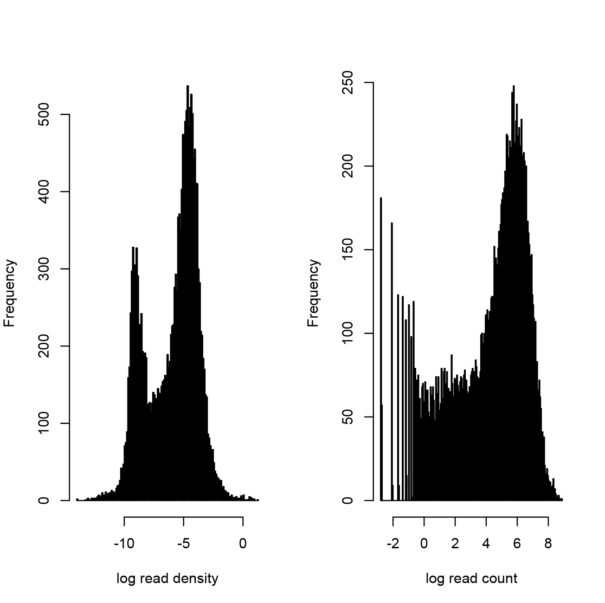
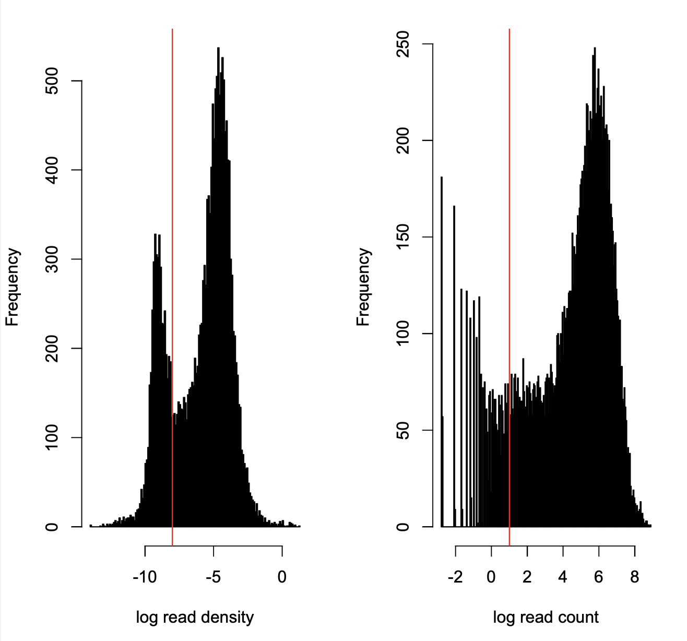
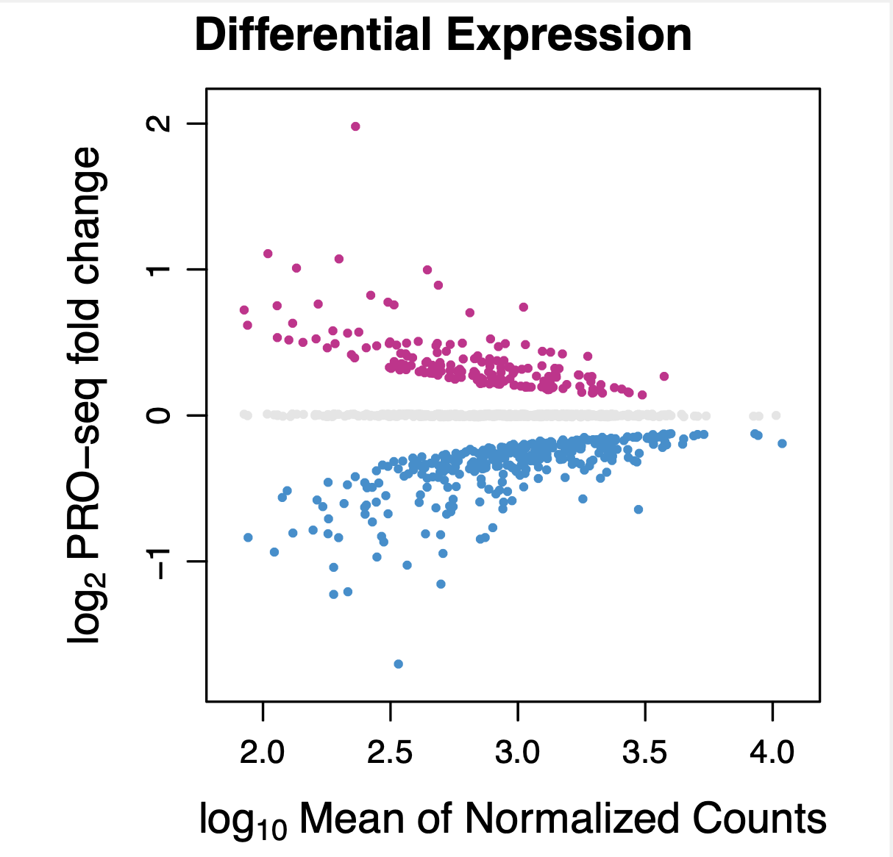

# Introduction

This is a vignette accompanying the manuscript "ZNF143 binds DNA and stimulates transcription initiation to activate and repress direct target genes" (doi: https://doi.org/10.1101/2024.05.13.594008). The analysis follows the published figures, which may differ from the preprint figures in labeling and content.

# PRO-seq analysis

Combine FASTQs for ZNF143-dTAG PRO-seq data from two different sequencing runs:
```{r engine='bash', eval=F, echo=TRUE}
cd /labs/Guertin/ZNF143_PRO

for i in ./dep1/*_dep1_*.fastq.gz
do
    echo $i
    pre=$(echo $i | awk -F"/" '{print $NF}' | awk -F"_dep1_" '{print $1}')
    suf=$(echo $i | awk -F"/" '{print $NF}' | awk -F"_dep1_" '{print $2}')
    x=$(echo $suf |  awk -F".fastq" '{print $1}')
    echo $pre # cell type, treatment, condition
    echo $suf # replicate number, PE2, fastq.gz
    echo $x # replicate number, PE2
    cat $i ./dep2/${pre}_dep2_${suf} > ${pre}_${x}_final.fastq.gz
done 
```

 Load modules, pre-run seqOutBias, and parse the hg38 annotation file:

```{r engine='bash', eval=F, echo=TRUE}
module load bowtie2/2.5.0
module load genometools/1.5.10
module load bedtools/2.29.0
module load ucsc_genome/2012.05.22
module load rust 

release=109

wget https://raw.githubusercontent.com/guertinlab/fqComplexity/main/fqComplexity
wget https://raw.githubusercontent.com/guertinlab/fqComplexity/main/complexity_pro.R
wget https://raw.githubusercontent.com/guertinlab/Nascent_RNA_Methods/main/insert_size.R
wget https://raw.githubusercontent.com/guertinlab/Nascent_RNA_Methods/main/pause_index.R
wget https://raw.githubusercontent.com/guertinlab/Nascent_RNA_Methods/main/exon_intron_ratio.R
wget https://raw.githubusercontent.com/guertinlab/Nascent_RNA_Methods/main/plot_all_metrics.R
wget https://raw.githubusercontent.com/guertinlab/Nascent_RNA_Methods/main/differential_expression.R

wget https://raw.githubusercontent.com/guertinlab/Nascent_RNA_Methods/main/PRO_normalization
wget https://raw.githubusercontent.com/guertinlab/Nascent_RNA_Methods/main/normalization_factor.R
wget https://raw.githubusercontent.com/guertinlab/Nascent_RNA_Methods/main/normalize_bedGraph.py

chmod +x insert_size.R
chmod +x fqComplexity
chmod +x complexity_pro.R
chmod +x pause_index.R
chmod +x exon_intron_ratio.R
chmod +x plot_all_metrics.R
chmod +x differential_expression.R

chmod +x normalize_bedGraph.py
chmod +x normalization_factor.R
chmod +x PRO_normalization

wget https://github.com/guertinlab/fqdedup/archive/refs/tags/v1.0.0.tar.gz
gunzip v1.0.0.tar.gz
tar -xvf v1.0.0.tar
cd fqdedup-1.0.0/ 
cargo build --release

wget https://hgdownload.cse.ucsc.edu/goldenpath/hg38/bigZips/hg38.fa.gz
gunzip hg38.fa.gz
bowtie2-build hg38.fa hg38

wget https://github.com/databio/ref_decoy/raw/master/human_rDNA.fa.gz
gunzip human_rDNA.fa.gz
bowtie2-build human_rDNA.fa human_rDNA

#Compute mappability for the given read length and the k-mer that corresponds to each possible read alignment position
#This is the most time-consuming step of the seqOutBias command but can be completed once before processing the sequencing data
#install from source, if you have issues: guertin@uchc.edu

# if seqOutBias is in a directory accessible by PATH, simply call it directly from the command line
seqOutBias seqtable hg38.fa --read-size=47

wget https://hgdownload.cse.ucsc.edu/goldenpath/hg38/bigZips/hg38.chrom.sizes

wget http://ftp.ensembl.org/pub/release-${release}/gtf/homo_sapiens/Homo_sapiens.GRCh38.${release}.chr.gtf.gz
gunzip Homo_sapiens.GRCh38.${release}.chr.gtf.gz

#extract all exon 1 annotations
grep 'exon_number "1"' Homo_sapiens.GRCh38.${release}.chr.gtf | \
    sed 's/^/chr/' | \
    awk '{OFS="\t";} {print $1,$4,$5,$14,$20,$7}' | \
    sed 's/";//g' | \
    sed 's/"//g' | sed 's/chrMT/chrM/g' | \
    sort -k1,1 -k2,2n > Homo_sapiens.GRCh38.${release}.tss.bed

#extract all exons
grep 'exon_number' Homo_sapiens.GRCh38.${release}.chr.gtf | \
    sed 's/^/chr/' | \
    awk '{OFS="\t";} {print $1,$4,$5,$14,$20,$7}' | \
    sed 's/";//g' | \
    sed 's/"//g' | sed 's/chrMT/chrM/g' | \
    sort -k1,1 -k2,2n > Homo_sapiens.GRCh38.${release}.all.exons.bed

#extract all complete gene annotations, sorted for use with join
awk '$3 == "gene"' Homo_sapiens.GRCh38.${release}.chr.gtf | \
    sed 's/^/chr/' | \
    awk '{OFS="\t";} {print $1,$4,$5,$10,$14,$7}' | \
    sed 's/";//g' | \
    sed 's/"//g' | sed 's/chrMT/chrM/g' | \
    sort -k5,5 > Homo_sapiens.GRCh38.${release}.bed
    
#extract all complete gene annotations, sorted for use with bedtools map
awk '$3 == "gene"' Homo_sapiens.GRCh38.${release}.chr.gtf | \
    sed 's/^/chr/' | \
    awk '{OFS="\t";} {print $1,$4,$5,$10,$14,$7}' | \
    sed 's/";//g' | \
    sed 's/"//g' | sed 's/chrMT/chrM/g' | \
    sort -k1,1 -k2,2n > Homo_sapiens.GRCh38.${release}_sorted.bed
 
#merge exon intervals that overlap each other
mergeBed -s -c 6 -o distinct -i Homo_sapiens.GRCh38.${release}.all.exons.bed | \
    awk '{OFS="\t";} {print $1,$2,$3,$4,$2,$4}' | 
    sort -k1,1 -k2,2n > Homo_sapiens.GRCh38.${release}.all.exons.merged.bed

#remove all first exons (so pause region is excluded from exon / intron density ratio)
subtractBed -s -a Homo_sapiens.GRCh38.${release}.all.exons.merged.bed -b Homo_sapiens.GRCh38.${release}.tss.bed | \
    sort -k1,1 -k2,2n > Homo_sapiens.GRCh38.${release}.no.first.exons.bed

#extract gene names of exons
intersectBed -s -wb -a Homo_sapiens.GRCh38.${release}.no.first.exons.bed -b Homo_sapiens.GRCh38.${release}.bed | \
    awk '{OFS="\t";} {print $1,$2,$3,$11,$4,$4}' | \
    sort -k1,1 -k2,2n >  Homo_sapiens.GRCh38.${release}.no.first.exons.named.bed

#extract the pause region from the first exons, position 20 - 120 downstream of the TSS
awk  '{OFS="\t";} $6 == "+" {print $1,$2+20,$2 + 120,$4,$5,$6} \
    $6 == "-" {print $1,$3 - 120,$3 - 20,$4,$5,$6}' Homo_sapiens.GRCh38.${release}.tss.bed  | \
    sort -k1,1 -k2,2n > Homo_sapiens.GRCh38.${release}.pause.bed 

#define and name all introns 
subtractBed -s -a Homo_sapiens.GRCh38.${release}.bed -b Homo_sapiens.GRCh38.${release}.all.exons.merged.bed | \
    sort -k1,1 -k2,2n > Homo_sapiens.GRCh38.${release}.introns.bed 
```

## Confirming UMI length

This is important for removing adapter steps later. Even if you know this number from your experimental protocol it doesn't hurt to confirm it in your data. Before doing any tests, subset some reads from any one of your FASTQs so these tests don't take forever to run. Make sure you are subsetting from a PE1 file!

```{r engine='bash', eval=F, echo=TRUE}
# get 4 million reads
zcat HEK_CloneZD29_30min_control_rep4_PE1_final.fastq.gz | head -n 40000000 > Z143_UMI_test.fastq

# do this in an interactive node
srun --partition=general --qos=general --mem=36G -N 1 -n 1 -c 12 --pty bash
```

**Interpreting cutadapt output**

```{r engine='bash', eval=F, echo=TRUE}
module load cutadapt

# cutadapt arguments:
# -m : minimum length
# -O : [capital letter o] minimum overlap length between adapter and read
# -a : adapter sequence ligated to 3' end, or of the first read in paired data
# -o : [lowercase o] name of output file, which is a FASTQ with trimmed reads
cutadapt --cores=12 -m 1 -O 1 -a TGGAATTCTCGGGTGCCAAGG Z143_UMI_test.fastq \
  -o Z143_UMI_test_noadapt.fastq > Z143_UMI_test_cutadapt.txt

tail Z143_UMI_test_cutadapt.txt
# 38  32011 0.0 2 28256 3368 387
# 39  1976282 0.0 2 1842220 117943 16119
# 40  81301 0.0 2 67815 12434 1052
# 41  56103 0.0 2 50968 3886 1249
# 42  45902 0.0 2 42491 2676 735
# 43  41906 0.0 2 38847 2339 720
# 44  38556 0.0 2 35661 2301 594
# 45  37035 0.0 2 34420 2048 567
# 46  43034 0.0 2 40439 2117 478
# 47  45296 0.0 2 41996 2565 735
```

Counting how many sequences follow the spike in counts (at length 39, last column): UMI length = 8.

**Trim and Align**

Another method to confirm UMI length is to trim the PE1 reads from the 5' end, one base at a time, and see when a spike in alignment rate to the human genome takes place.

```{r engine='bash', eval=F, echo=TRUE}
module load fastx

# if we didn't do this we'd just be trimming the adapter one base at a time and that's not very informative
cat Z143_UMI_test.fastq | fastx_clipper -Q 33 -a TGGAATTCTCGGGTGCCAAGG -o Z143_UMI_test_clipped.fastq

# Trim by 1 base at a time
for n in {1..9}
do
fastx_trimmer -f $(expr $n + 1) -i Z143_UMI_test_clipped.fastq -o Z143_UMI_test_clipped_trim$n.fastq
done

# -f means the first base to KEEP, so -f 2 will trim the first base (from the left/5' side)
head -2 Z143_UMI_test_clipped.fastq 
# @NB551647:99:HVY2FBGXN:1:11101:24868:1042 1:N:0:ACTTGA
# ACATAGTACTTTTAAAT
head -2 Z143_UMI_test_clipped_trim1.fastq 
# @NB551647:99:HVY2FBGXN:1:11101:24868:1042 1:N:0:ACTTGA
#  CATAGTACTTTTAAAT
head -2 Z143_UMI_test_clipped_trim2.fastq 
# @NB551647:99:HVY2FBGXN:1:11101:24868:1042 1:N:0:ACTTGA
#   ATAGTACTTTTAAAT
```

Script for aligning the clipped FASTQs:
```{r engine='bash', eval=F, echo=TRUE}
#! /usr/bin/bash
#SBATCH --job-name=ZNF143_UMI_alignments
#SBATCH -N 1                    
#SBATCH -n 1                  
#SBATCH -c 24                          
#SBATCH -p general
#SBATCH --qos=general       
#SBATCH --mem=36G                    
#SBATCH --mail-type=ALL 
#SBATCH --mail-user=jdong@uchc.edu
#SBATCH -o /home/FCAM/jdong/slurm_out/%x_%j.all_out
#SBATCH -e /home/FCAM/jdong/slurm_out/%x_%j.all_out

module load bowtie2
genome_index=/home/FCAM/jdong/human38/hg38
directory=/labs/Guertin/ZNF143_PRO
cd $directory

# simple alignment with bowtie2
for x in Z143_UMI_test_clipped*.fastq
    do
    name=$(echo $x | awk -F ".fastq" '{print $1}')
    echo "Now aligning $name"
    bowtie2 -p 24 -t -x ${genome_index} -U ${x} -S ${name}.sam
    done 2> Z143_UMI_test_clipped_stderr.txt
```

Interpreting results:
```{r engine='bash', eval=F, echo=TRUE}
grep -i "alignment rate" Z143_UMI_test_clipped_stderr.txt 
65.72% overall alignment rate # 0 bases trimmed
74.20% overall alignment rate # 1
78.63% overall alignment rate # 2
82.87% overall alignment rate # 3
84.89% overall alignment rate # 4
86.72% overall alignment rate # 5
89.22% overall alignment rate # 6
74.36% overall alignment rate # 7
95.84% overall alignment rate # 8 -- spike
96.61% overall alignment rate # 9 
```

Note the large spike in alignment rate when 8 bases are trimmed--this is another point in favor of the UMI length = 8. 


# PRO alignment and parallelization:

The following code chunk was run as "pro_processing.sh" and generally follows the PEPPRO method (https://doi.org/10.1186/s13059-021-02349-4) for PRO-seq processing and quality control assessment. 
```{r engine='bash', eval=F, echo=TRUE}
#! /usr/bin/bash

#SBATCH --job-name=pro_processing_XXXXXXX.sh
#SBATCH -N 1                  
#SBATCH -n 1                 
#SBATCH -c 24                  
#SBATCH -p general           
#SBATCH --qos=general       
#SBATCH --mem=36G               
#SBATCH --mail-type=ALL 
#SBATCH --mail-user=jdong@uchc.edu
#SBATCH -o /home/FCAM/jdong/slurm_out/%x_%j.all_out
#SBATCH -e /home/FCAM/jdong/slurm_out/%x_%j.all_out

cd /labs/Guertin/ZNF143_PRO

echo "Current wd:" $(pwd)
echo "Current node:" $(hostname)

name=XXXXXXX

module load cutadapt/3.5
module load seqtk/1.3
seqOutBias=/home/FCAM/jdong/software/seqOutBias #version 1.4.0
fqdedup=/home/FCAM/jdong/software/fqdedup
flash=/home/FCAM/jdong/software/flash
module load fastq-pair/1.0
module load samtools/1.16.1
module load genometools/1.5.10
module load ucsc_genome/2012.05.22
module load rust
module load bowtie2
module load bedtools

sizes=/home/FCAM/jdong/human38/hg38.chrom.sizes
annotation_prefix=/home/FCAM/jdong/ZNF143_PRO_2023/Homo_sapiens.GRCh38.109 
UMI_length=8
read_size=47
cores=24
genome=/home/FCAM/jdong/human38/hg38.fa
genome_index=/home/FCAM/jdong/human38/hg38
prealign_rdna_index=/home/FCAM/jdong/hum_rDNA
tallymer=/home/FCAM/jdong/ZNF143_PRO_2023/hg38.tal_${read_size}.gtTxt.gz
table=/home/FCAM/jdong/ZNF143_PRO_2023/hg38_${read_size}.4.2.2.tbl

gunzip ${name}_PE1_final.fastq.gz
gunzip ${name}_PE2_final.fastq.gz

echo 'removing dual adapter ligations and calculating the fraction of adapter/adapters in' $name
cutadapt --cores=$cores -m $((UMI_length+2)) -O 1 -a TGGAATTCTCGGGTGCCAAGG ${name}_PE1_final.fastq \
        -o ${name}_PE1_noadap.fastq --too-short-output ${name}_PE1_short.fastq > ${name}_PE1_cutadapt.txt
cutadapt --cores=$cores -m $((UMI_length+10)) -O 1 -a GATCGTCGGACTGTAGAACTCTGAAC ${name}_PE2_final.fastq \
        -o ${name}_PE2_noadap.fastq --too-short-output ${name}_PE2_short.fastq > ${name}_PE2_cutadapt.txt

PE1_total=$(wc -l ${name}_PE1_final.fastq | awk '{print $1/4}')
PE1_w_Adapter=$(wc -l ${name}_PE1_short.fastq | awk '{print $1/4}')
AAligation=$(echo "scale=2 ; $PE1_w_Adapter / $PE1_total" | bc)
echo -e  "value\texperiment\tthreshold\tmetric" > ${name}_QC_metrics.txt
echo -e "$AAligation\t$name\t0.80\tAdapter/Adapter" >> ${name}_QC_metrics.txt

echo 'removing short RNA insertions in' $name
seqtk seq -L $((UMI_length+10)) ${name}_PE1_noadap.fastq > ${name}_PE1_noadap_trimmed.fastq 

echo 'removing PCR duplicates from' $name
fqdedup -i ${name}_PE1_noadap_trimmed.fastq -o ${name}_PE1_dedup.fastq

PE1_noAdapter=$(wc -l ${name}_PE1_dedup.fastq | awk '{print $1/4}')

fastq_pair -t $PE1_noAdapter ${name}_PE1_dedup.fastq ${name}_PE2_noadap.fastq

echo 'calculating and plotting RNA insert sizes from' $name
flash -q --compress-prog=gzip --suffix=gz ${name}_PE1_dedup.fastq.paired.fq \
        ${name}_PE2_noadap.fastq.paired.fq -o ${name}

insert_size.R ${name}.hist ${UMI_length}

echo 'trimming off the UMI from' $name
seqtk trimfq -b ${UMI_length} ${name}_PE1_dedup.fastq | seqtk seq -r - > ${name}_PE1_processed.fastq
seqtk trimfq -e ${UMI_length} ${name}_PE2_noadap.fastq | seqtk seq -r - > ${name}_PE2_processed.fastq

echo 'aligning' $name 'to rDNA and removing aligned reads'
bowtie2 -p $((cores-2)) -x $prealign_rdna_index -U ${name}_PE1_processed.fastq 2>${name}_bowtie2_rDNA.log | \
        samtools sort -n - | samtools fastq -f 0x4 - > ${name}_PE1.rDNA.fastq
reads=$(wc -l ${name}_PE1.rDNA.fastq | awk '{print $1/4}')
fastq_pair -t $reads ${name}_PE1.rDNA.fastq ${name}_PE2_processed.fastq

echo 'aligning' $name 'to the genome'
bowtie2 -p $((cores-2)) --maxins 1000 -x $genome_index --rf -1 ${name}_PE1.rDNA.fastq.paired.fq \
        -2 ${name}_PE2_processed.fastq.paired.fq 2>${name}_bowtie2.log | samtools view -b - | \
        samtools sort - -o ${name}.bam

echo 'calculating rDNA alignment rate for' $name
PE1_prior_rDNA=$(wc -l ${name}_PE1_processed.fastq | awk '{print $1/4}')
PE1_post_rDNA=$(wc -l ${name}_PE1.rDNA.fastq | awk '{print $1/4}')
total_rDNA=$(echo "$(($PE1_prior_rDNA-$PE1_post_rDNA))") 
concordant_pe1=$(samtools view -c -f 0x42 ${name}.bam)
total=$(echo "$(($concordant_pe1+$total_rDNA))")
rDNA_alignment=$(echo "scale=2 ; $total_rDNA / $total" | bc)
echo -e "$rDNA_alignment\t$name\t0.10\trDNA Alignment Rate" >> ${name}_QC_metrics.txt

echo 'calculating alignment rate for' $name
map_pe1=$(samtools view -c -f 0x42 ${name}.bam)
pre_alignment=$(wc -l ${name}_PE1.rDNA.fastq.paired.fq | awk '{print $1/4}')
alignment_rate=$(echo "scale=2 ; $map_pe1 / $pre_alignment" | bc)
echo -e "$alignment_rate\t$name\t0.80\tAlignment Rate" >> ${name}_QC_metrics.txt

echo 'plotting and calculating complexity for' $name
fqComplexity -i ${name}_PE1_noadap_trimmed.fastq

echo 'calculating and plotting theoretical sequencing depth' 
echo 'to achieve a defined number of concordantly aligned reads for' $name
PE1_total=$(wc -l ${name}_PE1_final.fastq | awk '{print $1/4}')
PE1_noadap_trimmed=$(wc -l ${name}_PE1_noadap_trimmed.fastq | awk '{print $1/4}')
factorX=$(echo "scale=2 ; $PE1_noadap_trimmed / $PE1_total" | bc)
echo 'fraction of reads that are not adapter/adapter ligation products or below 10 base inserts:'
echo $factorX 
PE1_dedup=$(wc -l ${name}_PE1_dedup.fastq | awk '{print $1/4}')
factorY=$(echo "scale=2 ; $concordant_pe1 / $PE1_dedup" | bc)
fqComplexity -i ${name}_PE1_noadap_trimmed.fastq -x $factorX -y $factorY

echo 'Separating paired end reads and creating genomic BED and bigWig intensity files for' $name
seqOutBias scale $table ${name}.bam --no-scale --stranded --bed-stranded-positive \
        --bw=$name.bigWig --bed=$name.bed --out-split-pairends --only-paired \
        --tail-edge --read-size=$read_size --tallymer=$tallymer

grep -v "random" ${name}_not_scaled_PE1.bed | grep -v "chrUn" | grep -v "chrEBV" | sort -k1,1 -k2,2n > ${name}_tmp.txt 
mv ${name}_tmp.txt ${name}_not_scaled_PE1.bed 

echo 'calculating pause indices for' $name
mapBed -null "0" -s -a $annotation_prefix.pause.bed -b ${name}_not_scaled_PE1.bed | \
awk '$7>0' | sort -k5,5 -k7,7nr | sort -k5,5 -u > ${name}_pause.bed

join -1 5 -2 5 ${name}_pause.bed $annotation_prefix.bed | \
        awk '{OFS="\t";} $2==$8 && $6==$12 {print $2, $3, $4, $1, $6, $7, $9, $10}' | \
        awk '{OFS="\t";} $5 == "+" {print $1,$2+480,$8,$4,$6,$5} $5 == "-" {print $1,$7,$2 - 380,$4,$6,$5}' | \
        awk  '{OFS="\t";} $3>$2 {print $1,$2,$3,$4,$5,$6}' | sort -k1,1 -k2,2n  > ${name}_pause_counts_body_coordinates.bed
mapBed -null "0" -s -a ${name}_pause_counts_body_coordinates.bed \
        -b ${name}_not_scaled_PE1.bed | awk '$7>0' | \
        awk '{OFS="\t";} {print $1,$2,$3,$4,$5,$6,$7,$5/100,$7/($3 - $2)}' | \
        awk '{OFS="\t";} {print $1,$2,$3,$4,$5,$6,$7,$8,$9,$8/$9}' > ${name}_pause_body.bed

pause_index.R ${name}_pause_body.bed

echo 'Calculating exon density / intron density as a metric for nascent RNA purity for' $name
mapBed -null "0" -s -a $annotation_prefix.introns.bed \
        -b ${name}_not_scaled_PE1.bed | awk '$7>0' | \
        awk '{OFS="\t";} {print $1,$2,$3,$5,$5,$6,$7,($3 - $2)}' > ${name}_intron_counts.bed
mapBed -null "0" -s -a $annotation_prefix.no.first.exons.named.bed \
        -b ${name}_not_scaled_PE1.bed | awk '$7>0' | \
        awk '{OFS="\t";} {print $1,$2,$3,$4,$4,$6,$7,($3 - $2)}' > ${name}_exon_counts.bed

exon_intron_ratio.R ${name}_exon_counts.bed ${name}_intron_counts.bed

echo 'removing intermediate files'
rm ${name}_PE1_short.fastq
rm ${name}_PE2_short.fastq
rm ${name}_PE1_noadap.fastq
rm ${name}_PE2_noadap.fastq
rm ${name}_PE1_noadap_trimmed.fastq
rm ${name}_PE1_dedup.fastq
rm ${name}_PE1_processed.fastq
rm ${name}_PE2_processed.fastq
rm ${name}_PE1_dedup.fastq.paired.fq   
rm ${name}_PE2_noadap.fastq.paired.fq
rm ${name}_PE1_dedup.fastq.single.fq
rm ${name}_PE2_noadap.fastq.single.fq
rm ${name}_PE1.rDNA.fastq.paired.fq
rm ${name}_PE1.rDNA.fastq.single.fq
rm ${name}_PE2_processed.fastq.paired.fq
rm ${name}_PE2_processed.fastq.single.fq
rm ${name}.extendedFrags.fastq.gz
rm ${name}.notCombined_1.fastq.gz
rm ${name}.notCombined_2.fastq.gz

echo 'script complete'
```

## Run the previous chunk in parallel (Fig S1)

```{r engine='bash', eval=F, echo=TRUE}

file=pro_processing.sh

for i in *_PE1_final.fastq.gz
do
    nm=$(echo $i | awk -F"/" '{print $NF}' | awk -F"_PE1_final.fastq.gz" '{print $1}')
    echo $nm
    sed -e "s/XXXXXXX/${nm}/g" "$file" > pro_processing_${nm}.sh
    sbatch pro_processing_${nm}.sh
    sleep 1
done

```

Re-zip raw sequencing files:

```{r engine='bash', eval=F, echo=TRUE}
# check wildcards first
gzip *_PE1_final.fastq
gzip *_PE2_final.fastq
```

Combine all QC metrics and plot:
```{r engine='bash', eval=F, echo=TRUE}
cat *_QC_metrics.txt | awk '!x[$0]++' > project_QC_metrics.txt 

plot_all_metrics.R project_QC_metrics.txt ZNF143_degron_PRO
```

This plot is saved as `ZNF143_pro_metrics_depth_final.pdf` (Figure S1).


# Prepare input for pTA

Normalize bigWigs from seqOutBias:
```{r engine='bash', eval=F, echo=TRUE}
PRO_normalization -c hg38.chrom.sizes
```

Then merge bigWigs based on strand (control and experimental conditions together):
```{r engine='bash', eval=F, echo=TRUE}
reps=8
pair="_PE1"
name="HEK_CloneZD29_30min"
chrSizes="/Users/jinhongdong/fileRef/human38/hg38.chrom.sizes"

plusfiles=$(ls ${name}_*rep*_plus${pair}_scaled.bigWig)
bigWigMerge $plusfiles tmpPlus${pair}.bg
minusfiles=$(ls ${name}_*rep*_minus${pair}_scaled.bigWig)
bigWigMerge -threshold=-10000000000 $minusfiles tmpMinus${pair}.bg
scaleall=$(bc <<< "scale=4 ; 1.0 / $reps")
normalize_bedGraph.py -i tmpPlus${pair}.bg -s $scaleall -o ${name}_plus${pair}_scaled.bg
normalize_bedGraph.py -i tmpMinus${pair}.bg -s $scaleall -o ${name}_minus${pair}_scaled.bg
sort -k1,1 -k2,2n ${name}_plus${pair}_scaled.bg > ${name}_plus${pair}_scaled_sorted.bg
sort -k1,1 -k2,2n ${name}_minus${pair}_scaled.bg > ${name}_minus${pair}_scaled_sorted.bg
bedGraphToBigWig ${name}_plus${pair}_scaled_sorted.bg $chrSizes ${name}_plus${pair}_scaled.bigWig 
bedGraphToBigWig ${name}_minus${pair}_scaled_sorted.bg $chrSizes ${name}_minus${pair}_scaled.bigWig

rm ${name}_plus${pair}_scaled.bg
rm ${name}_minus${pair}_scaled.bg
rm ${name}_plus${pair}_scaled_sorted.bg
rm ${name}_minus${pair}_scaled_sorted.bg
rm tmpPlus${pair}.bg
rm tmpMinus${pair}.bg
```


# Prepare input for TSSinference

This is basically the same as the above, but for PE2 reads instead of PE1.

```{r engine='bash', eval=F, echo=TRUE}
reps=8
pair="_PE2"
name="HEK_CloneZD29_30min"
chrSizes="/Users/jinhongdong/fileRef/human38/hg38.chrom.sizes"

plusfiles=$(ls ${name}_*rep*_plus${pair}_scaled.bigWig)
bigWigMerge $plusfiles tmpPlus${pair}.bg
minusfiles=$(ls ${name}_*rep*_minus${pair}_scaled.bigWig)
bigWigMerge -threshold=-10000000000 $minusfiles tmpMinus${pair}.bg
scaleall=$(bc <<< "scale=4 ; 1.0 / $reps")
normalize_bedGraph.py -i tmpPlus${pair}.bg -s $scaleall -o ${name}_plus${pair}_scaled.bg
normalize_bedGraph.py -i tmpMinus${pair}.bg -s $scaleall -o ${name}_minus${pair}_scaled.bg
sort -k1,1 -k2,2n ${name}_plus${pair}_scaled.bg > ${name}_plus${pair}_scaled_sorted.bg
sort -k1,1 -k2,2n ${name}_minus${pair}_scaled.bg > ${name}_minus${pair}_scaled_sorted.bg
bedGraphToBigWig ${name}_plus${pair}_scaled_sorted.bg $chrSizes ${name}_plus${pair}_scaled.bigWig 
bedGraphToBigWig ${name}_minus${pair}_scaled_sorted.bg $chrSizes ${name}_minus${pair}_scaled.bigWig

rm ${name}_plus${pair}_scaled.bg
rm ${name}_minus${pair}_scaled.bg
rm ${name}_plus${pair}_scaled_sorted.bg
rm ${name}_minus${pair}_scaled_sorted.bg
rm tmpPlus${pair}.bg
rm tmpMinus${pair}.bg
```

## Get gene annotations

The starting file for filtering these annotations was obtained from the gencode website here: [https://ftp.ebi.ac.uk/pub/databases/gencode/Gencode_human/release_42/gencode.v42.basic.annotation.gtf.gz](https://ftp.ebi.ac.uk/pub/databases/gencode/Gencode_human/release_42/gencode.v42.basic.annotation.gtf.gz), specifically the version of basic annotation which contained reference chromosomes only. 

```{r engine='R', eval=F, echo=TRUE}
gunzip gencode.v42.basic.annotation.gtf.gz

grep 'transcript_type "protein_coding"' gencode.v42.basic.annotation.gtf | \
    grep -v 'tag "readthrough_transcript"' | \
    grep -v 'tag "RNA_Seq_supported_only"' | \
    grep -v 'tag "RNA_Seq_supported_partial"' | \
    awk '{if($3=="exon"){print $0}} ' | \
    grep -w "exon_number 1" | \
    cut -f1,4,5,7,9 | tr ";" "\t" | \
    awk '{for(i=5;i<=NF;i++){if($i~/^gene_name/){a=$(i+1)}} print $1,$2,$3,a,"na",$4}' | \
    tr " " "\t" | tr -d '"' | \
    grep -v "\tENSG" > gencode.hg38.v42.basic.firstExon.latest.filtered.bed

```

## Re-annotating transcription units after manual curation

After an initial round of transcription unit (TU) calling with TSSinference and primaryTranscriptAnnotation, we identified differentially expressed genes with DESeq2 (same methods as below) and looked at TU calls for all of the down genes in the UCSC genome browser to verify that all TSSs had been identified for each gene. We noticed some gene annotations were missing true TSSs, so they were adjusted to match the data. These are the gene annotations that were adjusted, along with accompanying browser sessions:

Plus strand genes:
- *MATR3*: TSS should be more upstream because exon1 window missed annotations with more upstream exons. (https://genome.ucsc.edu/s/jhdong/MATR3_TU)
    - new exon1 start: chr5:139274101
- delete *SRRM*: ZNF576 completely overlaps this gene and it's impossible to tell who's who (https://genome.ucsc.edu/s/jhdong/SRRM5_TU)
- *ZNF382*: The TTS looks fine, but most prominent TSS was missed by ~400bp. Update the TSS to the one in the annotation with bidir txn (https://genome.ucsc.edu/s/jhdong/ZNF382_TSS)
    - new exon1 start: chr19:36605313

Minus strand genes:
- *ATXN7L3*: a more prominent TSS is ~224bp upstream, make sure it has bidir txn (https://genome.ucsc.edu/s/jhdong/ATXN7L3_TU) 
    - manually setting exon1 boundary: chr17:44200100
- delete *DQX1*: not much bidirectional transcription at current TSS (https://genome.ucsc.edu/s/jhdong/DQX1_TU) 
- delete *NPFF*: messy overlapping genes; unsure of where to call TSS or TTS. Doesn't look like it has a proper transcription unit (https://genome.ucsc.edu/s/jhdong/NPFF_TU)

```{r engine='R', eval=F, echo=TRUE}
# import original exon1 table
oldExon1 = read.table("gencode.hg38.v42.basic.firstExon.latest.filtered.bed", sep="\t", header =FALSE)
dim(oldExon1)
# [1] 18930     6
colnames(oldExon1) = c("chr","start","end","gene", "misc","strand")

# import original transcription unit calls 
oldCoords = read.table('HEK_ZNF143_infcoords_control_only.bed', sep="\t", header =FALSE)
dim(oldCoords)
#[1] 11818     6
colnames(oldCoords) = c("chr","start","end","gene","misc","strand")

# move MATR3 exon1 start upstream
oldCoords[grepl("MATR3",oldCoords$gene),]
#       chr     start       end  gene  misc strand
# 2770 chr5 139293742 139341807 MATR3 89870      +
oldExon1[grepl("MATR3",oldExon1$gene),]
#       chr     start       end  gene misc strand
# 9188 chr5 139293722 139293778 MATR3    1      +
oldExon1[9188,"start"] = 139274101
oldExon1[grepl("MATR3",oldExon1$gene),]
#       chr     start       end  gene misc strand
# 9188 chr5 139274101 139293778 MATR3    1      +

# delete SRRM5 and DQX1
oldExon1[(oldExon1$gene %in% c("SRRM5","DQX1")),]
#         chr    start      end  gene misc strand
# 4469   chr2 74526191 74526231  DQX1    1      -
# 15528 chr19 43596617 43612088 SRRM5    1      +
oldExon1 = oldExon1[!(oldExon1$gene %in% c("SRRM5","DQX1")),]

# move ZNF382 exon1 more upstream to cut off the TSS without bidir txn
oldExon1[oldExon1$gene == c("ZNF382"),]
#         chr    start      end   gene misc strand
# 18517 chr19 36604817 36608420 ZNF382    1      +
oldExon1[oldExon1$gene == c("ZNF382"),"start"] = 36605313
oldExon1[oldExon1$gene == c("ZNF382"),]
#         chr    start      end   gene misc strand
# 18517 chr19 36605313 36608420 ZNF382    1      +

# move ATXN7L3 TSS to the upstream one with bidir txn
oldExon1[oldExon1$gene == c("ATXN7L3"),]
#        chr    start      end    gene misc strand
# 1312 chr17 44198070 44199884 ATXN7L3    1      -
oldExon1[oldExon1$gene == c("ATXN7L3"),"end"] = 44200100
oldExon1[oldExon1$gene == c("ATXN7L3"),]
#        chr    start      end    gene misc strand
# 1312 chr17 44198070 44200100 ATXN7L3    1      -

# delete NPFF
oldExon1[oldExon1$gene == c("NPFF"),]
#         chr    start      end gene misc strand
# 10590 chr12 53507483 53507484 NPFF    1      -
oldExon1 = oldExon1[!(oldExon1$gene == c("NPFF")),]

# export updated exon1 table
write.table(oldExon1, file="gencode_exon1_parsed_updated.bed",sep="\t",quote=FALSE,row.names=FALSE,col.names=FALSE)
```

The following code represents what was done with the latest gene annotations after the manual curation. 

# TSSInference

## Control-called TSSs 

For differential gene expresion analysis, call TSSs from the control data only.

```{r engine='R', eval=F, echo=TRUE}
library(bigWig)
# source TSSinference functions
source("TSSinference.R")
# load gene annotation file
gene.exon1 = parse.bed.exon1("gencode_exon1_parsed_updated.bed")

# assign bigWig variables
# IMPORTANT: because these are PE2, switch the plus and minus bigWigs!
# These two are the ones with control + experimental merged
bw.plus='HEK_CloneZD29_30min_control_minus_PE2_scaled.bigWig'
bw.minus='HEK_CloneZD29_30min_control_plus_PE2_scaled.bigWig'

colnames(gene.exon1) = c("chrom","start","end","gene","misc","strand")
controlTSSall = TSSinference(gene.exon1, bw.plus, bw.minus,low.limit.tss.factor = 1, densityFilter = FALSE)

# get maximum TSSs for all genes
temp = controlTSSall[!is.na(controlTSSall$height),]
temp2 = temp[!(temp$chrom == "chrM"),]
controlTSSmaxH = do.call(rbind, lapply(split(temp2, as.factor(temp2$gene)), function(x) {return(x[which.max(x$height),])}))
dim(controlTSSmaxH) # 15586 genes
```

After checking TSS locations on the genome browser, ABCB1's assigned TSS turned out to be a pileup of adapters that slipped through the previous adapter removal processes, possibly due to part of the sequence being improperly called during the sequencing process.

Reassigning the "problem TSS":
These coordinates were chosen manually by selecting the read peak closest to the annotated version of ABCB1 in the genome browser that had an appreciable peak.

```{r engine='R', eval=F, echo=TRUE}
controlTSSmaxH[grepl("ABCB1",controlTSSmaxH$gene) & grepl("chr7",controlTSSmaxH$chrom),]$start = 87600883
controlTSSmaxH[grepl("ABCB1",controlTSSmaxH$gene) & grepl("chr7",controlTSSmaxH$chrom),]$end = 87600884

# run TSSinference and select primary TSSs based on height (read count)
# potential.tss2 = TSSinference(gene.exon1, bw.minus, bw.plus, densityFilter=FALSE)
# flipTSS = potential.tss2[!is.na(potential.tss2$height),]
# flipTSS.sort = flipTSS[order(flipTSS$chrom, flipTSS$start),]
# flipTSS.sort = flipTSS.sort[!(flipTSS.sort$chrom == "chrM"),]
# flipTSSmaxH = do.call(rbind, lapply( split(flipTSS.sort, as.factor(flipTSS.sort$gene)), function(x) {return(x[which.max(x$height),])}))

# write.table(flipTSSmaxH[, c(1,2,3,4,7,6)], file = "flipTSSmaxH.bed", quote = FALSE, sep ='\t', row.names = FALSE, col.names = FALSE)

# to identify the problem row
# flipTSSmaxH[grepl("ABCB1",flipTSSmaxH$gene) & grepl("chr7",flipTSSmaxH$chrom),]
# #       chrom    start      end  gene  misc strand   height         up     down
# # ABCB1  chr7 87628641 87628642 ABCB1 ABCB1      - 638.6562 0.03999625 6.610102

# flipTSSmaxH[grepl("ABCB1",flipTSSmaxH$gene) & grepl("chr7",flipTSSmaxH$chrom),]$start = 87600883
# flipTSSmaxH[grepl("ABCB1",flipTSSmaxH$gene) & grepl("chr7",flipTSSmaxH$chrom),]$end = 87600884
# # the height and up/down densities are wrong but the position is the important thing here

# #check
# flipTSSmaxH[grepl("ABCB1",flipTSSmaxH$gene) & grepl("chr7",flipTSSmaxH$chrom),]
# #       chrom    start      end  gene  misc strand   height         up     down
# # ABCB1  chr7 87600883 87600884 ABCB1 ABCB1      - 638.6562 0.03999625 6.610102

# # new as of 09-13-23
# save(flipTSSmaxH, file="flipTSSmaxH.Rdata")

# write.table(flipTSSmaxH[, c(1,2,3,4,7,6)], file = "flipTSSmaxH.bed", quote = FALSE, sep ='\t', row.names = FALSE, col.names = FALSE)

```

## dTAG-called TSSs 

For later analysis, also call TSSs from the ZNF143-dTAG-only data.

```{r engine='R', eval=F, echo=TRUE}
bw.minus='HEK_CloneZD29_30min_dTAGV1_plus_PE2_scaled.bigWig'
bw.plus='HEK_CloneZD29_30min_dTAGV1_minus_PE2_scaled.bigWig'

dTAGtssAll = TSSinference(gene.exon1, bw.plus, bw.minus, low.limit.tss.factor = 1,densityFilter=FALSE)
temp = dTAGtssAll[!is.na(dTAGtssAll$height),]
temp2 = temp[!(temp$chrom == "chrM"),]
dTAGtssAllmaxH = do.call(rbind, lapply( split(temp2, as.factor(temp2$gene)), function(x) {return(x[which.max(x$height),])}))
dim(dTAGtssAllmaxH) # [1] 15609     9
```


# primaryTranscriptAnnotation

Prepare specific annotations:

```{r engine='bash', eval=F, echo=TRUE}
grep 'transcript_type "protein_coding"' gencode.v42.basic.annotation.gtf | \
   awk '{if($3=="exon"){print $0}}' | \
   grep -w "exon_number 1" | \
   cut -f1,4,5,7,9 | tr ";" "\t" | \
   awk '{for(i=5;i<=NF;i++){if($i~/^gene_name/){a=$(i+1)}} print $1,$2,$3,a,"na",$4}' | \
   tr " " "\t" | tr -d '"' > gencode.v42.firstExon.bed
   
grep 'transcript_type "protein_coding"' gencode.v42.basic.annotation.gtf | \
    awk '{if($3=="transcript"){print $0}} ' | \
    cut -f1,4,5,7,9 | tr ";" "\t" | \
    awk '{for(i=5;i<=NF;i++){if($i~/^gene_name/){a=$(i+1)}} print $1,$2,$3,a,"na",$4}' | \
    tr " " "\t" | tr -d '"' > gencode.v42.transcript.bed

```

Download the pTA repository from https://github.com/WarrenDavidAnderson/genomicsRpackage/tree/master and load pTA functions from source:
```{r engine='bash', eval=F, echo=TRUE}
source("/Users/jinhongdong/software/genomicsRpackage-master/primaryTranscriptAnnotation/R/gene_ann.R")
source("/Users/jinhongdong/software/genomicsRpackage-master/primaryTranscriptAnnotation/R/map_tu.R")
```

```{r engine='R', eval=F, echo=TRUE}
# import data for all transcripts, annotate, and remove duplicate transcripts
fname = "gencode.v42.transcript.bed"
dat0 = read.table(fname,header=F,stringsAsFactors=F) 
names(dat0) = c('chr', 'start', 'end', 'gene', 'xy', 'strand') 
dat0 = unique(dat0)
gencode.transcript = dat0

chrom.sizes = read.table("/Users/jinhongdong/fileRef/human38/hg38.chrom.sizes",stringsAsFactors=F,header=F) 
names(chrom.sizes) = c("chr","size")

# load in normalized bigWigs
plus.file.pe1 = "HEK_CloneZD29_30min_control_plus_PE1_scaled.bigWig" 
minus.file.pe1 = "HEK_CloneZD29_30min_control_minus_PE1_scaled.bigWig" 
bw.plus.pe1 = load.bigWig(plus.file.pe1) 
bw.minus.pe1 = load.bigWig(minus.file.pe1)

# necessary libraries
library(NMF)
library(dplyr)
library(bigWig)
library(pracma) 
library(RColorBrewer) 
library(primaryTranscriptAnnotation)

# for each gene: get largest interval and read counts for annotated transcripts
largest.interval.bed = get.largest.interval(bed=gencode.transcript)
transcript.reads = read.count.transcript(bed=gencode.transcript, bw.plus=bw.plus.pe1, bw.minus=bw.minus.pe1)
```

```{r engine='R', eval=F, echo=TRUE}
# set up a graphical space with 1 row and 2 columns
par(mfrow=c(1,2)) 
# make plots of the distribution of the logs of read density and read counts across the genes
hist(log(transcript.reads$density), breaks=200, col="black",xlab="log read density",main="") 
hist(log(transcript.reads$counts), breaks=200, col="black",xlab="log read count",main="")
# plot saved as "read_density_count.pdf"
```

<!-- ```{r  echo=F, fig.align = "left", fig.cap="Log read density and counts"}
library(knitr)
 
``` -->

```{r engine='R', eval=F, echo=TRUE}
# pick cut-offs for density and counts by looking at the plots 
den.cut = -8
cnt.cut = 1

ind.cut.den = which(log(transcript.reads$density) < den.cut) 
ind.cut.cnt = which(log(transcript.reads$counts) < cnt.cut) 
# get indices for which transcripts fall below both cutoffs
ind.cut = union(ind.cut.den, ind.cut.cnt)

# remake the prevous plot but include locations of cutoffs
par(mfrow=c(1,2))
hist(log(transcript.reads$density), breaks=200,
col="black",xlab="log read density",main="") 
abline(v=den.cut, col="red") 
hist(log(transcript.reads$counts), breaks=200,
col="black",xlab="log read count",main="") 
abline(v=cnt.cut, col="red")
# plot saved as "read_density_count_cutoff.pdf"
```

<!-- ```{r  echo=F, fig.align = "left", fig.cap="Log read density and counts cutoff for defining expressed genes"}
#library(knitr)
 
``` -->

```{r engine='R', eval=F, echo=TRUE}
# remove genes below cutoffs ("unexpressed")
unexp = names(transcript.reads$counts)[ind.cut]
largest.interval.expr.bed = largest.interval.bed[!(largest.interval.bed$gene %in% unexp),]

# get TSSs for each gene (from TSSinf)
tss.interval.bed = merge(potential.tss2, largest.interval.expr.bed, by.x="gene", by.y="gene")
tss.interval.bed$end.x[tss.interval.bed$strand.x == "+"] <- tss.interval.bed$end.y[tss.interval.bed$strand.x == "+"]
tss.interval.bed$start.x[tss.interval.bed$strand.x == "-"] <- tss.interval.bed$start.y[tss.interval.bed$strand.x == "-"]
tss.interval.bed= tss.interval.bed[,c(2:5, 7, 6)]
colnames(tss.interval.bed) = c('chr', 'start', 'end', 'gene', 'xy', 'strand')
tss.interval.bed$xy <- 0

#remove gene overlaps
overlap.data = gene.overlaps( bed = tss.interval.bed ) 
filtered.id.overlaps = remove.overlaps(bed=tss.interval.bed,
                            overlaps=overlap.data$cases, 
                            transcripts=gencode.transcript, 
                            bw.plus=bw.plus, 
                            bw.minus=bw.minus, 
                            by="den")

# Get TTS (transcription termination site)
add.to.end = 100000
fraction.end = 0.2
dist.from.start = 50
bed.for.tts.eval = get.end.intervals(bed=filtered.id.overlaps,
                                     add.to.end=add.to.end,
                                     fraction.end=fraction.end,
                                     dist.from.start=dist.from.start)
add.to.end = max(bed.for.tts.eval$xy) 
knot.div = 40
pk.thresh = 0.05
bp.bin = 50
knot.thresh = 5

cnt.thresh = 5
tau.dist = 50000
frac.max = 1
frac.min = 0.3

inferred.coords = get.TTS(bed=bed.for.tts.eval, tss=  filtered.id.overlaps,
                          bw.plus=bw.plus, bw.minus=bw.minus,
                          bp.bin=bp.bin, add.to.end=add.to.end,
                          pk.thresh=pk.thresh, knot.thresh=knot.thresh,
                          cnt.thresh=cnt.thresh, tau.dist=tau.dist,
                          frac.max=frac.max, frac.min=frac.min,
						  knot.div=knot.div)
						  

final.coords = inferred.coords$bed		

write.table(final.coords, file = "HEK_ZNF143_gene_annotations_new_infCoords.bed",
sep = "\t", row.names=FALSE, col.names=FALSE, quote=FALSE)
```


# Differential expression analysis 

Setup and get functions:
```{r engine='R', eval=F, echo=TRUE}
library(bigWig)
library(lattice)
library(DESeq2)
library(MatchIt)
library(data.table)

source('https://raw.githubusercontent.com/guertinlab/seqOutBias/master/docs/R/seqOutBias_functions.R')
source('https://raw.githubusercontent.com/mjg54/znf143_pro_seq_analysis/master/docs/ZNF143_functions.R')

get.raw.counts.interval <- function(df, path.to.bigWig, file.prefix = 'M') {
    vec.names = c()
    inten.df=data.frame(matrix(ncol = 0, nrow = nrow(df)))
    
    for (mod.bigWig in Sys.glob(file.path(path.to.bigWig, paste(file.prefix, "*plus_PE1.bigWig", sep ='')))) {
        factor.name = strsplit(strsplit(mod.bigWig, "/")[[1]][length(strsplit(mod.bigWig, "/")[[1]])], '_plus')[[1]][1]
        print(factor.name)
        vec.names = c(vec.names, factor.name)
        loaded.bw.plus = load.bigWig(mod.bigWig)
        print(mod.bigWig)
        print(paste(path.to.bigWig,'/',factor.name, '_minus.bigWig', sep=''))
        loaded.bw.minus = load.bigWig(paste(path.to.bigWig,'/',factor.name, '_minus_PE1.bigWig', sep=''))
        mod.inten = bed6.region.bpQuery.bigWig(loaded.bw.plus, loaded.bw.minus, df)
        inten.df = cbind(inten.df, mod.inten)
    }
    colnames(inten.df) = vec.names
    r.names = paste(df[,1], ':', df[,2], '-', df[,3],'_', df[,4], sep='')
    row.names(inten.df) = r.names
    return(inten.df)
}

plotPCAlattice <- function(df, file = 'PCA_lattice.pdf') {  
  perVar = round(100 * attr(df, "percentVar"))
  df = data.frame(cbind(df, sapply(strsplit(as.character(df$name), '_rep'), '[', 1)))
  colnames(df) = c(colnames(df)[1:(ncol(df)-1)], 'unique_condition')
  print(df)
  #get colors and take away the hex transparency
  color.x = substring(rainbow(length(unique(df$unique_condition))), 1,7) 
  
  df$color = NA
  df$alpha.x = NA
  df$alpha.y = NA
  df$colpal = NA
  
  for (i in 1:length(unique(df$unique_condition))) {
    
    df[df$unique_condition == unique(df$unique_condition)[[i]],]$color = color.x[i]   
    #gives replicates for unique condition
    reps_col<- df[df$unique_condition == unique(df$unique_condition)[[i]],]
    #gives number of replicates in unique condition
    replicates.x = nrow(reps_col)
    alx <- rev(seq(0.2, 1, length.out = replicates.x))
    
    #count transparency(alx), convert alx to hex(aly), combain color and transparency(cp)
    for(rep in 1:replicates.x) {
    
      na <- reps_col[rep, ]$name
      df[df$name == na, ]$alpha.x = alx[rep]
      aly = as.hexmode(round(alx * 255))
      df[df$name == na, ]$alpha.y = aly[rep]
      cp = paste0(color.x[i], aly)
      df[df$name == na, ]$colpal = cp[rep]
      #print(df)
    }
  }
  colpal = df$colpal
  df$name = gsub('_', ' ', df$name)
  pdf(file, width=6, height=6, useDingbats=FALSE)
  print(xyplot(PC2 ~ PC1, groups = name, data=df,
               xlab = paste('PC1: ', perVar[1], '% variance', sep = ''),
               ylab = paste('PC2: ', perVar[2], '% variance', sep = ''),
               par.settings = list(superpose.symbol = list(pch = c(20), col=colpal)),
               pch = 20, cex = 1.7,
               auto.key = TRUE,
               col = colpal))
  dev.off()
}


run.deseq.list <- function(mat, untreated = 4, treated=4) {
  sample.conditions = factor(c(rep("untreated",untreated), rep("treated", treated)), levels=c("untreated","treated")) 
  deseq.counts.table = DESeqDataSetFromMatrix(mat, DataFrame(sample.conditions), ~ sample.conditions);
  colData(deseq.counts.table)$condition<-factor(colData(deseq.counts.table)$sample.conditions, levels=c('untreated','treated'));
  dds = DESeq(deseq.counts.table);
  res = results(dds);
  #res = res[order(res$padj),];
  return(res)
}


run.deseq.list.dds <- function(mat) {
  sample.conditions = factor(c("untreated","untreated","untreated","untreated","treated","treated","treated","treated"), levels=c("untreated","treated"))        
  deseq.counts.table = DESeqDataSetFromMatrix(mat, DataFrame(sample.conditions), ~ sample.conditions);
  colData(deseq.counts.table)$condition<-factor(colData(deseq.counts.table)$sample.conditions, levels=c('untreated','treated'));
  dds = DESeq(deseq.counts.table);
  #res = results(dds);
  #res = res[order(res$padj),];
  return(dds)
}


tighten_summit_window <- function(res.deseq) {
  chr = sapply(strsplit(rownames(res.deseq), ':'), '[', 1)
  start = as.numeric(sapply(strsplit(sapply(strsplit(rownames(res.deseq), ':'), '[', 2), "-"), "[", 1))
  x=sapply(strsplit(sapply(strsplit(rownames(res.deseq), ':'), '[', 2), "-"), "[", 2)
  end = as.numeric(sapply(strsplit(x, "_"), "[", 1))
  gene = sapply(strsplit(rownames(res.deseq), "_"), "[", 2)
  df = cbind.data.frame(chr, start, end, gene)
  return(df)
}
```

# Code for making integrated UCSC tracks

https://raw.githubusercontent.com/guertinlab/znf143_degron/main/PRO_analysis/pro_ucsc.sh
https://raw.githubusercontent.com/guertinlab/znf143_degron/main/PRO_analysis/pro_ucsc_2.sh


# Code for inferring regulatory elements using bidirectional TXN

https://raw.githubusercontent.com/guertinlab/znf143_degron/main/PRO_analysis/pro_dreg.sh
```{r engine='bash', eval=F, echo=TRUE}

awk '{OFS="\t";} {print $1,$2,$6}' ZNF143_total.dREG.peak.full.bed > ZNF143_total.dREG.peak.minus.bed
awk '{OFS="\t";} {print $1,$6,$3}' ZNF143_total.dREG.peak.full.bed > ZNF143_total.dREG.peak.plus.bed
```


Analysis:
```{r engine='R', eval=F, echo=TRUE}
inferred.coords=read.table('HEK_ZNF143_gene_annotations_new_infCoords.bed', sep="\t", header =FALSE)

# use unnormalized bigWigs
counts.df = abs(get.raw.counts.interval(inferred.coords, "/Users/jinhongdong/Desktop/TSSinference/ZNF143dTag_2023/seqOutBias_bw", file.prefix = "H"))

estimateSizeFactorsForMatrix(counts.df)


#PCA for experiments

dds = run.deseq.list.dds(counts.df)
rld <- rlog(dds)

plotPCA(rld) # basic plot

# more informative plot:
pca.plot = plotPCA(rld, intgroup="sample.conditions", returnData=TRUE)
pca.plot$sample.conditions = rownames(pca.plot)
plotPCAlattice(pca.plot, file = 'PCA_ZNF143_PRO.pdf')

rep = factor(sapply(strsplit(colnames(counts.df), 'rep'), '[', 2))
sample.conditions = factor(c("untreated","untreated","untreated","untreated","treated","treated","treated","treated"), levels=c("untreated","treated"))


deseq.df = DESeqDataSetFromMatrix(counts.df, cbind.data.frame(sample.conditions, rep), ~ rep + sample.conditions)
deseq.df = DESeq(deseq.df)

# Create tables of activated/repressed genes and their matching genes 
for (i in levels(sample.conditions)[-1]) {
  res.deseq = results(deseq.df, contrast = c("sample.conditions", i, "untreated"))
  sum(res.deseq$padj < 0.1 & !is.na(res.deseq$padj))
  
  activated = res.deseq[res.deseq$padj < 0.1 & !is.na(res.deseq$padj) & res.deseq$log2FoldChange > 0,]
  activated.strand = merge(cbind(tighten_summit_window(activated), "Activated"), inferred.coords, by.x = "gene", by.y = "V4")[,c(2, 3, 4, 1, 5, 10)]	
  write.table(activated.strand, file = paste0(i, '_activated_genes.bed'), quote = FALSE, row.names = FALSE, col.names = FALSE, sep = '\t')
  
  unchanged = res.deseq[!is.na(res.deseq$padj) & res.deseq$padj > 0.1 & abs(res.deseq$log2FoldChange) < 0.01,]

  #unchanged = unchanged[sample(x, size, replace = FALSE, prob = NULL),]
  unchanged$treatment = 0
  activated$treatment = 1
  df.deseq.effects.lattice = rbind(unchanged, activated)
  out = matchit(treatment ~ baseMean, data = df.deseq.effects.lattice, method = "optimal", ratio = 1)
  unchanged = df.deseq.effects.lattice[rownames(df.deseq.effects.lattice) %in% out$match.matrix,]
  unchanged.strand = merge(cbind(tighten_summit_window(unchanged), "Matched to Activated"), inferred.coords, by.x = "gene", by.y = "V4")[,c(2, 3, 4, 1, 5, 10)]	

  write.table(unchanged.strand, file = paste0(i, '_activated_matched_genes.bed'), quote = FALSE, row.names = FALSE, col.names = FALSE, sep = '\t')
  unchanged$treatment = "Matched to Activated"
  activated$treatment = "Activated"
  df.x = rbind(activated, unchanged)
  
  repressed = res.deseq[res.deseq$padj < 0.1 & !is.na(res.deseq$padj) & res.deseq$log2FoldChange < 0,]
  repressed.strand = merge(cbind(tighten_summit_window(repressed), "Repressed"), inferred.coords, by.x = "gene", by.y = "V4")[,c(2, 3, 4, 1, 5, 10)]	
  write.table(repressed.strand, file = paste0(i, '_repressed_genes.bed'), quote = FALSE, row.names = FALSE, col.names = FALSE, sep = '\t')
  unchanged = res.deseq[!is.na(res.deseq$padj) & res.deseq$padj > 0.1 & abs(res.deseq$log2FoldChange) < 0.01,]

  # unchanged = res.deseq[rownames(res.deseq) %notin% rownames(repressed) & !is.na(res.deseq$padj) & res.deseq$log2FoldChange > 0,]
   unchanged$treatment = 0
  repressed$treatment = 1
  df.deseq.effects.lattice = rbind(unchanged, repressed)
  out = matchit(treatment ~ baseMean, data = df.deseq.effects.lattice, method = "optimal", ratio = 1)
  unchanged = df.deseq.effects.lattice[rownames(df.deseq.effects.lattice) %in% out$match.matrix,]
  unchanged.strand = merge(cbind(tighten_summit_window(unchanged), "Matched to Repressed"), inferred.coords, by.x = "gene", by.y = "V4")[,c(2, 3, 4, 1, 5, 10)]	

  write.table(unchanged.strand, file = paste0(i, '_repressed_matched_genes.bed'), quote = FALSE, row.names = FALSE, col.names = FALSE, sep = '\t')
  unchanged$treatment = "Matched to Repressed"
  repressed$treatment = "Repressed"
  df.x = rbind(df.x, unchanged)
  df.x = rbind(df.x, repressed)
}
```

## Create CDFs (reference code from genex course)

Set up functions and packages:
```{r engine='R', eval=F, echo=TRUE}
library(latticeExtra)
library(DESeq2)
library(lattice)
library(dplyr)
library(ggplot2)
library(limma)
library(bigWig)
library(gplots)

# make sure these functions are sourced
source('https://raw.githubusercontent.com/guertinlab/seqOutBias/master/docs/R/seqOutBias_functions.R')
source('https://raw.githubusercontent.com/mjg54/znf143_pro_seq_analysis/master/docs/ZNF143_functions.R')
source('https://raw.githubusercontent.com/guertinlab/genex/main/ChIP_analysis/cdf_functions.R')

# previous version of cdf.deseq.df:
# cdf.deseq.df <- function(df, genes = gene.file, chip.peaks = chip.peaks) {
#   bed.tss.activated = filter.deseq.into.bed(df, genes, cat = "Repressed")
#   bed.tss.unchanged = filter.deseq.into.bed(df, genes, cat = "Matched to Repressed")
#   act.distance = bedTools.closest(bed1 = bed.tss.activated, bed2 = chip.peaks[,c(1:3)], opt.string = '-D a')
#   unreg.distance = bedTools.closest(bed1 = bed.tss.unchanged, bed2 = chip.peaks[,c(1:3)], opt.string = '-D a')

#   df.up.can = cbind(act.distance[,c(4, 10)], "Repressed")
#   df.un.can = cbind(unreg.distance[,c(4, 10)], "Matched to Repressed")

#   colnames(df.up.can) = c(colnames(df.up.can)[1:2], 'status')
#   colnames(df.un.can) = c(colnames(df.up.can)[1:2], 'status')

#   df.all = rbind(df.up.can, df.un.can)
#   df.all$status = factor(df.all$status, levels = c("Repressed", "Matched to Repressed"))
#   return(df.all)
# }

# filter.deseq.into.bed <- function(deseq.df, gene.file, cat = 'R1881 Activated') {
#   deseq.df = deseq.df[deseq.df$treatment == cat,]
#   #print(dim(deseq.df))
#   #scientific notation was messing this up occasionally
#   x = gene.file$V4
#   #print(length(x))
#   y = gene.file[x %in% rownames(deseq.df),]
#   #print(dim(y))
#   z = get.tss(y)
#   #print(dim(z))
#   return(z)
# }

# filter.deseq.into.bed <- function(deseq.df, gene.file, cat = 'R1881 Activated') {
#   deseq.df = deseq.df[deseq.df$treatment == cat,]
#   print(dim(deseq.df))
#   #scientific notation was messing this up occasionally
#   x = gene.file$V4
#   print(length(x))
#   xy=sapply(strsplit(sapply(strsplit(rownames(deseq.df), ':'), '[', 2), "-"), "[", 2)
#   gene = sapply(strsplit(xy, "_"), "[", 2)
#   y = gene.file[x %in% gene,]
#   #print(dim(y))
#   z = get.tss(y)
#   #print(dim(z))
#   return(z)
# }

# makes input dataframe for plotting function
cdf.deseq.df <- function(genes = gene.file, chip.peaks = chip.peaks, cat = "Repressed", opt.str="") {
  bed.tss.activated = get.tss(genes[genes$V5 == cat,])
  bed.tss.unchanged = get.tss(genes[genes$V5 == paste0("Matched to ", cat),])
  
  # note 'functionstring' in bedTools.closest
  act.distance = bedTools.closest(bed1 = bed.tss.activated, bed2 = chip.peaks[,c(1:3)], opt.string = '-D a')
  unreg.distance = bedTools.closest(bed1 = bed.tss.unchanged, bed2 = chip.peaks[,c(1:3)], opt.string = '-D a')

  df.up.can = cbind(act.distance[,c(4, 10)], paste0(opt.str,cat))
  df.un.can = cbind(unreg.distance[,c(4, 10)], paste0(opt.str,"Matched to ", cat))

  colnames(df.up.can) = c(colnames(df.up.can)[1:2], 'status')
  colnames(df.un.can) = c(colnames(df.up.can)[1:2], 'status')

  df.all = rbind(df.up.can, df.un.can)
  df.all$status = factor(df.all$status, levels = c(paste0(opt.str,cat), paste0(opt.str,"Matched to ", cat)))
  return(df.all)
}

bedTools.closest <- function(functionstring="/usr/local/bin/bedtools2-2.31.0/bin/closestBed",bed1,bed2,opt.string="") {
  
  options(scipen =99) # not to use scientific notation when writing out
  
  #write bed formatted dataframes to tempfile
  write.table(bed1,file= 'a.file.bed', quote=F,sep="\t",col.names=F,row.names=F)
  write.table(bed2,file= 'b.file.bed', quote=F,sep="\t",col.names=F,row.names=F)
  
  # create the command string and call the command using system()
  command1=paste('sort -k1,1 -k2,2n', 'a.file.bed', '> a.file.sorted.bed')
  cat(command1,"\n")
  try(system(command1))
  command2=paste('sort -k1,1 -k2,2n', 'b.file.bed', '> b.file.sorted.bed')
  cat(command2,"\n")
  try(system(command2))
  
  # use opt.string argument to add options for closestBed
  command=paste(functionstring,opt.string,"-a",'a.file.sorted.bed',"-b",'b.file.sorted.bed',">",'out.file.bed',sep=" ")
  cat(command,"\n")
  try(system(command))
  
  res=read.table('out.file.bed',sep ="\t", header=F, comment.char='')
  
  command3=paste('rm', 'a.file.bed', 'b.file.bed', 'a.file.sorted.bed', 'b.file.sorted.bed', 'out.file.bed')
  cat(command3,"\n")
  try(system(command3))
  
  colnames(res) = c(colnames(bed1), colnames(bed2), 'dis' )
  return(res)
}

# plotting function
plot_cdf <- function(df.all, tf="quantile", cat = "Repressed", col.lines = c("#ce228e", "grey60", "#2290cf","grey90"), line.type = c(1), cex = 1, abline=1) {
pdf(paste0(tf, "_CDF_", cat, ".pdf"), width=6.2, height=3.83) 
         print(ecdfplot(~log(abs(dis), base = 10), groups = status, data = df.all,
         auto.key = list(lines=TRUE, points=FALSE, cex = cex),
         col = col.lines,
         aspect = 1,
                                        #xlim = c(0, 50000),
         scales=list(relation="free",alternating=c(1,1,1,1)),
         ylab = 'Cumulative Distribution Function',
         xlab = expression('log'[10]~'ZNF143 inferred binding site distance from TSS'),
                                        #index.cond = list(c(2,1)),
         between=list(y=1.0),
         type = 'a',
         xlim = c(0,8),
         lwd=2,
         lty=line.type,
         par.settings = list(superpose.line = list(col = col.lines, lwd=3), strip.background=list(col="grey85")),
         panel = function(...) {
             panel.abline(v= log(abline, base=10), lty =2) # variable line location
             panel.ecdfplot(...)
         }))
    dev.off()
}
```

One last important setup step!! Concatenate the `treated*bed` files into one file. This will be how you get the TSSs, according to each category.

```{r engine='bash', eval=F, echo=TRUE}
# in ./ZNF143dTAG_diffExp/
cat treated* > HEK_ZNF143dTag_merged_treated_diffExp.bed
```

Create a CDF of activated, repressed, and matched genes:
```{r engine='R', eval=F, echo=TRUE}
# Get bed with diff exp labeling, gene names, and gene coordinates
gene.file=read.table(file = "./ZNF143dTAG_diffExp/HEK_ZNF143dTag_merged_treated_diffExp.bed", sep="\t", header=FALSE)
dim(gene.file)
# [1] 1080    6
unique(gene.file$V5)
# [1] "Activated"            "Matched to Activated" "Repressed"            "Matched to Repressed"

# Get bed of binding sites
znf143binding = read.table(file = "./ChIP/ZNF143_inferred_binding_final.bed", sep="\t", header=FALSE)
dim(znf143binding)
# [1] 2182    7
head(znf143binding) # V4 is peak intensity, V5 is p(?)-value from MAST
#     V1      V2      V3      V4       V5 V6 V7
# 1 chr1  959263  959292 2722.53 2.11e-09  -  1
# 2 chr1 1116181 1116210 3190.65 2.52e-11  -  1
# 3 chr1 1375404 1375433 2394.84 2.68e-08  -  1
# 4 chr1 1399504 1399533 1645.84 2.75e-06  -  1
# 5 chr1 1407340 1407369 2004.74 3.57e-07  -  1
# 6 chr1 1615805 1615834 3892.84 9.67e-16  +  1
unique(znf143binding$V3-znf143binding$V2)
# [1] 29

# make plottable df for repressed and matches
rep.df = cdf.deseq.df(genes=gene.file, chip.peaks= znf143binding, cat="Repressed")
dim(rep.df)
# [1] 714   3 # correct number because we have 714/2=357 repressed genes
head(rep.df)
#       V4  dis    status
# 1  CENPS -103 Repressed
# 2   EMC1 -191 Repressed
# 3  HMGCL    0 Repressed
# 4  SRRM1    0 Repressed
# 5  TXLNA  -79 Repressed
# 6 ZBTB8B -160 Repressed
unique(rep.df$status)
# [1] Repressed            Matched to Repressed
# Levels: Repressed Matched to Repressed

# make plottable df for activated and matches
act.df = cdf.deseq.df(genes=gene.file, chip.peaks= znf143binding, cat="Activated")
dim(act.df)
# [1] 366   3 # we have 366/2=183 activated genes
head(act.df)
#        V4     dis    status
# 1     ID3 -132234 Activated
# 2 ATP5IF1   23173 Activated
# 3  TRIM62 -156544 Activated
# 4    PPCS  389891 Activated
# 5    TOE1     258 Activated
# 6     IPP   63428 Activated
unique(act.df$status)
# [1] Activated            Matched to Activated
# Levels: Activated Matched to Activated

# merge rep/act and plot
plot.df = rbind(rep.df, act.df)

length(unique(plot.df$V4))
[1] 1001
> dim(plot.df)
[1] 1080    3
length(unique(rep.df$V4))
[1] 714
> length(unique(act.df$V4))
[1] 366
# This suggests that there are some matched genes that are matches for both repressed and activated genes?

plot_cdf(plot.df, tf = "ZNF143_binding_vs_TSS", col.lines = c("#2290cf", "grey60", "#ce228e","grey90"), cat = "diffExp", line.type = c(1), cex = 0.75)

#now with a line to separate genes that are "far" vs "near" 
plot_cdf(plot.df, tf = "ZNF143_binding_vs_TSS", col.lines = c("#2290cf", "grey60", "#ce228e","grey90"), cat = "diffExp_440", line.type = c(1), cex = 0.75, abline=440)

# save items for easier replotting later
save(rep.df, file="rep.df.Rdata")
save(act.df, file="act.df.Rdata")
save(plot.df, file="ZNF143_diffExp_binding_distance_TSS.Rdata")
```

```{r engine='R', eval=F, echo=TRUE}
# old stuff:

# df.all = cdf.deseq.df(df = df.x, genes = gene.file, chip.peaks=read.table('/Users/guertinlab/Desktop/ZNF143_ChIP/quantile1.bed', sep = '\t',header=FALSE))

# plot_cdf <- function(df.all, tf="quantile", col.lines = c("#ce228e", "grey60", "#2290cf","grey90"), line.type = c(1)) {
# pdf(paste0(tf, "FIG_cdf_compare_Reg_classes.pdf"), width=6.2, height=3.83) 
# 	print(ecdfplot(~log(abs(dis), base = 10), groups = status, data = df.all,
#          auto.key = list(lines=TRUE, points=FALSE),
#          col = col.lines,
#          aspect = 1,
#                                         #xlim = c(0, 50000),
#          scales=list(relation="free",alternating=c(1,1,1,1)),
#          ylab = 'Cumulative Distribution Function',
#          xlab = expression('log'[10]~'ZNF143 Distance from TSS'),
#                                         #index.cond = list(c(2,1)),
#          between=list(y=1.0),
#          type = 'a',
#          xlim = c(0,8),
#          lwd=2,
# 		 lty=line.type,
#          par.settings = list(superpose.line = list(col = col.lines, lwd=3), strip.background=list(col="grey85")),
#          panel = function(...) {
#              panel.abline(v= 200, lty =2)
#              panel.ecdfplot(...)
#          }))
# 	dev.off()
# }


# #make sure that the "cdf.deseq.df" function is the one from above, not sourced
# for (chip.peak in Sys.glob(file.path("/Users/guertinlab/Desktop/ZNF143_ChIP/quantile*bed"))) {
# 	print(chip.peak)
# 	quantile.name = strsplit(strsplit(chip.peak, "/")[[1]][length(strsplit(chip.peak, "/")[[1]])], '.bed')[[1]][1]
# 	print(quantile.name)
# 	df.all = cdf.deseq.df(df = df.x, genes = gene.file, chip.peaks=read.table(chip.peak, sep="\t",header=FALSE))
#     plot_cdf(df.all, tf = quantile.name)
# 	}
	
# df.cdf = data.frame(matrix(nrow = 0, ncol = 3)) 	
# colnames(df.cdf) = c("V4", "dis", "status")
# for (chip.peak in Sys.glob(file.path("/Users/guertinlab/Desktop/ZNF143_ChIP/quantile*bed"))) {
# 	print(chip.peak)
# 	quantile.name = strsplit(strsplit(chip.peak, "/")[[1]][length(strsplit(chip.peak, "/")[[1]])], '.bed')[[1]][1]
# 	print(quantile.name)
# 	df.all = cdf.deseq.df(df = df.x, genes = gene.file,
#     chip.peaks=read.table(chip.peak, sep="\t", header=FALSE))
# 	x = paste(as.character(df.all[,3]), quantile.name)
# 	df.all[,3] = x
# 	df.cdf = rbind(df.cdf, df.all)
#     #plot_cdf(df.all, tf = quantile)
	
# 	}
# plot_cdf(df.cdf, tf = "ZNF143", col.lines = c(rep("grey60",20),colorRampPalette(c("red","pink"))(13),colorRampPalette(c("blue", "light blue"))(7)), line.type = c(rep(2, 20), rep(1,20)))
```


## Plot an MA plot for activated and repressed and unchanged

Unchanged can be the combine matched genes (match a set for act and a
set for repressed).

```{r engine='R', eval=F, echo=TRUE}
# use df.x from DESeq above
temp = df.x
unique(temp$treatment)

dim(res.deseq[is.na(res.deseq$padj),])
# [1] 240   6
otherGenes = res.deseq[!(rownames(res.deseq) %in% rownames(temp)) & !(is.na(res.deseq$padj)),]
otherGenes$treatment = "Other"

ma.df = rbind(temp,otherGenes)
dim(ma.df)
# [1] 12172     7

levelsMA = c("Other","Matched to Activated", "Matched to Repressed","Activated","Repressed")
ma.df$treatment = factor(ma.df$treatment, levels = levelsMA)

save(ma.df,file="ZNF143dTag_PRO_DESeq_genes_categorized.Rdata",header=TRUE)

# Adapting this plotting function from the genex course's ATAC-seq vignette
ma.plot.lattice <- function(ma.df, filename = 'file.name', 
         title.main = "Differential Expression",
         col = c("grey90",  "grey60", "#ce228e" , "#2290cf"))
  {
  pdf(paste("MA_plot_", filename, ".pdf", sep=''), 
      useDingbats = FALSE, width=3.83, height=3.83);
  print(xyplot(ma.df$log2FoldChange ~ log(ma.df$baseMean, base=10),
               groups=ma.df$treatment,
               col= col,
                main=title.main, scales="free", aspect=1, pch=20, cex=0.5,
               ylab=expression("log"[2]~"PRO-seq fold change"), 
               xlab=expression("log"[10]~"Mean of Normalized Counts"),
               par.settings=list(par.xlab.text=list(cex=1.1,font=2), 
                                 par.ylab.text=list(cex=1.1,font=2))));
  dev.off()
  }

ma.plot.lattice(ma.df, filename='ZNF143_dTAG_PRO_230913', col=c("grey90","grey30","grey30", "#ce228e" ,"#2290cf"))
```

<!-- ```{r  echo=F, fig.align = "center", fig.cap="Differential Expression after ZNF143 degradation"}
#library(knitr) # only need to do this for the first image in the vignette
 
``` -->

Create a BED of all genes from DESeq categorized according to activated, matched to activated, repressed, matched to repressed, and other:
```{r engine='R', eval=F, echo=TRUE}
deseqGenes = tighten_summit_window(ma.df)
dim(deseqGenes)
# [1] 12172     4

deseqGenesInfo = cbind(deseqGenes, ma.df)
dim(deseqGenesInfo)
# [1] 12172    11

write.table(deseqGenesInfo,file="ZNF143dTag_PRO_DESeq_genes_categorized.bed",quote = FALSE, sep ='\t', row.names = FALSE, col.names = TRUE)
```

# Determining threshold for "functional" ChIP peaks


## Merge quantile beds

Make cumulative bed files of the ChIP quantile peaks starting from the most intense and including each level in the next merged file.

```{r engine='bash', eval=F, echo=TRUE}
cd /labs/Guertin/ZNF143_ChIP/

cat quantile1_summits.bed quantile0.95_summits.bed > qmerge1.bed
quants=($(seq 0.9 -0.05 0.05))
newQ=()
# remove trailing zeroes to match existing file names
for i in {0..17}
do
    newQ[$i]=$(echo ${quants[$i]} | sed '/\./ s/\.\{0,1\}0\{1,\}$//')
done

# serially merge quantiles together
for i in {1..18}
do
    k=${newQ[$((i-1))]} #bash arrays are 0-indexed
    #echo $i
    #echo $k
    echo "Now merging" qmerge${i}.bed "with" quantile${k}_summits.bed "to create" qmerge$((i+1)).bed 
    cat qmerge${i}.bed quantile${k}_summits.bed > qmerge$((i+1)).bed
    wc -l qmerge$((i+1)).bed
done 2>&1 | tee merging_scheme.txt
```

## Plot all cumulative quantiles together

Note: this takes place in a different directory than the immediately preceding code chunk.

```{r engine='bash', eval=F, echo=TRUE}
srun --partition=general --qos=general --pty --mem=16G -c 2 bash
cd /labs/Guertin/ZNF143_PRO
module load R/4.1.2
R
```

Setup (mostly same as above)
```{r engine='R', eval=F, echo=TRUE}
library(latticeExtra)
library(DESeq2)
library(lattice)
library(dplyr)
library(ggplot2)
library(limma)
library(bigWig)
library(gplots)
library(RColorBrewer)
library(viridis)
source('https://raw.githubusercontent.com/guertinlab/seqOutBias/master/docs/R/seqOutBias_functions.R')
source('https://raw.githubusercontent.com/mjg54/znf143_pro_seq_analysis/master/docs/ZNF143_functions.R')
source('https://raw.githubusercontent.com/guertinlab/genex/main/ChIP_analysis/cdf_functions.R')

# use these functions instead of their sourced versions
cdf.deseq.df <- function(genes = gene.file, chip.peaks = chip.peaks, cat = "Repressed") {
  bed.tss.activated = get.tss(genes[genes$V5 == cat,])
  bed.tss.unchanged = get.tss(genes[genes$V5 == paste0("Matched to ", cat),])
  # I used the long way to call closestBed because of how I installed bedtools
  act.distance = bedTools.closest(bed1 = bed.tss.activated, bed2 = chip.peaks[,c(1:3)], opt.string = 'closest -D a')
  unreg.distance = bedTools.closest(bed1 = bed.tss.unchanged, bed2 = chip.peaks[,c(1:3)], opt.string = 'closest -D a')

  df.up.can = cbind(act.distance[,c(4, 10)], cat)
  df.un.can = cbind(unreg.distance[,c(4, 10)], paste0("Matched to ", cat))

  colnames(df.up.can) = c(colnames(df.up.can)[1:2], 'status')
  colnames(df.un.can) = c(colnames(df.up.can)[1:2], 'status')

  df.all = rbind(df.up.can, df.un.can)
  df.all$status = factor(df.all$status, levels = c(cat, paste0("Matched to ", cat)))
  return(df.all)
}

bedTools.closest <- function(functionstring="/home/FCAM/jdong/software/bedtools",bed1,bed2,opt.string="") {
  
  options(scipen =99) # not to use scientific notation when writing out
  
  #write bed formatted dataframes to tempfile
  write.table(bed1,file= 'a.file.bed', quote=F,sep="\t",col.names=F,row.names=F)
  write.table(bed2,file= 'b.file.bed', quote=F,sep="\t",col.names=F,row.names=F)
  
  # create the command string and call the command using system()
  command1=paste('sort -k1,1 -k2,2n', 'a.file.bed', '> a.file.sorted.bed')
  cat(command1,"\n")
  try(system(command1))
  command2=paste('sort -k1,1 -k2,2n', 'b.file.bed', '> b.file.sorted.bed')
  cat(command2,"\n")
  try(system(command2))
  
  command=paste(functionstring, opt.string,"-a",'a.file.sorted.bed',"-b",'b.file.sorted.bed',">",'out.file.bed',sep=" ")
  cat(command,"\n")
  try(system(command))
  
  res=read.table('out.file.bed',sep ="\t", header=F, comment.char='')
  
  command3=paste('rm', 'a.file.bed', 'b.file.bed', 'a.file.sorted.bed', 'b.file.sorted.bed', 'out.file.bed')
  cat(command3,"\n")
  try(system(command3))
  
  colnames(res) = c(colnames(bed1), colnames(bed2), 'dis' )
  return(res)
}

```

Making CDF plot:
```{r engine='R', eval=F, echo=TRUE}
gene.file=read.table(file = "HEK_ZNF143_gene_annotations.bed", sep="\t", header=FALSE)
cat = "Repressed"

df.cdf = data.frame(matrix(nrow = 0, ncol = 3))   
colnames(df.cdf) = c("V4", "dis", "status")

for (chip.peak in Sys.glob(file.path("/labs/Guertin/ZNF143_ChIP/qmerge*bed"))) {
    print(chip.peak)
    quantile.name = strsplit(strsplit(chip.peak, "/")[[1]][length(strsplit(chip.peak, "/")[[1]])], '.bed')[[1]][1]
    print(quantile.name)
    df.all = cdf.deseq.df(genes = gene.file,
        chip.peaks=read.table(chip.peak, header=FALSE),
        cat = cat)
    x = paste(as.character(df.all[,3]), quantile.name)
    df.all[,3] = x
    df.cdf = rbind(df.cdf, df.all)
    }

# check that all plotting arguments are correct
function(df.all, tf="quantile", cat = "Repressed", col.lines = c("#ce228e", "grey60", "#2290cf","grey90"), line.type = c(1), cex = 1, abline=1) {
pdf(paste0(tf, "_CDF_", cat, ".pdf"), width=6.2, height=3.83) 
         print(ecdfplot(~log(abs(dis), base = 10), groups = status, data = df.all,
         auto.key = list(lines=TRUE, points=FALSE, cex = cex, space="right"),
         col = col.lines,
         aspect = 1,
                                        #xlim = c(0, 50000),
         scales=list(relation="free",alternating=c(1,1,1,1)),
         ylab = 'Cumulative Distribution Function',
         xlab = expression('log'[10]~'ZNF143 Distance from TSS'),
                                        #index.cond = list(c(2,1)),
         between=list(y=1.0),
         type = 'a',
         xlim = c(0,8),
         lwd=2,
         lty=line.type,
         par.settings = list(superpose.line = list(col = col.lines, lwd=3), strip.background=list(col="grey85")),
         panel = function(...) {
             panel.abline(v= log(abline, base=10), lty =2) # variable line location
             panel.ecdfplot(...)
         }))
    dev.off()
}

# I'm making the threshold line forest green to make it easier to see on the plot
plot_cdf(df.cdf, tf = "qmerge_cumulative", cat = cat, col.lines = c(rep.int("grey60",19), brewer.pal(8,"Spectral"), plasma(13)[1:7], "#154a19", plasma(13)[9:11]), line.type = c(rep.int(2, 19), rep.int(1,19)), cex = 0.3)
```

qmerge_cumulative_CDF_Repressed.pdf

The threshold is set at the trace for `qmerge6`, which corresponds to quantile 0.7 and above. Using this threshold, return to ChIP vignette for motif analysis.

# Features of Repressed Genes

How many repressed genes are "far" i.e. >440 distance from a ZNF143 binding site?
```{r engine='R', eval=F, echo=TRUE}
repFar = rep.df[(abs(rep.df$dis) > 440) & (rep.df$status == "Repressed"), ]
dim(repFar)
[1] 42  3
42/357 = 0.12 # 12% 
```

What are the features of these genes? (from DESeq)
```{r engine='R', eval=F, echo=TRUE}
# massive DESeq results table: deseqGenesInfo, aka "ZNF143dTag_PRO_DESeq_genes_categorized.bed"

repFarInfo = deseqGenesInfo[deseqGenesInfo$gene %in% repFar$V4,]
dim(repFarInfo)
# [1] 42 11
unique(repFarInfo$treatment)
# [1] Repressed

# The gene order is different so before cbinding I need to sort them somehow
identical(repFar[order(repFar$V4),"V4"], repFarInfo[order(repFarInfo$gene),"gene"])
# [1] TRUE
repFar = repFar[order(repFar$V4),]
repFarInfo = repFarInfo[order(repFarInfo$gene),]
identical(repFar$V4,repFarInfo$gene)
# [1] TRUE

# Add distance to deseq table
repFarInfo$dis = repFar$dis

# Get stats: gene length, mean expression, log fold change
repFarInfo$geneLength = repFarInfo$end - repFarInfo$start
mean(repFarInfo$geneLength)
# [1] 63715.67
range(repFarInfo$geneLength)
# [1]   6209 546739

mean(repFarInfo$baseMean)
# [1] 1260.029
range(repFarInfo$baseMean)
# [1]  126.8172 8766.4077

mean(repFarInfo$log2FoldChange)
# [1] -0.3695827
range(repFarInfo$log2FoldChange)
# [1] -1.7049706 -0.1391026

save(repFarInfo, file="repFarInfo.Rdata")
```

Do the same for the genes "near" ZNF143 binding sites:
How many are there?
```{r engine='R', eval=F, echo=TRUE}
repNear = rep.df[(abs(rep.df$dis) <= 440) & (rep.df$status == "Repressed"), ]
dim(repNear)
#[1] 315   3 
315/357 = 0.88 # 88% are considered "near" 
```

What are their features?
```{r engine='R', eval=F, echo=TRUE}
repNearInfo = deseqGenesInfo[deseqGenesInfo$gene %in% repNear$V4,]
dim(repNearInfo)
# [1] 315  11
unique(repNearInfo$treatment)
# [1] Repressed

# Again sort by gene name before combining distance to ZNF143 binding site to rest of DESeq results
identical(repNear[order(repNear$V4),"V4"], repNearInfo[order(repNearInfo$gene),"gene"])
# [1] TRUE
repNear = repNear[order(repNear$V4),]
repNearInfo = repNearInfo[order(repNearInfo$gene),]
identical(repNear$V4,repNearInfo$gene)
# [1] TRUE

# Add distance to deseq table
repNearInfo$dis = repNear$dis

# Get stats: gene length, mean expression, log fold change
repNearInfo$geneLength = repNearInfo$end - repNearInfo$start
mean(repNearInfo$geneLength)
# [1] 50206.47
range(repNearInfo$geneLength)
# [1]   5124 333659

mean(repNearInfo$baseMean)
# [1] 1322.995 
range(repNearInfo$baseMean)
# [1]    74.26092 11485.49980

mean(repNearInfo$log2FoldChange)
# [1] -0.3408784
range(repNearInfo$log2FoldChange)
# [1] -1.2069426 -0.1181158

save(repNearInfo, file="repNearInfo.Rdata")
```

[make barchart of results]


# Picking SP ChIP antibodies

Which SP transcription factors are expressed in our HEK cells?

```{r engine='R', eval=F, echo=TRUE}
hek.sp = counts.df[grepl("_SP[0-9]$",rownames(counts.df)),]
# 6 SPs: 1,2,3,4,8,9
save(hek.sp,file="HEK_ZD29_SP_counts.Rdata")
```

Manually calculate FPKM for one SP from one sample:
```{r engine='R', eval=F, echo=TRUE}
# total counts per sample
sum(counts.df$HEK_CloneZD29_30min_control_rep1)
# [1] 14779516
sum(counts.df$HEK_CloneZD29_30min_control_rep2)
# [1] 14500393
sum(counts.df$HEK_CloneZD29_30min_control_rep3)
# [1] 14053817
sum(counts.df$HEK_CloneZD29_30min_control_rep4)
# [1] 14735850

# FPKM for SP1 in first control replicate
14779516/1000000 # divide total reads by 1 mill (scaling factor)
# [1] 14.77952
1285/14.77952 # divide counts for SP1 by scale factor
# [1] 86.94464 # this is FPM: fragments per million
53380187-53420344 # gene length
# [1] -40157
86.94464/40 # divide FPM by gene length in kilobases
# [1] 2.173616 

```

[] Confirm total read counts


